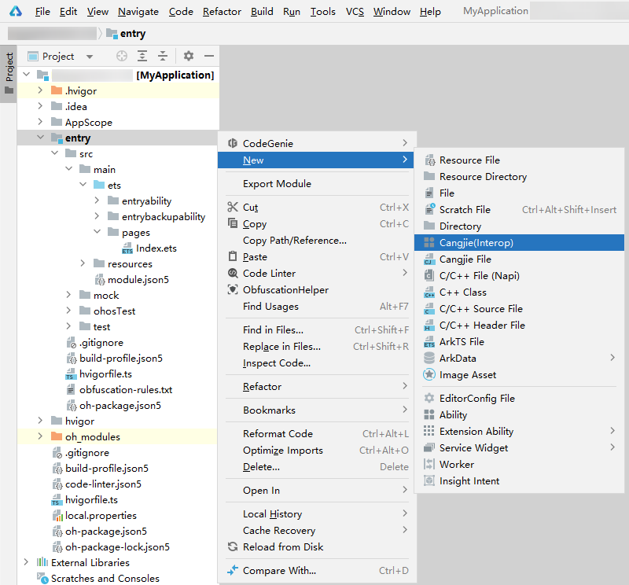
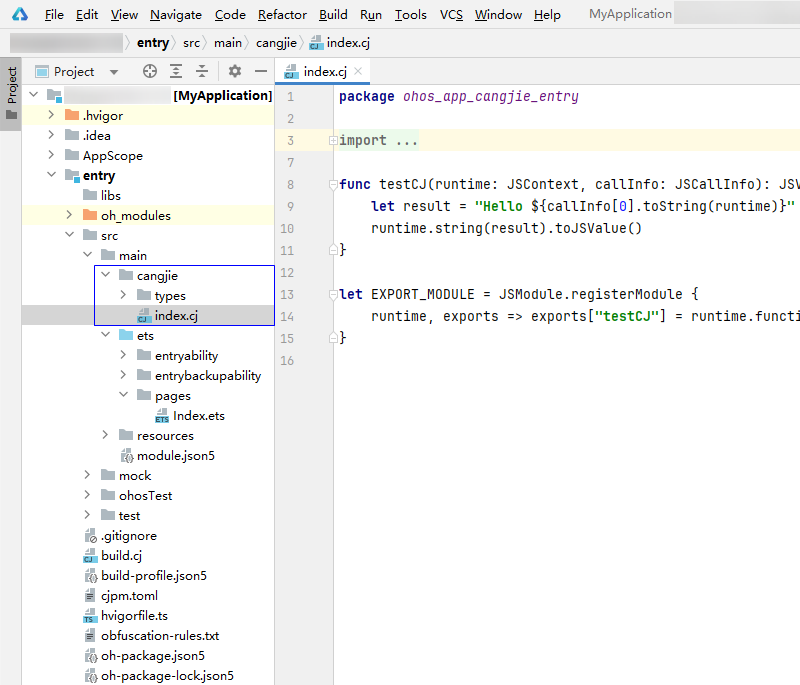
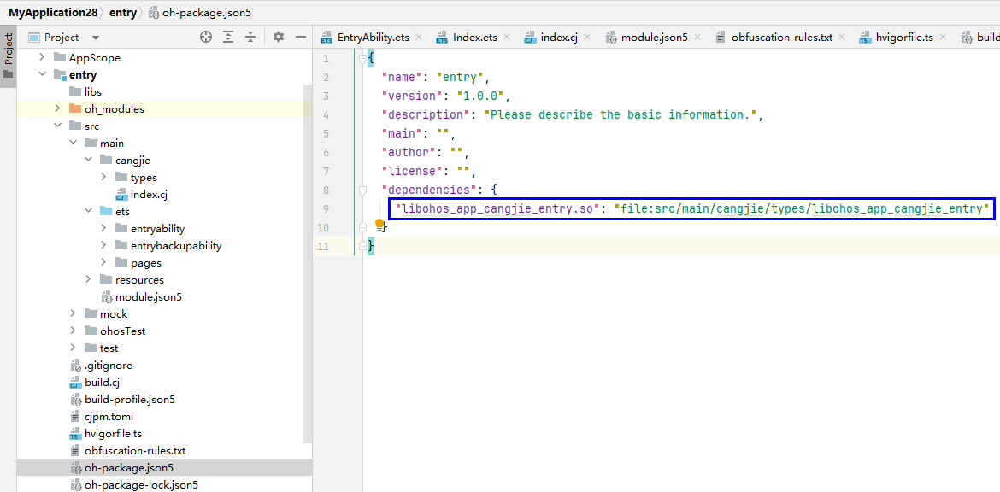
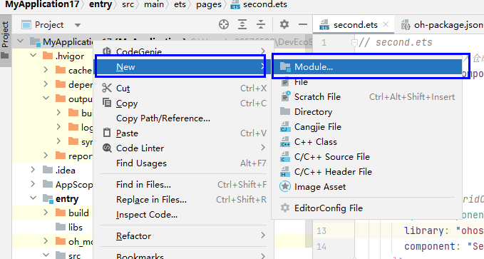
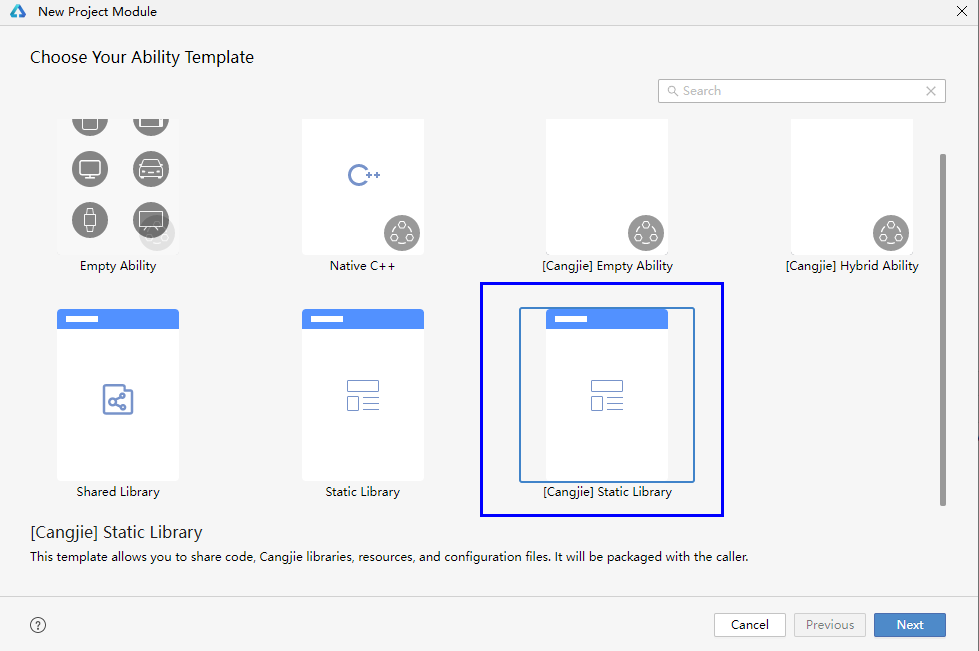
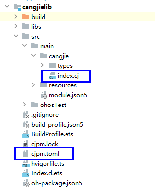

# Adding Cangjie Module

This section explains how to add a Cangjie module to an ArkTS project in DevEco Studio. It primarily covers adding a Cangjie module within the same module and adding a Cangjie static library module, followed by interoperation calls.

## Adding a Cangjie Module Within the Same Module

1. As shown in the figure below, select any file in the ArkTS entry directory, right-click, and choose **New -> Cangjie(Interop)**.

   

2. After clicking the **Cangjie(Interop)** button, a cjpm configuration file `cjpm.toml` and a folder named `cangjie` will be automatically created under the selected ArkTS module. The folder contains template code file `index.cj` and a `types` folder for storing Cangjie interoperation interface declaration files, as shown below:

      

      Additionally, Cangjie dependencies will be automatically generated in **entry -> oh-package.json5**:

      

## Adding a Cangjie Static Library Module

1. Right-click the project name and select **New->Module** to add a Cangjie static library module.

   

2. Select **[Cangjie] Static Library**, click **Next**, and in the pop-up window, change the **Module name** to **cangjielib**.

   

3. A **cangjielib** folder will be generated, containing Cangjie source code files and configuration files.

   

4. In the **cangjielib->src->main->cangjie->index.cj** file, add interoperation code. Here is an example:

   ```cangjie
   // Package name
   package ohos_app_cangjie_cangjielib

   // Import files
   internal import ohos.ark_interop.JSModule
   internal import ohos.ark_interop.JSContext
   internal import ohos.ark_interop.JSCallInfo
   internal import ohos.ark_interop.JSValue

   // Interoperation function
   func sayHelloCJ(runtime: JSContext, callInfo: JSCallInfo): JSValue {
       let result = "cangjie har arkts use "
       runtime.string(result).toJSValue()
   }

   let EXPORT_MODULE = JSModule.registerModule {
       runtime, exports => exports["sayHelloCJ"] = runtime.function(sayHelloCJ).toJSValue()
   }
   ```

5. Under **cangjielib->src->main->cangjie**, create an interoperation folder named **types**, and within **types**, create a folder named **libohos_app_cangjie_entry**.

6. In **types->libohos_app_cangjie_entry**, create an **Index.d.ts** file to implement the ArkTS function corresponding to `sayHelloCJ` in the above `index.cj`:

   ```ts
   export declare function sayHelloCJ(s: string): string
   ```

7. In **types->libohos_app_cangjie_entry**, create an **oh-package.json5** file with the following content. The **name** field should match the package name in the interoperation code, which must be consistent with the package name configured in **cangjielib->cjpm.toml**. Here, set **name** to `libohos_app_cangjie_cangjielib.so`.

   ```json
   {
     "name": "libohos_app_cangjie_cangjielib.so",
     "types": "./Index.d.ts",
     "version": "1.0.0",
     "description": ""
   }
   ```

8. When using the Cangjie static library module in ArkTS, add the following dependency to the **dependencies** section in **entry/oh-package.json5**:

   ```json
   // ...
     "dependencies": {
       "cangjielib": "file:../cangjielib",
       "libohos_app_cangjie_cangjielib.so": "file:../cangjielib/src/main/cangjie/types/libohos_app_cangjie_entry"
     }
   // ...
   ```

9. Then, in **entry->src->main->ets**, use the function as usual. Here is an example using **Index.ets**:

   ```ts
   // Import Cangjie function
   import { sayHelloCJ } from 'libohos_app_cangjie_cangjielib.so'

   @Entry
   @Component
   struct Index {
     @State message: string = 'Hello World';

     build() {
       RelativeContainer() {
         Text(this.message)
           .fontSize(40)
           .fontWeight(FontWeight.Bold)
           .alignRules({
             center: { anchor: '__container__', align: VerticalAlign.Center },
             middle: { anchor: '__container__', align: HorizontalAlign.Center }
           })
           .onClick(() => {
             // Use Cangjie function
             this.message = sayHelloCJ("Cangjie")
           })
       }
       .height('100%')
       .width('100%')
     }
   }
   ```