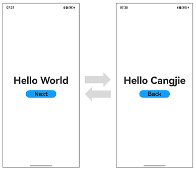
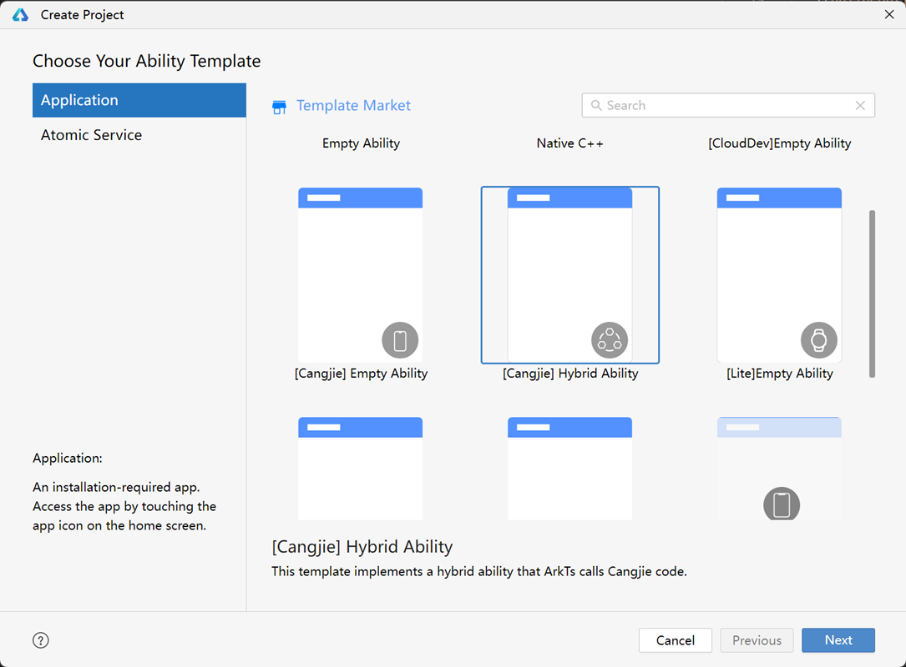
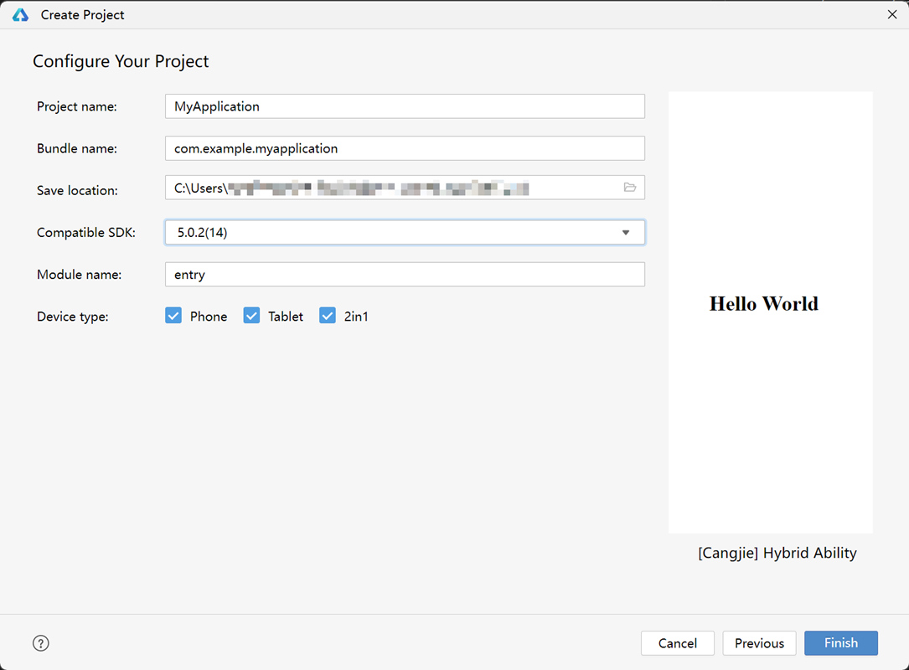
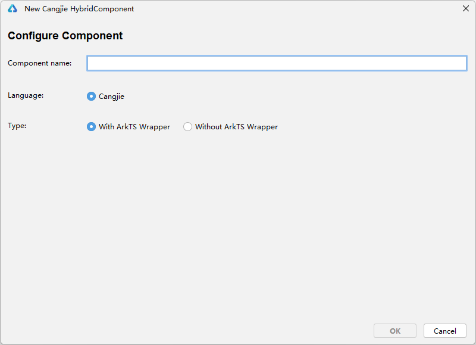
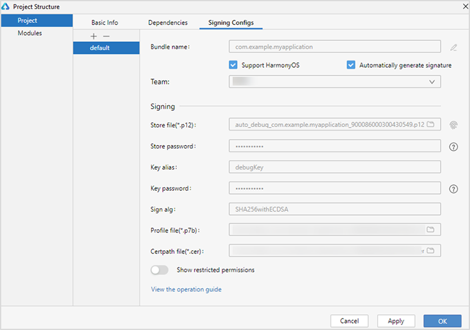

# Building Your First Cangjie and ArkTS Hybrid Application

> **Note:**
>
> To ensure optimal performance, this document uses **DevEco Studio 5.0.2 Release** and **DevEco Studio-Cangjie Plugin 5.0.7.100 Beta1** as examples. Click [here](https://developer.huawei.com/consumer/en/download/) to download the latest versions.

This documentation is intended for OpenHarmony application developers with basic knowledge of Cangjie language, ArkTS language, and UI frameworks. By building a simple hybrid application with page navigation/return functionality (as shown below), you'll quickly understand the main files in the project directory and familiarize yourself with the hybrid application development workflow.



## Creating a Cangjie and ArkTS Hybrid Project

1. If opening **DevEco Studio** for the first time, click **Create Project** to create a new project. If a project is already open, select **File** > **New** > **Create Project** from the menu bar.
2. Choose **Application** development, select the **[Cangjie] Hybrid Ability** template, and click **Next** to proceed with configuration.

   > **Note:**
   >
   > For pure Cangjie project development, select the **[Cangjie] Empty Ability** template.

   

3. On the project configuration page, keep the default parameters.

   > **Note:**
   >
   > The minimum Compatible SDK version for Cangjie hybrid pages is 5.0.1(13).

   

4. Click **Finish**. DevEco Studio will automatically generate sample code and related resources. Wait for the project creation to complete.

## Cangjie and ArkTS Hybrid Project Directory Structure

The directory structure of a Cangjie and ArkTS hybrid project is as follows:

```text
Project_name
├── .hvigor
├── .idea
├── AppScope
│    ├── resources
│    └── app.json5
├── entry
│    ├── build
│    ├── har
│    │    └── CJHyAPIRegister-v1.0.1.har
│    ├── libs
│    ├── oh_modules
│    ├── src
│    │    ├── main
│    │    │    ├── cangjie
│    │    │    │    ├── types
│    │    │    │    │    └── libohos_app_cangjie_entry
│    │    │    │    │          ├── Index.d.ts
│    │    │    │    │          └── oh-package.json5
│    │    │    │    └── index.cj
│    │    │    ├── ets
│    │    │    │    ├── entryability
│    │    │    │    ├── entrybackupability
│    │    │    │    └── pages
│    │    │    ├── resources
│    │    │    └── module.json5
│    │    ├── mock
│    │    ├── ohosTest
│    │    └── test
│    ├── build-profile.json5
│    ├── cjpm.toml
│    ├── hvigorfile.ts
│    ├── obfuscation-rules.txt
│    ├── oh-package.json5
│    └── oh-package-lock.json5
├── hvigor
│    ├── cangjie-build-support-x.y.z.tgz
│    └── hvigor-config.json5
├── oh_modules
├── build-profile.json5
├── code-linter.json5
├── hvigorfile.ts
├── local.properties
├── oh-package.json5
└── oh-package-lock.json5
```

Key files include:

- **AppScope > app.json5**: Global configuration for the application.
- **entry**: OpenHarmony project module, compiled into a HAP package.
    - **src > har**: HAR module for Cangjie and ArkTS interoperability.
    - **src > main > cangjie**: Cangjie source code.
    - **src > main > cangjie > types**: Dependency libraries for Cangjie and ArkTS interoperability.
    - **src > main > ets**: ArkTS source code.
    - **src > main > ets > entryability**: Application/service entry point.
    - **src > main > ets > entrybackupability**: Backup and recovery capabilities.
    - **src > main > ets > pages**: Application/service pages.
    - **src > main > resources**: Resource files (graphics, multimedia, strings, layouts).
    - **src > main > module.json5**: Module configuration, including HAP settings and device-specific configurations.
    - **build-profile.json5**: Module build configuration (build options, targets).
    - **cjpm.toml**: Cangjie package management configuration (build options, dependencies).
    - **hvigorfile.ts**: Module-level build script.
    - **oh-package.json5**: Package metadata (name, version, entry file, dependencies).
- **hvigor**: Contains hvigor configurations.
    - **cangjie-build-support-x.y.z.tgz**: Cangjie-specific hvigor task package.
    - **hvigor-config.json5**: Global hvigor configuration.
- **oh_modules**: Third-party dependencies.
- **build-profile.json5**: Application-level configuration (signing, product settings).
- **hvigorfile.ts**: Application-level build script.
- **oh-package.json5**: Global configurations (dependency overrides, parameterization).

## Building the First Page (Pure ArkTS Page)

1. Using Text Components

   After project synchronization, navigate to **entry > src > main > ets > pages** and open **Index.ets** to edit the page.

   For this example, we'll use Row and Column components for layout. For complex alignment scenarios, consider using RelativeContainer.

   **Index.ets** example:

   ```typescript
   @Entry
   @Component
   struct Index {
     @State message: string = 'Hello World';

     build() {
       RelativeContainer() {
         Text(this.message)
           .fontSize(40)
           .fontWeight(FontWeight.Bold)
           .alignRules({
             center: { anchor: '__container__', align: VerticalAlign.Center },
             middle: { anchor: '__container__', align: HorizontalAlign.Center }
           })
       }
       .height('100%')
       .width('100%')
     }
   }
   ```

2. Adding a Button

   Add a Button component to enable page navigation. Updated **Index.ets**:

   ```typescript
   // Index.ets
   @Entry
   @Component
   struct Index {
     @State message: string = 'Hello World'

     build() {
       Row() {
         Column() {
           Text(this.message)
             .fontSize(50)
             .fontWeight(FontWeight.Bold)
           // Add button for navigation
           Button() {
             Text('Next')
               .fontSize(30)
               .fontWeight(FontWeight.Bold)
           }
           .type(ButtonType.Capsule)
           .margin({
             top: 20
           })
           .backgroundColor('#0D9FFB')
           .width('40%')
           .height('5%')
         }
         .width('100%')
       }
       .height('100%')
     }
   }
   ```

## Building the Second Page (ArkTS and Cangjie Hybrid Page)

> **Note:**
>
> In hybrid development, Cangjie pages aren't full lifecycle pages but are embedded as components within ArkTS pages. An ArkTS @Entry page serves as the container.

1. Creating a Cangjie Page

   - Right-click **entry > src > main > cangjie**, select **New -> Cangjie HybridComponent File**, name it **Second**, select **Cangjie** and **With ArkTS Wrapper** options:

     

   - Click **OK**. The directory structure will update:

     ```text
      entry
      ├── .preview
      ├── build
      ├── libs
      ├── oh_modules
      └── src
           └── main
                ├── cangjie
                │    ├── types
                │    ├── index.cj
                │    └── second.cj
                ├── ets
                │    ├── entryability
                │    ├── entrybackupability
                │    └── pages
                │         ├── Index.ets
                │         └── second.ets
                ├── resources
                └── module.json5
     ```

   - Add components to **second.cj**:

     ```cangjie
     // second.cj
     package ohos_app_cangjie_entry

     import ohos.base.*
     import ohos.arkui.component.*
     import ohos.hybrid_base.*
     import ohos.arkui.state_macro_manage.*
     import ohos.arkui.state_management.*

     @HybridComponentEntry
     @Component
     class Second {
         @State var msg: String = "Hello Cangjie"

         public func build() {
             Row() {
                 Column() {
                     Text(this.msg)
                         .fontSize(50)
                         .fontWeight(FontWeight.Bold)

                     Button() {
                         Text("Back")
                             .fontSize(30)
                             .fontWeight(FontWeight.Bold)
                     }
                     .shape(ShapeType.Capsule)
                     .margin(top: 20)
                     .backgroundColor(Color(0x0D9FFB))
                     .width(40.percent)
                     .height(5.percent)
                 }
                 .width(100.percent)
             }
             .height(100.percent)
         }
     }
     ```

2. Creating the ArkTS Container

   - Embed the Cangjie page in ArkTS (**second.ets**):

     ```typescript
     // second.ets
     import { CJHybridComponentV2 } from '@cangjie/cjhybridview';

     @Entry
     @Component
     struct Second {
       build() {
         Row() {
           // Embed Cangjie page component
           CJHybridComponentV2({
             library: "ohos_app_cangjie_entry", // Cangjie package name
             component: "Second"                // Cangjie class name
           })
         }
         .height('100%')
         .width('100%')
       }
     }
     ```

   > **Note:**
   >
   > Developers must implement the ArkTS container code.

3. Configuring Page Routing

   The route is automatically added to **main_pages.json**:

   ```json
   {
     "src": [
       "pages/Index",
       "pages/second"
     ]
   }
   ```

## Implementing Page Navigation

Page navigation uses the router module to find target pages via URLs.

1. Navigating from ArkTS to Hybrid Page

   Add onClick event to the button in **Index.ets**:

   ```typescript
   // Index.ets
   import { router } from '@kit.ArkUI';
   import { BusinessError } from '@kit.BasicServicesKit';

   @Entry
   @Component
   struct Index {
     @State message: string = 'Hello World'

     build() {
       Row() {
         Column() {
           Text(this.message)
             .fontSize(50)
             .fontWeight(FontWeight.Bold)
           Button() {
             Text('Next')
               .fontSize(30)
               .fontWeight(FontWeight.Bold)
           }
           .type(ButtonType.Capsule)
           .margin({
             top: 20
           })
           .backgroundColor('#0D9FFB')
           .width('40%')
           .height('5%')
           .onClick(() => {
             console.info(`Succeeded in clicking the 'Next' button.`)
             router.pushUrl({ url: 'pages/second' }).then(() => {
               console.info('Succeeded in jumping to the second page.')
             }).catch((err: BusinessError) => {
               console.error(`Failed to jump to the second page. Code is ${err.code}, message is $   {err.message}`)
             })
           })
         }
         .width('100%')
       }
       .height('100%')
     }
   }
   ```

2. Returning from Hybrid to ArkTS Page

   Since Cangjie and ArkTS routers aren't directly compatible, we register an ArkTS callback in Cangjie:

   - Add interoperability code to **index.cj**:

     ```cangjie
     // index.cj
     package ohos_app_cangjie_entry

     import ohos.base.*
     import ohos.ark_interop.*
     import ohos.ark_interop_macro.*
     import std.collection.*

     public let globalJSFunction = HashMap<String, ()->Unit>()

     @Interop[ArkTS]
     public func registerJSFunc(name: String, fn: ()->Unit): Unit {
         if (globalJSFunction.contains(name)) {
             Hilog.error(1, "info", "registerJSFunc failed(err: func ${name} already exists)")
             return
         }
         globalJSFunction.add(name, fn)
     }

     @Interop[ArkTS]
     public func unregisterJSFunc(name: String): Unit {
         globalJSFunction.remove(name)
     }
     ```

   - Generate .d.ts interface files (right-click **Generate... > Cangjie-ArkTS Interop API**).

   - Register the callback in **second.ets**:

     ```typescript
     // second.ets
     import { CJHybridComponentV2 } from '@cangjie/cjhybridview';
     import { router } from '@kit.ArkUI';
     import { BusinessError } from '@kit.BasicServicesKit';
     import cjlib from 'libohos_app_cangjie_entry.so'

     @Entry
     @Component
     struct Second {
       aboutToAppear(): void {
         cjlib.registerJSFunc('SecondPageRouterBack', () => {
           try {
             router.back()
             console.info('Succeeded in returning to the first page.')
           } catch (err) {
             let code = (err as BusinessError).code;
             let message = (err as BusinessError).message;
             console.error(`Failed to return to the first page. Code is ${code}, message is $   {message}`)
           }
         })
       }

       aboutToDisappear(): void {
         cjlib.unregisterJSFunc('SecondPageRouterBack')
       }

       build() {
         Row() {
           CJHybridComponentV2({
             library: "ohos_app_cangjie_entry",
             component: "Second"
           })
         }
         .height('100%')
         .width('100%')
       }
     }
     ```

   - Call the callback in **second.cj**:

     ```cangjie
     // second.cj
     package ohos_app_cangjie_entry

     import ohos.base.*
     import ohos.arkui.component.*
     import ohos.hybrid_base.*
     import ohos.arkui.state_macro_manage.*
     import ohos.arkui.state_management.*

     @HybridComponentEntry
     @Component
     class Second {
         @State var msg: String = "Hello Cangjie"

         public func build() {
             Row() {
                 Column() {
                     Text(this.msg)
                         .fontSize(50)
                         .fontWeight(FontWeight.Bold)

                     Button() {
                         Text("Back")
                             .fontSize(30)
                             .fontWeight(FontWeight.Bold)
                     }
                     .shape(ShapeType.Capsule)
                     .margin(top: 20)
                     .backgroundColor(Color(0x0D9FFB))
                     .width(40.percent)
                     .height(5.percent)
                     .onClick ({
                         Hilog.info(1, "info", "Succeeded in clicking the 'Back' button.")
                         let optFn = globalJSFunction.get("SecondPageRouterBack")
                         if (let Some(fn) <- optFn) {
                             fn()
                         } else {
                             Hilog.error(1, "info", "Failed to return to the first page. callback not exists")
                         }
                     })
                 }
                 .width(100.percent)
             }
             .height(100.percent)
         }
     }
     ```## Running the Application on a Real Device or Emulator

### Using a Local Real Device

1. Connect a real device with the OpenHarmony system to your computer.
2. After the device is successfully connected, click **File > Project Structure > Project > Signing Configs**, check **Support OpenHarmony** and **Automatically generate signature**, then click **Sign In** as prompted on the interface to log in with your user account. Wait for the automatic signing to complete, then click **OK**. The process is illustrated below:

    

3. In the toolbar at the top-right corner of the editing window, click the  button to run the application. The result is shown below:

    

### Using an Emulator

OpenHarmony applications/services written in the Cangjie language can run on the emulator (Emulator) provided by DevEco Studio.

1. Create an emulator device of the Phone type and select this device from the device list in the top-right corner of DevEco Studio.

2. The default compilation architecture for Cangjie projects is **arm64-v8a**. Therefore, when using an **x86 emulator** (when the current development environment is **Windows/x86_64** or **MacOS/x86_64**), the Cangjie project and third-party libraries need to compile the x86_64 version of the .so file. In the **build-profile.json5** configuration file of the Cangjie module, add **x86_64** to the value of **cangjieOptions/abiFilters**. The specific compilation configuration is as follows:

    ```json
    "buildOption": { // Configuration used during the project build process
      "cangjieOptions": { // Cangjie-related configurations
        "path": "./cjpm.toml", // Path to the cjpm configuration file, providing Cangjie build configurations
        "abiFilters": ["arm64-v8a", "x86_64"] // Custom Cangjie compilation architectures; the default is arm64-v8a
      }
    }
    ```

3. In the toolbar at the top-right corner of the editing window, click the  button to run the application. The result is the same as running on a real device.

Congratulations! You have successfully built your first hybrid application using Cangjie and ArkTS.