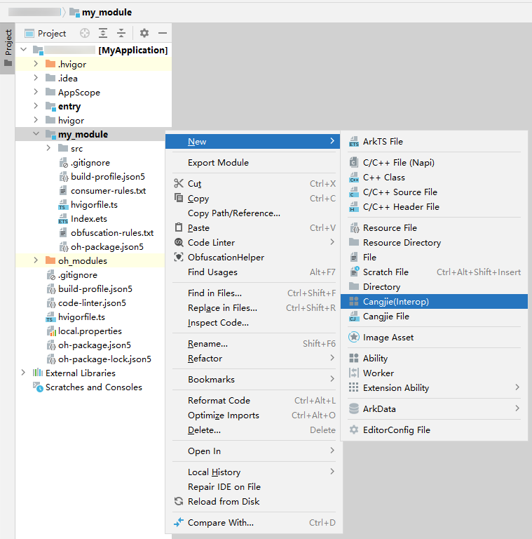

# Incrementally Using Cangjie in an Existing ArkTS Project

> **Note:**
>
> To ensure the operational effect, this document uses **DevEco Studio 5.0.2 Release** and **DevEco Studio-Cangjie Plugin 5.0.7.100 Beta1** as examples. Click [here](https://developer.huawei.com/consumer/en/download/) to download the latest version.

This document is intended for OpenHarmony application developers who have a basic understanding of the Cangjie language, ArkTS language, and UI frameworks. Based on a simple, purely ArkTS-developed application that supports page navigation/return functionality, this guide demonstrates how to introduce Cangjie to develop incremental features (e.g., Cangjie providing a synchronous interface for ArkTS to call, an asynchronous interface for ArkTS to call, and embedding a Cangjie component in the original ArkTS page). This helps developers quickly understand how to introduce Cangjie into existing ArkTS projects and familiarize themselves with the hybrid application development process.

Assume the initial runtime effect of the original ArkTS application is as follows (with two pages supporting navigation/return):


Now, introducing Cangjie aims to achieve the following two effects:

1. In the ArkTS page, add two Button components. When clicked, they trigger calls to Cangjie's synchronous and asynchronous interfaces, respectively, updating the Text component as shown below.

   

2. Embed a Cangjie component in the ArkTS page. The Cangjie component provides a Button that updates the Text component when clicked, as shown below.

   

## Initial State of the Original ArkTS Project

Developers can refer to the example to create the original ArkTS project. The directory structure of the original ArkTS application is as follows:

```text
Project_name
├── .hvigor
├── .idea
├── AppScope
├── entry
├── hvigor
│    └── hvigor-config.json5
├── my_module
├── oh_modules
├── build-profile.json5
├── code-linter.json5
├── hvigorfile.ts
├── local.properties
├── oh-package.json5
└── oh-package-lock.json5
```

Where:
- **entry** is an ArkTS module created using the **Empty Ability** project template, which is compiled into a HAP package.
- **my_module** is an ArkTS static library module created using the **Static Library** project template, which is compiled into a HAR package and depended on by the **entry** module.

Both **entry** and **my_module** modules contain a page, with navigation between them via the Navigation component.

1. The directory structure of the **entry** module is as follows:

   ```text
   entry
   ├── build
   ├── oh_modules
   ├── src
   │    ├── main
   │    │    ├── ets
   │    │    │    ├── entryability
   │    │    │    ├── entrybackupability
   │    │    │    └── pages
   │    │    │         └── Index.ets
   │    │    ├── resources
   │    │    └── module.json5
   │    ├── mock
   │    ├── ohosTest
   │    └── test
   ├── build-profile.json5
   ├── hvigorfile.ts
   ├── obfuscation-rules.txt
   ├── oh-package.json5
   └── oh-package-lock.json5
   ```

   - Example of **entry > src > main > ets > pages > Index.ets**:

   ```typescript
   // Index.ets
   @Entry
   @Component
   struct Index {
     pathStack: NavPathStack = new NavPathStack()
     @State message: string = 'Hello World';

     build() {
       Navigation(this.pathStack) {
         Column() {
           Button('Navigate to: MyModulePage')
             .width('80%')
             .height(40)
             .margin(20)
             .onClick(() => {
               this.pathStack.pushPathByName('MyModulePage', null)
             })
         }
         .width('100%')
         .height('100%')
       }
       .title("Home")
       .mode(NavigationMode.Stack)
     }
   }
   ```

   - In the module's **oh-package.json5**, add my_module as a dependency:

   ```json
   "dependencies": {
     "my_module": "file:../my_module"
   }
   ```

2. The directory structure of the **my_module** module is as follows:

   ```text
   my_module
   ├── build
   ├── src
   │    ├── main
   │    │    ├── ets
   │    │    │    └── pages
   │    │    │         └── MyModulePage.ets
   │    │    ├── resources
   │    │    │    └── base
   │    │    │         ├── element
   │    │    │         └── profile
   │    │    │              └──router_map.json
   │    │    └── module.json5
   │    ├── ohosTest
   │    └── test
   ├── build-profile.json5
   ├── BuildProfile.ets
   ├── consumer-rules.txt
   ├── hvigorfile.ts
   ├── Index.ets
   ├── obfuscation-rules.txt
   └── oh-package.json5
   ```

   - Example of **my_module > src > main > ets > pages > MyModulePage.ets**:

   ```typescript
   // MyModulePage.ets

   @Builder
   export function MyModulePageBuilder() {
     MyModulePage()
   }

   @Component
   export struct MyModulePage {
     pathStack: NavPathStack = new NavPathStack()

     build() {
       NavDestination() {
         Column() {
           Button('Return to Home')
             .type(ButtonType.Capsule)
             .width('80%')
             .height(40)
             .margin(20)
             .onClick(() => {
               this.pathStack.clear()
             })
         }
         .width('100%')
         .height('100%')
       }
       .title('MyModulePage')
       .onReady((context: NavDestinationContext) => {
         this.pathStack = context.pathStack
       })
     }
   }
   ```

   - **my_module > src > main > resources > base > profile > route_map.json** must configure the subpage routing information, as shown below:

   ```json
   // router_map.json
   {
     "routerMap": [
       {
         "name": "MyModulePage",
         "pageSourceFile": "src/main/ets/pages/MyModulePage.ets",
         "buildFunction": "MyModulePageBuilder",
         "data": {
           "description": "this is MyModulePage"
         }
       }
     ]
   }
   ```

   - In the **module.json5** configuration file, the module tag defines the routerMap field, pointing to the route_map.json configuration file. Example:

   ```json5
   // module.json5
   "routerMap": "$profile:router_map"
   ```

   > **Note:**
   >
   > If the module tag originally contains the line `"pages": "$profile:main_pages"`, it must be deleted. Otherwise, routing navigation may fail after release, resulting in a blank screen.

## Incrementally Using Cangjie in an ArkTS Module

> **Note:**
>
> Currently, Cangjie modules only support OpenHarmony static library modules, i.e., HAR static shared packages.

Using the original ArkTS application project as an example, this section explains how to enable Cangjie development in an ArkTS module (i.e., **my_module**).

### Right-Click Menu to Enable Cangjie-ArkTS Hybrid Module

1. As shown below, right-click the **my_module** directory in the **Project** window and select **New -> Cangjie(Interop)**.



After the project syncs automatically, the directory structure is as follows:

```text
├── hvigor
│    ├── cangjie-build-support-x.y.z.tgz
│    └── hvigor-config.json5
└── my_module
    ├── build
    ├── libs
    ├── oh_modules
    ├── src
    │    ├── main
    │    │    ├── cangjie
    │    │    │    ├── types
    │    │    │    │    └── libohos_app_cangjie_entry
    │    │    │    │          ├── Index.d.ts
    │    │    │    │          └── oh-package.json5
    │    │    │    └── index.cj
    │    │    ├── ets
    │    │    │    └── pages
    │    │    │         └── MyModulePage.ets
    │    │    ├── resources
    │    │    │    └── base
    │    │    │         ├── element
    │    │    │         └── profile
    │    │    │              └── router_map.json
    │    │    └── module.json5
    │    ├── ohosTest
    │    └── test
    ├── build-profile.json5
    ├── consumer-rules.txt
    ├── hvigorfile.ts
    ├── Index.ets
    ├── obfuscation-rules.txt
    ├── oh-package.json5
    └── oh-package-lock.json5
```

Here, **my_module** becomes a Cangjie-ArkTS hybrid module.

> **Note:**
>
> When enabling Cangjie development in an ArkTS project for the first time, a "cangjie-build-support-x.y.z.tgz" plugin package is automatically created in the project's "hvigor" directory to support Cangjie-related compilation.

### Cross-Module Calls to Cangjie Functions in a Pure ArkTS Project Within the Same Project

1. Develop business logic on the Cangjie side and expose interfaces to ArkTS.

   In the **Project** window, navigate to **my_module > src > main > cangjie**, open **index.cj**, and write the following code:

   <!-- compile -->

   ```cangjie
   // index.cj
   package ohos_app_cangjie_my_module // Note: The package name must match the [package] name field in cjpm.toml.

   import ohos.base.*
   import ohos.ark_interop.*
   import ohos.ark_interop_macro.*
   import std.core.sleep
   import std.core.Duration

   // Synchronous interface: Executes synchronously on the main thread.
   @Interop[ArkTS]
   public func callSync(msg: String): String {
       // do something
       return "callSync: ${msg}"
   }

   // Asynchronous interface: Executes asynchronously on a Cangjie lightweight thread.
   @Interop[ArkTS, Async]
   public func callAsync(msg: String): String {
       // Simulate time-consuming operations using the sleep function.
       sleep(Duration.second * 5)
       return "callAsync: ${msg}"
   }
   ```

2. Automatically generate Cangjie-ArkTS interop interface declarations.

   Open **index.cj**, right-click in the editor, and select **Generate... > Cangjie-ArkTS Interop API**. This generates .d.ts interface declarations in **entry > src > main > cangjie > types > libohos_app_cangjie_entry > Index.d.ts**, exposing Cangjie interfaces to ArkTS. The directory structure is as follows:

   ```text
   my_module
   ├── build
   ├── libs
   ├── oh_modules
   └── src
        └── main
             ├── cangjie
             │    ├── ark_interop_api
             │    ├── types
             │    │    └── libohos_app_cangjie_entry
             │    │         │── Index.d.ts
             │    │         └── oh-package.json5
             │    └── index.cj
             └── ets
   ```

   The interface declarations are as follows:

   ```typescript
   // Index.d.ts
   export declare function callSync(msg: string): string
   export declare function callAsync(msg: string): Promise<string>
   ```

   > **Note:**
   >
   > After creating a Cangjie Hybrid Ability hybrid project, the **libohos_app_cangjie_my_module** library is automatically added to the **dependencies** field in **my_module > oh-package.json5**.

3. After generating the .d.ts interface declarations, to use Cangjie interfaces in a pure ArkTS module, modify the **hvigorfile.ts** file of the pure ArkTS module. In this example, modify **entry > hvigorfile.ts**, changing the first line `import { hapTasks } from '@ohos/hvigor-ohos-plugin'` to `import { hapTasks } from '@ohos/cangjie-build-support'`.

4. After modifying the **hvigorfile.ts** file, you can directly import the dependencies of the interfaces declared in the .d.ts file in ArkTS files.

   Modify **my_module > src > main > ets > pages > MyModulePage.ets** as follows:

   ```typescript
   // MyModulePage.ets
   // Import callSync and callAsync interfaces from libohos_app_cangjie_entry.so.
   import cjlib from 'libohos_app_cangjie_my_module.so'

   @Builder
   export function MyModulePageBuilder() {
     MyModulePage()
   }

   @Component
   export struct MyModulePage {
     pathStack: NavPathStack = new NavPathStack()
     @State msg: string = "Hello"

     build() {
       NavDestination() {
         Column() {
           Button('Return to Home')
             .type(ButtonType.Capsule)
             .width('80%')
             .height(40)
             .margin(20)
             .onClick(() => {
               this.pathStack.clear()
             })

           // Add a Text component to display changes in this.msg.
           Text(`msg = ${this.msg}`)
             .fontSize(20)
             .fontWeight(FontWeight.Bold)

           // Add two buttons to trigger calls.
           Button('Call cjlib.callSync')
             .width('80%')
             .height(40)
             .margin(20)
             .onClick(() => {
               // Call the synchronous interface.
               this.msg = cjlib.callSync('Hello')
             })
           Button('Call cjlib.callAsync')
             .width('80%')
             .height(40)
             .margin(20)
             .onClick(() => {
               // Call the asynchronous interface.
               cjlib.callAsync('Hello')
                 .then((res) => {
                   this.msg = res
                 })
             })
         }
         .width('100%')
         .height('100%')
       }
       .title('MyModulePage')
       .onReady((context: NavDestinationContext) => {
         this.pathStack = context.pathStack
       })
     }
   }
   ```

5. Run the application on a real device or emulator.

   After successful compilation and installation, navigate to the **MyModulePage** and click the buttons to trigger function calls. The effect is as follows:

   

   > **Note:**
   >
   > For detailed steps on running the application on a real device or emulator, refer to [Building Your First Cangjie Application](./cj-quick-start-first-cangjie-hybrid-app.md#using-a-real-device-or-emulator-to-run-the-application).### Embedding Cangjie Components within the Same Module in ArkTS Pages

1. Create a Cangjie page.

   In the **Project** window, navigate to **my_module > src > main**, right-click the **cangjie** folder, select **New -> Cangjie HybridComponent File**, name the **Component name** as **CangjiePage**, check the **Cangjie** option, and click **OK**. The file directory structure will appear as follows:

   ```text
   my_module
   ├── build
   ├── libs
   ├── oh_modules
   └── src
        ├── main
        │    ├── cangjie
        │    │    ├── ark_interop_api
        │    │    ├── types
        │    │    ├── cangjie_page.cj
        │    │    └── index.cj
        │    ├── ets
        │    │    └── pages
        │    │         └── cangjie_page.ets
        │    │         └── MyModulePage.ets
        │    ├── resources
        │    └── module.json5
        ├── ohosTest
        └── test
   ```

   - Add Text components, Button components, etc., to the Cangjie page and set their styles. Below is an example of the **cangjie_page.cj** file:

   <!-- compile -->

   ```cangjie
   // cangjie_page.cj
   package ohos_app_cangjie_my_module

   import ohos.base.*
   import ohos.arkui.component.*
   import ohos.arkui.state_macro_manage.*
   import ohos.arkui.state_management.*

   @HybridComponentEntry
   @Component
   class CangjiePage {
       @State
       var msg: String = "Hi, this is Cangjie"

       public func build() {
           Column {
               Text(msg)
                   .fontSize(20)
                   .fontWeight(FontWeight.Bold)
               Button("Click to Modify the Text Above")
                   .shape(ButtonType.Capsule)
                   .width(80.percent)
                   .height(40)
                   .margin(20)
                   .onClick ({ _ =>
                        msg = "Okay, Cangjie clicked"
                    })
           }
           .width(100.percent)
           .height(100.percent)
       }
   }
   ```

2. Embed the Cangjie page in the ArkTS side.

   In the **Project** window, navigate to **my_module > src > main > pages**, and modify the **MyModulePage.ets** file as shown below:

   ```typescript
   // MyModulePage.ets
   // Embedding the Cangjie page in an ArkTS page
   import { CJHybridComponent } from '@cangjie/cjhybridcomponent'
   // Import the callSync and callAsync interfaces from libohos_app_cangjie_entry.so
   import cjlib from 'libohos_app_cangjie_my_module.so'

   @Builder
   export function MyModulePageBuilder() {
     MyModulePage()
   }

   @Component
   export struct MyModulePage {
     pathStack: NavPathStack = new NavPathStack()
     @State msg: string = "Hello"

     build() {
       NavDestination() {
         Column() {
           Button('Return to Home')
             .type(ButtonType.Capsule)
             .width('80%')
             .height(40)
             .margin(20)
             .onClick(() => {
               this.pathStack.clear()
             })

             // Add a Text component to display changes in this.msg
           Text(`msg = ${this.msg}`)
             .fontSize(20)
             .fontWeight(FontWeight.Bold)

           // Add two buttons to trigger calls
           Button('Call cjlib.callSync')
             .width('80%')
             .height(40)
             .margin(20)
             .onClick(() => {
               // Call the synchronous interface
               this.msg = cjlib.callSync('Hello')
             })
           Button('Call cjlib.callAsync')
             .width('80%')
             .height(40)
             .margin(20)
             .onClick(() => {
               // Call the asynchronous interface
               cjlib.callAsync('Hello')
                 .then((res) => {
                   this.msg = res
                 })
             })
             // Embed the Cangjie page via CJHybridComponent
           CJHybridComponent({
             library: 'ohos_app_cangjie_my_module', // The package name where the Cangjie page resides
             component: 'CangjiePage'               // The class name corresponding to the Cangjie page
           })
         }
         .width('100%')
         .height('100%')
       }
       .title('MyModulePage')
       .onReady((context: NavDestinationContext) => {
         this.pathStack = context.pathStack
       })
     }
   }
   ```

3. Run the application on a real device or emulator.

   After successful compilation and installation of the application, navigate to the **MyModulePage**, then click the Cangjie Button to trigger the Cangjie Text to update its content. The effect is as follows:

   

   > **Note:**
   >
   > For detailed steps on running the application on a real device or emulator, refer to [Building Your First Cangjie Application](..\..\..\cj-start\start\quick-start\cj-quick-start-first-cangjie-app.md#building-your-first-cangjie-application).

Congratulations! You have successfully used Cangjie to develop a business module in an ArkTS application.