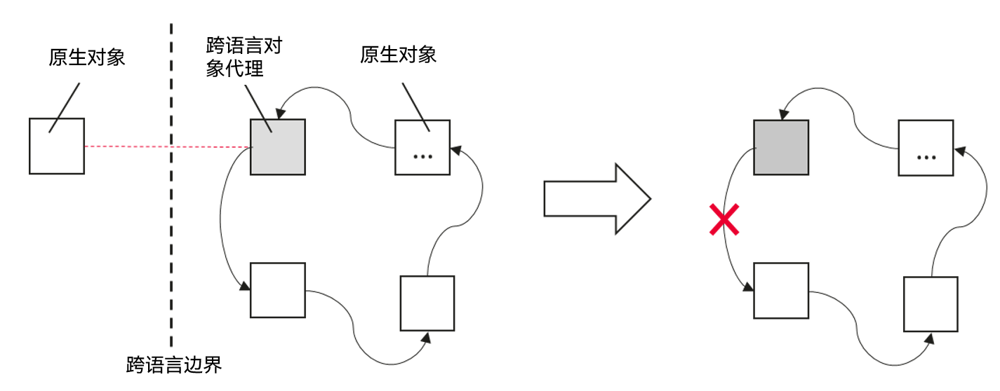

# Cangjie-ArkTS Interoperability Development Specifications

## Multi-Engine Instance Context Sensitivity

**[Rule]** Cross-engine instance access to JS objects is prohibited.

In multi-engine instance scenarios, each JS object (such as instances of JSValue and its subclasses) is bound to the engine instance (JSContext) that created it. Different engine instances operate independently and cannot share JS objects. Accessing JS objects from non-owning engines may cause program crashes.

In the Cangjie-ArkTS interoperability library, early interfaces for accessing JS objects required developers to manually pass JSContext parameters. When calling these interfaces, ensure the correct instance is passed. Such interfaces have been marked as "deprecated" and it is recommended to use newer interfaces without JSContext parameters, which automatically select the correct engine instance.

**Incorrect Example:**

Cangjie code:

```cangjie
// Import interoperability library
import ohos.ark_interop.*

func doSth(context: JSContext, callInfo: JSCallInfo): JSValue {
    // Create new runtime instance
    let newRuntime = JSRuntime()
    let newContext = newRuntime.mainContext

    // Create new object on new runtime
    let newObjValue = newContext.object().toJSValue()

    // Error: Converting new object's JSValue using old runtime instance
    let newObj = newObjValue.asObject(context)

    // Error: Using old runtime as parameter when setting property on new object
    newObjValue.setProperty(context, newContext.string("a"), newContext.boolean(false).toJSValue())

    // Error: Using string key created by old runtime when getting object property
    newObjValue.getProperty(newContext, context.string("a"))

    return newObjValue
}

let EXPORT_MODULE = JSModule.registerModule {
    runtime, exports => exports["doSth"] = runtime.function(doSth).toJSValue()
}
```

**Correct Example:**

Cangjie code:

```cangjie
// Import interoperability library
import ohos.ark_interop.*

func doSth(context: JSContext, callInfo: JSCallInfo): JSValue {
    // Create new runtime instance
    let newRuntime = JSRuntime()
    let newContext = newRuntime.mainContext

    // Create new object on new runtime
    let newObjValue = newContext.object().toJSValue()

    // Correct: Converting new object's JSValue using new runtime instance
    let newObj = newObjValue.asObject()

    // Correct: Using non-deprecated interface (no explicit context passing) when setting property
    newObjValue.setProperty(newContext.string("a"), newContext.boolean(false).toJSValue())

    // Correct: Using string key created by new runtime when getting property
    newObjValue.getProperty(newContext.string("a"))

    return newObjValue
}

let EXPORT_MODULE = JSModule.registerModule {
    runtime, exports => exports["doSth"] = runtime.function(doSth).toJSValue()
}
```

## Exception Handling

**[Rule]** Use try statements to catch and handle cross-language call exceptions.

In cross-language function calls, exceptions thrown by the callee are automatically converted by the interoperability library into exceptions that can be caught by the caller. The caller should use try statements to catch and handle exceptions to prevent program errors or crashes.

**Correct Example (Catching Cangjie exceptions on ArkTS side):**

Cangjie side code:

```cangjie
// Import interoperability library
import ohos.ark_interop.*

func doSthWithException(context: JSContext, callInfo: JSCallInfo): JSValue {
    if (callInfo.count > 0) {
        throw Exception("should not pass any argument")
    }
    context.undefined().toJSValue()
}

let EXPORT_MODULE = JSModule.registerModule {
    runtime, exports => exports["doSthWithException"] = runtime.function(doSthWithException).toJSValue()
}
```

ArkTS side code:

```javascript
interface CJLib {
    doSthWithException(src?: string): void
}

function doSth(lib: CJLib): void {
    // Use try...catch to catch cross-language exceptions when calling cross-language interfaces
    try {
        lib.doSthWithException("xxx")
    } catch (err) {
        // ...
    }
}
```

**Correct Example (Catching ArkTS exceptions on Cangjie side):**

Cangjie side code:

```cangjie
// Import interoperability library
import ohos.ark_interop.*

func callArktsWithExp(context: JSContext, callInfo: JSCallInfo): JSValue {
    // Use try...catch to catch cross-language exceptions when calling cross-language interfaces
    try {
        callInfo[0].asFunction().call()
    } catch (err: JSCodeError) {
        // ...
    }
    context.undefined().toJSValue()
}

let EXPORT_MODULE = JSModule.registerModule {
    runtime, exports => exports["callArktsWithExp"] = runtime.function(callArktsWithExp).toJSValue()
}
```

ArkTS side code:

```javascript
interface CJLib {
    callArkTSWithExp(callback: () => void): void
}

function doSth(lib: CJLib): void {
    lib.callArkTSWithExp(() => {
        throw new Error("this is an error")
    })
}
```

## Proper Usage of JS Objects Created via JSContext.external Interface

**[Rule]** Properly use JS Objects created via JSContext.external interface.

JSExternal objects created through JSContext.external are of type undefined on the ArkTS side and should not be directly used as interface parameters. It is recommended to bind JSExternal objects to a JSObject, encapsulating internal data within the object to enhance interface security and maintainability.

**Incorrect Example:**

Cangjie side code:

```cangjie
// Import interoperability library
import ohos.ark_interop.*

// Define shared class, SharedObject is a class from the interoperability library
class Data <: SharedObject {
    Data(
        // Define 2 properties
        var id: Int64,
        let name: String
    ) {}

    static init() {
        // Register functions exported to ArkTS
        JSModule.registerFunc("createData", createData)
        JSModule.registerFunc("setDataId", setDataId)
        JSModule.registerFunc("getDataId", getDataId)
    }

    // Create shared object
    static func createData(context: JSContext, _: JSCallInfo): JSValue {
        // Create Cangjie object
        let data = Data(1, "abc")
        // Create JS reference to Cangjie object
        let jsExternal = context.external(data)
        // Return JS reference to Cangjie object
        return jsExternal.toJSValue()
    }

    // Set object's id
    static func setDataId(context: JSContext, callInfo: JSCallInfo): JSValue {
        // Read parameters
        let arg0 = callInfo[0]
        let arg1 = callInfo[1]

        // Convert parameter 0 to JS reference to Cangjie object
        let jsExternal = arg0.asExternal(context)
        // Get Cangjie object
        let data: Data = jsExternal.cast<Data>().getOrThrow()
        // Convert parameter 1 to Float64
        let value = arg1.toNumber()

        // Modify Cangjie object property
        data.id = Int64(value)

        // Return undefined
        let result = context.undefined().toJSValue()
        return result
    }

    // Get object's id
    static func getDataId(context: JSContext, callInfo: JSCallInfo): JSValue {
        let arg0 = callInfo[0]

        let jsExternal = arg0.asExternal(context)

        let data: Data = jsExternal.cast<Data>().getOrThrow()

        let result = context.number(Float64(data.id)).toJSValue()
        return result
    }
}
```

Corresponding ArkTS interface declaration for Cangjie side code:

```javascript
export declare function createData(): undefined;
export declare function setDataId(data: undefined, value: number): void;
export declare function getDataId(data: undefined): number;
```

ArkTS side code:

```javascript
import { createData, setDatId, getDataId } from "libohos_app_cangjie_entry.so";

// Create shared object
let data = createData();
// Manipulate object properties
setDataId(data, 3);
let id = getDataId(data);

console.log("id is " + id);
```

**Correct Example:**

Cangjie side code:

```cangjie
// Import interoperability library
import ohos.ark_interop.*

// Define shared class
class Data <: SharedObject {
    Data(
        // Define 2 properties
        var id: Int64,
        let name: String
    ) {}

    static init() {
        // Register function exported to ArkTS
        JSModule.registerFunc("createData", createData)
    }

    // Create shared object
    static func createData(context: JSContext, _: JSCallInfo): JSValue {
        let data = Data(1, "abc")
        let jsExternal = context.external(data)

        // Create empty JSObject
        let object = context.object()
        // Attach JS reference to Cangjie object as hidden property of JSObject
        object.attachCJObject(jsExternal)

        // Add 2 methods to JS object
        object["setId"] = context.function(setDataId).toJSValue()
        object["getId"] = context.function(getDataId).toJSValue()

        return object.toJSValue()
    }

    // Set object's id
    static func setDataId(context: JSContext, callInfo: JSCallInfo): JSValue {
        // Get this pointer
        let thisArg = callInfo.thisArg
        let arg0 = callInfo[0]

        // Convert this pointer to JSObject
        let thisObject = thisArg.asObject(context)
        // Get hidden property from JSObject
        let jsExternal = thisObject.getAttachInfo().getOrThrow()
        // Get Cangjie object from JS reference
        let data = jsExternal.cast<Data>().getOrThrow()
        // Convert parameter 0 to Float64
        let value = arg0.toNumber()

        // Modify Cangjie object property
        data.id = Int64(value)

        let result = context.undefined()
        return result.toJSValue()
    }

    // Get object's id
    static func getDataId(context: JSContext, callInfo: JSCallInfo): JSValue {
        let thisArg = callInfo.thisArg
        let thisObject = thisArg.asObject(context)
        let jsExternal = thisObject.getAttachInfo().getOrThrow()
        let data = jsExternal.cast<Data>().getOrThrow()

        let result = context.number(Float64(data.id)).toJSValue()
        return result
    }
}
```

Corresponding ArkTS interface declaration for Cangjie side code:

```javascript
export declare interface Data {
    setId(value: number): void;
    getId(): number;
}

export declare function createData(): Data;
```

ArkTS side code:

```javascript
import { createData } from "libohos_app_cangjie_entry.so";

// Create shared object
let data = createData();
// Manipulate object properties
data.setId(3);
let id = data.getId();

console.log("id is " + id);
```

## Cross-Language Object References

**[Rule]** When passing objects across languages, developers should avoid having local proxy objects hold references to native objects, or promptly nullify such references after use to prevent memory leaks.

During cross-language interoperability, circular references between cross-language objects can easily occur, preventing related objects from being released and causing memory leaks. The root cause of circular references lies in the ring-shaped dependency formed between proxy objects of cross-language methods (typically parameters or return values) and native objects. Since their respective garbage collection (GC) mechanisms cannot automatically identify and handle such cross-runtime references, manual management by developers is required.



As shown in the diagram above, to avoid such issues, it is recommended that developers avoid having proxy objects directly reference native objects during design. If business scenarios genuinely require proxy objects to hold references to native objects, promptly release the references to native objects after use to break the circular reference.

**Circular Reference Error Example:**

Cangjie side code:

```cangjie
import ohos.ark_interop.*

class CJData <: SharedObject {
    let name: String
    var callback: ?()->Unit = None
    init(name: String) {
        this.name = name
    }
}

func createCJData(context: JSContext, callInfo: JSCallInfo): JSValue {
    let object = context.object()
    let data = CJData(callInfo[0].toString())
    object.attachCJObject(context.external(data))
    object.defineOwnAccessor("name", getter: { context, callInfo =>
        context.string(data.name).toJSValue()
    })
    object.defineOwnAccessor("callback", setter: {context, callInfo =>
        let callback = callInfo[0].asFunction()
        data.callback = { =>
            callback.call()
        }
        context.undefined().toJSValue()
    })

    object.toJSValue()
}

let EXPORT_MODULE = JSModule.registerModule {
    runtime, exports => exports["createCJData"] = runtime.function(createCJData).toJSValue()
}
```

Corresponding ArkTS interface declaration for Cangjie side code:

```javascript
export declare interface CJData {
    name: string;
    callback: () => void;
}

export declare function createCJData(): CJData;
```

ArkTS side code:

```javascript
import { createCJData, CJData } from "libohos_app_cangjie_entry.so"

const data: CJData = createCJData("123")
data.callback = () => {
    console.log(data.name)
}
```

The circular reference in the above example occurs as follows:

1. The CJData object **data** created on the ArkTS side holds the Cangjie object via external
2. The Cangjie object (of type CJData) holds the **callback** variable
3. **callback** captures the callback function from the ArkTS side
4. The callback function on the ArkTS side captures the CJData object **data** created on the ArkTS side

Assuming this scenario is necessary for business requirements, developers should promptly nullify data.callback after execution to break the circular reference. Example:

```cangjie
// ...
data.callback()
data.callback = () = {}
// ...
``````markdown
## In ArkTS Main Thread, Cangjie APIs Must Not Block Waiting for spawn(UIThread) Execution Results

**【Rule】** When calling Cangjie APIs from the ArkTS main thread, the main thread must not block waiting for the execution result of spawn(UIThread), as this will cause deadlock and trigger App Freeze failures.

When Cangjie APIs are called from the ArkTS main thread, the Cangjie code may use the spawn(UIThread) expression to dispatch an asynchronous task to the main thread. This operation is typically used to return execution results from Cangjie APIs to the ArkTS side. Developers must ensure that the main thread does not block waiting for the spawn(UIThread) execution result, as this will cause deadlock and trigger App Freeze failures (APP_INPUT_BLOCK). Common blocking behaviors include but are not limited to:

- Using future.get() to wait for the return value of a spawn(UIThread) expression;
- Using the lock() interface of Mutex to acquire a lock that will be released in a spawn(UIThread) task.

**Incorrect Example:**

Cangjie-side code:

```cangjie
import ohos.ark_interop.*
import ohos.ark_interop_macro.*
import ohos.base.UIThread

@Interop[ArkTS]
public func testCJ(): Unit {
    // ...
    let future = spawn(UIThread) {
        // ...
    }
    future.get() // Error: spawn(UIThread) creates a Cangjie task for the main thread, while future.get() waits on the main thread, causing deadlock
    // ...
}
```

ArkTS-side code:

```javascript
import { testCJ } from "libohos_app_cangjie_entry.so"

@Entry
@Component
struct Index {
   // ...
   testCJ() // Calling Cangjie API from ArkTS main thread
   // ...
}
```

## Cangjie-ArkTS Interoperability Logic Must Execute on System Threads Bound to ArkTS Runtime

**【Rule】** When Cangjie calls ArkTS, all operations involving ArkTS data access or API calls must execute on system threads bound to the ArkTS runtime. Otherwise, a JSThreadMisMatch exception will be triggered.

Cangjie threads are user-mode threads, and the runtime schedules them to execute on system threads. Therefore, Cangjie programs are not bound to specific system threads by default. However, Cangjie-ArkTS interoperability logic must execute on system threads bound to the ArkTS runtime. Thus, developers must ensure interoperability occurs on the correct thread. If not on an ArkTS thread, developers must use the interoperability library's APIs to switch to an ArkTS thread. The following APIs can be used to ensure correct execution of interoperability logic:

- Use JSContext.isInBindThread() to check if the current thread can execute interoperability APIs;
- To switch threads, use:
    - JSContext.postJSTask { ... } to create a task that executes on the ArkTS thread;
    - If ArkTS is deployed on the main thread, developers can use spawn(UIThread) to schedule interoperability logic to execute on the main thread.

**Incorrect Example:**

Cangjie code:

```cangjie
import ohos.ark_interop.*

func addNumberAsync(context: JSContext, callInfo: JSCallInfo): JSValue {
    // Get arguments from JSCallInfo
    let arg0: JSValue = callInfo[0]
    let arg1: JSValue = callInfo[1]
    let arg2: JSValue = callInfo[2]

    // Convert JSValue to Cangjie types
    let a: Float64 = arg0.toNumber()
    let b: Float64 = arg1.toNumber()
    let callback = arg2.asFunction(context)

    // Create a new Cangjie thread
    spawn {
        // Actual Cangjie function behavior
        let value = a + b
        // Create result
        let result = context.number(value).toJSValue() // Error: Not executing on a system thread bound to ArkTS runtime
        // Call JS callback
        callback.call(result)
    }

    // Return void
    return context.undefined().toJSValue()
}

let EXPORT_MODULE = JSModule.registerModule {
    runtime, exports => exports["addNumberAsync"] = runtime.function(addNumberAsync).toJSValue()
}
```

**Correct Example (isInBindThread & postJSTask usage):**

Cangjie code:

```cangjie
import ohos.ark_interop.*

func addNumberAsync(context: JSContext, callInfo: JSCallInfo): JSValue {
    // Get arguments from JSCallInfo
    let arg0: JSValue = callInfo[0]
    let arg1: JSValue = callInfo[1]
    let arg2: JSValue = callInfo[2]

    // Convert JSValue to Cangjie types
    let a: Float64 = arg0.toNumber()
    let b: Float64 = arg1.toNumber()
    let callback = arg2.asFunction(context)

    // Create a new Cangjie thread
    spawn {
        // Actual Cangjie function behavior
        let value = a + b
        if (context.isInBindThread()) { // Correct: If current thread is bound to ArkTS runtime, synchronous calls are allowed
            // Create result
            let result = context.number(value).toJSValue()
            // Call JS callback
            callback.call(result)
        } else {                        // Correct: Otherwise, use postJSTask for asynchronous callback on ArkTS thread
            context.postJSTask {
                // Create result
                let result = context.number(value).toJSValue()
                // Call JS callback
                callback.call(result)
            }
        }
    }

    // Return void
    return context.undefined().toJSValue()
}

let EXPORT_MODULE = JSModule.registerModule {
    runtime, exports => exports["addNumberAsync"] = runtime.function(addNumberAsync).toJSValue()
}
```

**Correct Example (spawn(UIThread) usage):**

Cangjie code:

```cangjie
import ohos.ark_interop.*
import ohos.base.UIThread

func addNumberAsync(context: JSContext, callInfo: JSCallInfo): JSValue {
    // Get arguments from JSCallInfo
    let arg0: JSValue = callInfo[0]
    let arg1: JSValue = callInfo[1]
    let arg2: JSValue = callInfo[2]

    // Convert JSValue to Cangjie types
    let a: Float64 = arg0.toNumber()
    let b: Float64 = arg1.toNumber()
    let callback = arg2.asFunction(context)

    // Create a new Cangjie thread
    spawn {
        // Actual Cangjie function behavior
        let value = a + b
        spawn(UIThread) { // Correct: Schedule execution on ArkTS main thread
            // Create result
            let result = context.number(value).toJSValue()
            // Call JS callback
            callback.call(result)
        }
    }

    // Return void
    return context.undefined().toJSValue()
}

let EXPORT_MODULE = JSModule.registerModule {
    runtime, exports => exports["addNumberAsync"] = runtime.function(addNumberAsync).toJSValue()
}
```

## JSRuntime() Can Only Be Created on Main Thread in Cangjie Applications

**【Rule】** In Cangjie applications, JSRuntime() can only be used to create an ArkTS runtime on the main thread.

Thread environment requirements dictate that JSRuntime must bind to a system thread, and all interoperability APIs can only be called on this system thread. Otherwise, undefined behavior may occur. However, Cangjie threads are not 1:1 bound to system threads. Thus, creating JSRuntime in a Cangjie thread spawned via spawn() appears as a synchronous call from Cangjie's perspective but may cause thread switching from ArkTS's perspective, leading to undefined behavior or crashes. Therefore, JSRuntime creation is restricted to system threads and prohibited in Cangjie threads.

**Incorrect Example:**

Cangjie code:

```cangjie
import ohos.ark_interop.*

func addNumberAsync(context: JSContext, callInfo: JSCallInfo): JSValue {
    // Get arguments from JSCallInfo
    let arg0: JSValue = callInfo[0]
    let arg1: JSValue = callInfo[1]
    let arg2: JSValue = callInfo[2]

    // Convert JSValue to Cangjie types
    let a: Float64 = arg0.toNumber()
    let b: Float64 = arg1.toNumber()
    let callback = arg2.asFunction(context)

    // Create a new Cangjie thread
    spawn {
        let runtime = JSRuntime() // Error: JSRuntime() can only be used to create ArkTS runtime on the main thread
        // ...
    }

    // Return void
    return context.undefined().toJSValue()
}

let EXPORT_MODULE = JSModule.registerModule {
    runtime, exports => exports["addNumberAsync"] = runtime.function(addNumberAsync).toJSValue()
}
```