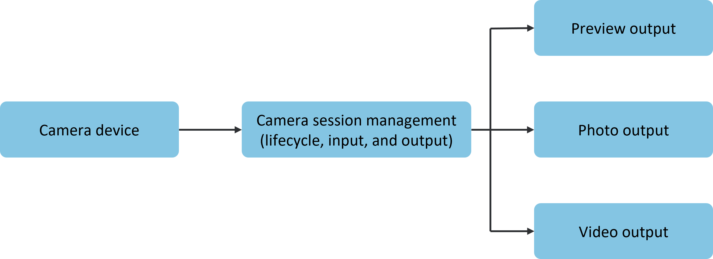
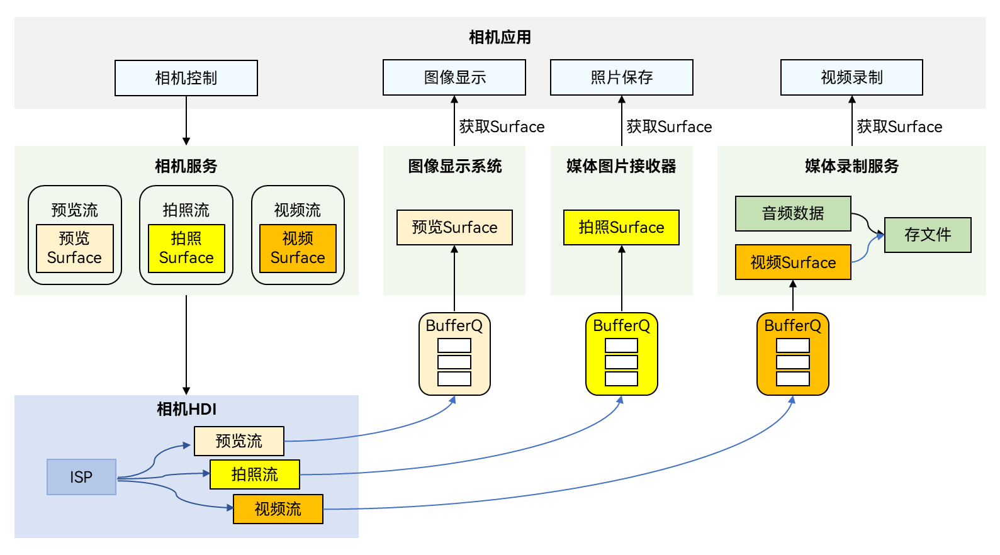

# Introduction to Camera Kit

Developers can create camera applications by invoking the interfaces provided by Camera Kit (camera service). Through accessing and operating camera hardware, applications can perform basic operations such as preview, photo capture, and video recording. Additionally, more advanced operations can be achieved by combining interfaces, such as controlling flash, exposure time, focus, or zoom.

## Development Scenarios

When developers need to create a camera application (or develop a camera module within an application), they should refer to the following development model to understand the camera workflow and proceed with development. For detailed guidance, please refer to the [Camera Development Guide](./cj-camera-preparation.md).

## Development Model

The camera utilizes the camera module to capture and process image and video data, precisely controlling the corresponding hardware to flexibly output image and video content. This meets the requirements for multi-lens hardware adaptation (e.g., wide-angle, telephoto, TOF) and multi-scenario adaptation (e.g., different resolutions, formats, and effects).

The camera workflow, as illustrated below, can be summarized into three parts: camera input device management, session management, and camera output management.

- The camera device invokes the camera module to capture data, serving as the camera input stream.

- Session management can configure input streams, such as selecting which lenses to use for shooting. Additionally, it can configure parameters like flash, exposure time, focus, and zoom to achieve different shooting effects, thereby adapting to various business scenarios. Applications can switch sessions to meet different shooting requirements.

- Configure the camera's output streams, which deliver content as preview streams, photo streams, or video streams.

**Figure 1** Camera Workflow  

After understanding the camera workflow, developers are advised to familiarize themselves with the camera development model to facilitate better application development.

**Figure 2** Camera Development Model  

Camera applications control the camera to perform basic operations such as image display (preview), photo saving (capture), and video recording. During these operations, the camera service manages the camera device to capture and output data. The captured image data is processed at the underlying hardware device interface (HDI, Hardware Device Interfaces) and directly transmitted to specific functional modules via BufferQueue for processing. BufferQueue, which requires no attention during application development, ensures timely delivery of processed data from the underlying layer to the upper layer for image display.

Take video recording as an example: during the recording process, the media recording service first creates a video Surface for data transmission and provides it to the camera service. The camera service then controls the camera device to capture video data and generate a video stream. The captured data is processed by the underlying camera HDI and transmitted to the media recording service via the Surface. The media recording service processes the video data and saves it as a video file, completing the recording process.