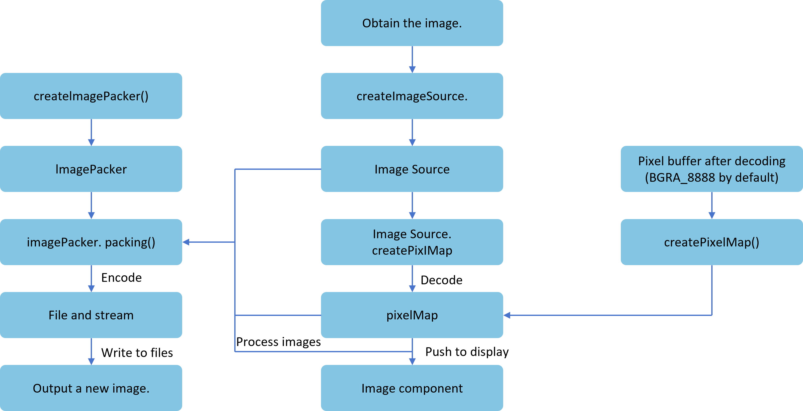

# Introduction to Image Kit

Image development in application development refers to the process of parsing, processing, and constructing image pixel data to achieve the desired image effects. It primarily involves image decoding, image processing, and image encoding.

Before learning image development, it is essential to familiarize yourself with the following basic concepts:

- **Image Decoding**

  Refers to decoding archived images in supported formats into a unified PixelMap for image display or processing within applications or systems.

- **PixelMap**

  Represents an uncompressed bitmap after image decoding, used for image display or processing.

- **Image Processing**

  Involves operations on PixelMap, such as rotation, scaling, setting transparency, obtaining image information, reading/writing pixel data, etc. The coordinate system origin for these operations is the top-left corner.

- **Image Encoding**

  Refers to encoding PixelMap into archived images of different formats for subsequent processing, such as storage or transmission.

The main workflow of image development is illustrated below.

**Figure 1** Image Development Process Diagram

1. **Obtain Image**: Acquire the original image through methods like the application sandbox.

2. **Create ImageSource Instance**: ImageSource is the image source class decoded from the image, used to obtain or modify image-related information.

3. **[Image Decoding](./cj-image-decoding.md)**: Decode the image into PixelMap via ImageSource.

4. **[Image Processing](./cj-image-transformation.md)**: Process the PixelMap to alter image attributes, achieving effects like rotation, scaling, and cropping. The processed image can then be displayed via the Image component.

In addition to the basic image development capabilities mentioned above, OpenHarmony also provides common [Image Tools](./cj-image-tool.md) for developers to choose from.

## Highlights/Features

Image Kit supports multiple image formats for encoding and decoding, employing efficient algorithms and optimization strategies to enhance the speed and efficiency of image processing.

## Constraints and Limitations

- **Read/Write Permission Restrictions:**

  During image processing, user images may be required. Applications must request corresponding read/write permissions from users to ensure proper functionality.

## Relationship with Related Kits

The image framework provides image encoding and decoding capabilities, supporting components like the Image component and applications such as the Gallery. The decoded results can be passed to the Image component for display.