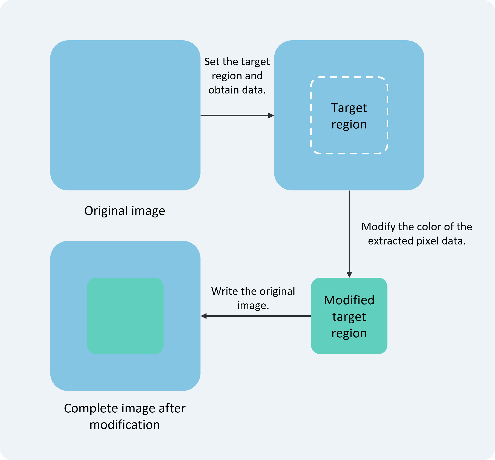

# Performing Bitmap Operations Using PixelMap

<!--Del-->
> **Note:**
>
> Currently in the beta phase.
<!--DelEnd-->

When it's necessary to process specific regions within a target image, bitmap operation functionality can be utilized. This feature is commonly used for operations such as image beautification.

As illustrated below, pixel data from a specified rectangular area in an image is read, modified, and then written back to the corresponding area in the original image.

**Figure 1** Bitmap Operation Schematic  



## Development Procedure  

For detailed API documentation on bitmap operations, please refer to the [API Reference](../../reference/ImageKit/cj-apis-image.md#class-pixelmap).

1. Complete [Image Decoding](./cj-image-decoding.md) to obtain the PixelMap bitmap object.

2. Retrieve information from the PixelMap bitmap object.

    <!-- compile -->

    ```cangjie
    import kit.ImageKit.*
    // Get the total number of bytes for the image pixels.
    let pixelBytesNumber = pixelMap.getPixelBytesNumber()
    // Get the number of bytes per row of the image pixels.
    let rowBytes = pixelMap.getBytesNumberPerRow()
    // Get the current image pixel density. Pixel density refers to the number of pixels per inch. Higher pixel density results in finer image quality.
    let density = pixelMap.getDensity()
    ```

3. Read and modify the pixel data of the target area, then write it back to the original image.
    > **Note:**  
    > It is recommended to use `readPixelsToBuffer` and `writeBufferToPixels` as a pair, and `readPixels` and `writePixels` as a pair, to avoid anomalies in the PixelMap image due to inconsistent pixel formats.

    <!-- compile -->

    ```cangjie
    // Scenario 1: Read and modify the entire image data.
    // Read the image pixel data from the PixelMap according to its pixel format and write it into the buffer.
    let pixelBytesNumber = 100000
    let buffer = Array<UInt8>(Int64(pixelBytesNumber), repeat: 0)
    pixelMap.readPixelsToBuffer(buffer)

    // Read the image pixel data from the buffer according to the PixelMap's pixel format and write it back to the PixelMap.
    pixelMap.writeBufferToPixels(buffer)

    // Scenario 2: Read and modify the image data within a specified region.
    // Read the image pixel data from the specified region of the PixelMap in BGRA_8888 format and write it into the PositionArea.pixels buffer. The region is defined by PositionArea.region.
    let area = PositionArea(Array<UInt8>(8, repeat: 0), 0, 8, Region(Size(1, 2), 0, 0))

    pixelMap.readPixels(area)

    // Read the image pixel data from the PositionArea.pixels buffer in BGRA_8888 format and write it back to the specified region of the PixelMap. The region is defined by PositionArea.region.
    pixelMap.writePixels(area)
    ```

## Development Example - Copying (Deep Copy) a New PixelMap  

1. Complete [Image Decoding](./cj-image-decoding.md) to obtain the PixelMap bitmap object.

2. Copy (deep copy) a new PixelMap.
    > **Note:**  
    > When creating a new PixelMap, the `srcPixelFormat` must be specified as the pixel format of the original PixelMap; otherwise, the new PixelMap may exhibit anomalies.

    <!-- compile -->

    ```cangjie
     /**
      *  Copy (deep copy) a new PixelMap
      *
      * @param pixelMap - The PixelMap to be copied.
      * @param desiredPixelFormat - The pixel format of the new PixelMap. If not specified, the original PixelMap's pixel format will be used.
      * @returns The new PixelMap.
      **/
    func clonePixelMap(pixelMap: PixelMap, desiredPixelFormat: ?PixelMapFormat): PixelMap {
        // Get the image information of the current PixelMap.
        let imageInfo = pixelMap.getImageInfo()
        // Read the image pixel data from the current PixelMap and write it into the buffer array according to the current PixelMap's pixel format.
        let buffer = Array<UInt8>(Int64(pixelMap.getPixelBytesNumber()), repeat: 0)
        pixelMap.readPixelsToBuffer(buffer)
        // Generate initialization options based on the current PixelMap's image information.
        let options = InitializationOptions(
            imageInfo.size,
            // Hypothetical alphaType enumeration value
            alphaType: AlphaType.Opaque,
            // Hypothetical editable value
            editable: true,
            // The pixel format of the current PixelMap.
            srcPixelFormat: imageInfo.pixelFormat,
            // The pixel format of the new PixelMap.
            pixelFormat: desiredPixelFormat??imageInfo.pixelFormat,
            // Hypothetical scaleMode enumeration value
            scaleMode: ScaleMode.FitTargetSize
            )
        // Generate the new PixelMap based on the initialization options and buffer array.
        createPixelMap(buffer, options)
    }
    ```