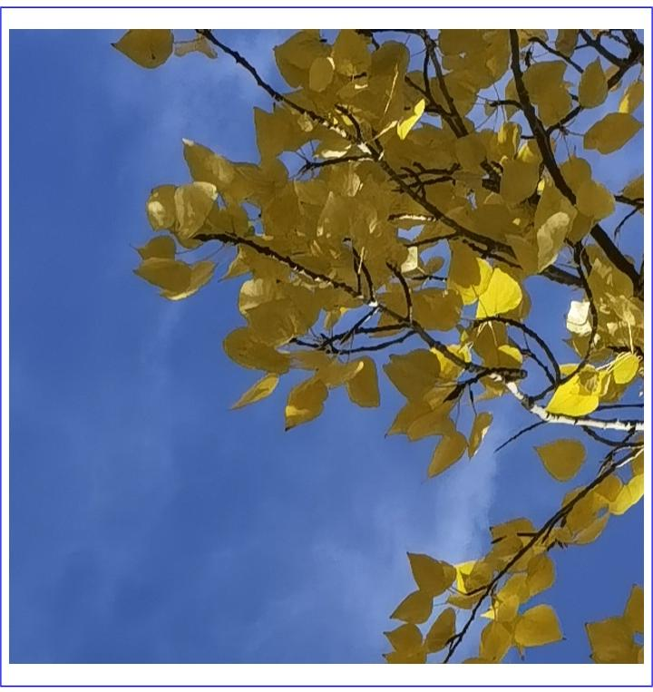
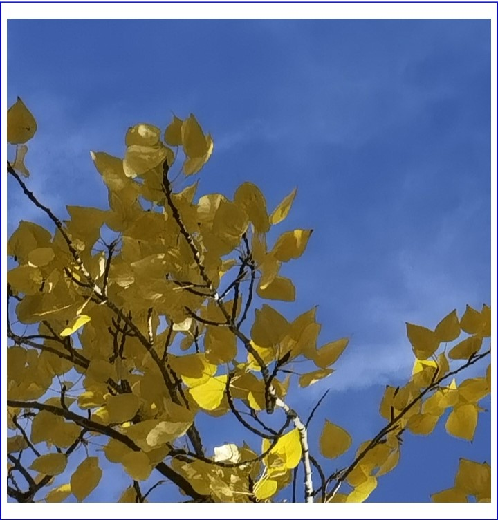
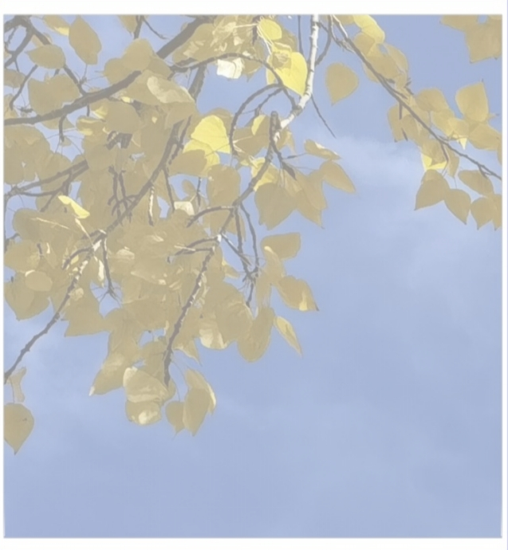

# Performing Image Transformations with PixelMap

Image processing involves operations on PixelMap, such as retrieving image information, cropping, scaling, translating, rotating, flipping, setting opacity, and reading/writing pixel data. Image processing primarily includes image transformations and [bitmap operations](./cj-image-pixelmap-operation.md). This document focuses on image transformations.

## Development Steps

For detailed API descriptions related to image transformations, refer to the [API Reference](../../../../en/application-dev/reference/ImageKit/cj-apis-image.md#class-pixelmap).

1. Complete [image decoding](./cj-image-decoding.md) to obtain a PixelMap object.

2. Retrieve image information.

    <!-- compile -->

    ```cangjie
    import kit.ImageKit.*
    
    // Get image dimensions.
    let info = pixelMap.getImageInfo()
    AppLog.info('info width = ${info.size.width}')
    AppLog.info('info height = ${info.size.height}')
    ```

3. Perform image transformation operations.

   Original image:

     

   - Cropping

     <!-- compile -->

     ```cangjie
     // x: Starting X-coordinate for cropping (0).
     // y: Starting Y-coordinate for cropping (0).
     // height: Crop height 400 (top-to-bottom direction, resulting image height is 400).
     // width: Crop width 400 (left-to-right direction, resulting image width is 400).
     pixelMap.crop(Region(Size(height: 400, width: 400), 0, 0))
     ```

     

   - Scaling

     <!-- compile -->

     ```cangjie
     // Width scaled to 0.5 of original.
     // Height scaled to 0.5 of original.
     pixelMap.scale(0.5, 0.5)
     ```

     

   - Translation

     <!-- compile -->

     ```cangjie
     // Translate downward by 100.
     // Translate rightward by 100.
     pixelMap.translate(100.0, 100.0);
     ```

     

   - Rotation

     <!-- compile -->

     ```cangjie
     // Rotate 90° clockwise.
     pixelMap.rotate(90.0);
     ```

     

   - Flipping

     <!-- compile -->

     ```cangjie
     // Vertical flip.
     pixelMap.flip(false, true);
     ```

     

     <!-- compile -->

     ```cangjie
     // Horizontal flip.
     pixelMap.flip(true, false);
     ```

     

   - Opacity

     <!-- compile -->

     ```cangjie
     // Opacity set to 0.5.
     pixelMap.opacity(0.5);
     ```

     