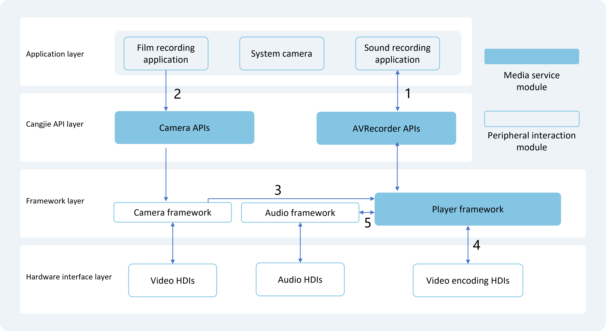

# Media Kit Introduction

Media Kit (Media Services) is designed for developing various audio and video playback or recording functionalities. In the Media Kit development guide, it provides detailed explanations on the development approaches for multiple audio and video modules, guiding developers on how to use the system-provided audio and video APIs to implement corresponding features. For example, using SoundPool to implement simple notification sounds, where the device emits a short "beep" when receiving a new message; or using AVPlayer to implement a music player that loops a song.

The modules provided by Media Kit include:

- [AVPlayer](#avplayer): Playback of audio and video
- [SoundPool](#soundpool): Playback of short audio clips
- [AVRecorder](#avrecorder): Recording of audio and video
- [AVScreenCapture](#avscreencapture): Screen recording
- [AVMetadataExtractor](#avmetadataextractor): Extraction of audio and video metadata
- [AVImageGenerator](#avimagegenerator): Generation of video thumbnails

## Highlights/Features

- Lightweight Media Engine

  Utilizes minimal system resources (threads, memory) to support audio/video playback/recording, flexible pipeline assembly, and plugin-based extensions for source/demuxer/codec.

- HDR Video Support

  Native system data structures and interfaces support the capture and playback of HDR Vivid content, enabling third-party applications to leverage the system's HDR capabilities for more vibrant user experiences.

- Audio Pool Support

  For common short audio effect playback scenarios in development, such as camera shutter sounds or system notification sounds, applications can call SoundPool to achieve one-time loading and multiple low-latency playback instances.

## Development Instructions

This development guide focuses solely on audio and video playback or recording, with capabilities provided by the media module. It does not cover UI interfaces, graphics processing, media storage, or other related functionalities.

Before developing music or video playback features, it is recommended to understand streaming media playback concepts, including but not limited to:

- Playback process: Network protocol > Container format > Audio/Video codec > Graphics/Audio rendering
- Network protocols: e.g., HLS, HTTP-FLV, HTTP/HTTPS
- Container formats: e.g., mp4, mkv, mpeg-ts
- Codec formats: e.g., h264/h265

## AVPlayer

AVPlayer primarily converts Audio/Video media resources (e.g., mp4/mp3/mkv/mpeg-ts) into renderable images and audible analog audio signals, which are then output through playback devices.

AVPlayer offers comprehensive, integrated playback capabilities. Applications only need to provide the streaming media source without handling data parsing or decoding to achieve playback.

### Audio Playback

When developing a music application for audio playback using AVPlayer, the interaction between AVPlayer and external modules is illustrated below.

Music applications implement corresponding functionalities by calling the AVPlayer interface provided by the Cangjie API layer. The framework layer parses resources into audio data streams (PCM) via the playback service (Player Framework). The PCM data is then decoded by software and output to the audio service (Audio Framework), which renders it through the audio driver. Complete audio playback requires collaboration between the application, Player Framework, Audio Framework, and audio HDI.

Numbers in the diagram indicate data transfers with external modules:

1. The music application passes media resources to the AVPlayer interface.
2. Player Framework outputs the audio PCM stream to Audio Framework, which then passes it to the audio HDI.

### Video Playback

When developing a video application for video playback using AVPlayer, the interaction between AVPlayer and external modules is illustrated below.

Applications implement functionalities by calling the AVPlayer interface provided by the Cangjie API layer. The framework layer parses resources into separate audio and video streams via the playback service (Player Framework). The audio stream is decoded by software and output to Audio Framework, then to the audio HDI for playback. The video stream is decoded by hardware (recommended) or software and output to the graphics rendering service (Graphic Framework), then to the display HDI for rendering.

Complete video playback requires collaboration between the application, XComponent, Player Framework, Graphic Framework, Audio Framework, display HDI, and audio HDI.

Numbers in the diagram indicate data transfers with external modules:

1. The application obtains the window SurfaceID from the XComponent.
2. The application passes media resources and SurfaceID to the AVPlayer interface.
3. Player Framework outputs the video ES stream to the decoder HDI, which decodes it into video frames (NV12/NV21/RGBA).
4. Player Framework outputs the audio PCM stream to Audio Framework, which passes it to the audio HDI.
5. Player Framework outputs video frames (NV12/NV21/RGBA) to Graphic Framework, which renders them via the display HDI.

### Supported Formats and Protocols

The following mainstream playback formats are recommended. Audio/video containers and codecs are specialized domains for content creators. Application developers are advised against creating custom streams for testing to avoid compatibility issues such as playback failure, stuttering, or artifacts. Such issues do not affect the system—simply exit playback.

Supported protocols:

| Protocol Type | Description |
| -------- | -------- |
| Local VoD | Format: Supports file descriptor (file path prohibited) |
| Network VoD | Formats: http/https/hls/dash |
| Network Live | Formats: hls/http-flv |

Supported audio playback formats:

| Audio Container | Description |
| -------- | -------- |
| m4a | Codec: AAC |
| aac | Codec: AAC |
| mp3 | Codec: MP3 |
| ogg | Codec: VORBIS |
| wav | Codec: PCM |
| amr | Codec: AMR |

<!--Del-->
> **Note:**
>
> Video playback formats are categorized into mandatory and optional specifications. Mandatory formats are supported by all vendors. Optional formats depend on vendor implementation. Developers should ensure compatibility across platforms.

| Video Format | Mandatory Specification? |
| -------- | -------- |
| H265      | Yes |
| H264      | Yes |
<!--DelEnd-->

Supported video playback formats and resolutions:

| Video Container | Description | Resolutions |
| -------- | -------- | -------- |
| mp4 | Video: H265/H264 Audio: AAC/MP3 | Mainstream resolutions (4K/1080P/720P/480P/270P) |
| mkv | Video: H265/H264 Audio: AAC/MP3 | Mainstream resolutions (4K/1080P/720P/480P/270P) |
| ts | Video: H265/H264 Audio: AAC/MP3 | Mainstream resolutions (4K/1080P/720P/480P/270P) |

Supported subtitle formats:

| Subtitle Container | Supported Protocols | Loading Method |
| -------- | -------- | -------- |
| srt | Local VoD (fd)/Network VoD (http/https/hls/dash) | External subtitles |
| vtt | Local VoD (fd)/Network VoD (http/https/hls/dash) | External subtitles |
| webvtt | Network VoD (dash) | Embedded subtitles |

> **Note:**
>
> When dash protocol includes embedded subtitles, external subtitles cannot be added.

## SoundPool

SoundPool primarily converts audio media resources (e.g., mp3/m4a/wav) into analog audio signals for playback through output devices.

SoundPool provides short audio playback capabilities. Applications only need to provide the audio source without handling data parsing or decoding.

When developing an application for audio playback using SoundPool, the interaction between SoundPool and external modules is illustrated below.

Music applications implement functionalities by calling the SoundPool interface provided by the Cangjie API layer. The framework layer parses resources into PCM streams via Player Framework, which are decoded by software and output to Audio Framework for rendering via the audio driver. Complete audio playback requires collaboration between the application, Player Framework, Audio Framework, and audio HDI.

Numbers in the diagram indicate data transfers with external modules:

1. The music application passes media resources to the SoundPool interface.
2. Player Framework outputs the audio PCM stream to Audio Framework, which passes it to the audio HDI.

### Supported Formats and Protocols

The following mainstream playback formats are recommended. Audio containers and codecs are specialized domains for content creators. Developers are advised against creating custom streams to avoid compatibility issues like playback failure or stuttering. Such issues do not affect the system—simply exit playback.

Supported protocols:

| Protocol Type | Description |
| -------- | -------- |
| Local VoD | Format: Supports file descriptor (file path prohibited) |

Supported audio playback formats:

| Audio Container | Description |
| -------- | -------- |
| m4a | Codec: AAC |
| aac | Codec: AAC |
| mp3 | Codec: MP3 |
| ogg | Codec: VORBIS |
| wav | Codec: PCM |

## AVRecorder

AVRecorder primarily captures audio signals, receives video signals, encodes them, and saves them to files. It simplifies audio/video recording functionalities, including start, pause, resume, stop, and resource release. Developers can specify parameters like codec format, container format, and file path.

When developing a video recording application using AVRecorder, the interaction between AVRecorder and external modules is illustrated below.

- **Audio Recording**: Applications call the AVRecorder interface provided by the Cangjie API layer. The framework captures audio data via Audio Framework and audio HDI, encodes it via software, and saves it to a file.
- **Video Recording**: Applications call the AVRecorder interface, which uses the Camera interface to capture video data via Camera Framework and video HDI. The data is encoded by the video codec HDI and saved to a file.

Combining audio and video recording enables pure audio, pure video, or combined recording.

Numbers in the diagram indicate data transfers with external modules:

1. The application obtains SurfaceID from the recording service via AVRecorder.
2. The application sets SurfaceID for the camera service, which captures video data via video HDI and passes it to the recording service.
3. The camera service passes video data to the recording service via Surface.
4. The recording service encodes video data via the video codec HDI.
5. The recording service configures audio parameters with Audio Framework and retrieves audio data.

### Supported Formats

Supported audio sources:

| Audio Source | Description |
| -------- | -------- |
| mic | System microphone as input. |

Supported video sources:

| Video Source | Description |
| -------- | -------- |
| surface_yuv | Surface carries raw data. |
| surface_es | Surface carries ES data. |

Supported codec formats:

| Codec Format | Description |
| -------- | -------- |
| audio/mp4a-latm | Audio/MP4A-LATM |
| video/hevc | Video/HEVC |
| video/avc | Video/AVC |
| audio/mpeg | Audio/MPEG |
| audio/g711mu | Audio/G.711 μ-law |

Supported output file formats:

| Output Format | Description |
| -------- | -------- |
| mp4 | Video container (MP4). |
| m4a | Audio container (M4A). |
| mp3 | Audio container (MP3). |
| wav | Audio container (WAV). |

## AVScreenCapture

AVScreenCapture captures audio and video signals, encodes them, and saves screen content to files. It offers two interfaces: screen recording to file and screen recording to stream. Developers can specify parameters like codec format, container format, and file path.

When developing a screen recording application using AVScreenCapture, the interaction between AVScreenCapture and external modules is illustrated below.

- **Audio Recording**: Applications call the AVScreenCapture interface via JS/Native API. The framework captures audio data via Audio Framework, encodes it via software, and saves it to a file.
- **Screen Recording**: Applications call the AVScreenCapture interface. The framework captures screen data via graphics services, encodes it via software, and saves it to a file.

### Supported Formats

Supported audio sources:

| Audio Source | Description |
| -------- | -------- |
| MIC | System microphone as input. |
| ALL_PLAYBACK | System internal recording as input. |

Supported video sources:

| Video Source | Description |
| -------- | -------- |
| SURFACE_RGBA | Output buffer contains RGBA data. |

Supported audio codec formats:

| Audio Codec | Description |
| -------- | -------- |
| AAC_LC | AAC-LC type. |

Supported video codec formats:

| Video Codec | Description |
| -------- | -------- |
| H264 | H.264 type. |

Supported output file formats:

| Output Format | Description |
| -------- | -------- |
| mp4 | Video container (MP4). |
| m4a | Audio container (M4A). |

## AVMetadataExtractor

AVMetadataExtractor extracts metadata from audio and video resources. Developers can retrieve details like title, artist, album, and duration for audio, or similar metadata for video (excluding album art).

The workflow includes: creating AVMetadataExtractor, setting the resource, extracting metadata, optionally extracting album art, and releasing resources.

### Supported Formats

Supported audio/video sources: See [Media Data Parsing](./cj-avcodec-support-formats.md#media-parsing).

## AVImageGenerator

AVImageGenerator generates video thumbnails from media resources at specified timestamps.

### Supported Formats

Supported video sources: See [Video Decoding](./cj-avcodec-support-formats.md#video-decoding).