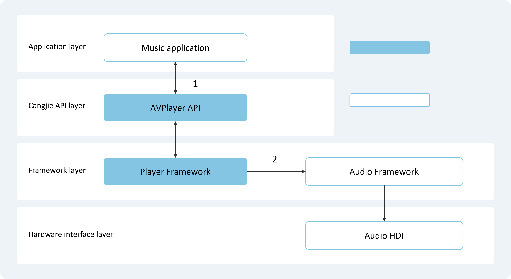
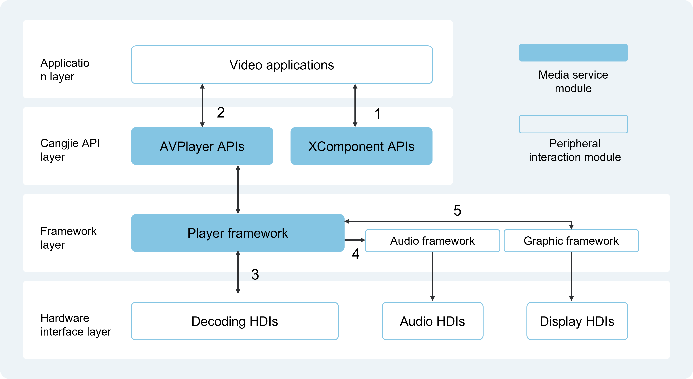
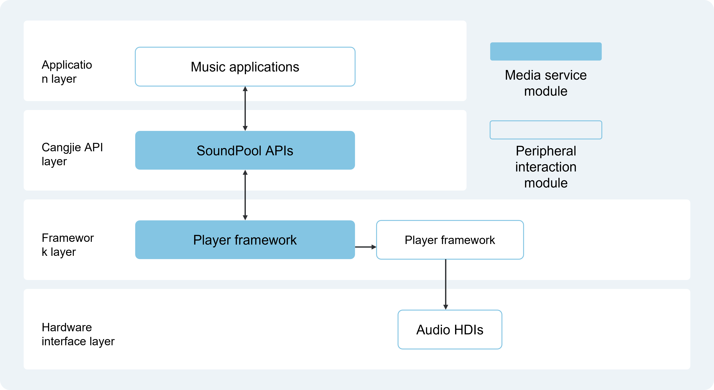
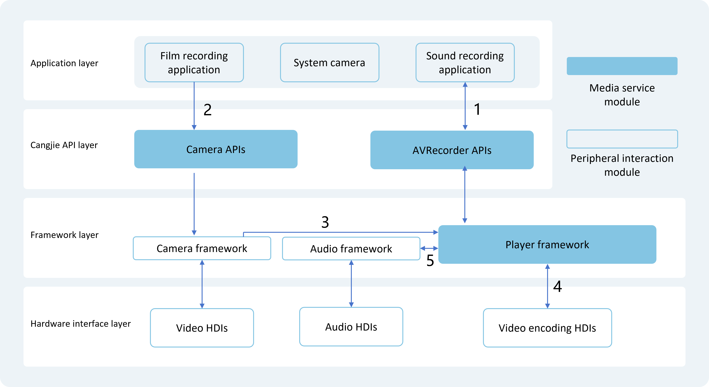
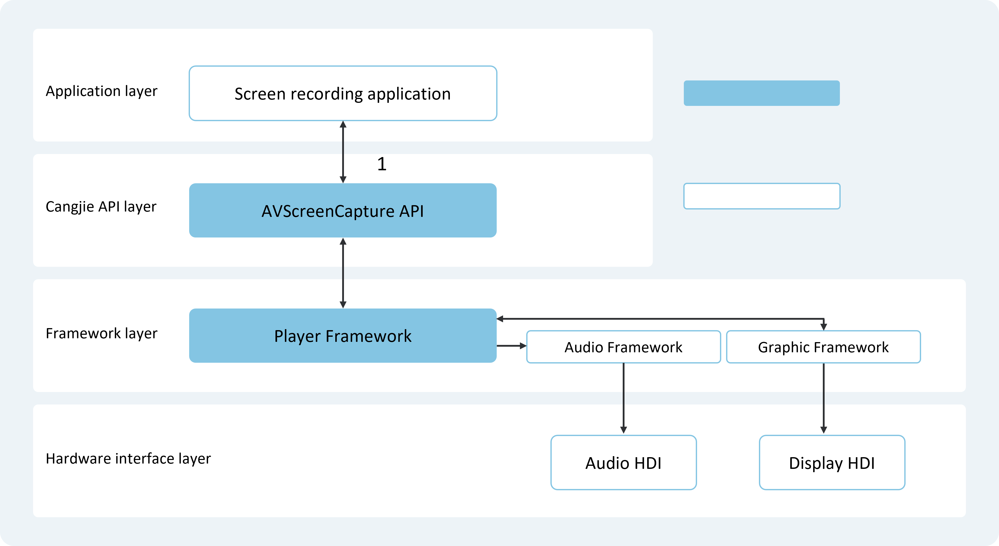

# Media Kit Introduction

Media Kit (Media Service) is designed for developing various audio/video playback and recording functionalities. In the Media Kit development guide, it provides detailed instructions on developing multiple audio/video modules, guiding developers on how to use the system-provided audio/video APIs to implement corresponding features. For example, using SoundPool to implement simple notification sounds—when a device receives a new message, it emits a short "beep" sound; or using AVPlayer to implement a music player that loops a single track.

The modules provided by Media Kit include:

- [AVPlayer](#avplayer): Playback of audio and video
- [SoundPool](#soundpool): Playback of short audio clips
- [AVRecorder](#avrecorder): Recording of audio and video
- [AVScreenCapture](#avscreencapture): Screen recording
- [AVMetadataExtractor](#avmetadataextractor): Extraction of audio/video metadata
- [AVImageGenerator](#avimagegenerator): Generation of video thumbnails

## Highlights/Features

- **Lightweight Media Engine**  
  Utilizes minimal system resources (threads, memory) to support audio/video playback/recording, flexible pipeline assembly, and plugin-based extensions for source/demuxer/codec.

- **HDR Video Support**  
  Native system data structures and interfaces support HDR Vivid capture and playback, enabling third-party applications to leverage the system's HDR capabilities for more vibrant user experiences.

- **Audio Pool Support**  
  For common short sound effect playback scenarios (e.g., camera shutter sounds, system notifications), applications can call SoundPool to achieve one-time loading and multiple low-latency playback instances.

## Development Notes

This development guide focuses solely on audio/video playback or recording, with capabilities provided by the media module. It does not cover UI interfaces, graphics processing, media storage, or other related functionalities.

Before developing music or video playback features, it is recommended to understand streaming media playback concepts, including but not limited to:

- **Playback Process**: Network protocol > Container format > Audio/Video codec > Graphics/Audio rendering
- **Network Protocols**: e.g., HLS, HTTP-FLV, HTTP/HTTPS
- **Container Formats**: e.g., MP4, MKV, MPEG-TS
- **Codec Formats**: e.g., H.264/H.265

## AVPlayer

AVPlayer primarily converts Audio/Video media resources (e.g., MP4/MP3/MKV/MPEG-TS) into renderable images and audible analog audio signals, outputting them via playback devices.

AVPlayer offers comprehensive, integrated playback capabilities. Applications only need to provide the streaming source without handling data parsing or decoding to achieve playback.

### Audio Playback

When developing a music application for audio playback using AVPlayer, the interaction between AVPlayer and external modules is illustrated below.

Music applications implement functionalities by calling AVPlayer interfaces provided by the Cangjie API layer. The framework layer parses resources into PCM audio streams via the Player Framework. The audio stream is decoded by software and passed to the Audio Framework, which outputs it to the audio driver for rendering, completing audio playback. Full audio playback requires collaboration among the application, Player Framework, Audio Framework, and audio HDI.

Numbers in the diagram indicate data transfers with external modules:

1. The music application passes media resources to the AVPlayer interface.
2. The Player Framework outputs PCM audio streams to the Audio Framework, which then passes them to the audio HDI.

### Video Playback

When developing a video application for playback using AVPlayer, the interaction between AVPlayer and external modules is illustrated below.

Applications implement functionalities by calling AVPlayer interfaces provided by the Cangjie API layer. The framework layer parses resources into separate audio and video streams via the Player Framework. The audio stream is decoded by software and passed to the Audio Framework, then to the audio HDI for playback. The video stream is decoded (preferably by hardware) and passed to the Graphic Framework, then to the display HDI for rendering.

Full video playback requires collaboration among the application, XComponent, Player Framework, Graphic Framework, Audio Framework, display HDI, and audio HDI.

Numbers in the diagram indicate data transfers with external modules:

1. The application obtains a window SurfaceID from the XComponent.
2. The application passes media resources and SurfaceID to the AVPlayer interface.
3. The Player Framework outputs video ES streams to the decoder HDI, decoding them into video frames (NV12/NV21/RGBA).
4. The Player Framework outputs PCM audio streams to the Audio Framework, which passes them to the audio HDI.
5. The Player Framework outputs video frames (NV12/NV21/RGBA) to the Graphic Framework, which passes them to the display HDI.

### Supported Formats and Protocols

The following mainstream playback formats are recommended. Audio/video containers and codecs are specialized domains for content creators. Application developers are discouraged from creating custom streams for testing to avoid compatibility issues like playback failure, stuttering, or artifacts. Such issues do not affect the system—simply exit playback.

**Supported Protocols:**

| Protocol Type       | Description                                   |
|---------------------|-----------------------------------------------|
| Local VOD           | Format: Supports file descriptor (file path prohibited) |
| Network VOD         | Formats: HTTP/HTTPS/HLS/DASH                  |
| Network Live        | Formats: HLS/HTTP-FLV                         |

**Supported Audio Playback Formats:**

| Audio Container Spec | Description           |
|---------------------|-----------------------|
| M4A                 | Audio Format: AAC    |
| AAC                 | Audio Format: AAC    |
| MP3                 | Audio Format: MP3    |
| OGG                 | Audio Format: VORBIS |
| WAV                 | Audio Format: PCM    |
| AMR                 | Audio Format: AMR    |

<!--Del-->
> **Note:**  
>  
> Video playback formats are categorized into mandatory and optional specifications. Mandatory formats are supported by all vendors. Optional formats depend on vendor implementation. Developers should ensure compatibility across platforms.

| Video Format | Mandatory Specification? |
|--------------|---------------------------|
| H.265        | Yes                       |
| H.264        | Yes                       |
<!--DelEnd-->

**Supported Video Playback Formats and Resolutions:**

| Video Container Spec | Description                                   | Resolutions                     |
|----------------------|-----------------------------------------------|---------------------------------|
| MP4                  | Video: H.265/H.264 Audio: AAC/MP3          | 4K/1080P/720P/480P/270P         |
| MKV                  | Video: H.265/H.264 Audio: AAC/MP3          | 4K/1080P/720P/480P/270P         |
| TS                   | Video: H.265/H.264 Audio: AAC/MP3          | 4K/1080P/720P/480P/270P         |

**Supported Subtitle Formats:**

| Subtitle Container Spec | Supported Protocols                          | Loading Method       |
|-------------------------|-----------------------------------------------|----------------------|
| SRT                     | Local VOD (FD)/Network VOD (HTTP/HTTPS/HLS/DASH) | External Subtitles   |
| VTT                     | Local VOD (FD)/Network VOD (HTTP/HTTPS/HLS/DASH) | External Subtitles   |
| WebVTT                  | Network VOD (DASH)                            | Embedded Subtitles   |

> **Note:**  
>  
> When DASH streams contain embedded subtitles, external subtitles cannot be added.

## SoundPool

SoundPool primarily converts audio media resources (e.g., MP3/M4A/WAV) into analog audio signals for playback via output devices.

SoundPool provides short audio playback capabilities. Applications only need to provide the audio source without handling data parsing or decoding.

The interaction between SoundPool and external modules during audio playback is illustrated below.

Music applications implement functionalities by calling SoundPool interfaces provided by the Cangjie API layer. The framework layer parses resources into PCM audio streams via the Player Framework. The audio stream is decoded by software and passed to the Audio Framework, which outputs it to the audio driver for rendering. Full audio playback requires collaboration among the application, Player Framework, Audio Framework, and audio HDI.

Numbers in the diagram indicate data transfers with external modules:

1. The music application passes media resources to the SoundPool interface.
2. The Player Framework outputs PCM audio streams to the Audio Framework, which then passes them to the audio HDI.

### Supported Formats and Protocols

The following mainstream playback formats are recommended. Audio containers and codecs are specialized domains for content creators. Application developers are discouraged from creating custom streams for testing to avoid compatibility issues like playback failure or stuttering. Such issues do not affect the system—simply exit playback.

**Supported Protocols:**

| Protocol Type       | Description                                   |
|---------------------|-----------------------------------------------|
| Local VOD           | Format: Supports file descriptor (file path prohibited) |

**Supported Audio Playback Formats:**

| Audio Container Spec | Description           |
|---------------------|-----------------------|
| M4A                 | Audio Format: AAC    |
| AAC                 | Audio Format: AAC    |
| MP3                 | Audio Format: MP3    |
| OGG                 | Audio Format: VORBIS |
| WAV                 | Audio Format: PCM    |

## AVRecorder

AVRecorder primarily captures audio signals, receives video signals, encodes them, and saves them to files. It simplifies audio/video recording for developers, offering controls like start, pause, resume, stop, and resource release. Users can specify parameters like codec format, container format, and file path.

The interaction between AVRecorder and external modules during video recording is illustrated below.

- **Audio Recording**: Applications call AVRecorder interfaces provided by the Cangjie API layer. The framework captures audio data via the Audio Framework and audio HDI, encodes it via software, and saves it to a file.
- **Video Recording**: Applications call AVRecorder interfaces to capture image data via the Camera Framework and video HDI. The Player Framework encodes the data via the video encoder HDI and saves it to a file.

Combining audio and video recording enables pure audio, pure video, or A/V recording.

Numbers in the diagram indicate data transfers with external modules:

1. The application obtains a SurfaceID from the Player Framework via AVRecorder.
2. The application sets the SurfaceID for the Camera Framework to capture image data via the video HDI.
3. The Camera Framework passes video data to the Player Framework via the Surface.
4. The Player Framework encodes video data via the video encoder HDI.
5. The Player Framework configures audio parameters with the Audio Framework and retrieves audio data.

### Supported Formats

**Supported Audio Sources:**

| Audio Source Type | Description                          |
|------------------|--------------------------------------|
| MIC              | System microphone as audio input.    |

**Supported Video Sources:**

| Video Source Type | Description                          |
|------------------|--------------------------------------|
| SURFACE_YUV      | Input Surface carries raw data.      |
| SURFACE_ES       | Input Surface carries ES data.       |

**Supported Codec Formats:**

| Codec Format       | Description                          |
|-------------------|--------------------------------------|
| audio/mp4a-latm   | AAC audio type                       |
| video/hevc        | H.265 video type                     |
| video/avc         | H.264 video type                     |
| audio/mpeg        | MPEG audio type                      |
| audio/g711mu      | G.711 μ-law audio type               |

**Supported Output File Formats:**

| Output Format | Description                          |
|--------------|--------------------------------------|
| MP4          | Video container format (MP4).        |
| M4A          | Audio container format (M4A).        |
| MP3          | Audio container format (MP3).        |
| WAV          | Audio container format (WAV).        |

## AVScreenCapture

AVScreenCapture captures audio/video signals and encodes screen data into files. It offers two interfaces: screen recording to file and screen recording to stream, allowing users to specify codec formats, container formats, and file paths.

The interaction between AVScreenCapture and external modules during screen recording is illustrated below.

- **Audio Recording**: Applications call AVScreenCapture interfaces (JS/Native) to capture audio data via the Audio Framework, encode it via software, and save it to a file.
- **Screen Recording**: Applications call AVScreenCapture interfaces to capture screen data via the Graphic Framework, encode it via software, and save it to a file.

### Supported Formats

**Supported Audio Sources:**

| Audio Source Type | Description                          |
|------------------|--------------------------------------|
| MIC              | System microphone as audio input.    |
| ALL_PLAYBACK     | System internal recording as audio input. |

**Supported Video Sources:**

| Video Source Type | Description                          |
|------------------|--------------------------------------|
| SURFACE_RGBA     | Output buffer contains RGBA data.    |

**Supported Audio Codec Formats:**

| Audio Codec Format | Description                          |
|-------------------|--------------------------------------|
| AAC_LC            | AAC Low Complexity type.            |

**Supported Video Codec Formats:**

| Video Codec Format | Description                          |
|-------------------|--------------------------------------|
| H264              | H.264 type.                          |

**Supported Output File Formats:**

| Output Format | Description                          |
|--------------|--------------------------------------|
| MP4          | Video container format (MP4).        |
| M4A          | Audio-only container format (M4A).  |

## AVMetadataExtractor

AVMetadataExtractor extracts metadata from audio/video resources. For audio, it retrieves details like title, artist, album, and duration. Video metadata extraction is similar but excludes album covers.

The workflow includes: creating AVMetadataExtractor, setting the resource, extracting metadata, optionally extracting album covers, and releasing resources.

### Supported Formats

Supported audio/video sources are detailed in [Media Data Parsing](./cj-avcodec-support-formats.md#媒体数据解析).

## AVImageGenerator

AVImageGenerator generates video thumbnails from media resources at specified timestamps.

### Supported Formats

Supported video sources are detailed in [Video Decoding](./cj-avcodec-support-formats.md#视频解码).