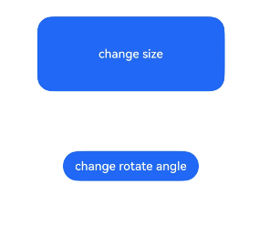

# Property Animation

When certain common properties of a component change, smooth transition effects can be achieved through property animation to enhance user experience. Supported properties include [width](./cj-universal-attribute-size.md#func-widthlength), [height](./cj-universal-attribute-size.md#func-heightlength), [backgroundColor](cj-universal-attribute-background.md#func-backgroundcolorresourcecolor), [opacity](cj-universal-attribute-opacity.md#func-opacityfloat64), [scale](./cj-universal-attribute-transform.md#func-scalefloat32-float32-float32-length-length), [rotate](./cj-universal-attribute-transform.md#func-rotatefloat32-float32-float32-float64-length-length), [translate](./cj-universal-attribute-transform.md#func-translatelength-length-length), etc. For layout animations that change width/height, the content jumps directly to the final state (e.g., text, [Canvas](./cj-canvas-drawing-canvas.md) content). To make content follow width/height changes, use the [renderFit](./cj-universal-attribute-renderfit.md) property configuration.

## Import Module

```cangjie
import kit.ArkUI.*
```

## func animation(?AnimateParam)

```cangjie
public func animation(value: ?AnimateParam): T
```

**Function:** Sets property animation for a component.

**System Capability:** SystemCapability.ArkUI.ArkUI.Full

**Since:** 22

**Parameters:**

| Name | Type | Required | Default | Description |
|:---|:---|:---|:---|:---|
| value | ?[AnimateParam](./cj-common-types.md#class-animateparam) | Yes | - | Parameters for animation effects. |

**Return Value:**

| Type | Description |
|:----|:----|
| T | Returns the component instance. |

## Example Code

This example demonstrates component property animation using the animation method.

<!-- run -->

```cangjie
package ohos_app_cangjie_entry
import kit.ArkUI.*
import ohos.arkui.state_macro_manage.*
import ohos.hilog.*

let animateOpt1 = AnimateParam(
    duration: 1200,
    curve: Curve.EaseOut,
    delay: 500,
    iterations: 3,
    playMode: PlayMode.Normal,
    onFinish: {
        => Hilog.info(0, "cangjie", "onfinish")
    },
    expectedFrameRateRange: ExpectedFrameRateRange(
        min: 20,
        max: 120,
        expected: 90
    )
)
let animateOpt2 = AnimateParam(
    duration: 1200,
    curve: Curve.Friction,
    delay: 500,
    iterations: -1,
    playMode: PlayMode.Alternate,
    onFinish: {
        => Hilog.info(0, "cangjie", "onfinish")
    },
    expectedFrameRateRange: ExpectedFrameRateRange(
        min: 20,
        max: 120,
        expected: 90
    )
)

@Entry
@Component
class EntryView {
    @State var widthSize: Length = 250.vp
    @State var heightSize: Length = 100.vp
    @State var rotateAngle: Float32 = 0.0
    @State var flag: Bool = true
    func build() {
        Column() {
            Button("change size")
                .animation(animateOpt1)
                .onClick({
                   evt =>
                    if (this.flag) {
                        this.widthSize = 150.vp
                        this.heightSize = 60.vp
                    } else {
                        this.widthSize = 250.vp
                        this.heightSize = 100.vp
                    }
                    this.flag = !this.flag
                })
                .margin(30)
                .width(this.widthSize)
                .height(this.heightSize)
            Button('change rotate angle')
                .animation(animateOpt2)
                .onClick({
                   evt => this.rotateAngle = 90.0
                })
                .margin(50)
                .rotate(angle: this.rotateAngle)
        }
        .width(100.percent)
        .margin(top: 20)
    }
}
```

