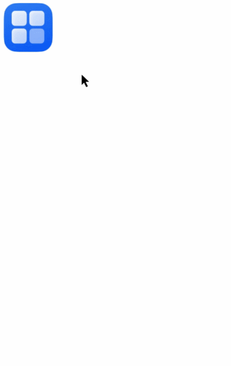

# Implicit Shared Element Transition Within Components (geometryTransition)

Provides smooth contextual inheritance transitions during view switching. The general transition mechanism offers effects like [opacity](cj-animation-transition.md#static-func-opacityfloat64) and [scale](cj-animation-transition.md#static-func-scalescaleoptions). geometryTransition establishes spatial connections between originally independent transition animations by coordinating the frame and position of the bound in/out components (where "in" refers to the new view and "out" refers to the old view), guiding the visual focus from the old view's position to the new view's position.

## Import Module

```cangjie
import kit.ArkUI.*
```

## func geometryTransition(?String, ?Bool)

```cangjie
public func geometryTransition(id: ?String, follow!: ?Bool = None): T
```

**Function:** Implicit shared element transition within components

> **Note:**
>
> geometryTransition must be used with [animateTo](./cj-apis-uicontext-uicontext.md#func-animatetoanimateparam-voidcallback) to achieve animation effects. The animation duration and curve follow the configuration in [animateTo](./cj-apis-uicontext-uicontext.md#func-animatetoanimateparam-voidcallback) and do not support [animation](./cj-animation-animation.md) implicit animations.

**System Capability:** SystemCapability.ArkUI.ArkUI.Full

**Initial Version:** 22

**Parameters:**

| Parameter Name | Type | Required | Default Value | Description |
|:---|:---|:---|:---|:---|
| id | ?String | Yes | - | Used to establish binding relationships. Setting id to an empty string clears the binding to avoid participation in sharing behavior. The id can be changed to re-establish binding relationships. Only two components can be bound to the same id, and they must be of different in/out roles. Multiple components cannot share the same id.<br>Initial value: "". |
| follow | ?Bool | No | None | **Named parameter.** Used only in if paradigms to mark whether components always present in the component tree should follow the shared animation. Initial value: false |

**Return Value:**

| Type | Description |
|:----|:----|
| T | Returns the component instance. |

## Example Code

<!-- run -->

```cangjie
package ohos_app_cangjie_entry
import kit.ArkUI.*
import ohos.arkui.state_macro_manage.*
import ohos.resource.*

@Entry
@Component
class EntryView {
    @State var isShow: Bool = false
    func build() {
        Stack(alignContent:Alignment.Center) {
            if (this.isShow) {
                Image(@r(app.media.startIcon))
                    .autoResize(false)
                    .clip(true)
                    .width(300)
                    .height(400)
                    .offset(x: 0, y: 100)
                    .geometryTransition("picture")
                    .transition(TransitionEffect.OPACITY)
            } else {
                Column() {
                    Column() {
                        Image(@r(app.media.startIcon))
                            .width(100.percent)
                            .height(100.percent)
                    }
                        .width(100.percent)
                        .height(100.percent)
                }
                    .width(80)
                    .height(80)
                    .borderRadius(20)
                    .clip(true)
                    .geometryTransition("picture")
                    .transition(TransitionEffect.OPACITY)
            }
        }.onClick({
            event => getUIContext().animateTo(AnimateParam(duration: 1000), ({=> this.isShow = !this.isShow}))
        })
    }
}
```

