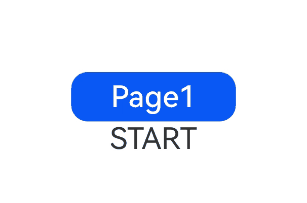

# Page Transition (pageTransition)

When routing switches occur, custom page entrance and exit transition effects can be defined.

> **Note:**
>
> For better transition effects, it is recommended to use the Navigation component and [Modal Transition](../../arkui-cj/cj-modal-transition.md).

## Import Module

```cangjie
import kit.ArkUI.*
```

## class CommonTransition

```cangjie
sealed abstract class CommonTransition {}
```

**Function:** The common base class for page transition animations, providing a series of reusable animation effect methods.

**System Capability:** SystemCapability.ArkUI.ArkUI.Full

**Initial Version:** 22

### func slide(SlideEffect)

```cangjie
public func slide(value: SlideEffect): This
```

**Function:** Sets the sliding effect during page transitions.

**System Capability:** SystemCapability.ArkUI.ArkUI.Full

**Initial Version:** 22

**Parameters:**

| Parameter | Type | Required | Default | Description |
|:---|:---|:---|:---|:---|
| value | [SlideEffect](#enum-slideeffect) | Yes | - | The type of sliding effect. |

### func translate(?Length, ?Length, ?Length)

```cangjie
public func translate(x!: ?Length = None, y!: ?Length = None, z!: ?Length = None): This
```

**Function:** Sets the translation effect during page transitions.

**System Capability:** SystemCapability.ArkUI.ArkUI.Full

**Initial Version:** 22

**Parameters:**

| Parameter | Type | Required | Default | Description |
|:---|:---|:---|:---|:---|
| x | ?[Length](./cj-common-types.md#interface-length) | No | None | **Named parameter.** The translation distance on the x-axis. Initial value: 0.0vp |
| y | ?[Length](./cj-common-types.md#interface-length) | No | None | **Named parameter.** The translation distance on the y-axis. Initial value: 0.0vp |
| z | ?[Length](./cj-common-types.md#interface-length) | No | None | **Named parameter.** The translation distance on the z-axis. Initial value: 0.0vp |

### func scale(?Float32, ?Float32, ?Float32, ?Length, ?Length)

```cangjie
public func scale(
    x!: ?Float32 = None,
    y!: ?Float32 = None,
    z!: ?Float32 = None,
    centerX!: ?Length = None,
    centerY!: ?Length = None
): This
```

**Function:** Sets the scaling effect during page transitions.

**System Capability:** SystemCapability.ArkUI.ArkUI.Full

**Initial Version:** 22

**Parameters:**

| Parameter | Type | Required | Default | Description |
|:---|:---|:---|:---|:---|
| x | ?Float32 | No | None | **Named parameter.** The scaling ratio on the x-axis. Initial value: 1.0 |
| y | ?Float32 | No | None | **Named parameter.** The scaling ratio on the y-axis. Initial value: 1.0 |
| z | ?Float32 | No | None | **Named parameter.** The scaling ratio on the z-axis. Initial value: 1.0 |
| centerX | ?[Length](./cj-common-types.md#interface-length) | No | None | **Named parameter.** The x-coordinate of the transformation center point. Initial value: 50.percent |
| centerY | ?[Length](./cj-common-types.md#interface-length) | No | None | **Named parameter.** The y-coordinate of the transformation center point. Initial value: 50.percent |

### func opacity(Float64)

```cangjie
public func opacity(value: Float64): This
```

**Function:** Sets the opacity effect during page transitions.

**System Capability:** SystemCapability.ArkUI.ArkUI.Full

**Initial Version:** 22

**Parameters:**

| Parameter | Type | Required | Default | Description |
|:---|:---|:---|:---|:---|
| value | Float64 | Yes | - | The opacity value, ranging from [0, 1], where 0 means fully transparent and 1 means fully opaque. |

## class PageTransitionEnter

```cangjie
public class PageTransitionEnter <: CommonTransition {
    public init(
        routeType!: ?RouteType = Option.None,
        duration!: ?Int32 = None,
        curve!: ?Curve = None,
        delay!: ?Int32 = None
    )
}
```

**Function:** The custom entrance animation type for the current page.

**System Capability:** SystemCapability.ArkUI.ArkUI.Full

**Initial Version:** 22

**Parent Type:**

- [CommonTransition](#class-commontransition)

### init(?RouteType, ?Int32, ?Curve, ?Int32)

```cangjie
public init(
    routeType!: ?RouteType = Option.None,
    duration!: ?Int32 = None,
    curve!: ?Curve = None,
    delay!: ?Int32 = None
)
```

**Function:** Creates a custom entrance animation object for the current page.

**System Capability:** SystemCapability.ArkUI.ArkUI.Full

**Initial Version:** 22

**Parameters:**

| Parameter | Type | Required | Default | Description |
|:---|:---|:---|:---|:---|
| routeType | ?[RouteType](#enum-routetype) | No | Option.None | **Named parameter.** The route type for which the page transition effect is applied. |
| duration | ?Int32 | No | None | **Named parameter.** The duration of the animation. Unit: milliseconds. Range: [0, +∞). |
| curve | ?[Curve](./cj-common-types.md#enum-curve) | No | None | **Named parameter.** The animation curve. |
| delay | ?Int32 | No | None | **Named parameter.** The delay time of the animation. Unit: milliseconds. |

### func onEnter(?PageTransitionCallback)

```cangjie
public func onEnter(event: ?PageTransitionCallback)
```

**Function:** Frame-by-frame callback until the entrance animation ends, with progress changing from 0 to 1.

**System Capability:** SystemCapability.ArkUI.ArkUI.Full

**Initial Version:** 22

**Parameters:**

| Parameter | Type | Required | Default | Description |
|:---|:---|:---|:---|:---|
| event | ?[PageTransitionCallback](#type-pagetransitioncallback) | Yes | - | The frame-by-frame callback for the entrance animation until it ends, with progress changing from 0 to 1. |

## class PageTransitionExit

```cangjie
public class PageTransitionExit <: CommonTransition {
    public init(
        routeType!: ?RouteType = Option.None,
        duration!: ?Int32 = None,
        curve!: ?Curve = None,
        delay!: ?Int32 = None
    )
}
```

**Function:** The custom exit animation type for the current page.

**System Capability:** SystemCapability.ArkUI.ArkUI.Full

**Initial Version:** 22

**Parent Type:**

- [CommonTransition](#class-commontransition)

### init(?RouteType, ?Int32, ?Curve, ?Int32)

```cangjie
public init(
    routeType!: ?RouteType = Option.None,
    duration!: ?Int32 = None,
    curve!: ?Curve = None,
    delay!: ?Int32 = None
)
```

**Function:** Creates a custom exit animation object for the current page.

**System Capability:** SystemCapability.ArkUI.ArkUI.Full

**Initial Version:** 22

**Parameters:**

| Parameter | Type | Required | Default | Description |
|:---|:---|:---|:---|:---|
| routeType | ?[RouteType](#enum-routetype) | No | Option.None | **Named parameter.** The route type for which the page transition effect is applied. |
| duration | ?Int32 | No | None | **Named parameter.** The duration of the animation. Unit: milliseconds. Range: [0, +∞). |
| curve | ?[Curve](./cj-common-types.md#enum-curve) | No | None | **Named parameter.** The animation curve. |
| delay | ?Int32 | No | None | **Named parameter.** The delay time of the animation. Unit: milliseconds. |

### func onExit(?PageTransitionCallback)

```cangjie
public func onExit(event: ?PageTransitionCallback)
```

**Function:** Frame-by-frame callback until the exit animation ends, with progress changing from 0 to 1.

**System Capability:** SystemCapability.ArkUI.ArkUI.Full

**Initial Version:** 22

**Parameters:**

| Parameter | Type | Required | Default | Description |
|:---|:---|:---|:---|:---|
| event | ?[PageTransitionCallback](#type-pagetransitioncallback) | Yes | - | The frame-by-frame callback for the exit animation until it ends, with progress changing from 0 to 1. |

## enum RouteType

```cangjie
public enum RouteType <: Equatable<RouteType> {
    | None
    | Push
    | Pop
    | ...
}
```

**Function:** The type of page routing.

**System Capability:** SystemCapability.ArkUI.ArkUI.Full

**Initial Version:** 22

**Parent Type:**

- Equatable\<[RouteType](#enum-routetype)>

### None

```cangjie
None
```

**Function:** The page is not redirected.

**System Capability:** SystemCapability.ArkUI.ArkUI.Full

**Initial Version:** 22

### Push

```cangjie
Push
```

**Function:** Navigates to the next page.

**System Capability:** SystemCapability.ArkUI.ArkUI.Full

**Initial Version:** 22

### Pop

```cangjie
Pop
```

**Function:** Redirects to the specified page.

**System Capability:** SystemCapability.ArkUI.ArkUI.Full

**Initial Version:** 22

### operator func !=(RouteType)

```cangjie
public operator func !=(other: RouteType): Bool
```

**Function:** Compares whether two enumeration values are not equal.

**System Capability:** SystemCapability.ArkUI.ArkUI.Full

**Initial Version:** 22

**Parameters:**

| Parameter | Type | Required | Default | Description |
|:---|:---|:---|:---|:---|
| other | [RouteType](#enum-routetype) | Yes | - | The other enumeration value to compare. |

**Return Value:**

| Type | Description |
|:----|:----|
| Bool | Returns true if the two enumeration values are not equal, otherwise returns false. |

### operator func ==(RouteType)

```cangjie
public operator func ==(other: RouteType): Bool
```

**Function:** Compares whether two enumeration values are equal.

**System Capability:** SystemCapability.ArkUI.ArkUI.Full

**Initial Version:** 22

**Parameters:**

| Parameter | Type | Required | Default | Description |
|:---|:---|:---|:---|:---|
| other | [RouteType](#enum-routetype) | Yes | - | The other enumeration value to compare. |

**Return Value:**

| Type | Description |
|:----|:----|
| Bool | Returns true if the two enumeration values are equal, otherwise returns false. |

## enum SlideEffect

```cangjie
public enum SlideEffect <: Equatable<SlideEffect> {
    | Left
    | Right
    | Top
    | Bottom
    | ...
}
```

**Function:** The type of page sliding effect.

**System Capability:** SystemCapability.ArkUI.ArkUI.Full

**Initial Version:** 22

**Parent Type:**

- Equatable\<[SlideEffect](#enum-slideeffect)>

### Left

```cangjie
Left
```

**Function:** For entrance, it means sliding in from the left; for exit, it means sliding out to the left.

**System Capability:** SystemCapability.ArkUI.ArkUI.Full

**Initial Version:** 22

### Right

```cangjie
Right
```

**Function:** For entrance, it means sliding in from the right; for exit, it means sliding out to the right.

**System Capability:** SystemCapability.ArkUI.ArkUI.Full

**Initial Version:** 22

### Top

```cangjie
Top
```

**Function:** For entrance, it means sliding in from the top; for exit, it means sliding out to the top.

**System Capability:** SystemCapability.ArkUI.ArkUI.Full

**Initial Version:** 22

### Bottom

```cangjie
Bottom
```

**Function:** For entrance, it means sliding in from the bottom; for exit, it means sliding out to the bottom.

**System Capability:** SystemCapability.ArkUI.ArkUI.Full

**Initial Version:** 22

### operator func !=(SlideEffect)

```cangjie
public operator func !=(other: SlideEffect): Bool
```

**Function:** Compares whether two enumeration values are not equal.

**System Capability:** SystemCapability.ArkUI.ArkUI.Full

**Initial Version:** 22

**Parameters:**

| Parameter | Type | Required | Default | Description |
|:---|:---|:---|:---|:---|
| other | [SlideEffect](#enum-slideeffect) | Yes | - | The other enumeration value to compare. |

**Return Value:**

| Type | Description |
|:----|:----|
| Bool | Returns true if the two enumeration values are not equal, otherwise returns false. |

### operator func ==(SlideEffect)

```cangjie
public operator func ==(other: SlideEffect): Bool
```

**Function:** Compares whether two enumeration values are equal.

**System Capability:** SystemCapability.ArkUI.ArkUI.Full

**Initial Version:** 22

**Parameters:**

| Parameter | Type | Required | Default | Description |
|:---|:---|:---|:---|:---|
| other | [SlideEffect](#enum-slideeffect) | Yes | - | The other enumeration value to compare. |

**Return Value:**

| Type | Description |
|:----|:----|
| Bool | Returns true if the two enumeration values are equal, otherwise returns false. |## type PageTransitionCallback

```cangjie
public type PageTransitionCallback = (RouteType, Float64) -> Unit
```

**Function:** Callback for reporting page transition events.

**Type:** ([RouteType](#enum-routetype), Float64) -> Unit

## Example Code

### Example Code 1 (Configuring Exit/Enter Animations)

Configure different exit and enter animations through different transition types.

<!-- run -->

```cangjie
//index.cj
package ohos_app_cangjie_entry
import kit.ArkUI.*
import ohos.arkui.state_macro_manage.*
import ohos.i18n.*
import ohos.resource_manager.*
import ohos.arkui.ui_context.*
import ohos.resource.__GenerateResource__

@Entry
@Component
class EntryView {
    @State var scale2: Float32 = 1.0
    @State var opacity2: Float64 = 1.0

    func build() {
        Column() {
            Image(@r(app.media.background))
                .width(100.percent)
                .height(100.percent)
        }
        .width(100.percent)
        .height(100.percent)
        .scale(x: scale2, y: 1.0)
        .opacity(this.opacity2)
        .onClick({
                e => getUIContext().getRouter().pushUrl(url: "Page1")
            })
    }

    protected func onTransition(): Unit {
        PageTransitionEnter(duration: 1200, curve: Curve.Linear,).onEnter({
            ty: RouteType, progress: Float64 => match (ty) {
                case RouteType.Push | RouteType.Pop =>
                    scale2 = Float32(progress)
                    opacity2 = progress
                case _ => ()
            }
        })
        PageTransitionExit(duration: 1200, curve: Curve.Ease, ).onExit({
            ty: RouteType, progress: Float64 => match (ty) {
                case RouteType.Push =>
                    this.scale2 = Float32(1.0 - progress)
                    this.opacity2 = 1.0 - progress
                case _ => ()
            }
        })
    }
}
```

<!-- run -->

```cangjie
//page1.cj
package ohos_app_cangjie_entry
import kit.ArkUI.*
import ohos.arkui.state_macro_manage.*
import ohos.i18n.*
import ohos.resource_manager.*
import ohos.arkui.ui_context.*
import ohos.resource.__GenerateResource__

@Entry
@Component
class Page1 {
    @State var scale1: Float32 = 1.0
    @State var opacity1: Float64 = 1.0

    func build() {
        Column() {
            Image(@r(app.media.background))
                .width(50.percent)
                .height(50.percent)
        }
        .width(100.percent)
        .height(100.percent)
        .scale(x: scale1, y: 1.0)
        .opacity(opacity1)
        .onClick({
                e => getUIContext().getRouter().pushUrl(url: "EntryView")
            })
    }

    protected func onTransition(): Unit {
        PageTransitionEnter(duration: 1200, curve: Curve.Linear).onEnter({
            ty: RouteType, progress: Float64 => match (ty) {
                case RouteType.Push | RouteType.Pop =>
                    scale1 = Float32(progress)
                    opacity1 = progress
                case _ => ()
            }
        })
        PageTransitionExit(duration: 1200, curve: Curve.Ease).onExit({
            ty: RouteType, progress: Float64 => match (ty) {
                case RouteType.Push =>
                    this.scale1 = Float32(1.0 - progress)
                    this.opacity1 = 1.0 - progress
                case _ => ()
            }
        })
    }
}
```


### Example Code 2 (Configuring Exit/Enter Slide Effects)

Configure different exit/enter slide effects by changing the system language layout mode to RTL.

<!-- run -->

```cangjie
//index.cj
package ohos_app_cangjie_entry
import kit.ArkUI.*
import ohos.arkui.state_macro_manage.*
import ohos.i18n.*
import ohos.resource_manager.*
import ohos.arkui.ui_context.*

@Entry
@Component
class EntryView {
    @State var scale2: Float32 = 1.0
    @State var opacity2: Float64 = 1.0

    func build() {
        Column() {
            Button("Page1").onClick({
                e => getUIContext().getRouter().pushUrl(url: "Page1")
            })
                .width(200)
                .height(60)
                .fontSize(36)
            Text("START")
                .fontSize(36)
                .textAlign(TextAlign.Center)
        }
        .width(100.percent)
        .height(100.percent)
        .scale(x: scale2, y: 1.0)
        .opacity(this.opacity2)
        .justifyContent(FlexAlign.Center)
    }

    protected func onTransition(): Unit {
        PageTransitionEnter(duration: 1200, curve: Curve.Linear).slide(SlideEffect.Left)
        PageTransitionExit(duration: 1200, curve: Curve.Ease).slide(SlideEffect.Left)
    }
}
```

<!-- run -->

```cangjie

//page1.cj
package ohos_app_cangjie_entry
import kit.ArkUI.*
import ohos.arkui.state_macro_manage.*
import ohos.i18n.*
import ohos.resource_manager.*
import ohos.arkui.ui_context.*

@Entry
@Component
class Page1 {
    @State var scale1: Float32 = 1.0
    @State var opacity1: Float64 = 1.0

    func build() {
        Column() {
            Button("Page2").onClick({
                e => getUIContext().getRouter().pushUrl(url: "EntryView")
            })
                .width(200)
                .height(60)
                .fontSize(36)
            Text("END")
                .fontSize(36)
                .textAlign(TextAlign.Center)
        }
        .width(100.percent)
        .height(100.percent)
        .scale(x: scale1, y: 1.0)
        .opacity(this.opacity1)
        .justifyContent(FlexAlign.Center)
    }

    protected func onTransition(): Unit {
        PageTransitionEnter(duration: 1200).slide(SlideEffect.Right)
        PageTransitionExit(duration: 1200).slide(SlideEffect.Right)
    }
}
```

