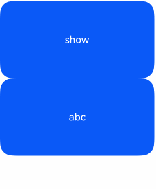
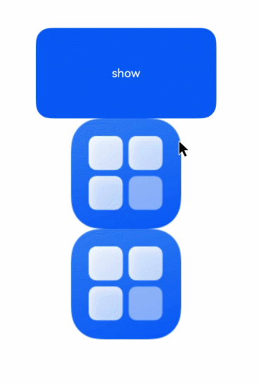

# Component Transition

Component transition primarily configures transition parameters through the `transition` attribute, displaying transition animations when components are inserted or deleted. It is mainly used to enhance user experience during the insertion and deletion of child components within container components.

> **Note:**
>
> Currently, there are two ways to trigger component transition:
>
> - When a component is inserted or deleted (e.g., due to `if` condition changes or `ForEach` adding/removing components), the transition effects of all newly inserted/deleted components will be triggered recursively.
> - When the [Visibility](./cj-universal-attribute-visibility.md) attribute of a component changes between visible and invisible, only the transition effect of that component is triggered.

## Import Module

```cangjie
import kit.ArkUI.*
```

## class RotateOptions

```cangjie
public class RotateOptions {
    public var angle: Float32
    public var x: Float32
    public var y: Float32
    public var z: Float32
    public var centerX: Length
    public var centerY: Length
    public var centerZ: Length
    public var perspective: Float32
    public init(angle: Float32, x!: Float32 = 0.0, y!: Float32 = 0.0, z!: Float32 = 0.0, centerX!: Length = 50.percent,
        centerY!: Length = 50.percent, centerZ!: Length = 0, perspective!: Float32 = 0.0)
}
```

**Function:** Sets rotation parameters.

**System Capability:** SystemCapability.ArkUI.ArkUI.Full

**Since:** 21

### var angle

```cangjie
public var angle: Float32
```

**Function:** Specifies the rotation angle.

**Type:** Float32

**Read/Write:** Readable and Writable

**System Capability:** SystemCapability.ArkUI.ArkUI.Full

**Since:** 21

### var centerX

```cangjie
public var centerX: Length
```

**Function:** Specifies the x-coordinate of the component's transformation center point (i.e., anchor point).

**Type:** [Length](../BasicServicesKit/cj-apis-base.md#interface-length)

**Read/Write:** Readable and Writable

**System Capability:** SystemCapability.ArkUI.ArkUI.Full

**Since:** 21

### var centerY

```cangjie
public var centerY: Length
```

**Function:** Specifies the y-coordinate of the component's transformation center point (i.e., anchor point).

**Type:** [Length](../BasicServicesKit/cj-apis-base.md#interface-length)

**Read/Write:** Readable and Writable

**System Capability:** SystemCapability.ArkUI.ArkUI.Full

**Since:** 21

### var centerZ

```cangjie
public var centerZ: Length
```

**Function:** Specifies the z-axis anchor point, i.e., the z-axis component of the 3D rotation center point.

**Type:** [Length](../BasicServicesKit/cj-apis-base.md#interface-length)

**Read/Write:** Readable and Writable

**System Capability:** SystemCapability.ArkUI.ArkUI.Full

**Since:** 21

### var perspective

```cangjie
public var perspective: Float32
```

**Function:** Specifies the perspective distance, i.e., the distance from the viewpoint to the z=0 plane.

**Type:** Float32

**Read/Write:** Readable and Writable

**System Capability:** SystemCapability.ArkUI.ArkUI.Full

**Since:** 21

### var x

```cangjie
public var x: Float32
```

**Function:** Specifies the x-coordinate of the rotation axis vector.

**Type:** Float32

**Read/Write:** Readable and Writable

**System Capability:** SystemCapability.ArkUI.ArkUI.Full

**Since:** 21

### var y

```cangjie
public var y: Float32
```

**Function:** Specifies the y-coordinate of the rotation axis vector.

**Type:** Float32

**Read/Write:** Readable and Writable

**System Capability:** SystemCapability.ArkUI.ArkUI.Full

**Since:** 21

### var z

```cangjie
public var z: Float32
```

**Function:** Specifies the z-coordinate of the rotation axis vector.

**Type:** Float32

**Read/Write:** Readable and Writable

**System Capability:** SystemCapability.ArkUI.ArkUI.Full

**Since:** 21

### init(Float32, Float32, Float32, Float32, Length, Length, Length, Float32)

```cangjie
public init(angle: Float32, x!: Float32 = 0.0, y!: Float32 = 0.0, z!: Float32 = 0.0, centerX!: Length = 50.percent,
        centerY!: Length = 50.percent, centerZ!: Length = 0, perspective!: Float32 = 0.0)
```

**Function:** Constructor for RotateOptions.

**System Capability:** SystemCapability.ArkUI.ArkUI.Full

**Since:** 21

**Parameters:**

| Parameter | Type | Required | Default | Description |
|:---|:---|:---|:---|:---|
| angle | Float32 | Yes | - | Rotation angle. Positive values rotate clockwise relative to the rotation axis direction; negative values rotate counterclockwise. |
| x | Float32 | No | 0.0 | **Named parameter.** X-coordinate of the rotation axis vector. |
| y | Float32 | No | 0.0 | **Named parameter.** Y-coordinate of the rotation axis vector. |
| z | Float32 | No | 0.0 | **Named parameter.** Z-coordinate of the rotation axis vector. |
| centerX | [Length](../BasicServicesKit/cj-apis-base.md#interface-length) | No | 50.percent | **Named parameter.** X-coordinate of the transformation center point. Specifies the x-coordinate of the component's transformation center point (i.e., anchor point). |
| centerY | [Length](../BasicServicesKit/cj-apis-base.md#interface-length) | No | 50.percent | **Named parameter.** Y-coordinate of the transformation center point. Specifies the y-coordinate of the component's transformation center point (i.e., anchor point). |
| centerZ | [Length](../BasicServicesKit/cj-apis-base.md#interface-length) | No | 0 | **Named parameter.** Z-axis anchor point, i.e., the z-axis component of the 3D rotation center point. |
| perspective | Float32 | No | 0.0 | **Named parameter.** Perspective distance, i.e., the distance from the viewpoint to the z=0 plane.<br>The rotation axis and rotation center point are based on the coordinate system settings. When the component moves, the coordinate system does not follow. |

## class ScaleOptions

```cangjie
public class ScaleOptions {
    public var x: Float32
    public var y: Float32
    public var z: Float32
    public var centerX: Length
    public var centerY: Length
    public init(x!: Float32 = 1.0, y!: Float32 = 1.0, z!: Float32 = 1.0, centerX!: Length = 50.percent,
        centerY!: Length = 50.percent)
}
```

**Function:** Sets scaling parameters.

**System Capability:** SystemCapability.ArkUI.ArkUI.Full

**Since:** 21

### var centerX

```cangjie
public var centerX: Length
```

**Function:** Specifies the x-coordinate of the transformation center point.

**Type:** [Length](../BasicServicesKit/cj-apis-base.md#interface-length)

**Read/Write:** Readable and Writable

**System Capability:** SystemCapability.ArkUI.ArkUI.Full

**Since:** 21

### var centerY

```cangjie
public var centerY: Length
```

**Function:** Specifies the y-coordinate of the transformation center point.

**Type:** [Length](../BasicServicesKit/cj-apis-base.md#interface-length)

**Read/Write:** Readable and Writable

**System Capability:** SystemCapability.ArkUI.ArkUI.Full

**Since:** 21

### var x

```cangjie
public var x: Float32
```

**Function:** Specifies the scaling factor along the x-axis. Values >1 scale up along the x-axis; values between 0 and 1 scale down along the x-axis; values <0 reverse and scale along the x-axis.

**Type:** Float32

**Read/Write:** Readable and Writable

**System Capability:** SystemCapability.ArkUI.ArkUI.Full

**Since:** 21

### var y

```cangjie
public var y: Float32
```

**Function:** Specifies the scaling factor along the y-axis. Values >1 scale up along the y-axis; values between 0 and 1 scale down along the y-axis; values <0 reverse and scale along the y-axis.

**Type:** Float32

**Read/Write:** Readable and Writable

**System Capability:** SystemCapability.ArkUI.ArkUI.Full

**Since:** 21

### var z

```cangjie
public var z: Float32
```

**Function:** Specifies the scaling factor along the z-axis. Values >1 scale up along the z-axis; values between 0 and 1 scale down along the z-axis; values <0 reverse and scale along the z-axis.

**Type:** Float32

**Read/Write:** Readable and Writable

**System Capability:** SystemCapability.ArkUI.ArkUI.Full

**Since:** 21

### init(Float32, Float32, Float32, Length, Length)

```cangjie
public init(x!: Float32 = 1.0, y!: Float32 = 1.0, z!: Float32 = 1.0, centerX!: Length = 50.percent,
        centerY!: Length = 50.percent)
```

**Function:** Constructor for ScaleOptions.

**System Capability:** SystemCapability.ArkUI.ArkUI.Full

**Since:** 21

**Parameters:**

| Parameter | Type | Required | Default | Description |
|:---|:---|:---|:---|:---|
| x | Float32 | No | 1.0 | **Named parameter.** Scaling factor along the x-axis. Values >1 scale up along the x-axis; values between 0 and 1 scale down along the x-axis; values <0 reverse and scale along the x-axis. |
| y | Float32 | No | 1.0 | **Named parameter.** Scaling factor along the y-axis. Values >1 scale up along the y-axis; values between 0 and 1 scale down along the y-axis; values <0 reverse and scale along the y-axis. |
| z | Float32 | No | 1.0 | **Named parameter.** Scaling factor along the z-axis. Values >1 scale up along the z-axis; values between 0 and 1 scale down along the z-axis; values <0 reverse and scale along the z-axis. |
| centerX | [Length](../BasicServicesKit/cj-apis-base.md#interface-length) | No | 50.percent | **Named parameter.** X-coordinate of the transformation center point. Specifies the x-coordinate of the component's transformation center point (i.e., anchor point). |
| centerY | [Length](../BasicServicesKit/cj-apis-base.md#interface-length) | No | 50.percent | **Named parameter.** Y-coordinate of the transformation center point. Specifies the y-coordinate of the component's transformation center point (i.e., anchor point). |

## class TransitionEffect

```cangjie
public class TransitionEffect {
    public static let IDENTITY: TransitionEffect = unsafe {    TransitionEffect(FfiOHOSAceFrameworkTransitionEffectIdentity())}
    public static let OPACITY: TransitionEffect = TransitionEffect.opacity(0.0)
    public static let SLIDE: TransitionEffect = TransitionEffect.asymmetric(TransitionEffect.move(TransitionEdge.Start), TransitionEffect.move(TransitionEdge.End))
    public static let SLIDE_SWITCH: TransitionEffect = unsafe {    TransitionEffect(FfiOHOSAceFrameworkTransitionEffectSlideSwitch())}
}
```

**Function:** Specifies the type of transition effect in function form.

> **Note:**
>
> - TransitionEffect can combine multiple transition effects using the `combine` function. Each effect can have its own `animation` parameters, and the `animation` parameters of the previous effect can also apply to the subsequent effects. For example, `TransitionEffect.OPACITY.animation(AnimateParam(duration: 1000)).combine(TransitionEffect.translate(TranslateOptions(x:100)))` means the animation duration of 1000ms applies to both `OPACITY` and `translate`.
> - The order of animation parameter application is: animation parameters specified in this TransitionEffect > animation parameters specified in the previous TransitionEffect > animation parameters in the `animateTo` that triggers the component's appearance/disappearance.
> - If `animateTo` is not used to trigger the transition animation and no animation parameters are specified in TransitionEffect, the component will appear or disappear directly.
> - If the attribute values specified in TransitionEffect are the same as the default values, no transition animation will be generated for that attribute. For example, `TransitionEffect.opacity(1.0).animation(AnimateParam(duration: 1000))` will not generate an opacity animation because the default opacity value is also 1.0, causing the component to appear or disappear directly.
> - For more details on `scale` and `rotate` effects, refer to [Graphic Transformation](./cj-universal-attribute-transform.md).
> - If a component's tree attachment/detachment or visibility ([Visibility](./cj-universal-attribute-visibility.md)) changes within an animation scope (`animateTo` or `animation`) and the root component has no transition configured, a default opacity transition (`TransitionEffect.OPACITY`) will be applied to the component, with animation parameters following the surrounding animation environment. To disable this, explicitly configure `TransitionEffect.IDENTITY` to make the component appear or disappear directly.
> - When triggering a disappearance transition by deleting an entire subtree, ensure the root component of the deleted subtree has sufficient disappearance transition time to see the complete transition process. See [Example 3](#example-code-3-setting-parent-and-child-components-as-transition).
> - The static functions provided below are used to construct TransitionEffect objects, while non-static functions operate on constructed TransitionEffect objects to specify combinations of transition effects and animation parameters.

**System Capability:** SystemCapability.ArkUI.ArkUI.Full

**Since:** 21

### static let IDENTITY

```cangjie
public static let IDENTITY: TransitionEffect = unsafe {    TransitionEffect(FfiOHOSAceFrameworkTransitionEffectIdentity())}
```

**Function:** Disables transition effects.

**Type:** [TransitionEffect](#class-transitioneffect)

**System Capability:** SystemCapability.ArkUI.ArkUI.Full

**Since:** 21

### static let OPACITY

```cangjie
public static let OPACITY: TransitionEffect = TransitionEffect.opacity(0.0)
```

**Function:** Adds an opacity transition effect to the component, fading in from 0 to 1 and fading out from 1 to 0, equivalent to `TransitionEffect.opacity(0.0)`.

**Type:** [TransitionEffect](#class-transitioneffect)

**System Capability:** SystemCapability.ArkUI.ArkUI.Full

**Since:** 21

### static let SLIDE

```cangjie
public static let SLIDE: TransitionEffect = TransitionEffect.asymmetric(TransitionEffect.move(TransitionEdge.Start), TransitionEffect.move(TransitionEdge.End))
```

**Function:** Sets the slide-in from the START edge and slide-out from the END edge. In LTR mode, slides in from the left and out from the right; in RTL mode, slides in from the right and out from the left. Equivalent to `TransitionEffect.asymmetric(TransitionEffect.move(TransitionEdge.START), TransitionEffect.move(TransitionEdge.END))`.

**Type:** [TransitionEffect](#class-transitioneffect)

**System Capability:** SystemCapability.ArkUI.ArkUI.Full

**Since:** 21

### static let SLIDE_SWITCH

```cangjie
public static let SLIDE_SWITCH: TransitionEffect = unsafe {    TransitionEffect(FfiOHOSAceFrameworkTransitionEffectSlideSwitch())}
```

**Function:** Specifies a transition effect where the component slides in from the right, first shrinking and then expanding, and slides out from the left, first shrinking and then expanding. Comes with built-in animation parameters (duration: 600ms, curve: cubicBezierCurve(0.24, 0.0, 0.50, 1.0), minimum scale: 0.8), which can be overridden.

**Type:** [TransitionEffect](#class-transitioneffect)

**System Capability:** SystemCapability.ArkUI.ArkUI.Full

**Since:** 21

### static func asymmetric(TransitionEffect, TransitionEffect)

```cangjie
public static func asymmetric(appear: TransitionEffect, disappear: TransitionEffect): TransitionEffect
```

**Function:** Specifies asymmetric transition effects.

> **Note:**
>
> If TransitionEffect is not constructed using the `asymmetric` function, the effect applies to both component appearance and disappearance.

**System Capability:** SystemCapability.ArkUI.ArkUI.Full

**Since:** 21

**Parameters:**

| Parameter | Type | Required | Default | Description |
|:---|:---|:---|:---|:---|
| appear | [TransitionEffect](#class-transitioneffect) | Yes | - | Specifies the appearance transition effect. |
| disappear | [TransitionEffect](#class-transitioneffect) | Yes | - | Specifies the disappearance transition effect. |

**Return Value:**

| Type | Description |
|:----|:----|
| [TransitionEffect](#class-transitioneffect) | Component transition effect. |

### static func move(TransitionEdge)

```cangjie
public static func move(edge: TransitionEdge): TransitionEffect
```

**Function:** Specifies a slide-in/slide-out transition effect from the screen edges.

**System Capability:** SystemCapability.ArkUI.ArkUI.Full

**Since:** 21

**Parameters:**

| Parameter | Type | Required | Default | Description |
|:---|:---|:---|:---|:---|
| edge | [TransitionEdge](### class TranslateOptions

```cangjie
public class TranslateOptions {
    public var x: Length
    public var y: Length
    public var z: Length
    public init(x!: Length = 0.0.vp, y!: Length = 0.0.vp, z!: Length = 0.0.vp)
}
```

**Function:** Sets translation parameters

**System Capability:** SystemCapability.ArkUI.ArkUI.Full

**Since:** 21

### var x

```cangjie
public var x: Length
```

**Function:** Represents the translation distance along the x-axis

**Type:** [Length](../BasicServicesKit/cj-apis-base.md#interface-length)

**Read-Write Attribute:** Readable and Writable

**System Capability:** SystemCapability.ArkUI.ArkUI.Full

**Since:** 21

### var y

```cangjie
public var y: Length
```

**Function:** Represents the translation distance along the y-axis

**Type:** [Length](../BasicServicesKit/cj-apis-base.md#interface-length)

**Read-Write Attribute:** Readable and Writable

**System Capability:** SystemCapability.ArkUI.ArkUI.Full

**Since:** 21

### var z

```cangjie
public var z: Length
```

**Function:** Represents the translation distance along the z-axis

**Type:** [Length](../BasicServicesKit/cj-apis-base.md#interface-length)

**Read-Write Attribute:** Readable and Writable

**System Capability:** SystemCapability.ArkUI.ArkUI.Full

**Since:** 21

### init(Length, Length, Length)

```cangjie
public init(x!: Length = 0.0.vp, y!: Length = 0.0.vp, z!: Length = 0.0.vp)
```

**Function:** Constructor for TranslateOptions

**System Capability:** SystemCapability.ArkUI.ArkUI.Full

**Since:** 21

**Parameters:**

| Parameter | Type | Required | Default Value | Description |
|:---|:---|:---|:---|:---|
|x|[Length](../BasicServicesKit/cj-apis-base.md#interface-length)|No|0.0.vp| **Named parameter.** Translation distance along x-axis.<br>Unit: vp.<br>Value range: (-∞, +∞)|
|y|[Length](../BasicServicesKit/cj-apis-base.md#interface-length)|No|0.0.vp| **Named parameter.** Translation distance along y-axis.<br>Unit: vp.<br>Value range: (-∞, +∞)|
|z|[Length](../BasicServicesKit/cj-apis-base.md#interface-length)|No|0.0.vp| **Named parameter.** Translation distance along z-axis.<br>Unit: vp.<br>Value range: (-∞, +∞)|

## enum TransitionEdge

```cangjie
public enum TransitionEdge <: Equatable<TransitionEdge> {
    | Top
    | Bottom
    | Start
    | End
    | ...
}
```

**Function:** Window edge information.

**System Capability:** SystemCapability.ArkUI.ArkUI.Full

**Since:** 21

**Parent Type:**

- Equatable\<TransitionEdge>

### Bottom

```cangjie
Bottom
```

**Function:** Sets the bottom edge of the window.

**System Capability:** SystemCapability.ArkUI.ArkUI.Full

**Since:** 21

### End

```cangjie
End
```

**Function:** Sets the end edge of the window (right edge in LTR mode, left edge in RTL mode).

**System Capability:** SystemCapability.ArkUI.ArkUI.Full

**Since:** 21

### Start

```cangjie
Start
```

**Function:** Sets the start edge of the window (left edge in LTR mode, right edge in RTL mode).

**System Capability:** SystemCapability.ArkUI.ArkUI.Full

**Since:** 21

### Top

```cangjie
Top
```

**Function:** Sets the top edge of the window.

**System Capability:** SystemCapability.ArkUI.ArkUI.Full

**Since:** 21

### func !=(TransitionEdge)

```cangjie
public operator func !=(other: TransitionEdge): Bool
```

**Function:** Determines whether two enum values are unequal.

**Parameters:**

| Parameter | Type | Required | Default Value | Description |
|:---|:---|:---|:---|:---|
|other|[TransitionEdge](#enum-transitionedge)|Yes|-|Another enum value to compare.|

**Return Value:**

| Type | Description |
|:----|:----|
|Bool|Returns true if the enum values are unequal, otherwise returns false.|

### func ==(TransitionEdge)

```cangjie
public operator func ==(other: TransitionEdge): Bool
```

**Function:** Determines whether two enum values are equal.

**Parameters:**

| Parameter | Type | Required | Default Value | Description |
|:---|:---|:---|:---|:---|
|other|[TransitionEdge](#enum-transitionedge)|Yes|-|Another enum value to compare.|

**Return Value:**

| Type | Description |
|:----|:----|
|Bool|Returns true if the enum values are equal, otherwise returns false.|

## func transition(TransitionEffect)

```cangjie
public func transition(value: TransitionEffect): This
```

**Function:** Sets transition effects for components.

**System Capability:** SystemCapability.ArkUI.ArkUI.Full

**Since:** 21

**Parameters:**

| Parameter | Type | Required | Default Value | Description |
|:---|:---|:---|:---|:---|
|value|TransitionEffect|Yes|-|Specifies transition effects in function form.|

## func transition(TransitionEffect, ?TransitionFinishCallback)

```cangjie
public func transition(value: TransitionEffect, onFinish: ?TransitionFinishCallback): This
```

**Function:** Sets insertion/display and removal/hiding transition effects with animation completion callback.

**System Capability:** SystemCapability.ArkUI.ArkUI.Full

**Since:** 21

**Parameters:**

| Parameter | Type | Required | Default Value | Description |
|:---|:---|:---|:---|:---|
|value|[TransitionEffect](#class-transitioneffect)|Yes|-|Specifies transition effects in function form.|
|onFinish|?[TransitionFinishCallback](./cj-common-types.md#type-transitionfinishcallback)|Yes|-|Callback function when component transition animation completes.|

## Example Code

### Example 1 (Using the same interface for appearance/disappearance)

This example demonstrates how to use the same TransitionEffect for both appearance and disappearance of an image, where the two processes are inverses of each other.

<!-- run -->

```cangjie
package ohos_app_cangjie_entry
import kit.ArkUI.*
import ohos.arkui.state_macro_manage.*
import kit.PerformanceAnalysisKit.Hilog

@Entry
@Component
class EntryView {
    @State var flag = true
    @State var show = "show"
    func build() {
        Column {
            Button(this.show)
                .onClick {
                    evt =>
                    Hilog.info(0, "cangjie", "Hello Cangjie")
                    if (this.flag) {
                        this.show = "hide"
                    } else {
                        this.show = "show"
                    }
                    this.flag = !this.flag
                }
                .width(800.px)
                .height(400.px)

            if (this.flag) {
                Button("abc")
                    .width(800.px)
                    .height(400.px)
                    .transition(
                        TransitionEffect
                            .OPACITY
                            .animation(AnimateParam(duration: 2000, curve: Curve.Ease))
                            .combine(TransitionEffect.rotate(RotateOptions(180.0, z: 1.0))))
            }
        }
    }
}
```



### Example 2 (Using different interfaces for appearance/disappearance)

This example demonstrates using different TransitionEffects for appearance and disappearance of an image.

<!-- run -->

```cangjie
package ohos_app_cangjie_entry
import kit.ArkUI.*
import ohos.arkui.state_macro_manage.*
import kit.PerformanceAnalysisKit.Hilog

@Entry
@Component
class EntryView {
    @State var flag = true
    @State var show = "show"
    func build() {
        Column {
            Button(this.show)
                .onClick {
                    evt =>
                    Hilog.info(0, "cangjie", "Hello Cangjie")
                    if (this.flag) {
                        this.show = "hide"
                    } else {
                        this.show = "show"
                    }
                    this.flag = !this.flag
                }
                .width(800.px)
                .height(400.px)

            if (this.flag) {
                Button("abc")
                    .width(800.px)
                    .height(400.px)
                    .transition(
                        TransitionEffect
                            .OPACITY
                            .animation(AnimateParam(duration: 2000, curve: Curve.Ease))
                            .combine(TransitionEffect.rotate(RotateOptions(180.0, z: 1.0))))

                Button("abc")
                    .width(800.px)
                    .height(400.px)
                    .transition(
                        TransitionEffect
                            .asymmetric(
                                TransitionEffect.scale(ScaleOptions()),
                                TransitionEffect.IDENTITY
                            )
                            .animation(AnimateParam(duration: 2000, curve: Curve.Ease)))
            }
        }
    }
}
```


### Example 3 (Setting parent-child components with transition)

This example demonstrates configuring transitions for both parent and child components to achieve image appearance/disappearance effects.

<!-- run -->

```cangjie
package ohos_app_cangjie_entry
import kit.ArkUI.*
import ohos.arkui.state_macro_manage.*
import kit.PerformanceAnalysisKit.Hilog
import ohos.resource_manager.AppResource

@Entry
@Component
class EntryView {
    @State var flag = true
    @State var show = "show"
    func build() {
        Column {
            Button(this.show)
                .onClick {
                    evt =>
                    Hilog.info(0, "cangjie", "Hello Cangjie")
                    if (this.flag) {
                        this.show = "hide"
                    } else {
                        this.show = "show"
                    }
                    this.flag = !this.flag
                }
                .width(800.px)
                .height(400.px)

            if (this.flag) {
                Column() {
                    Row() {
                        Image(@r(app.media.startIcon))
                            .width(150)
                            .height(150)
                            .id("image1")
                            .transition(TransitionEffect
                                .OPACITY
                                .animation(AnimateParam(duration: 2000)))
                    }
                    Image(@r(app.media.startIcon))
                        .width(150)
                        .height(150)
                        .id("image2")
                        .transition(TransitionEffect
                            .OPACITY
                            .animation(AnimateParam(duration: 1000)))
                }.transition(TransitionEffect
                    .OPACITY
                    .animation(AnimateParam(duration: 1000)))
            }```
        }
    }
}
```

