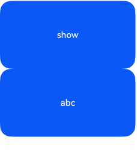
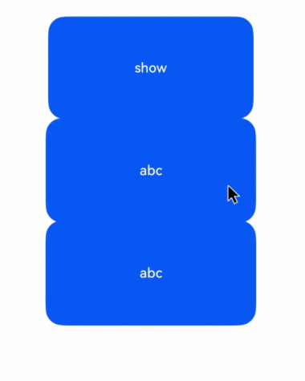
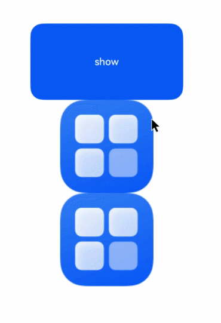

# Component Transition

Component transition is primarily configured through the `transition` property to display animation effects during component insertion and deletion. It is mainly used to enhance user experience when child components are inserted or deleted within container components.

> **Note:**
>
> Currently, there are two ways to trigger component transition:
>
> - When a component is inserted or deleted (e.g., due to `if` condition changes or `ForEach` adding/removing components), the transition effects of all newly inserted/deleted components will be triggered recursively.
> - When the [Visibility](./cj-universal-attribute-visibility.md) attribute of a component changes between visible and invisible, only the transition effect of that component will be triggered.

## Import Module

```cangjie
import kit.ArkUI.*
```

## func transition(?TransitionEffect)

```cangjie
func transition(value: ?TransitionEffect): T
```

**Function:** Sets the transition effect for component insertion and deletion.

**System Capability:** SystemCapability.ArkUI.ArkUI.Full

**Since:** 22

**Parameters:**

| Parameter | Type | Required | Default Value | Description |
|:---|:---|:---|:---|:---|
| value | ?[TransitionEffect](#class-transitioneffect) | Yes | - | Specifies the transition effect in function form. |

**Return Value:**

| Type | Description |
|:----|:----|
| T | Returns the component instance. |

## func transition(?TransitionEffect, ?TransitionFinishCallback)

```cangjie
func transition(value: ?TransitionEffect, onFinish: ?TransitionFinishCallback): T
```

**Function:** Sets the transition effect for component insertion/deletion and the callback after the transition animation ends.

**System Capability:** SystemCapability.ArkUI.ArkUI.Full

**Since:** 22

**Parameters:**

| Parameter | Type | Required | Default Value | Description |
|:---|:---|:---|:---|:---|
| value | ?[TransitionEffect](#class-transitioneffect) | Yes | - | Specifies the transition effect in function form. |
| onFinish | ?[TransitionFinishCallback](./cj-common-types.md#type-transitionfinishcallback) | Yes | - | Callback type for the end of component transition animation.<br>When this parameter is `true`, it indicates the callback is for the appearance animation; when `false`, it indicates the callback is for the disappearance animation. |

**Return Value:**

| Type | Description |
|:----|:----|
| T | Returns the component instance. |

## class TranslateOptions

```cangjie
public class TranslateOptions {
    public var x: ?Length
    public var y: ?Length
    public var z: ?Length
    public init(x!: ?Length = None, y!: ?Length = None, z!: ?Length = None)
}
```

**Function:** Defines translation options.

**System Capability:** SystemCapability.ArkUI.ArkUI.Full

**Since:** 22

### var x

```cangjie
public var x: ?Length
```

**Function:** Translation distance along the x-axis. For numeric types, the unit is vp, with a range of (-∞, +∞).

**Type:** ?[Length](./cj-common-types.md#interface-length)

**Read/Write:** Readable and Writable

**System Capability:** SystemCapability.ArkUI.ArkUI.Full

**Since:** 22

### var y

```cangjie
public var y: ?Length
```

**Function:** Translation distance along the y-axis. For numeric types, the unit is vp, with a range of (-∞, +∞).

**Type:** ?[Length](./cj-common-types.md#interface-length)

**Read/Write:** Readable and Writable

**System Capability:** SystemCapability.ArkUI.ArkUI.Full

**Since:** 22

### var z

```cangjie
public var z: ?Length
```

**Function:** Translation distance along the z-axis. For numeric types, the unit is vp, with a range of (-∞, +∞).

**Type:** ?[Length](./cj-common-types.md#interface-length)

**Read/Write:** Readable and Writable

**System Capability:** SystemCapability.ArkUI.ArkUI.Full

**Since:** 22

### init(?Length, ?Length, ?Length)

```cangjie
public init(x!: ?Length = None, y!: ?Length = None, z!: ?Length = None)
```

**Function:** Constructor for `TranslateOptions`.

**System Capability:** SystemCapability.ArkUI.ArkUI.Full

**Since:** 22

**Parameters:**

| Parameter | Type | Required | Default Value | Description |
|:---|:---|:---|:---|:---|
| x | ?[Length](./cj-common-types.md#interface-length) | No | None | **Named parameter.** Translation distance along the x-axis. Initial value: 0.0.vp |
| y | ?[Length](./cj-common-types.md#interface-length) | No | None | **Named parameter.** Translation distance along the y-axis. Initial value: 0.0.vp |
| z | ?[Length](./cj-common-types.md#interface-length) | No | None | **Named parameter.** Translation distance along the z-axis. Initial value: 0.0.vp |

## class ScaleOptions

```cangjie
public class ScaleOptions {
    public var x: ?Float32
    public var y: ?Float32
    public var z: ?Float32
    public var centerX: ?Length
    public var centerY: ?Length
    public init(x!: ?Float32 = None, y!: ?Float32 = None, z!: ?Float32 = None, centerX!: ?Length = None,
        centerY!: ?Length = None)
}
```

**Function:** Scaling parameters.

**System Capability:** SystemCapability.ArkUI.ArkUI.Full

**Since:** 22

### var x

```cangjie
public var x: ?Float32
```

**Function:** Scaling ratio along the x-axis.
- x > 1: Component scales up along the x-axis.
- 0 < x < 1: Component scales down along the x-axis.
- x < 0: Component scales in the opposite direction along the x-axis.

**Type:** ?Float32

**Read/Write:** Readable and Writable

**System Capability:** SystemCapability.ArkUI.ArkUI.Full

**Since:** 22

### var y

```cangjie
public var y: ?Float32
```

**Function:** Scaling ratio along the y-axis.
- y > 1: Component scales up along the y-axis.
- 0 < y < 1: Component scales down along the y-axis.
- y < 0: Component scales in the opposite direction along the y-axis.

**Type:** ?Float32

**Read/Write:** Readable and Writable

**System Capability:** SystemCapability.ArkUI.ArkUI.Full

**Since:** 22

### var z

```cangjie
public var z: ?Float32
```

**Function:** Scaling ratio along the z-axis.
- z > 1: Component scales up along the z-axis.
- 0 < z < 1: Component scales down along the z-axis.
- z < 0: Component scales in the opposite direction along the z-axis.

**Type:** ?Float32

**Read/Write:** Readable and Writable

**System Capability:** SystemCapability.ArkUI.ArkUI.Full

**Since:** 22

### var centerX

```cangjie
public var centerX: ?Length
```

**Function:** X-coordinate of the transformation center point (anchor point). Unit: vp.

**Type:** ?[Length](./cj-common-types.md#interface-length)

**Read/Write:** Readable and Writable

**System Capability:** SystemCapability.ArkUI.ArkUI.Full

**Since:** 22

### var centerY

```cangjie
public var centerY: ?Length
```

**Function:** Y-coordinate of the transformation center point (anchor point). Unit: vp.

**Type:** ?[Length](./cj-common-types.md#interface-length)

**Read/Write:** Readable and Writable

**System Capability:** SystemCapability.ArkUI.ArkUI.Full

**Since:** 22

### init(?Float32, ?Float32, ?Float32, ?Length, ?Length)

```cangjie
public init(x!: ?Float32 = None, y!: ?Float32 = None, z!: ?Float32 = None, centerX!: ?Length = None,
        centerY!: ?Length = None)
```

**Function:** Constructor for `ScaleOptions`.

**System Capability:** SystemCapability.ArkUI.ArkUI.Full

**Since:** 22

**Parameters:**

| Parameter | Type | Required | Default Value | Description |
|:---|:---|:---|:---|:---|
| x | ?Float32 | No | None | **Named parameter.** Scaling ratio along the x-axis. Initial value: 1.0 |
| y | ?Float32 | No | None | **Named parameter.** Scaling ratio along the y-axis. Initial value: 1.0 |
| z | ?Float32 | No | None | **Named parameter.** Scaling ratio along the z-axis. Initial value: 1.0 |
| centerX | ?[Length](./cj-common-types.md#interface-length) | No | None | **Named parameter.** X-coordinate of the transformation center point. Unit: vp. Initial value: 50.percent |
| centerY | ?[Length](./cj-common-types.md#interface-length) | No | None | **Named parameter.** Y-coordinate of the transformation center point. Unit: vp. Initial value: 50.percent |

## class RotateOptions

```cangjie
public class RotateOptions {
    public var x: ?Float32
    public var y: ?Float32
    public var z: ?Float32
    public var centerX: ?Length
    public var centerY: ?Length
    public var centerZ: ?Length
    public var perspective: ?Float32
    public var angle: ?Float32
    public init(angle: ?Float32, x!: ?Float32 = None, y!: ?Float32 = None, z!: ?Float32 = None, centerX!: ?Length = None,
        centerY!: ?Length = None, centerZ!: ?Length = None, perspective!: ?Float32 = None)
}
```

**Function:** Rotation parameters.

**System Capability:** SystemCapability.ArkUI.ArkUI.Full

**Since:** 22

### var angle

```cangjie
public var angle: ?Float32
```

**Function:** Rotation angle. A positive value indicates clockwise rotation relative to the rotation axis direction; a negative value indicates counterclockwise rotation.

**Type:** ?Float32

**Read/Write:** Readable and Writable

**System Capability:** SystemCapability.ArkUI.ArkUI.Full

**Since:** 22

### var x

```cangjie
public var x: ?Float32
```

**Function:** X-coordinate of the rotation axis vector.

**Type:** ?Float32

**Read/Write:** Readable and Writable

**System Capability:** SystemCapability.ArkUI.ArkUI.Full

**Since:** 22

### var y

```cangjie
public var y: ?Float32
```

**Function:** Y-coordinate of the rotation axis vector.

**Type:** ?Float32

**Read/Write:** Readable and Writable

**System Capability:** SystemCapability.ArkUI.ArkUI.Full

**Since:** 22

### var z

```cangjie
public var z: ?Float32
```

**Function:** Z-coordinate of the rotation axis vector.

**Type:** ?Float32

**Read/Write:** Readable and Writable

**System Capability:** SystemCapability.ArkUI.ArkUI.Full

**Since:** 22

### var centerX

```cangjie
public var centerX: ?Length
```

**Function:** X-coordinate of the transformation center point. Represents the x-coordinate of the component's transformation center point (i.e., anchor point).

**Type:** ?[Length](./cj-common-types.md#interface-length)

**Read/Write:** Readable and Writable

**System Capability:** SystemCapability.ArkUI.ArkUI.Full

**Since:** 22

### var centerY

```cangjie
public var centerY: ?Length
```

**Function:** Y-coordinate of the transformation center point. Represents the y-coordinate of the component's transformation center point (i.e., anchor point).

**Type:** ?[Length](./cj-common-types.md#interface-length)

**Read/Write:** Readable and Writable

**System Capability:** SystemCapability.ArkUI.ArkUI.Full

**Since:** 22

### var centerZ

```cangjie
public var centerZ: ?Length
```

**Function:** Z-axis anchor point, i.e., the z-component of the 3D rotation center point.

**Type:** ?[Length](./cj-common-types.md#interface-length)

**Read/Write:** Readable and Writable

**System Capability:** SystemCapability.ArkUI.ArkUI.Full

**Since:** 22

### var perspective

```cangjie
public var perspective: ?Float32
```

**Function:** Z-coordinate of the camera position. The value represents the viewing distance, i.e., the distance from the camera to the z=0 plane. The sign determines the camera's viewing direction. When `perspective=0`, the system automatically calculates an appropriate camera z-position (negative value). The rotation axis and center point are based on the coordinate system, which remains fixed when the component moves.

**Type:** ?Float32

**Read/Write:** Readable and Writable

**System Capability:** SystemCapability.ArkUI.ArkUI.Full

**Since:** 22

### init(?Float32, ?Float32, ?Float32, ?Length, ?Length, ?Length, ?Float32)

```cangjie
public init(angle: ?Float32, x!: ?Float32 = None, y!: ?Float32 = None, z!: ?Float32 = None, centerX!: ?Length = None,
        centerY!: ?Length = None, centerZ!: ?Length = None, perspective!: ?Float32 = None)
```

**Function:** Constructor for `RotateOptions`.

**System Capability:** SystemCapability.ArkUI.ArkUI.Full

**Since:** 22

**Parameters:**

| Parameter | Type | Required | Default Value | Description |
|:---|:---|:---|:---|:---|
| angle | ?Float32 | Yes | - | Angle parameter. |
| x | ?Float32 | No | None | **Named parameter.** X-coordinate of the rotation axis vector. Initial value: 0.0 |
| y | ?Float32 | No | None | **Named parameter.** Y-coordinate of the rotation axis vector. Initial value: 0.0 |
| z | ?Float32 | No | None | **Named parameter.** Z-coordinate of the rotation axis vector. Initial value: 0.0 |
| centerX | ?[Length](./cj-common-types.md#interface-length) | No | None | **Named parameter.** X-coordinate of the transformation center point. Unit: vp. Initial value: 50.percent |
| centerY | ?[Length](./cj-common-types.md#interface-length) | No | None | **Named parameter.** Y-coordinate of the transformation center point. Unit: vp. Initial value: 50.percent |
| centerZ | ?[Length](./cj-common-types.md#interface-length) | No | None | **Named parameter.** Z-axis anchor point, i.e., the z-component of the 3D rotation center point. Initial value: 0 |
| perspective | ?Float32 | No | None | **Named parameter.** Distance from the user to the z=0 plane. The axis and rotation center are based on the coordinate system, which remains fixed when the component moves. Initial value: 0.0 |## class TransitionEffect

```cangjie
public class TransitionEffect {
    public static let IDENTITY: TransitionEffect
    public static let OPACITY: TransitionEffect
    public static let SLIDE: TransitionEffect
    public static let SLIDE_SWITCH: TransitionEffect
}
```

**Function:** Specifies the type of transition effect in function form.

> **Note:**
>
> - Multiple transition effects can be combined using the `combine` function. The `animation` parameter can be specified separately for each effect, and the animation parameters of the preceding effect also apply to the subsequent effect. For example, `TransitionEffect.OPACITY.animation(AnimateParam(duration: 1000)).combine(TransitionEffect.translate(TranslateOptions(x:100)))` means the animation parameters with a duration of 1000ms apply to both `OPACITY` and `translate`.

**System Capability:** SystemCapability.ArkUI.ArkUI.Full

**Since:** 22

### static let IDENTITY

```cangjie
public static let IDENTITY: TransitionEffect
```

**Function:** Disables the transition effect.

**Type:** [TransitionEffect](#class-transitioneffect)

**Read/Write:** Read-only

**System Capability:** SystemCapability.ArkUI.ArkUI.Full

**Since:** 22

### static let OPACITY

```cangjie
public static let OPACITY: TransitionEffect
```

**Function:** Defines a transition effect with opacity set to 0, equivalent to `TransitionEffect.opacity(0.0)`.

**Type:** [TransitionEffect](#class-transitioneffect)

**Read/Write:** Read-only

**System Capability:** SystemCapability.ArkUI.ArkUI.Full

**Since:** 22

### static let SLIDE

```cangjie
public static let SLIDE: TransitionEffect
```

**Function:** Defines a slide transition effect.

**Type:** [TransitionEffect](#class-transitioneffect)

**Read/Write:** Read-only

**System Capability:** SystemCapability.ArkUI.ArkUI.Full

**Since:** 22

### static let SLIDE_SWITCH

```cangjie
public static let SLIDE_SWITCH: TransitionEffect
```

**Function:** Specifies a transition effect where the component appears by sliding in from the right with first shrinking and then enlarging, and disappears by sliding out to the left with first shrinking and then enlarging. It comes with built-in animation parameters, which can also be overridden. The default animation duration is 600ms, with the animation curve set to `cubicBezierCurve(0.24, 0.0, 0.50, 1.0)` and the minimum scale factor set to 0.8.

**Type:** [TransitionEffect](#class-transitioneffect)

**Read/Write:** Read-only

**System Capability:** SystemCapability.ArkUI.ArkUI.Full

**Since:** 22

### static func opacity(Float64)

```cangjie
public static func opacity(alpha: Float64): TransitionEffect
```

**Function:** Sets the opacity effect during component transition.

**System Capability:** SystemCapability.ArkUI.ArkUI.Full

**Since:** 22

**Parameters:**

| Name | Type | Required | Default | Description |
|:---|:---|:---|:---|:---|
| alpha | Float64 | Yes | - | Sets the opacity effect during component transition, which is the value at the start of insertion and the end of deletion. Range: [0.0, 1.0].<br> **Note:** <br>Invalid values less than 0.0 are treated as 0.0, and values greater than 1.0 are treated as 1.0 |

**Return Value:**

| Type | Description |
|:----|:----|
| [TransitionEffect](#class-transitioneffect) | Returns the transition effect. |

### static func translate(TranslateOptions)

```cangjie
public static func translate(options: TranslateOptions): TransitionEffect
```

**Function:** Sets the translation effect during component transition.

**System Capability:** SystemCapability.ArkUI.ArkUI.Full

**Since:** 22

**Parameters:**

| Name | Type | Required | Default | Description |
|:---|:---|:---|:---|:---|
| options | [TranslateOptions](#class-translateoptions) | Yes | - | Sets the translation effect during component transition, which is the value at the start of insertion and the end of deletion. |

**Return Value:**

| Type | Description |
|:----|:----|
| [TransitionEffect](#class-transitioneffect) | Returns the transition effect. |

### static func scale(?ScaleOptions)

```cangjie
public static func scale(options: ?ScaleOptions): TransitionEffect
```

**Function:** Sets the scaling effect during component transition.

**System Capability:** SystemCapability.ArkUI.ArkUI.Full

**Since:** 22

**Parameters:**

| Name | Type | Required | Default | Description |
|:---|:---|:---|:---|:---|
| options | ?[ScaleOptions](#class-scaleoptions) | Yes | - | Sets the scaling effect during component transition, which is the value at the start of insertion and the end of deletion. |

**Return Value:**

| Type | Description |
|:----|:----|
| [TransitionEffect](#class-transitioneffect) | Returns the transition effect. |

### static func rotate(?RotateOptions)

```cangjie
public static func rotate(options: ?RotateOptions): TransitionEffect
```

**Function:** Sets the rotation effect during component transition.

**System Capability:** SystemCapability.ArkUI.ArkUI.Full

**Since:** 22

**Parameters:**

| Name | Type | Required | Default | Description |
|:---|:---|:---|:---|:---|
| options | ?[RotateOptions](#class-rotateoptions) | Yes | - | Sets the rotation effect during component transition, which is the value at the start of insertion and the end of deletion. |

**Return Value:**

| Type | Description |
|:----|:----|
| [TransitionEffect](#class-transitioneffect) | Returns the transition effect. |

### static func move(TransitionEdge)

```cangjie
public static func move(edge: TransitionEdge): TransitionEffect
```

**Function:** Specifies the effect of sliding in and out from the screen edge during component transition.

**System Capability:** SystemCapability.ArkUI.ArkUI.Full

**Since:** 22

**Parameters:**

| Name | Type | Required | Default | Description |
|:---|:---|:---|:---|:---|
| edge | [TransitionEdge](#enum-transitionedge) | Yes | - | Specifies the effect of sliding in and out from the screen edge during component transition, which is essentially a translation effect, representing the value at the start of insertion and the end of deletion. |

**Return Value:**

| Type | Description |
|:----|:----|
| [TransitionEffect](#class-transitioneffect) | Returns the transition effect. |

### static func asymmetric(TransitionEffect, TransitionEffect)

```cangjie
public static func asymmetric(appear: TransitionEffect, disappear: TransitionEffect): TransitionEffect
```

**Function:** Used to specify asymmetric transition effects.

> **Note:**
>
> If `TransitionEffect` is not constructed using the `asymmetric` function, it means the effect applies to both the appearance and disappearance of the component.

**System Capability:** SystemCapability.ArkUI.ArkUI.Full

**Since:** 22

**Parameters:**

| Name | Type | Required | Default | Description |
|:---|:---|:---|:---|:---|
| appear | [TransitionEffect](#class-transitioneffect) | Yes | - | Specifies the transition effect for appearance. |
| disappear | [TransitionEffect](#class-transitioneffect) | Yes | - | Specifies the transition effect for disappearance. |

**Return Value:**

| Type | Description |
|:----|:----|
| [TransitionEffect](#class-transitioneffect) | Returns the transition effect. |

### func animation(?AnimateParam)

```cangjie
public func animation(param: ?AnimateParam): TransitionEffect
```

**Function:** Specifies the animation parameters for this `TransitionEffect`.

> **Note:**
>
> These parameters are only used to specify animation settings. The `onFinish` callback in `AnimateParam` does not take effect. If `TransitionEffect` is combined using `combine`, the animation parameters of the preceding `TransitionEffect` also apply to the subsequent one.

**System Capability:** SystemCapability.ArkUI.ArkUI.Full

**Since:** 22

**Parameters:**

| Name | Type | Required | Default | Description |
|:---|:---|:---|:---|:---|
| param | ?[AnimateParam](./cj-common-types.md#class-animateparam) | Yes | - | Animation effect parameters. |

**Return Value:**

| Type | Description |
|:----|:----|
| [TransitionEffect](#class-transitioneffect) | Returns the transition effect. |

### func combine(TransitionEffect)

```cangjie
public func combine(transitionEffect: TransitionEffect): TransitionEffect
```

**Function:** Used to chain `TransitionEffect` combinations to form a `TransitionEffect` that includes multiple transition effects.

**System Capability:** SystemCapability.ArkUI.ArkUI.Full

**Since:** 22

**Parameters:**

| Name | Type | Required | Default | Description |
|:---|:---|:---|:---|:---|
| transitionEffect | [TransitionEffect](#class-transitioneffect) | Yes | - | The component transition effect to be chained. |

**Return Value:**

| Type | Description |
|:----|:----|
| [TransitionEffect](#class-transitioneffect) | Returns the transition effect. |

## enum TransitionEdge

```cangjie
public enum TransitionEdge <: Equatable<TransitionEdge> {
    | Top
    | Bottom
    | Start
    | End
    | ...
}
```

**Function:** Defines edge objects.

**System Capability:** SystemCapability.ArkUI.ArkUI.Full

**Since:** 22

**Parent Type:**

- Equatable\<[TransitionEdge](#enum-transitionedge)>

### Top

```cangjie
Top
```

**Function:** The top edge.

**System Capability:** SystemCapability.ArkUI.ArkUI.Full

**Since:** 22

### Bottom

```cangjie
Bottom
```

**Function:** The bottom edge of the window.

**System Capability:** SystemCapability.ArkUI.ArkUI.Full

**Since:** 22

### Start

```cangjie
Start
```

**Function:** The starting edge of the window, which is the left edge for left-to-right scripts and the right edge for right-to-left scripts.

**System Capability:** SystemCapability.ArkUI.ArkUI.Full

**Since:** 22

### End

```cangjie
End
```

**Function:** The ending edge of the window, which is the right edge for left-to-right scripts and the left edge for right-to-left scripts.

**System Capability:** SystemCapability.ArkUI.ArkUI.Full

**Since:** 22

### operator func !=(TransitionEdge)

```cangjie
public operator func !=(other: TransitionEdge): Bool
```

**Function:** Compares whether two enum values are not equal.

**System Capability:** SystemCapability.ArkUI.ArkUI.Full

**Since:** 22

**Parameters:**

| Name | Type | Required | Default | Description |
|:---|:---|:---|:---|:---|
| other | [TransitionEdge](#enum-transitionedge) | Yes | - | The other enum value to compare. |

**Return Value:**

| Type | Description |
|:----|:----|
| Bool | Returns `true` if the two enum values are not equal, otherwise returns `false`. |

### operator func ==(TransitionEdge)

```cangjie
public operator func ==(other: TransitionEdge): Bool
```

**Function:** Compares whether two enum values are equal.

**System Capability:** SystemCapability.ArkUI.ArkUI.Full

**Since:** 22

**Parameters:**

| Name | Type | Required | Default | Description |
|:---|:---|:---|:---|:---|
| other | [TransitionEdge](#enum-transitionedge) | Yes | - | The other enum value to compare. |

**Return Value:**

| Type | Description |
|:----|:----|
| Bool | Returns `true` if the two enum values are equal, otherwise returns `false`. |

## Example Code### Example Code 1 (Using the Same Interface for Image Appearance and Disappearance)

This example demonstrates how to use the same TransitionEffect to achieve both the appearance and disappearance of an image, where these two processes are inverses of each other.

<!-- run -->

```cangjie
package ohos_app_cangjie_entry
import kit.ArkUI.*
import ohos.arkui.state_macro_manage.*
import ohos.hilog.*

@Entry
@Component
class EntryView {
    @State var flag = true
    @State var show = "show"
    func build() {
        Column {
            Button(this.show)
                .onClick({
                    evt =>
                    Hilog.info(0, "cangjie", "Hello Cangjie")
                    if (this.flag) {
                        this.show = "hide"
                    } else {
                        this.show = "show"
                    }
                    this.flag = !this.flag
                })
                .width(800.px)
                .height(400.px)

            if (this.flag) {
                Button("abc")
                    .width(800.px)
                    .height(400.px)
                    .transition(
                        TransitionEffect
                            .OPACITY
                            .animation(AnimateParam(duration: 2000, curve: Curve.Ease))
                            .combine(TransitionEffect.rotate(RotateOptions(180.0, z: 1.0))))
            }
        }
    }
}
```



### Example Code 2 (Using Different Interfaces for Image Appearance and Disappearance)

This example demonstrates how to use different TransitionEffects to achieve the appearance and disappearance of an image.

<!-- run -->

```cangjie
package ohos_app_cangjie_entry
import kit.ArkUI.*
import ohos.arkui.state_macro_manage.*
import ohos.hilog.*

@Entry
@Component
class EntryView {
    @State var flag = true
    @State var show = "show"
    func build() {
        Column {
            Button(this.show)
                .onClick({
                    evt =>
                    Hilog.info(0, "cangjie", "Hello Cangjie")
                    if (this.flag) {
                        this.show = "hide"
                    } else {
                        this.show = "show"
                    }
                    this.flag = !this.flag
                })
                .width(800.px)
                .height(400.px)

            if (this.flag) {
                Button("abc")
                    .width(800.px)
                    .height(400.px)
                    .transition(
                        TransitionEffect
                            .OPACITY
                            .animation(AnimateParam(duration: 2000, curve: Curve.Ease))
                            .combine(TransitionEffect.rotate(RotateOptions(180.0, z: 1.0))))

                Button("abc")
                    .width(800.px)
                    .height(400.px)
                    .transition(
                        TransitionEffect
                            .asymmetric(
                                TransitionEffect.scale(ScaleOptions()),
                                TransitionEffect.IDENTITY
                            )
                            .animation(AnimateParam(duration: 2000, curve: Curve.Ease)))
            }
        }
    }
}
```



### Example Code 3 (Setting Parent and Child Components as Transitions)

This example demonstrates how to achieve image appearance and disappearance by configuring transitions for both parent and child components.

<!-- run -->

```cangjie
package ohos_app_cangjie_entry
import kit.ArkUI.*
import ohos.arkui.state_macro_manage.*
import ohos.hilog.*
import ohos.resource.*

@Entry
@Component
class EntryView {
    @State var flag = true
    @State var show = "show"
    func build() {
        Column {
            Button(this.show)
                .onClick({
                    evt =>
                    Hilog.info(0, "cangjie", "Hello Cangjie")
                    if (this.flag) {
                        this.show = "hide"
                    } else {
                        this.show = "show"
                    }
                    this.flag = !this.flag
                })
                .width(800.px)
                .height(400.px)

            if (this.flag) {
                Column() {
                    Row() {
                        Image(@r(app.media.startIcon))
                            .width(150)
                            .height(150)
                            .id("image1")
                            .transition(TransitionEffect
                                .OPACITY
                                .animation(AnimateParam(duration: 2000)))
                    }
                    Image(@r(app.media.startIcon))
                        .width(150)
                        .height(150)
                        .id("image2")
                        .transition(TransitionEffect
                            .OPACITY
                            .animation(AnimateParam(duration: 1000)))
                }.transition(TransitionEffect
                    .OPACITY
                    .animation(AnimateParam(duration: 1000)))
            }
        }
    }
}
```

