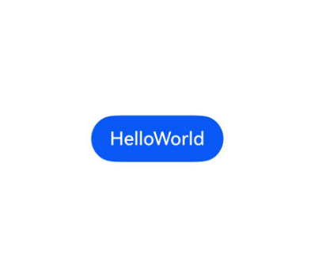

# Font

Registration information for custom fonts.

> **Note:**
>
> The following APIs require first obtaining a Font instance using the [getFont()](./cj-apis-uicontext-uicontext.md#func-getfont) method from [UIContext](./cj-apis-uicontext-uicontext.md#class-uicontext), then calling corresponding methods through this instance.

## Import Module

```cangjie
import kit.ArkUI.*
```

## class Font

```cangjie
public class Font {}
```

**Functionality:** Font class, providing font registration, system font list retrieval, and font information retrieval by name.

**System Capability:** SystemCapability.ArkUI.ArkUI.Full

**Since:** 22

### func getFontByName(String)

```cangjie
public func getFontByName(fontName: String): ?FontInfo
```

**Functionality:** Retrieves detailed font information by font name.

**System Capability:** SystemCapability.ArkUI.ArkUI.Full

**Since:** 22

**Parameters:**

| Parameter | Type | Required | Default | Description |
|:---|:---|:---|:---|:---|
| fontName | String | Yes | - | Font name. |

**Return Value:**

| Type | Description |
|:----|:----|
| ?[FontInfo](#class-fontinfo) | Returns font information, or None if the font is not found. |

### func getSystemFontList()

```cangjie
public func getSystemFontList(): Array<String>
```

**Functionality:** Retrieves the list of fonts supported by the system.

**System Capability:** SystemCapability.ArkUI.ArkUI.Full

**Since:** 22

**Return Value:**

| Type | Description |
|:----|:----|
| Array\<String> | List of system font names. |

### func registerFont(ResourceStr, ResourceStr)

```cangjie
public func registerFont(familyName!: ResourceStr, familySrc!: ResourceStr): Unit
```

**Functionality:** Registers a custom font in font management.

**System Capability:** SystemCapability.ArkUI.ArkUI.Full

**Since:** 22

**Parameters:**

| Parameter | Type | Required | Default | Description |
|:---|:---|:---|:---|:---|
| familyName | [ResourceStr](./cj-common-types.md#interface-resourcestr) | Yes | - | **Named parameter.** Font name. |
| familySrc | [ResourceStr](./cj-common-types.md#interface-resourcestr) | Yes | - | **Named parameter.** Font resource path. |

**Exceptions:**

- BusinessException: Error codes as shown below, refer to [Universal Error Codes](../cj-errorcode-universal.md).

  | Error Code | Description |
  |:----|:----|
  | 401 | Invalid input parameter |
  | 100001 | Internal error. |

**Example:**

## class FontInfo

```cangjie
public class FontInfo {
    public var family: String
    public var fullName: String
    public var italic: Bool
    public var monoSpace: Bool
    public var path: String
    public var postScriptName: String
    public var subfamily: String
    public var symbolic: Bool
    public var weight: UInt32
    public var width: UInt32
}
```

**Functionality:** Detailed information about a font.

**System Capability:** SystemCapability.ArkUI.ArkUI.Full

**Since:** 22

### var family

```cangjie
public var family: String
```

**Functionality:** Font family.

**Type:** String

**Read/Write:** Read-Write

**System Capability:** SystemCapability.ArkUI.ArkUI.Full

**Since:** 22

### var fullName

```cangjie
public var fullName: String
```

**Functionality:** Full font name.

**Type:** String

**Read/Write:** Read-Write

**System Capability:** SystemCapability.ArkUI.ArkUI.Full

**Since:** 22

### var italic

```cangjie
public var italic: Bool
```

**Functionality:** Whether the font is italic.

**Type:** Bool

**Read/Write:** Read-Write

**System Capability:** SystemCapability.ArkUI.ArkUI.Full

**Since:** 22

### var monoSpace

```cangjie
public var monoSpace: Bool
```

**Functionality:** Whether the font is monospace.

**Type:** Bool

**Read/Write:** Read-Write

**System Capability:** SystemCapability.ArkUI.ArkUI.Full

**Since:** 22

### var path

```cangjie
public var path: String
```

**Functionality:** Font file path.

**Type:** String

**Read/Write:** Read-Write

**System Capability:** SystemCapability.ArkUI.ArkUI.Full

**Since:** 22

### var postScriptName

```cangjie
public var postScriptName: String
```

**Functionality:** PostScript name.

**Type:** String

**Read/Write:** Read-Write

**System Capability:** SystemCapability.ArkUI.ArkUI.Full

**Since:** 22

### var subfamily

```cangjie
public var subfamily: String
```

**Functionality:** Font subfamily name.

**Type:** String

**Read/Write:** Read-Write

**System Capability:** SystemCapability.ArkUI.ArkUI.Full

**Since:** 22

### var symbolic

```cangjie
public var symbolic: Bool
```

**Functionality:** Whether the font supports symbolic characters.

**Type:** Bool

**Read/Write:** Read-Write

**System Capability:** SystemCapability.ArkUI.ArkUI.Full

**Since:** 22

### var weight

```cangjie
public var weight: UInt32
```

**Functionality:** Font weight.

**Type:** UInt32

**Read/Write:** Read-Write

**System Capability:** SystemCapability.ArkUI.ArkUI.Full

**Since:** 22

### var width

```cangjie
public var width: UInt32
```

**Functionality:** Font width.

**Type:** UInt32

**Read/Write:** Read-Write

**System Capability:** SystemCapability.ArkUI.ArkUI.Full

**Since:** 22

## Example Code

### Example 1 (Register Custom Font)

<!-- run -->

```cangjie
package ohos_app_cangjie_entry

import kit.ArkUI.*
import ohos.arkui.state_macro_manage.*
import ohos.i18n.*
import ohos.resource_manager.*

@Entry
@Component
class EntryView {
    protected func onAppear() {
        getUIContext().getFont().registerFont(
            familyName: "Deyihei",
            familySrc: "/resources/rawfile/SmileySans-Oblique.ttf"
        )
    }

    func build() {
        Row {
            Column {
                Text("HelloWorld").fontFamily("Deyihei")
                Text("HelloWorld")
            }.width(100.percent)
        }.height(100.percent)
    }
}
```


### Example 2 (Get System Font List)

<!-- run -->

```cangjie
package ohos_app_cangjie_entry

import kit.ArkUI.*
import ohos.arkui.state_macro_manage.*
import ohos.hilog.*

@Entry
@Component
class EntryView {
    func build() {
        Row {
            Column {
                Button("HelloWorld")
                .onClick({evt =>
                    let list = getUIContext().getFont().getSystemFontList()
                    Hilog.info(0, "AppLogCj", "${list.size}")
                })
            }.width(100.percent)
        }.height(100.percent)
    }
}
```



### Example 3 (Get Font Details)

<!-- run -->

```cangjie
package ohos_app_cangjie_entry

import kit.ArkUI.*
import ohos.arkui.state_macro_manage.*
import ohos.hilog.*

@Entry
@Component
class EntryView {
    func build() {
        Row {
            Column {
                Button("HelloWorld")
                .onClick({evt =>
                    let info = getUIContext().getFont().getFontByName("HarmonyOS Sans Italic")
                    match (info) {
                        case Some(v) =>
                            Hilog.info(0, "AppLogCj", "${v.path}")
                            Hilog.info(0, "AppLogCj", "${v.postScriptName}")
                            Hilog.info(0, "AppLogCj", "${v.fullName}")
                            Hilog.info(0, "AppLogCj", "${v.family}")
                            Hilog.info(0, "AppLogCj", "${v.subfamily}")
                            Hilog.info(0, "AppLogCj", "${v.weight}")
                            Hilog.info(0, "AppLogCj", "${v.width}")
                            Hilog.info(0, "AppLogCj", "${v.italic}")
                            Hilog.info(0, "AppLogCj", "${v.monoSpace}")
                            Hilog.info(0, "AppLogCj", "${v.symbolic}")
                        case None => Hilog.error(0, "AppLogCj", "None")
                    }
``````
                })
            }.width(100.percent)
        }.height(100.percent)
    }
}
```


