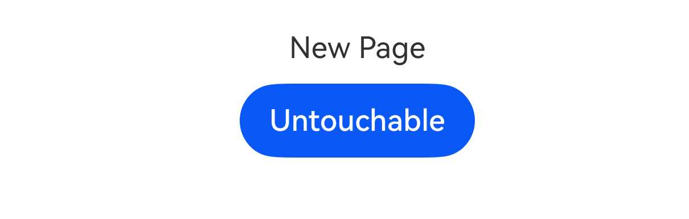

# ohos.window (Window)

ohos.window provides fundamental capabilities for window management, including creating and destroying the current window, setting various properties, and managing scheduling between windows.

This module offers the following common window-related functionalities:

- [Window](#class-window): The current window instance, which is the basic unit managed by the window manager.

> **Note:**
>
> ohos.window only supports pure Cangjie scenarios and cannot be used for mixed development scenarios involving ArkTS and Cangjie.

## Importing the Module

```cangjie
import kit.ArkUI.*
```

## func createWindow(Configuration)

```cangjie
public func createWindow(config: Configuration): Window
```

**Function:** Creates a sub-window or system window.

**Required Permission:** ohos.permission.SYSTEM_FLOAT_WINDOW (Required only when creating a window of type WindowType.TYPE_FLOAT)

**System Capability:** SystemCapability.WindowManager.WindowManager.Core

**Since Version:** 21

**Parameters:**

| Parameter Name | Type | Required | Default Value | Description |
|:---|:---|:---|:---|:---|
| config | [Configuration](#class-configuration) | Yes | - | Parameters for creating the window. |

**Return Value:**

| Type | Description |
|:----|:----|
| [Window](#class-window) | Returns the currently created window object. |

**Exceptions:**

- BusinessException: Corresponding error codes are listed below. For details, see [Universal Error Codes](../cj-errorcode-universal.md) and [Window Error Codes](./cj-errorcode-window.md).

  | Error Code ID | Error Message |
  | :---- | :--- |
  | 201 | Permission verification failed. The application does not have the permission required to call the API. |
  | 401 | Parameter error. Possible causes: 1. Mandatory parameters are not specified; 2. Incorrect parameter types. |
  | 1300003 | This window manager service is functioning abnormally. |
  | 1300006 | This window context is abnormal. |

- IllegalArgumentException:

  | Error Message | Possible Cause | Handling Steps |
  | :---- | :--- | :--- |
  | The context type is not supported. Only UIAbilityContext is supported. | Illegal parameter. | Check if ctx is an object of type UIAbilityContext. |

## func findWindow(String)

```cangjie
public func findWindow(name: String): Window
```

**Function:** Finds the window corresponding to the specified name.

**System Capability:** SystemCapability.WindowManager.WindowManager.Core

**Since Version:** 21

**Parameters:**

| Parameter Name | Type | Required | Default Value | Description |
|:---|:---|:---|:---|:---|
| name | String | Yes | - | Window name, which is the name in [Configuration](#class-configuration). |

**Return Value:**

| Type | Description |
|:----|:----|
| [Window](#class-window) | The currently found window object. |

**Exceptions:**

- BusinessException: Corresponding error codes are listed below. For details, see [Window Error Codes](./cj-errorcode-window.md).

  | Error Code ID | Error Message |
  | :---- | :--- |
  | 1300002 | This window state is abnormal. |

## func getLastWindow(BaseContext)

```cangjie
public func getLastWindow(ctx: BaseContext): Window
```

**Function:** Gets the topmost sub-window within the current application. If there are no application sub-windows, returns the application's main window.

**System Capability:** SystemCapability.WindowManager.WindowManager.Core

**Since Version:** 21

**Parameters:**

| Parameter Name | Type | Required | Default Value | Description |
|:---|:---|:---|:---|:---|
| ctx | [BaseContext](../AbilityKit/cj-apis-app-ability.md#class-basecontext) | Yes | - | Current application context information. |

**Return Value:**

| Type | Description |
|:----|:----|
| [Window](#class-window) | Returns the last displayed window object within the current application. |

**Exceptions:**

- BusinessException: Corresponding error codes are listed below. For details, see [Window Error Codes](./cj-errorcode-window.md).

  | Error Code ID | Error Message |
  | :---- | :--- |
  | 1300002 | This window state is abnormal. Top window or main window is null or destroyed. |

- IllegalArgumentException:

  | Error Message | Possible Cause | Handling Steps |
  | :---- | :--- | :--- |
  | The context type is not supported. Only UIAbilityContext is supported. | Illegal parameter. | Check if ctx is an object of type UIAbilityContext. |

## func shiftAppWindowFocus(Int32, Int32)

```cangjie
public func shiftAppWindowFocus(sourceWindowId: Int32, targetWindowId: Int32): Unit
```

**Function:** Transfers window focus from the source window to the target window within the same application.

> **Note:**
>
> Only supports focus transfer between the application's main window and sub-windows.

**System Capability:** SystemCapability.Window.SessionManager

**Since Version:** 21

**Parameters:**

| Parameter Name | Type | Required | Default Value | Description |
|:---|:---|:---|:---|:---|
| sourceWindowId | Int32 | Yes | - | Source window ID, which must be in focus. |
| targetWindowId | Int32 | Yes | - | Target window ID. |

**Exceptions:**

- BusinessException: Corresponding error codes are listed below. For details, see [Universal Error Codes](../cj-errorcode-universal.md) and [Window Error Codes](./cj-errorcode-window.md).

  | Error Code ID | Error Message |
  | :---- | :--- |
  | 401 | Parameter error. Possible causes: 1. Mandatory parameters are not specified; 2. Incorrect parameter types. |
  | 801 | Capability not supported. Failed to call the API due to limited device capabilities. |
  | 1300002 | This window state is abnormal. |
  | 1300003 | This window manager service is functioning abnormally. |
  | 1300004 | Unauthorized operation. |

## class AvoidArea

```cangjie
public class AvoidArea {
    public var visible: Bool
    public var leftRect: Rect
    public var topRect: Rect
    public var rightRect: Rect
    public var bottomRect: Rect
    public init(
        visible!: Bool,
        leftRect!: Rect,
        topRect!: Rect,
        rightRect!: Rect,
        bottomRect!: Rect
    )
}
```

**Function:** The area where window content should avoid overlapping.

> **Note:**
>
> When system bars, notches, gesture areas, or soft keyboard areas overlap with window content, these areas need to be avoided. User click events cannot be responded to in these avoidance areas.
>
> Additionally, the following constraints apply to avoidance areas:
>
> - The non-navigation bar area in the bottom gesture area supports click and long-press event passthrough but does not support drag-in.
> - The left and right gesture areas support click, long-press, and vertical swipe event passthrough but do not support drag-in.
> - The navigation bar area supports long-press, click, and drag-in event responses but does not support event passthrough.

**System Capability:** SystemCapability.WindowManager.WindowManager.Core

**Since Version:** 21

### var bottomRect

```cangjie
public var bottomRect: Rect
```

**Function:** Represents the rectangular area at the bottom of the screen.

**Type:** [Rect](#class-rect)

**Read/Write Capability:** Readable and Writable

**System Capability:** SystemCapability.WindowManager.WindowManager.Core

**Since Version:** 21

### var leftRect

```cangjie
public var leftRect: Rect
```

**Function:** Represents the rectangular area on the left side of the screen.

**Type:** [Rect](#class-rect)

**Read/Write Capability:** Readable and Writable

**System Capability:** SystemCapability.WindowManager.WindowManager.Core

**Since Version:** 21

### var rightRect

```cangjie
public var rightRect: Rect
```

**Function:** Represents the rectangular area on the right side of the screen.

**Type:** [Rect](#class-rect)

**Read/Write Capability:** Readable and Writable

**System Capability:** SystemCapability.WindowManager.WindowManager.Core

**Since Version:** 21

### var topRect

```cangjie
public var topRect: Rect
```

**Function:** Represents the rectangular area at the top of the screen.

**Type:** [Rect](#class-rect)

**Read/Write Capability:** Readable and Writable

**System Capability:** SystemCapability.WindowManager.WindowManager.Core

**Since Version:** 21

### var visible

```cangjie
public var visible: Bool
```

**Function:** Indicates whether the avoidance area is visible.

**Type:** Bool

**Read/Write Capability:** Readable and Writable

**System Capability:** SystemCapability.WindowManager.WindowManager.Core

**Since Version:** 21

### init(Bool, Rect, Rect, Rect, Rect)

```cangjie
public init(
    visible!: Bool,
    leftRect!: Rect,
    topRect!: Rect,
    rightRect!: Rect,
    bottomRect!: Rect
)
```

**Function:** Constructs an object of type AvoidArea.

**System Capability:** SystemCapability.WindowManager.WindowManager.Core

**Since Version:** 21

**Parameters:**

| Parameter Name | Type | Required | Default Value | Description |
|:---|:---|:---|:---|:---|
| visible | Bool | Yes | - | Whether the avoidance area is visible. true indicates visible; false indicates invisible. |
| leftRect | [Rect](#class-rect) | Yes | - | The rectangular area on the left side of the screen. |
| topRect | [Rect](#class-rect) | Yes | - | The rectangular area at the top of the screen. |
| rightRect | [Rect](#class-rect) | Yes | - | The rectangular area on the right side of the screen. |
| bottomRect | [Rect](#class-rect) | Yes | - | The rectangular area at the bottom of the screen. |

## class Configuration

```cangjie
public class Configuration {
    public var name: String
    public var windowType: WindowType
    public var ctx: BaseContext
    public var displayId: Int64 = - 1
    public var parentId: Int64 = - 1
    public init(
        name!: String,
        windowType!: WindowType,
        ctx!: BaseContext,
        displayId!: Int64 = -1,
        parentId!: Int64 = -1
    )
}
```

**Function:** Parameters for creating a sub-window or system window.

**System Capability:** SystemCapability.WindowManager.WindowManager.Core

**Since Version:** 21

### var ctx

```cangjie
public var ctx: BaseContext
```

**Function:** Represents the current application context information. Used for creating floating windows, modal windows, or system windows.

**Type:** [BaseContext](../AbilityKit/cj-apis-app-ability.md#class-basecontext)

**Read/Write Capability:** Readable and Writable

**System Capability:** SystemCapability.WindowManager.WindowManager.Core

**Since Version:** 21

### var displayId

```cangjie
public var displayId: Int64 = - 1
```

**Function:** Sets the current physical screen ID. If not set, the default is -1.

**Type:** Int64

**Read/Write Capability:** Readable and Writable

**System Capability:** SystemCapability.WindowManager.WindowManager.Core

**Since Version:** 21

### var name

```cangjie
public var name: String
```

**Function:** Represents the window name.

**Type:** String

**Read/Write Capability:** Readable and Writable

**System Capability:** SystemCapability.WindowManager.WindowManager.Core

**Since Version:** 21

### var parentId

```cangjie
public var parentId: Int64 = - 1
```

**Function:** Sets the parent window ID. If not set, the default is -1.

**Type:** Int64

**Read/Write Capability:** Readable and Writable

**System Capability:** SystemCapability.WindowManager.WindowManager.Core

**Since Version:** 21

### var windowType

```cangjie
public var windowType: WindowType
```

**Function:** Represents the window type.

**Type:** [WindowType](#enum-windowtype)

**Read/Write Capability:** Readable and Writable

**System Capability:** SystemCapability.WindowManager.WindowManager.Core

**Since Version:** 21

### init(String, WindowType, BaseContext, Int64, Int64)

```cangjie
public init(
    name!: String,
    windowType!: WindowType,
    ctx!: BaseContext,
    displayId!: Int64 = -1,
    parentId!: Int64 = -1
)
```

**Function:** Constructs an object of type Configuration.

**System Capability:** SystemCapability.WindowManager.WindowManager.Core

**Since Version:** 21

**Parameters:**

| Parameter Name | Type | Required | Default Value | Description |
|:---|:---|:---|:---|:---|
| name | String | Yes | - | Window name. |
| windowType | [WindowType](#enum-windowtype) | Yes | - | Window type. |
| ctx | [BaseContext](../AbilityKit/cj-apis-app-ability.md#class-basecontext) | Yes | - | Current application context information. Used for creating floating windows, modal windows, or system windows. |
| displayId | Int64 | No | -1 | Current physical screen ID. |
| parentId | Int64 | No | -1 | Parent window ID. |## class Rect

```cangjie
public class Rect {
    public var left: Int32
    public var top: Int32
    public var width: UInt32
    public var height: UInt32
    public init(
        left!: Int32,
        top!: Int32,
        width!: UInt32,
        height!: UInt32
    )
}
```

**Function:** Window rectangular area.

**System Capability:** SystemCapability.WindowManager.WindowManager.Core

**Since:** 21

### var height

```cangjie
public var height: UInt32
```

**Function:** Sets the height of the rectangular area in px.

**Type:** UInt32

**Access:** Read-write

**System Capability:** SystemCapability.WindowManager.WindowManager.Core

**Since:** 21

### var left

```cangjie
public var left: Int32
```

**Function:** Sets the left boundary of the rectangular area in px.

**Type:** Int32

**Access:** Read-write

**System Capability:** SystemCapability.WindowManager.WindowManager.Core

**Since:** 21

### var top

```cangjie
public var top: Int32
```

**Function:** Sets the top boundary of the rectangular area in px.

**Type:** Int32

**Access:** Read-write

**System Capability:** SystemCapability.WindowManager.WindowManager.Core

**Since:** 21

### var width

```cangjie
public var width: UInt32
```

**Function:** Sets the width of the rectangular area in px.

**Type:** UInt32

**Access:** Read-write

**System Capability:** SystemCapability.WindowManager.WindowManager.Core

**Since:** 21

### init(Int32, Int32, UInt32, UInt32)

```cangjie
public init(
    left!: Int32,
    top!: Int32,
    width!: UInt32,
    height!: UInt32
)
```

**Function:** Constructs a Rect object.

**System Capability:** SystemCapability.WindowManager.WindowManager.Core

**Since:** 21

**Parameters:**

| Parameter | Type | Required | Default | Description |
|:---|:---|:---|:---|:---|
| left | Int32 | Yes | - | Left boundary of the rectangular area in px. |
| top | Int32 | Yes | - | Top boundary of the rectangular area in px. |
| width | UInt32 | Yes | - | Width of the rectangular area in px. |
| height | UInt32 | Yes | - | Height of the rectangular area in px. |

## class Size

```cangjie
public class Size {
    public var width: UInt32
    public var height: UInt32
    public init(
        width!: UInt32,
        height!: UInt32
    )
}
```

**Function:** Window size.

**System Capability:** SystemCapability.WindowManager.WindowManager.Core

**Since:** 21

### var height

```cangjie
public var height: UInt32
```

**Function:** Sets the window height in px.

**Type:** UInt32

**Access:** Read-write

**System Capability:** SystemCapability.WindowManager.WindowManager.Core

**Since:** 21

### var width

```cangjie
public var width: UInt32
```

**Function:** Sets the window width in px.

**Type:** UInt32

**Access:** Read-write

**System Capability:** SystemCapability.WindowManager.WindowManager.Core

**Since:** 21

### init(UInt32, UInt32)

```cangjie
public init(
    width!: UInt32,
    height!: UInt32
)
```

**Function:** Constructs a Size object.

**System Capability:** SystemCapability.WindowManager.WindowManager.Core

**Since:** 21

**Parameters:**

| Parameter | Type | Required | Default | Description |
|:---|:---|:---|:---|:---|
| width | UInt32 | Yes | - | Window width in px. |
| height | UInt32 | Yes | - | Window height in px. |

## class SystemBarProperties

```cangjie
public class SystemBarProperties {
    public var statusBarColor: String = "#66000000"
    public var isStatusBarLightIcon: Bool = false
    public var statusBarContentColor: String = "#E5FFFFFF"
    public var navigationBarColor: String = "#66000000"
    public var isNavigationBarLightIcon: Bool = false
    public var navigationBarContentColor: String = "#E5FFFFFF"
    public var enableStatusBarAnimation: Bool = false
    public var enableNavigationBarAnimation: Bool = false
    public init(
        statusBarColor!: String = "#66000000",
        isStatusBarLightIcon!: Bool = false,
        statusBarContentColor!: String = "#E5FFFFFF",
        navigationBarColor!: String = "#66000000",
        isNavigationBarLightIcon!: Bool = false,
        navigationBarContentColor!: String = "#E5FFFFFF",
        enableStatusBarAnimation!: Bool = false,
        enableNavigationBarAnimation!: Bool = false
    )
}
```

**Function:** Properties of the status bar and navigation bar. Used when setting window-level status bar and navigation bar properties.

**System Capability:** SystemCapability.WindowManager.WindowManager.Core

**Since:** 21

### var enableNavigationBarAnimation

```cangjie
public var enableNavigationBarAnimation: Bool = false
```

**Function:** Sets whether to enable animation effects when navigation bar properties change. true enables animation effects; false disables them.

**Type:** Bool

**Access:** Read-write

**System Capability:** SystemCapability.Window.SessionManager

**Since:** 21

### var enableStatusBarAnimation

```cangjie
public var enableStatusBarAnimation: Bool = false
```

**Function:** Sets whether to enable animation effects when status bar properties change. true enables animation effects; false disables them.

**Type:** Bool

**Access:** Read-write

**System Capability:** SystemCapability.Window.SessionManager

**Since:** 21

### var isNavigationBarLightIcon

```cangjie
public var isNavigationBarLightIcon: Bool = false
```

**Function:** Sets whether navigation bar icons are highlighted. true means highlighted; false means not highlighted.

**Type:** Bool

**Access:** Read-write

**System Capability:** SystemCapability.WindowManager.WindowManager.Core

**Since:** 21

### var isStatusBarLightIcon

```cangjie
public var isStatusBarLightIcon: Bool = false
```

**Function:** Sets whether status bar icons are highlighted. true means highlighted; false means not highlighted.

**Type:** Bool

**Access:** Read-write

**System Capability:** SystemCapability.WindowManager.WindowManager.Core

**Since:** 21

### var navigationBarColor

```cangjie
public var navigationBarColor: String = "#66000000"
```

**Function:** Sets the background color of the navigation bar in hexadecimal RGB or ARGB format (case-insensitive).

**Type:** String

**Access:** Read-write

**System Capability:** SystemCapability.WindowManager.WindowManager.Core

**Since:** 21

### var navigationBarContentColor

```cangjie
public var navigationBarContentColor: String = "#E5FFFFFF"
```

**Function:** Sets the text color of the navigation bar. After setting this property, the [isNavigationBarLightIcon](#var-isnavigationbarlighticon) setting becomes invalid.

**Type:** String

**Access:** Read-write

**System Capability:** SystemCapability.WindowManager.WindowManager.Core

**Since:** 21

### var statusBarColor

```cangjie
public var statusBarColor: String = "#66000000"
```

**Function:** Sets the background color of the status bar in hexadecimal RGB or ARGB format.

**Type:** String

**Access:** Read-write

**System Capability:** SystemCapability.WindowManager.WindowManager.Core

**Since:** 21

### var statusBarContentColor

```cangjie
public var statusBarContentColor: String = "#E5FFFFFF"
```

**Function:** Sets the text color of the status bar. After setting this property, the [isStatusBarLightIcon](#var-isstatusbarlighticon) setting becomes invalid.

**Type:** String

**Access:** Read-write

**System Capability:** SystemCapability.WindowManager.WindowManager.Core

**Since:** 21

### init(String, Bool, String, String, Bool, String, Bool, Bool)

```cangjie
public init(
    statusBarColor!: String = "#66000000",
    isStatusBarLightIcon!: Bool = false,
    statusBarContentColor!: String = "#E5FFFFFF",
    navigationBarColor!: String = "#66000000",
    isNavigationBarLightIcon!: Bool = false,
    navigationBarContentColor!: String = "#E5FFFFFF",
    enableStatusBarAnimation!: Bool = false,
    enableNavigationBarAnimation!: Bool = false
)
```

**Function:** Constructs a SystemBarProperties object.

**System Capability:** SystemCapability.WindowManager.WindowManager.Core

**Since:** 21

**Parameters:**

| Parameter | Type | Required | Default | Description |
|:---|:---|:---|:---|:---|
| statusBarColor | String | No | "#66000000" | Background color of the status bar in hexadecimal RGB or ARGB format (case-insensitive). |
| isStatusBarLightIcon | Bool | No | false | Whether status bar icons are highlighted. true means highlighted; false means not highlighted. |
| statusBarContentColor | String | No | "#E5FFFFFF" | Text color of the status bar. After setting this property, the isStatusBarLightIcon setting becomes invalid. |
| navigationBarColor | String | No | "#66000000" | Background color of the navigation bar in hexadecimal RGB or ARGB format (case-insensitive). |
| isNavigationBarLightIcon | Bool | No | false | Whether navigation bar icons are highlighted. true means highlighted; false means not highlighted. |
| navigationBarContentColor | String | No | "#E5FFFFFF" | Text color of the navigation bar. After setting this property, the isNavigationBarLightIcon setting becomes invalid. |
| enableStatusBarAnimation | Bool | No | false | Whether to enable animation effects when status bar properties change. true enables animation effects; false disables them. |
| enableNavigationBarAnimation | Bool | No | false | Whether to enable animation effects when navigation bar properties change. true enables animation effects; false disables them. |

## class TitleButtonRect

```cangjie
public class TitleButtonRect {
    public var right: Int32
    public var top: Int32
    public var width: UInt32
    public var height: UInt32
    public init(
        right!: Int32,
        top!: Int32,
        width!: UInt32,
        height!: UInt32
    )
}
```

**Function:** Rectangular area for minimize, maximize, and close buttons on the title bar. The coordinates of this area are relative to the top-right corner of the window.

**System Capability:** SystemCapability.Window.SessionManager

**Since:** 21

### var height

```cangjie
public var height: UInt32
```

**Function:** Sets the height of the rectangular area in vp.

**Type:** UInt32

**Access:** Read-write

**System Capability:** SystemCapability.Window.SessionManager

**Since:** 21

### var right

```cangjie
public var right: Int32
```

**Function:** Sets the right boundary of the rectangular area in vp.

**Type:** Int32

**Access:** Read-write

**System Capability:** SystemCapability.Window.SessionManager

**Since:** 21

### var top

```cangjie
public var top: Int32
```

**Function:** Sets the top boundary of the rectangular area in vp.

**Type:** Int32

**Access:** Read-write

**System Capability:** SystemCapability.Window.SessionManager

**Since:** 21

### var width

```cangjie
public var width: UInt32
```

**Function:** Sets the width of the rectangular area in vp.

**Type:** UInt32

**Access:** Read-write

**System Capability:** SystemCapability.Window.SessionManager

**Since:** 21

### init(Int32, Int32, UInt32, UInt32)

```cangjie
public init(
    right!: Int32,
    top!: Int32,
    width!: UInt32,
    height!: UInt32
)
```

**Function:** Constructs a TitleButtonRect object.

**System Capability:** SystemCapability.Window.SessionManager

**Since:** 21

**Parameters:**

| Parameter | Type | Required | Default | Description |
|:---|:---|:---|:---|:---|
| right | Int32 | Yes | - | Right boundary of the rectangular area in vp. |
| top | Int32 | Yes | - | Top boundary of the rectangular area in vp. |
| width | UInt32 | Yes | - | Width of the rectangular area in vp. |
| height | UInt32 | Yes | - | Height of the rectangular area in vp. |## class Window

```cangjie
public class Window {}
```

**Functionality:** The current window instance, which is the basic unit managed by the window manager.

> **Note:**
>
> In the following API examples, you must first obtain a [Window](#class-window) instance using any of the methods [getLastWindow()](#func-getlastwindowbasecontext), [createWindow()](#func-createwindowconfiguration), or [findWindow()](#func-findwindowstring). Then, call the corresponding methods through this instance.

**System Capability:** SystemCapability.WindowManager.WindowManager.Core

**Initial Version:** 21

### func destroyWindow()

```cangjie
public func destroyWindow(): Unit
```

**Functionality:** Destroys the current window.

> **Note:**
>
> Only system windows and application sub-windows are supported.

**System Capability:** SystemCapability.WindowManager.WindowManager.Core

**Initial Version:** 21

**Exceptions:**

- BusinessException: Corresponding error codes are listed in the table below. For details, see [Window Error Codes](./cj-errorcode-window.md).

  | Error Code ID | Error Message |
  | :---- | :--- |
  | 1300002 | This window state is abnormal. |

### func getWindowAvoidArea(AvoidAreaType)

```cangjie
public func getWindowAvoidArea(areaType: AvoidAreaType): AvoidArea
```

**Functionality:** Retrieves the avoidance area for the current application window content. When overlapping with system bars, notches, gesture areas, soft keyboard areas, etc., the window content needs to avoid these regions.

> **Note:**
>
> This interface is generally applicable in two scenarios:
> 1. In the `onWindowStageCreate` method, you can call this interface to obtain the initial layout avoidance area when the application starts.
> 2. When a sub-window within the application needs to be temporarily displayed, you can call this interface to adjust the content layout to avoid overlapping.

**System Capability:** SystemCapability.WindowManager.WindowManager.Core

**Initial Version:** 21

**Parameters:**

| Parameter Name | Type | Required | Default Value | Description |
| :--- | :--- | :--- | :--- | :--- |
| areaType | [AvoidAreaType](#enum-avoidareatype) | Yes | - | Indicates the type of avoidance area. |

**Return Value:**

| Type | Description |
| :---- | :---- |
| [AvoidArea](#class-avoidarea) | The avoidance area for window content. |

**Exceptions:**

- BusinessException: Corresponding error codes are listed in the table below. For details, see [Universal Error Codes](../cj-errorcode-universal.md) and [Window Error Codes](./cj-errorcode-window.md).

  | Error Code ID | Error Message |
  | :---- | :--- |
  | 401 | Parameter error. Possible cause: 1. Mandatory parameters are left unspecified; 2. Incorrect parameter types; 3. Parameter verification failed. |
  | 1300002 | This window state is abnormal. |

### func getWindowColorSpace()

```cangjie
public func getWindowColorSpace(): ColorSpace
```

**Functionality:** Retrieves the current window's color space mode.

**System Capability:** SystemCapability.WindowManager.WindowManager.Core

**Initial Version:** 21

**Return Value:**

| Type | Description |
| :---- | :---- |
| [ColorSpace](#enum-colorspace) | The current color space mode. |

**Exceptions:**

- BusinessException: Corresponding error codes are listed in the table below. For details, see [Window Error Codes](./cj-errorcode-window.md).

  | Error Code ID | Error Message |
  | :---- | :--- |
  | 1300002 | This window state is abnormal. |

### func getWindowProperties()

```cangjie
public func getWindowProperties(): WindowProperties
```

**Functionality:** Retrieves the properties of the current window, returning a WindowProperties object.

**System Capability:** SystemCapability.WindowManager.WindowManager.Core

**Initial Version:** 21

**Return Value:**

| Type | Description |
| :---- | :---- |
| [WindowProperties](#class-windowproperties) | The properties of the current window. |

**Exceptions:**

- BusinessException: Corresponding error codes are listed in the table below. For details, see [Window Error Codes](./cj-errorcode-window.md).

  | Error Code ID | Error Message |
  | :---- | :--- |
  | 1300002 | This window state is abnormal. |

### func isWindowShowing()

```cangjie
public func isWindowShowing(): Bool
```

**Functionality:** Determines whether the current window is displayed.

**System Capability:** SystemCapability.WindowManager.WindowManager.Core

**Initial Version:** 21

**Return Value:**

| Type | Description |
| :---- | :---- |
| Bool | Whether the current window is displayed. `true` indicates the window is displayed, `false` indicates it is not. |

**Exceptions:**

- BusinessException: Corresponding error codes are listed in the table below. For details, see [Window Error Codes](./cj-errorcode-window.md).

  | Error Code ID | Error Message |
  | :---- | :--- |
  | 1300002 | This window state is abnormal. |

### func isWindowSupportWideGamut()

```cangjie
public func isWindowSupportWideGamut(): Bool
```

**Functionality:** Determines whether the current window supports wide color gamut mode.

**System Capability:** SystemCapability.WindowManager.WindowManager.Core

**Initial Version:** 21

**Return Value:**

| Type | Description |
| :---- | :---- |
| Bool | Returns `true` if the current window supports wide color gamut mode, `false` otherwise. |

**Exceptions:**

- BusinessException: Corresponding error codes are listed in the table below. For details, see [Window Error Codes](./cj-errorcode-window.md).

  | Error Code ID | Error Message |
  | :---- | :--- |
  | 1300002 | This window state is abnormal. |

### func minimize()

```cangjie
public func minimize(): Unit
```

**Functionality:** Minimizes or hides the window, with different functionalities based on the calling object.

> **Note:**
>
> This interface provides different functionalities based on the calling object:
>
> - When called by a main window, it minimizes the window, which can be restored from the Dock.
>
> - When called by a sub-window, it hides the window, which cannot be restored from the Dock but can be restored using [showWindow()](#func-showwindow).
>
> - Calling this interface on a floating window will result in error code 1300002.

**System Capability:** SystemCapability.Window.SessionManager

**Initial Version:** 21

**Exceptions:**

- BusinessException: Corresponding error codes are listed in the table below. For details, see [Universal Error Codes](../cj-errorcode-universal.md) and [Window Error Codes](./cj-errorcode-window.md).

  | Error Code ID | Error Message |
  | :---- | :--- |
  | 801 | Capability not supported. Failed to call the API due to limited device capabilities. |
  | 1300002 | This window state is abnormal. |

### func moveWindowTo(Int32, Int32)

```cangjie
public func moveWindowTo(x: Int32, y: Int32): Unit
```

**Functionality:** Moves the window position.

> **Note:**
>
> - On 2-in-1 devices, this operation works for all window modes. On other devices, it only works in free-floating window mode (i.e., when the window mode is `WindowStatusType.Floating`), excluding Smart Multi-Window.
>
> - On 2-in-1 devices, the window moves relative to the screen. On other devices, it moves relative to the parent window.

**System Capability:** SystemCapability.WindowManager.WindowManager.Core

**Initial Version:** 21

**Parameters:**

| Parameter Name | Type | Required | Default Value | Description |
| :--- | :--- | :--- | :--- | :--- |
| x | Int32 | Yes | - | The x-coordinate position to move the window to, in pixels. Positive values indicate positions to the right of the x-axis origin; negative values indicate positions to the left; zero indicates the x-axis origin. |
| y | Int32 | Yes | - | The y-coordinate position to move the window to, in pixels. Positive values indicate positions below the y-axis origin; negative values indicate positions above; zero indicates the y-axis origin. |

**Exceptions:**

- BusinessException: Corresponding error codes are listed in the table below. For details, see [Window Error Codes](./cj-errorcode-window.md).

  | Error Code ID | Error Message |
  | :---- | :--- |
  | 1300002 | This window state is abnormal. |

### func off(WindowCallbackType, Callback1Argument\<UInt32>)

```cangjie
public func off(callbackType: WindowCallbackType, callback: Callback1Argument<UInt32>): Unit
```

**Functionality:** Stops listening for fixed-state soft keyboard height changes.

**System Capability:** SystemCapability.WindowManager.WindowManager.Core

**Initial Version:** 21

**Parameters:**

| Parameter Name | Type | Required | Default Value | Description |
| :--- | :--- | :--- | :--- | :--- |
| callbackType | [WindowCallbackType](#enum-windowcallbacktype) | Yes | - | The event to stop listening for, fixed as `WindowCallbackType.KeyboardHeightChange`, i.e., keyboard height change events. |
| callback | [Callback1Argument](../arkinterop/cj-api-callback_invoke.md#class-callback1argument)\<UInt32> | Yes | - | The callback function instance object. Returns the current keyboard height in pixels. |

**Exceptions:**

- BusinessException: Corresponding error codes are listed in the table below. For details, see [Universal Error Codes](../cj-errorcode-universal.md).

  | Error Code ID | Error Message |
  | :---- | :--- |
  | 401 | Parameter error. Possible cause: 1. Mandatory parameters are left unspecified; 2. Incorrect parameter types; 3. Parameter verification failed. |

### func off(WindowCallbackType)

```cangjie
public func off(callbackType: WindowCallbackType): Unit
```

**Functionality:** Stops listening for the specified window event.

**System Capability:** SystemCapability.WindowManager.WindowManager.Core

**Initial Version:** 21

**Parameters:**

| Parameter Name | Type | Required | Default Value | Description |
| :--- | :--- | :--- | :--- | :--- |
| callbackType | [WindowCallbackType](#enum-windowcallbacktype) | Yes | - | The event to stop listening for. Must be within the [WindowCallbackType](#enum-windowcallbacktype) enumeration. |

**Exceptions:**

- BusinessException: Corresponding error codes are listed in the table below. For details, see [Universal Error Codes](../cj-errorcode-universal.md).

  | Error Code ID | Error Message |
  | :---- | :--- |
  | 401 | Parameter error. Possible cause: 1. Mandatory parameters are left unspecified; 2. Incorrect parameter types; 3. Parameter verification failed. |

### func on(WindowCallbackType, Callback1Argument\<UInt32>)

```cangjie
public func on(callbackType: WindowCallbackType, callback: Callback1Argument<UInt32>): Unit
```

**Functionality:** Starts listening for fixed-state soft keyboard height changes. Notifies when the keyboard height changes if the soft keyboard is invoked by this window and overlaps with it.

**System Capability:** SystemCapability.WindowManager.WindowManager.Core

**Initial Version:** 21

**Parameters:**

| Parameter Name | Type | Required | Default Value | Description |
| :--- | :--- | :--- | :--- | :--- |
| callbackType | [WindowCallbackType](#enum-windowcallbacktype) | Yes | - | The event to listen for, fixed as `WindowCallbackType.KeyboardHeightChange`, i.e., keyboard height change events. |
| callback | [Callback1Argument](../arkinterop/cj-api-callback_invoke.md#class-callback1argument)\<UInt32> | Yes | - | The callback function. Returns the current keyboard height in pixels. |

**Exceptions:**

- BusinessException: Corresponding error codes are listed in the table below. For details, see [Universal Error Codes](../cj-errorcode-universal.md).

  | Error Code ID | Error Message |
  | :---- | :--- |
  | 401 | Parameter error. Possible cause: 1. Mandatory parameters are left unspecified; 2. Incorrect parameter types; 3. Parameter verification failed. |

### func resetAspectRatio()

```cangjie
public func resetAspectRatio(): Unit
```

**Functionality:** Resets the aspect ratio of the window content layout.

> **Note:**
>
> Only the main window can set this, and it only takes effect in free-floating window mode (i.e., when the window mode is [WindowStatusType.Floating](#enum-windowstatustype)). Calling this will clear the persistently stored ratio information.

**System Capability:** SystemCapability.WindowManager.WindowManager.Core

**Initial Version:** 21

**Exceptions:**

- BusinessException: Corresponding error codes are listed in the table below. For details, see [Window Error Codes](./cj-errorcode-window.md).

  | Error Code ID | Error Message |
  | :---- | :--- |
  | 1300002 | This window state is abnormal. |
  | 1300004 | Unauthorized operation. |

### func resize(UInt32, UInt32)

```cangjie
public func resize(width: UInt32, height: UInt32): Unit
```

**Functionality:** Resizes the current window.

> **Note:**
>
> - Application main windows and sub-windows have size limits. The default width range is [320, 1920], and the default height range is [240, 1920], in virtual pixels (vp).
>
> - The minimum width and height of application main windows and sub-windows can be configured by the product side. The configured minimum values will take precedence.
>
> - System windows have size limits. The width range is (0, 1920], and the height range is (0, 1920], in virtual pixels (vp). The set width and height are constrained by these rules: <br>If the set window width/height is less than the minimum limit, the minimum limit takes effect; <br>If the set window width/height exceeds the maximum limit, the maximum limit takes effect. <br>Full-screen mode windows do not support this operation.

**System Capability:** SystemCapability.WindowManager.WindowManager.Core

**Initial Version:** 21

**Parameters:**

| Parameter Name | Type | Required | Default Value | Description |
| :--- | :--- | :--- | :--- | :--- |
| width | UInt32 | Yes | - | The target window width, in pixels. |
| height | UInt32 | Yes | - | The target window height, in pixels. |

**Exceptions:**

- BusinessException: Corresponding error codes are listed in the table below. For details, see [Window Error Codes](./cj-errorcode-window.md).

  | Error Code ID | Error Message |
  | :---- | :--- |
  | 1300002 | This window state is abnormal. |

### func setAspectRatio(Float64)

```cangjie
public func setAspectRatio(ratio: Float64): Unit
```

**Functionality:** Sets the aspect ratio of the window content layout.

> **Note:**
>
> - When resizing the window using other interfaces like `resize` or `resizeAsync`, the `ratio` constraint does not apply.
> - Only the main window can set this, and it only takes effect in free-floating window mode (i.e., when the window mode is [WindowStatusType.Floating](#enum-windowstatustype)). The ratio parameter is persistently saved and remains effective after closing the application or restarting the device.

**System Capability:** SystemCapability.WindowManager.WindowManager.Core

**Initial Version:** 21

**Parameters:**

| Parameter Name | Type | Required | Default Value | Description |
| :--- | :--- | :--- | :--- | :--- |
| ratio | Float64 | Yes | - | The width-to-height ratio of the window content layout, excluding borders and decorations. <br>**Note:** <br>This parameter is constrained by the window's maximum and minimum size limits. The lower bound of the ratio is `minimum width / maximum height`, and the upper bound is `maximum width / minimum height`. |

**Exceptions:**

- BusinessException: Corresponding error codes are listed in the table below. For details, see [Window Error Codes](./cj-errorcode-window.md).

  | Error Code ID | Error Message |
  | :---- | :--- |
  | 1300002 | This window state is abnormal. |
  | 1300004 | Unauthorized operation. |### func setPreferredOrientation(Orientation)

```cangjie
public func setPreferredOrientation(orientation: Orientation): Unit
```

**Function:** Sets the display orientation property for the main window.

> **Note:**
>
> Only effective on devices that support sensor-based rotation. Calling this method on child windows has no effect.

**System Capability:** SystemCapability.WindowManager.WindowManager.Core

**Since:** 21

**Parameters:**

| Parameter Name | Type | Required | Default Value | Description |
|:---|:---|:---|:---|:---|
| orientation | [Orientation](#enum-orientation) | Yes | - | The display orientation property of the window. |

**Exceptions:**

- BusinessException: Error codes are listed in the table below. For details, see [Universal Error Codes](../cj-errorcode-universal.md) and [Window Error Codes](./cj-errorcode-window.md).

  | Error Code ID | Error Message |
  | :---- | :--- |
  | 401 | Parameter error. Possible cause: 1. Mandatory parameters are left unspecified; 2. Incorrect parameter types; 3. Parameter verification failed. |
  | 1300002 | This window state is abnormal. |

### func setWindowBackgroundColor(String)

```cangjie
public func setWindowBackgroundColor(color: String): Unit
```

**Function:** Sets the background color of the window.

> **Note:**
>
> This method must be called after `loadContent()` takes effect.

**System Capability:** SystemCapability.WindowManager.WindowManager.Core

**Since:** 21

**Parameters:**

| Parameter Name | Type | Required | Default Value | Description |
|:---|:---|:---|:---|:---|
| color | String | Yes | - | The background color to set, in hexadecimal RGB or ARGB format (case-insensitive). |

**Exceptions:**

- BusinessException: Error codes are listed in the table below. For details, see [Universal Error Codes](../cj-errorcode-universal.md) and [Window Error Codes](./cj-errorcode-window.md).

  | Error Code ID | Error Message |
  | :---- | :--- |
  | 401 | Parameter error. Possible cause: 1. Mandatory parameters are left unspecified; 2. Incorrect parameter types. |
  | 1300002 | This window state is abnormal. |

### func setWindowBrightness(Float32)

```cangjie
public func setWindowBrightness(brightness: Float32): Unit
```

**Function:** Allows the application's main window to set the screen brightness value.

> **Note:**
>
> Current screen brightness specifications: When the window sets the screen brightness, the control center cannot adjust the system screen brightness. After the window restores the default system brightness, the control center can adjust the system screen brightness.

**System Capability:** SystemCapability.WindowManager.WindowManager.Core

**Since:** 21

**Parameters:**

| Parameter Name | Type | Required | Default Value | Description |
|:---|:---|:---|:---|:---|
| brightness | Float32 | Yes | - | The screen brightness value. Range: [0.0, 1.0] or -1.0. 1.0 indicates maximum brightness; -1.0 indicates default brightness. |

**Exceptions:**

- BusinessException: Error codes are listed in the table below. For details, see [Window Error Codes](./cj-errorcode-window.md).

  | Error Code ID | Error Message |
  | :---- | :--- |
  | 1300002 | This window state is abnormal. |

### func setWindowColorSpace(ColorSpace)

```cangjie
public func setWindowColorSpace(colorSpace: ColorSpace): Unit
```

**Function:** Sets the current window to wide color gamut mode or default color gamut mode.

**System Capability:** SystemCapability.WindowManager.WindowManager.Core

**Since:** 21

**Parameters:**

| Parameter Name | Type | Required | Default Value | Description |
|:---|:---|:---|:---|:---|
| colorSpace | [ColorSpace](#enum-colorspace) | Yes | - | The color gamut mode to set. |

**Exceptions:**

- BusinessException: Error codes are listed in the table below. For details, see [Window Error Codes](./cj-errorcode-window.md).

  | Error Code ID | Error Message |
  | :---- | :--- |
  | 1300002 | This window state is abnormal. |

### func setWindowFocusable(Bool)

```cangjie
public func setWindowFocusable(isFocusable: Bool): Unit
```

**Function:** Sets whether the window supports switching focus from the previously focused window to this window when clicked or interacted with in other ways.

**System Capability:** SystemCapability.WindowManager.WindowManager.Core

**Since:** 21

**Parameters:**

| Parameter Name | Type | Required | Default Value | Description |
|:---|:---|:---|:---|:---|
| isFocusable | Bool | Yes | - | Whether the window supports focus switching. `true` indicates support; `false` indicates no support. |

**Exceptions:**

- BusinessException: Error codes are listed in the table below. For details, see [Window Error Codes](./cj-errorcode-window.md).

  | Error Code ID | Error Message |
  | :---- | :--- |
  | 1300002 | This window state is abnormal. |

### func setWindowKeepScreenOn(Bool)

```cangjie
public func setWindowKeepScreenOn(isKeepScreenOn: Bool): Unit
```

**Function:** Sets whether the screen remains always-on.

> **Note:**
>
> Use this method properly: Set this property to `true` only in necessary scenarios (navigation, video playback, drawing, gaming, etc.). Reset it to `false` after exiting these scenarios. Do not use this method in other scenarios (no screen interaction, audio playback, etc.). The system may restore the auto-screen-off function if it detects improper use.

**System Capability:** SystemCapability.WindowManager.WindowManager.Core

**Since:** 21

**Parameters:**

| Parameter Name | Type | Required | Default Value | Description |
|:---|:---|:---|:---|:---|
| isKeepScreenOn | Bool | Yes | - | Whether the screen remains always-on. `true` indicates always-on; `false` indicates not always-on. |

**Exceptions:**

- BusinessException: Error codes are listed in the table below. For details, see [Window Error Codes](./cj-errorcode-window.md).

  | Error Code ID | Error Message |
  | :---- | :--- |
  | 1300002 | This window state is abnormal. |

### func setWindowLayoutFullScreen(Bool)

```cangjie
public func setWindowLayoutFullScreen(isLayoutFullScreen: Bool): Unit
```

**Function:** Sets whether the layout of the main window or child window is immersive.

> **Note:**
>
> - When immersive layout is enabled, the layout does not avoid the status bar and navigation bar, which may cause components to overlap with them.
> - When non-immersive layout is enabled, the layout avoids the status bar and navigation bar, preventing component overlap.

**System Capability:** SystemCapability.WindowManager.WindowManager.Core

**Since:** 21

**Parameters:**

| Parameter Name | Type | Required | Default Value | Description |
|:---|:---|:---|:---|:---|
| isLayoutFullScreen | Bool | Yes | - | Whether the window layout is immersive (the status bar and navigation bar are still displayed). `true` indicates immersive layout; `false` indicates non-immersive layout. |

**Exceptions:**

- BusinessException: Error codes are listed in the table below. For details, see [Window Error Codes](./cj-errorcode-window.md).

  | Error Code ID | Error Message |
  | :---- | :--- |
  | 1300002 | This window state is abnormal. |

### func setWindowPrivacyMode(Bool)

```cangjie
public func setWindowPrivacyMode(isPrivacyMode: Bool): Unit
```

**Function:** Sets whether the window is in privacy mode. A window in privacy mode cannot be screenshotted or recorded. This method can be used in scenarios where screenshots/recordings are prohibited.

**Required Permission:** ohos.permission.PRIVACY_WINDOW

**System Capability:** SystemCapability.WindowManager.WindowManager.Core

**Since:** 21

**Parameters:**

| Parameter Name | Type | Required | Default Value | Description |
|:---|:---|:---|:---|:---|
| isPrivacyMode | Bool | Yes | - | Whether the window is in privacy mode. `true` indicates mode enabled; `false` indicates mode disabled. |

**Exceptions:**

- BusinessException: Error codes are listed in the table below. For details, see [Window Error Codes](./cj-errorcode-window.md).

  | Error Code ID | Error Message |
  | :---- | :--- |
  | 1300002 | This window state is abnormal. |

### func setWindowSystemBarEnable(Array\<SystemBarType>)

```cangjie
public func setWindowSystemBarEnable(names: Array<SystemBarType>): Unit
```

**Function:** Sets the visibility mode of the three-key navigation bar, status bar, and bottom navigation bar for the main window. The status bar and bottom navigation bar are controlled by `status`, and the three-key navigation bar is controlled by `navigation`.

> **Note:**
>
> - This method does not take effect when called on 2-in-1 devices. On other devices, calling this method in split-screen mode (i.e., window mode is [WindowStatusType.SplitScreen](#enum-windowstatustype)), free-floating window mode (i.e., window mode is [WindowStatusType.Floating](#enum-windowstatustype)), or free multi-window mode (enabled by clicking the free multi-window button in the device control center) does not take effect immediately. It only takes effect when entering full-screen main window.
>
> - The return of this method does not indicate that the display or hiding of the three-key navigation bar, status bar, and bottom navigation bar is complete. Calling this method on child windows has no effect.

**System Capability:** SystemCapability.WindowManager.WindowManager.Core

**Since:** 21

**Parameters:**

| Parameter Name | Type | Required | Default Value | Description |
|:---|:---|:---|:---|:---|
| names | Array\<[SystemBarType](#enum-systembartype)> | Yes | - | Sets whether the status bar, three-key navigation bar, and bottom navigation bar are displayed in full-screen mode. For example, to display all, set this parameter to `[SystemBarType.Status, SystemBarType.Navigation]`. If not set, they are hidden by default. |

**Exceptions:**

- BusinessException: Error codes are listed in the table below. For details, see [Window Error Codes](./cj-errorcode-window.md).

  | Error Code ID | Error Message |
  | :---- | :--- |
  | 1300002 | This window state is abnormal. |

### func setWindowSystemBarProperties(SystemBarProperties)

```cangjie
public func setWindowSystemBarProperties(systemBarProperties: SystemBarProperties): Unit
```

**Function:** Sets the properties of the three-key navigation bar and status bar for the main window.

> **Note:**
>
> - This method does not take effect when called on 2-in-1 devices. On other devices, calling this method in split-screen mode (i.e., window mode is [WindowStatusType.SplitScreen](#enum-windowstatustype)), free-floating window mode (i.e., window mode is [WindowStatusType.Floating](#enum-windowstatustype)), or free multi-window mode (enabled by clicking the free multi-window button in the device control center) does not take effect immediately. It only takes effect when entering full-screen main window.
>
> - Calling this method on child windows has no effect.

**System Capability:** SystemCapability.WindowManager.WindowManager.Core

**Since:** 21

**Parameters:**

| Parameter Name | Type | Required | Default Value | Description |
|:---|:---|:---|:---|:---|
| systemBarProperties | [SystemBarProperties](#class-systembarproperties) | Yes | - | The properties of the three-key navigation bar and status bar. |

**Exceptions:**

- BusinessException: Error codes are listed in the table below. For details, see [Window Error Codes](./cj-errorcode-window.md).

  | Error Code ID | Error Message |
  | :---- | :--- |
  | 1300002 | This window state is abnormal. |

### func setWindowTouchable(Bool)

```cangjie
public func setWindowTouchable(isTouchable: Bool): Unit
```

**Function:** Sets whether the window is touchable.

**System Capability:** SystemCapability.WindowManager.WindowManager.Core

**Since:** 21

**Parameters:**

| Parameter Name | Type | Required | Default Value | Description |
|:---|:---|:---|:---|:---|
| isTouchable | Bool | Yes | - | Whether the window is touchable. `true` indicates touchable; `false` indicates not touchable. |

**Exceptions:**

- BusinessException: Error codes are listed in the table below. For details, see [Window Error Codes](./cj-errorcode-window.md).

  | Error Code ID | Error Message |
  | :---- | :--- |
  | 1300002 | This window state is abnormal. |

### func showWindow()

```cangjie
public func showWindow(): Unit
```

**Function:** Displays the current window.

> **Note:**
>
> Only supports system windows and application child windows, or bringing an already displayed application main window to the top.

**System Capability:** SystemCapability.WindowManager.WindowManager.Core

**Since:** 21

**Exceptions:**

- BusinessException: Error codes are listed in the table below. For details, see [Window Error Codes](./cj-errorcode-window.md).

  | Error Code ID | Error Message |
  | :---- | :--- |
  | 1300002 | This window state is abnormal. |

### func snapshot()

```cangjie
public func snapshot(): PixelMap
```

**Function:** Captures a screenshot of the window, using a callback for asynchronous processing.

**System Capability:** SystemCapability.WindowManager.WindowManager.Core

**Since:** 21

**Return Value:**

| Type | Description |
|:----|:----|
| [PixelMap](../ImageKit/cj-apis-image.md#class-pixelmap) | Returns the screenshot of the current window. |

**Exceptions:**

- BusinessException: Error codes are listed in the table below. For details, see [Window Error Codes](./cj-errorcode-window.md).

  | Error Code ID | Error Message |
  | :---- | :--- |
  | 1300002 | This window state is abnormal. |

## class WindowProperties

```cangjie
public class WindowProperties {
    public var windowRect: Rect
    public var drawableRect: Rect
    public var winType: WindowType
    public var isFullScreen: Bool
    public var isLayoutFullScreen: Bool
    public var focusable: Bool
    public var touchable: Bool
    public var brightness: Float32
    public var isKeepScreenOn: Bool
    public var isPrivacyMode: Bool
    public var isTransparent: Bool
    public var id: UInt32
    public init(
        windowRect!: Rect,
        drawableRect!: Rect,
        winType!: WindowType,
        isFullScreen!: Bool,
        isLayoutFullScreen!: Bool,
        focusable!: Bool,
        touchable!: Bool,
        brightness!: Float32,
        isKeepScreenOn!: Bool,
        isPrivacyMode!: Bool,
        isTransparent!: Bool,
        id!: UInt32
    )
}
```

**Function:** Window properties.

**System Capability:** SystemCapability.WindowManager.WindowManager.Core

**Since:** 21

### var brightness

```cangjie
public var brightness: Float32
```

**Function:** Indicates the screen brightness. The settable range is [0.0, 1.0], where 1.0 indicates maximum brightness. If the window has no brightness set, it follows the system brightness, and the obtained value is -1.

**Type:** Float32

**Read/Write:** Readable and Writable

**System Capability:** SystemCapability.WindowManager.WindowManager.Core

**Since:** 21

### var drawableRect

```cangjie
public var drawableRect: Rect
```

**Function:** Indicates the drawable area size within the window, where the left and top boundaries are relative to the window.

**Type:** [Rect](#class-rect)

**Read/Write:** Readable and Writable

**System Capability:** SystemCapability.WindowManager.WindowManager.Core

**Since:** 21

### var focusable

```cangjie
public var focusable: Bool
```

**Function:** Indicates whether the window is focusable. Initial value is `true`. `true` indicates focusable; `false` indicates not focusable.

**Type:** Bool

**Read/Write:** Readable and Writable

**System Capability:** SystemCapability.WindowManager.WindowManager.Core

**Since:** 21

### var id

```cangjie
public var id: UInt32
```

**Function:** Indicates the window ID. Initial value is 0.

**Type:** UInt32

**Read/Write:** Readable and Writable

**System Capability:** SystemCapability.WindowManager.WindowManager.Core

**Since:** 21

### var isFullScreen

```cangjie
public var isFullScreen: Bool
```

**Function:** Indicates whether the window is in full-screen mode. Initial value is `false`. `true` indicates full-screen; `false` indicates not full-screen.

**Type:** Bool

**Read/Write:** Readable and Writable

**System Capability:** SystemCapability.WindowManager.WindowManager.Core

**Since:** 21

### var isKeepScreenOn

```cangjie
public var isKeepScreenOn: Bool
```

**Function:** Indicates whether the screen remains always-on. Initial value is `false`. `true` indicates always-on; `false` indicates not always-on.

**Type:** Bool

**Read/Write:** Readable and Writable

**System Capability:** SystemCapability.WindowManager.WindowManager.Core

**Since:** 21

### var isLayoutFullScreen

```cangjie
public var isLayoutFullScreen:## class WindowStage

```cangjie
public class WindowStage {}
```

**Description:** Window manager. Manages basic window units, i.e., Window instances.

**System Capability:** SystemCapability.WindowManager.WindowManager.Core

**Since:** 21

### func createSubWindow(String)

```cangjie
public func createSubWindow(name: String): Window
```

**Description:** Creates a sub-window under this WindowStage instance.

**System Capability:** SystemCapability.WindowManager.WindowManager.Core

**Since:** 21

**Parameters:**

| Parameter | Type | Required | Default | Description |
|:---|:---|:---|:---|:---|
| name | String | Yes | - | Name of the sub-window. |

**Return Value:**

| Type | Description |
|:----|:----|
| [Window](#class-window) | Returns the sub-window object under the current WindowStage. |

**Exceptions:**

- BusinessException: Error codes are listed below. For details, see [Window Error Codes](./cj-errorcode-window.md).

  | Error Code ID | Error Message |
  | :---- | :--- |
  | 1300002 | This window state is abnormal. |

### func getMainWindow()

```cangjie
public func getMainWindow(): Window
```

**Description:** Retrieves the main window under this WindowStage instance.

**System Capability:** SystemCapability.WindowManager.WindowManager.Core

**Since:** 21

**Return Value:**

| Type | Description |
|:----|:----|
| [Window](#class-window) | Returns the main window object under the current WindowStage. |

**Exceptions:**

- BusinessException: Error codes are listed below. For details, see [Window Error Codes](./cj-errorcode-window.md).

  | Error Code ID | Error Message |
  | :---- | :--- |
  | 1300002 | This window state is abnormal. |

### func getSubWindow()

```cangjie
public func getSubWindow(): Array<Window>
```

**Description:** Retrieves all sub-windows under this WindowStage instance.

**System Capability:** SystemCapability.WindowManager.WindowManager.Core

**Since:** 21

**Return Value:**

| Type | Description |
|:----|:----|
| Array\<[Window](#class-window)> | Returns all sub-window objects under the current WindowStage. |

**Exceptions:**

- BusinessException: Error codes are listed below. For details, see [Window Error Codes](./cj-errorcode-window.md).

  | Error Code ID | Error Message |
  | :---- | :--- |
  | 1300002 | This window state is abnormal. |

### func loadContent(String)

```cangjie
public func loadContent(path: String): Unit
```

**Description:** Loads specific page content for the main window of the current WindowStage.

**System Capability:** SystemCapability.WindowManager.WindowManager.Core

**Since:** 21

**Parameters:**

| Parameter | Type | Required | Default | Description |
|:---|:---|:---|:---|:---|
| path | String | Yes | - | Path of the page content to be loaded into the window. This path must be added to the project's main_pages.json file. |

## enum AvoidAreaType

```cangjie
public enum AvoidAreaType {
    | TypeSystem
    | TypeCutout
    | TypeSystemGesture
    | TypeKeyboard
    | TypeNavigationIndicator
    | ...
}
```

**Description:** Enumeration of types for areas that window content needs to avoid.

**System Capability:** SystemCapability.WindowManager.WindowManager.Core

**Since:** 21

**Parent Type:**

- Equatable\<AvoidAreaType>

### TypeCutout

```cangjie
TypeCutout
```

**Description:** Represents the notch area.

**System Capability:** SystemCapability.WindowManager.WindowManager.Core

**Since:** 21

### TypeKeyboard

```cangjie
TypeKeyboard
```

**Description:** Represents the soft keyboard area.

**System Capability:** SystemCapability.WindowManager.WindowManager.Core

**Since:** 21

### TypeNavigationIndicator

```cangjie
TypeNavigationIndicator
```

**Description:** Represents the navigation bar area.

**System Capability:** SystemCapability.WindowManager.WindowManager.Core

**Since:** 21

### TypeSystem

```cangjie
TypeSystem
```

**Description:** Represents the default system area. Generally includes the status bar and navigation bar, though definitions may vary across device systems.

**System Capability:** SystemCapability.WindowManager.WindowManager.Core

**Since:** 21

### TypeSystemGesture

```cangjie
TypeSystemGesture
```

**Description:** Represents the gesture area.

**System Capability:** SystemCapability.WindowManager.WindowManager.Core

**Since:** 21

### func ==(AvoidAreaType)

```cangjie
public operator func ==(other: AvoidAreaType): Bool
```

**Description:** Determines whether two enumeration values are equal.

**Parameters:**

| Parameter | Type | Required | Default | Description |
|:---|:---|:---|:---|:---|
| other | [AvoidAreaType](#enum-avoidareatype) | Yes | - | Another enumeration value. |

**Return Value:**

| Type | Description |
|:----|:----|
| Bool | Returns true if the two enumeration values are equal; otherwise, returns false. |

## enum ColorSpace

```cangjie
public enum ColorSpace {
    | Default
    | WideGamut
    | ...
}
```

**Description:** Color gamut mode.

**System Capability:** SystemCapability.WindowManager.WindowManager.Core

**Since:** 21

**Parent Type:**

- Equatable\<ColorSpace>

### Default

```cangjie
Default
```

**Description:** Default Srgb color gamut mode.

**System Capability:** SystemCapability.WindowManager.WindowManager.Core

**Since:** 21

### WideGamut

```cangjie
WideGamut
```

**Description:** Wide color gamut mode.

**System Capability:** SystemCapability.WindowManager.WindowManager.Core

**Since:** 21

### func !=(ColorSpace)

```cangjie
public operator func !=(other: ColorSpace): Bool
```

**Description:** Determines whether two enumeration values are not equal.

**Parameters:**

| Parameter | Type | Required | Default | Description |
|:---|:---|:---|:---|:---|
| other | [ColorSpace](#enum-colorspace) | Yes | - | Another enumeration value. |

**Return Value:**

| Type | Description |
|:----|:----|
| Bool | Returns true if the two enumeration values are not equal; otherwise, returns false. |

### func ==(ColorSpace)

```cangjie
public operator func ==(other: ColorSpace): Bool
```

**Description:** Determines whether two enumeration values are equal.

**Parameters:**

| Parameter | Type | Required | Default | Description |
|:---|:---|:---|:---|:---|
| other | [ColorSpace](#enum-colorspace) | Yes | - | Another enumeration value. |

**Return Value:**

| Type | Description |
|:----|:----|
| Bool | Returns true if the two enumeration values are equal; otherwise, returns false. |

## enum Orientation

```cangjie
public enum Orientation {
    | Unspecified
    | Portrait
    | Landscape
    | PortraitInverted
    | LandscapeInverted
    | AutoRotation
    | AutoRotationPortrait
    | AutoRotationLandscape
    | AutoRotationRestricted
    | AutoRotationPortraitRestricted
    | AutoRotationLandscapeRestricted
    | Locked
    | ...
}
```

**Description:** Enumeration of window display orientation types.

**System Capability:** SystemCapability.WindowManager.WindowManager.Core

**Since:** 21

**Parent Type:**

- Equatable\<Orientation>

### AutoRotation

```cangjie
AutoRotation
```

**Description:** Automatically rotates with the sensor, allowing rotation to portrait, landscape, inverted portrait, and inverted landscape orientations.

**System Capability:** SystemCapability.WindowManager.WindowManager.Core

**Since:** 21

### AutoRotationLandscape

```cangjie
AutoRotationLandscape
```

**Description:** Automatically rotates horizontally with the sensor, allowing rotation to landscape and inverted landscape orientations, but not to portrait or inverted portrait.

**System Capability:** SystemCapability.WindowManager.WindowManager.Core

**Since:** 21

### AutoRotationLandscapeRestricted

```cangjie
AutoRotationLandscapeRestricted
```

**Description:** Automatically rotates horizontally with the sensor, allowing rotation to landscape and inverted landscape orientations, but not to portrait or inverted portrait, and is controlled by the rotation switch in the control center.

**System Capability:** SystemCapability.WindowManager.WindowManager.Core

**Since:** 21

### AutoRotationPortrait

```cangjie
AutoRotationPortrait
```

**Description:** Temporarily rotates to portrait when called, then automatically rotates with the sensor, controlled by the rotation switch in the control center, with rotation direction determined by the system.

**System Capability:** SystemCapability.WindowManager.WindowManager.Core

**Since:** 21

### AutoRotationPortraitRestricted

```cangjie
AutoRotationPortraitRestricted
```

**Description:** Automatically rotates vertically with the sensor, allowing rotation to portrait and inverted portrait orientations, but not to landscape or inverted landscape, and is controlled by the rotation switch in the control center.

**System Capability:** SystemCapability.WindowManager.WindowManager.Core

**Since:** 21

### AutoRotationRestricted

```cangjie
AutoRotationRestricted
```

**Description:** Automatically rotates with the sensor, allowing rotation to portrait, landscape, inverted portrait, and inverted landscape orientations, and is controlled by the rotation switch in the control center.

**System Capability:** SystemCapability.WindowManager.WindowManager.Core

**Since:** 21

### Landscape

```cangjie
Landscape
```

**Description:** Represents landscape display mode.

**System Capability:** SystemCapability.WindowManager.WindowManager.Core

**Since:** 21

### LandscapeInverted

```cangjie
LandscapeInverted
```

**Description:** Represents inverted landscape display mode.

**System Capability:** SystemCapability.WindowManager.WindowManager.Core

**Since:** 21

### Locked

```cangjie
Locked
```

**Description:** Represents locked mode.

**System Capability:** SystemCapability.WindowManager.WindowManager.Core

**Since:** 21

### Portrait

```cangjie
Portrait
```

**Description:** Represents portrait display mode.

**System Capability:** SystemCapability.WindowManager.WindowManager.Core

**Since:** 21

### PortraitInverted

```cangjie
PortraitInverted
```

**Description:** Represents inverted portrait display mode.

**System Capability:** SystemCapability.WindowManager.WindowManager.Core

**Since:** 21

### Unspecified

```cangjie
Unspecified
```

**Description:** Represents undefined orientation mode, determined by the system.

**System Capability:** SystemCapability.WindowManager.WindowManager.Core

**Since:** 21

### func !=(Orientation)

```cangjie
public operator func !=(other: Orientation): Bool
```

**Description:** Determines whether two enumeration values are not equal.

**Parameters:**

| Parameter | Type | Required | Default | Description |
|:---|:---|:---|:---|:---|
| other | [Orientation](#enum-orientation) | Yes | - | Another enumeration value. |

**Return Value:**

| Type | Description |
|:----|:----|
| Bool | Returns true if the two enumeration values are not equal; otherwise, returns false. |

### func ==(Orientation)

```cangjie
public operator func ==(other: Orientation): Bool
```

**Description:** Determines whether two enumeration values are equal.

**Parameters:**

| Parameter | Type | Required | Default | Description |
|:---|:---|:---|:---|:---|
| other | [Orientation](#enum-orientation) | Yes | - | Another enumeration value. |

**Return Value:**

| Type | Description |
|:----|:----|
| Bool | Returns true if the two enumeration values are equal; otherwise, returns false. |## enum SystemBarType

```cangjie
public enum SystemBarType {
    | Status
    | Navigation
    | ...
}
```

**Description:** System bar type.

**System Capability:** SystemCapability.WindowManager.WindowManager.Core

**Since:** 21

**Parent Type:**

- Equatable\<SystemBarType>

### Navigation

```cangjie
Navigation
```

**Description:** Bottom navigation bar.

**System Capability:** SystemCapability.WindowManager.WindowManager.Core

**Since:** 21

### Status

```cangjie
Status
```

**Description:** Status bar.

**System Capability:** SystemCapability.WindowManager.WindowManager.Core

**Since:** 21

### func !=(SystemBarType)

```cangjie
public operator func !=(other: SystemBarType): Bool
```

**Description:** Determines whether two enum values are unequal.

**Parameters:**

|Name|Type|Mandatory|Default|Description|
|:---|:---|:---|:---|:---|
|other|[SystemBarType](#enum-systembartype)|Yes|-|Another enum value.|

**Return Value:**

|Type|Description|
|:----|:----|
|Bool|Returns true if the two enum values are unequal, otherwise returns false.|

### func ==(SystemBarType)

```cangjie
public operator func ==(other: SystemBarType): Bool
```

**Description:** Determines whether two enum values are equal.

**Parameters:**

|Name|Type|Mandatory|Default|Description|
|:---|:---|:---|:---|:---|
|other|[SystemBarType](#enum-systembartype)|Yes|-|Another enum value.|

**Return Value:**

|Type|Description|
|:----|:----|
|Bool|Returns true if the two enum values are equal, otherwise returns false.|

## enum WindowCallbackType

```cangjie
public enum WindowCallbackType {
    | WindowStageEvent
    | WindowSizeChange
    | WindowAvoidAreaChange
    | KeyboardHeightChange
    | TouchOutside
    | WindowVisibilityChange
    | NoInteractionDetected
    | Screenshot
    | DialogTargetTouch
    | WindowEvent
    | WindowStatusChange
    | SubWindowClose
    | WindowTitleButtonRectChange
    | WindowRectChange
    | ...
}
```

**Description:** Enumeration of window callback event types.

**System Capability:** SystemCapability.WindowManager.WindowManager.Core

**Since:** 21

**Parent Type:**

- Equatable\<WindowCallbackType>

### DialogTargetTouch

```cangjie
DialogTargetTouch
```

**Description:** Click or touch event on the window covered by a modal window.

**System Capability:** SystemCapability.WindowManager.WindowManager.Core

**Since:** 21

### KeyboardHeightChange

```cangjie
KeyboardHeightChange
```

**Description:** Keyboard height change event.

**System Capability:** SystemCapability.WindowManager.WindowManager.Core

**Since:** 21

### NoInteractionDetected

```cangjie
NoInteractionDetected
```

**Description:** Event indicating no interaction detected within the specified timeout period for this window.

**System Capability:** SystemCapability.WindowManager.WindowManager.Core

**Since:** 21

### Screenshot

```cangjie
Screenshot
```

**Description:** Screenshot event.

**System Capability:** SystemCapability.WindowManager.WindowManager.Core

**Since:** 21

### SubWindowClose

```cangjie
SubWindowClose
```

**Description:** Sub-window close event.

**System Capability:** SystemCapability.WindowManager.WindowManager.Core

**Since:** 21

### TouchOutside

```cangjie
TouchOutside
```

**Description:** Click event outside this window's bounds.

**System Capability:** SystemCapability.WindowManager.WindowManager.Core

**Since:** 21

### WindowAvoidAreaChange

```cangjie
WindowAvoidAreaChange
```

**Description:** System avoid area change event.

**System Capability:** SystemCapability.WindowManager.WindowManager.Core

**Since:** 21

### WindowEvent

```cangjie
WindowEvent
```

**Description:** Window lifecycle change event.

**System Capability:** SystemCapability.WindowManager.WindowManager.Core

**Since:** 21

### WindowRectChange

```cangjie
WindowRectChange
```

**Description:** Window rectangle change event.

**System Capability:** SystemCapability.WindowManager.WindowManager.Core

**Since:** 21

### WindowSizeChange

```cangjie
WindowSizeChange
```

**Description:** Window size change event.

**System Capability:** SystemCapability.WindowManager.WindowManager.Core

**Since:** 21

### WindowStageEvent

```cangjie
WindowStageEvent
```

**Description:** WindowStage lifecycle change event.

**System Capability:** SystemCapability.WindowManager.WindowManager.Core

**Since:** 21

### WindowStatusChange

```cangjie
WindowStatusChange
```

**Description:** Window mode change event.

**System Capability:** SystemCapability.WindowManager.WindowManager.Core

**Since:** 21

### WindowTitleButtonRectChange

```cangjie
WindowTitleButtonRectChange
```

**Description:** Title bar button (minimize/maximize/close) rectangle area change event.

**System Capability:** SystemCapability.WindowManager.WindowManager.Core

**Since:** 21

### WindowVisibilityChange

```cangjie
WindowVisibilityChange
```

**Description:** Window visibility state change event.

**System Capability:** SystemCapability.WindowManager.WindowManager.Core

**Since:** 21

### func !=(WindowCallbackType)

```cangjie
public operator func !=(other: WindowCallbackType): Bool
```

**Description:** Determines whether two enum values are unequal.

**Parameters:**

|Name|Type|Mandatory|Default|Description|
|:---|:---|:---|:---|:---|
|other|[WindowCallbackType](#enum-windowcallbacktype)|Yes|-|Another enum value.|

**Return Value:**

|Type|Description|
|:----|:----|
|Bool|Returns true if the two enum values are unequal, otherwise returns false.|

### func ==(WindowCallbackType)

```cangjie
public operator func ==(other: WindowCallbackType): Bool
```

**Description:** Determines whether two enum values are equal.

**Parameters:**

|Name|Type|Mandatory|Default|Description|
|:---|:---|:---|:---|:---|
|other|[WindowCallbackType](#enum-windowcallbacktype)|Yes|-|Another enum value.|

**Return Value:**

|Type|Description|
|:----|:----|
|Bool|Returns true if the two enum values are equal, otherwise returns false.|

## enum WindowEventType

```cangjie
public enum WindowEventType {
    | WindowShown
    | WindowActive
    | WindowInactive
    | WindowHidden
    | WindowDestroyed
    | ...
}
```

**Description:** Window lifecycle events.

**System Capability:** SystemCapability.WindowManager.WindowManager.Core

**Since:** 21

**Parent Type:**

- Equatable\<WindowEventType>

### WindowActive

```cangjie
WindowActive
```

**Description:** Focused state.

**System Capability:** SystemCapability.WindowManager.WindowManager.Core

**Since:** 21

### WindowDestroyed

```cangjie
WindowDestroyed
```

**Description:** Window destroyed.

**System Capability:** SystemCapability.WindowManager.WindowManager.Core

**Since:** 21

### WindowHidden

```cangjie
WindowHidden
```

**Description:** Moved to background.

**System Capability:** SystemCapability.WindowManager.WindowManager.Core

**Since:** 21

### WindowInactive

```cangjie
WindowInactive
```

**Description:** Unfocused state.

**System Capability:** SystemCapability.WindowManager.WindowManager.Core

**Since:** 21

### WindowShown

```cangjie
WindowShown
```

**Description:** Moved to foreground.

**System Capability:** SystemCapability.WindowManager.WindowManager.Core

**Since:** 21

### func !=(WindowEventType)

```cangjie
public operator func !=(other: WindowEventType): Bool
```

**Description:** Determines whether two enum values are unequal.

**Parameters:**

|Name|Type|Mandatory|Default|Description|
|:---|:---|:---|:---|:---|
|other|[WindowEventType](#enum-windoweventtype)|Yes|-|Another enum value.|

**Return Value:**

|Type|Description|
|:----|:----|
|Bool|Returns true if the two enum values are unequal, otherwise returns false.|

### func ==(WindowEventType)

```cangjie
public operator func ==(other: WindowEventType): Bool
```

**Description:** Determines whether two enum values are equal.

**Parameters:**

|Name|Type|Mandatory|Default|Description|
|:---|:---|:---|:---|:---|
|other|[WindowEventType](#enum-windoweventtype)|Yes|-|Another enum value.|

**Return Value:**

|Type|Description|
|:----|:----|
|Bool|Returns true if the two enum values are equal, otherwise returns false.|## enum WindowStageEventType

```cangjie
public enum WindowStageEventType {
    | Shown
    | Active
    | Inactive
    | Hidden
    | Resumed
    | Paused
    | ...
}
```

**Function:** WindowStage lifecycle events.

**System Capability:** SystemCapability.WindowManager.WindowManager.Core

**Since:** 21

**Parent Type:**

- Equatable\<WindowStageEventType>

### Active

```cangjie
Active
```

**Function:** Focused state, such as when an application window handles click events or after application startup.

**System Capability:** SystemCapability.WindowManager.WindowManager.Core

**Since:** 21

### Hidden

```cangjie
Hidden
```

**Function:** Background state, such as when an application is swiped up to exit or when its window is closed.

**System Capability:** SystemCapability.WindowManager.WindowManager.Core

**Since:** 21

### Inactive

```cangjie
Inactive
```

**Function:** Unfocused state, such as when a new application is opened or another window is clicked, causing the originally focused window to lose focus.

**System Capability:** SystemCapability.WindowManager.WindowManager.Core

**Since:** 21

### Paused

```cangjie
Paused
```

**Function:** Foreground non-interactive state, such as when an application enters the multitasking interface after swiping up from the bottom of the screen.

**System Capability:** SystemCapability.WindowManager.WindowManager.Core

**Since:** 21

### Resumed

```cangjie
Resumed
```

**Function:** Foreground interactive state, such as when an application is opened and can interact with the user.

**System Capability:** SystemCapability.WindowManager.WindowManager.Core

**Since:** 21

### Shown

```cangjie
Shown
```

**Function:** Switched to foreground, such as when clicking the application icon to launch it, whether for the first time or from the background.

**System Capability:** SystemCapability.WindowManager.WindowManager.Core

**Since:** 21

### func !=(WindowStageEventType)

```cangjie
public operator func !=(other: WindowStageEventType): Bool
```

**Function:** Determines whether two enum values are not equal.

**Parameters:**

|Parameter|Type|Required|Default|Description|
|:---|:---|:---|:---|:---|
|other|[WindowStageEventType](#enum-windowstageeventtype)|Yes|-|Another enum value.|

**Return Value:**

|Type|Description|
|:----|:----|
|Bool|Returns true if the two enum values are not equal, otherwise returns false.|

### func ==(WindowStageEventType)

```cangjie
public operator func ==(other: WindowStageEventType): Bool
```

**Function:** Determines whether two enum values are equal.

**Parameters:**

|Parameter|Type|Required|Default|Description|
|:---|:---|:---|:---|:---|
|other|[WindowStageEventType](#enum-windowstageeventtype)|Yes|-|Another enum value.|

**Return Value:**

|Type|Description|
|:----|:----|
|Bool|Returns true if the two enum values are equal, otherwise returns false.|

## enum WindowStatusType

```cangjie
public enum WindowStatusType {
    | Undefined
    | FullScreen
    | Maximize
    | Minimize
    | Floating
    | SplitScreen
    | ...
}
```

**Function:** Window mode enumeration.

**System Capability:** SystemCapability.Window.SessionManager

**Since:** 21

**Parent Type:**

- Equatable\<WindowStatusType>

### Floating

```cangjie
Floating
```

**Function:** Represents the free-floating window mode for applications.

**System Capability:** SystemCapability.Window.SessionManager

**Since:** 21

### FullScreen

```cangjie
FullScreen
```

**Function:** Represents full-screen mode for applications.

**System Capability:** SystemCapability.Window.SessionManager

**Since:** 21

### Maximize

```cangjie
Maximize
```

**Function:** Represents maximized window mode for applications.

**System Capability:** SystemCapability.Window.SessionManager

**Since:** 21

### Minimize

```cangjie
Minimize
```

**Function:** Represents minimized window mode for applications.

**System Capability:** SystemCapability.Window.SessionManager

**Since:** 21

### SplitScreen

```cangjie
SplitScreen
```

**Function:** Represents split-screen mode for applications.

**System Capability:** SystemCapability.Window.SessionManager

**Since:** 21

### Undefined

```cangjie
Undefined
```

**Function:** Represents undefined window mode for applications.

**System Capability:** SystemCapability.Window.SessionManager

**Since:** 21

### func !=(WindowStatusType)

```cangjie
public operator func !=(other: WindowStatusType): Bool
```

**Function:** Determines whether two enum values are not equal.

**Parameters:**

|Parameter|Type|Required|Default|Description|
|:---|:---|:---|:---|:---|
|other|[WindowStatusType](#enum-windowstatustype)|Yes|-|Another enum value.|

**Return Value:**

|Type|Description|
|:----|:----|
|Bool|Returns true if the two enum values are not equal, otherwise returns false.|

### func ==(WindowStatusType)

```cangjie
public operator func ==(other: WindowStatusType): Bool
```

**Function:** Determines whether two enum values are equal.

**Parameters:**

|Parameter|Type|Required|Default|Description|
|:---|:---|:---|:---|:---|
|other|[WindowStatusType](#enum-windowstatustype)|Yes|-|Another enum value.|

**Return Value:**

|Type|Description|
|:----|:----|
|Bool|Returns true if the two enum values are equal, otherwise returns false.|

## enum WindowType

```cangjie
public enum WindowType {
    | TypeApp
    | TypeFloat
    | TypeDialog
    | ...
}
```

**Function:** Window type enumeration.

**System Capability:** SystemCapability.WindowManager.WindowManager.Core

**Since:** 21

**Parent Type:**

- Equatable\<WindowType>

### TypeApp

```cangjie
TypeApp
```

**Function:** Represents application windows.

**System Capability:** SystemCapability.WindowManager.WindowManager.Core

**Since:** 21

### TypeDialog

```cangjie
TypeDialog
```

**Function:** Represents modal windows.

**System Capability:** SystemCapability.WindowManager.WindowManager.Core

**Since:** 21

### TypeFloat

```cangjie
TypeFloat
```

**Function:** Represents floating windows.

**System Capability:** SystemCapability.WindowManager.WindowManager.Core

**Since:** 21

### func !=(WindowType)

```cangjie
public operator func !=(other: WindowType): Bool
```

**Function:** Determines whether two enum values are not equal.

**Parameters:**

|Parameter|Type|Required|Default|Description|
|:---|:---|:---|:---|:---|
|other|[WindowType](#enum-windowtype)|Yes|-|Another enum value.|

**Return Value:**

|Type|Description|
|:----|:----|
|Bool|Returns true if the two enum values are not equal, otherwise returns false.|

### func ==(WindowType)

```cangjie
public operator func ==(other: WindowType): Bool
```

**Function:** Determines whether two enum values are equal.

**Parameters:**

|Parameter|Type|Required|Default|Description|
|:---|:---|:---|:---|:---|
|other|[WindowType](#enum-windowtype)|Yes|-|Another enum value.|

**Return Value:**

|Type|Description|
|:----|:----|
|Bool|Returns true if the two enum values are equal, otherwise returns false.|

## Example Code

### Example 1 (Setting Main Window as Untouchable)

After setting the main window property to untouchable, clicking buttons on the page will not trigger pop-ups.

<!-- run -example1 -->

```cangjie
// main_ability.cj

package ohos_app_cangjie_entry

internal import kit.ArkUI.*
internal import kit.AbilityKit.*
internal import kit.ArkUI.*

class MainAbility <: UIAbility {
    public init() {
        super()
        registerSelf()
    }

    public override func onWindowStageCreate(windowStage: WindowStage): Unit {
        // 1. Get the main window of the application.
        var window: Window = windowStage.getMainWindow()

        // 2. Set window properties. Example: setting the "touchable" property.
        window.setWindowTouchable(false)

        // 3. Load the corresponding target page for the main window.
        windowStage.loadContent("newPage")
    }
}
```

<!-- run -example1 -->

```cangjie
// newPage.cj

package ohos_app_cangjie_entry

import kit.ArkUI.*
import ohos.arkui.state_macro_manage.*

@Entry
@Component
class newPage{
    func build(){
        Flex(justifyContent: FlexAlign.Center ,alignItems: ItemAlign.Center) {
            Column{
                Text("New Page")
                Button("Untouchable").onClick{ evt
                    => AlertDialogParamWithConfirm(message:"Unreachable")
                }.margin(10.vp)
            }.margin(10.vp)
        }
    }
}
```

### Example 2 (Main Window Listening for Keyboard Height Change Events)

<!-- run -example2 -->

```cangjie
// main_ability.cj

package ohos_app_cangjie_entry

internal import kit.AbilityKit.*
internal import kit.ArkUI.*

class MainAbility <: UIAbility {

    public init() {
        super()
        registerSelf()
    }

    public override func onWindowStageCreate(windowStage: WindowStage): Unit {
        windowStage.loadContent("newPage")
        // Pass the Ability's window manager to AppStorage
        AppStorage.setOrCreate("windowStage",windowStage)
    }
}
```

<!-- run -example2 -->

```cangjie
//newPage.cj

package ohos_app_cangjie_entry

import kit.ArkUI.*
import kit.ArkUI.*
import ohos.hilog.*
import ohos.arkui.state_macro_manage.*
import ohos.callback_invoke.*
import ohos.business_exception.BusinessException

@Entry
@Component
class newPage{

    public override func onPageShow(){
        let windowStage: WindowStage = AppStorage.get<WindowStage>("windowStage").getOrThrow()
        let mainWindow: Window = windowStage.getMainWindow()

        // Enable monitoring
        var tmp: Unit = mainWindow.on(WindowCallbackType.KeyboardHeightChange,TestCallback(0))
    }

    func build(){
        Flex(justifyContent: FlexAlign.Center ,alignItems: ItemAlign.Center) {
            Column{
                TextInput(placeholder: 'input some words here... ').margin(10.vp)
            }.margin(10.vp)
        }
    }
}

public class TestCallback <: Callback1Argument<UInt32>{

    var count: Int64

    public init(count: Int64){
        this.count = count
    }

    public func invoke(err: ?BusinessException, value: UInt32): Unit {
        count++
        // When the keyboard is raised or hidden, it triggers logging of the total keyboard height change count
        Hilog.info(0,"","KeyboardHeightChangeCount: ${this.count}")
    }
}
```

After running, click the text box to trigger the callback. View the effect in the logs, which will print as follows:

```text
KeyboardHeightChangeCount: 1
KeyboardHeightChangeCount: 2
KeyboardHeightChangeCount: 3
```

