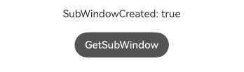

# ohos.window (Window)

Provides window-related functionalities.

## Import Module

```cangjie
import kit.ArkUI.*
```

## func findWindow(String)

```cangjie
public func findWindow(name: String): Window
```

**Description:** Finds a window by name.

**System Capability:** SystemCapability.WindowManager.WindowManager.Core

**Since:** 22

**Parameters:**

| Parameter | Type | Required | Default Value | Description |
|:---------|:-----|:--------|:-------------|:------------|
| name | String | Yes | - | Window name, which corresponds to the name value in Configuration. |

**Return Value:**

| Type | Description |
|:-----|:-----------|
| [Window](#class-window) | Returns the found window. |

**Exceptions:**

- BusinessException: Error codes are listed in the table below. For details, see [Universal Error Codes](../cj-errorcode-universal.md) and [Window Error Codes](./cj-errorcode-window.md).

  | Error Code | Description |
  |:----------|:-----------|
  | 1300002 | This window state is abnormal. |

## func createWindow(Configuration)

```cangjie
public func createWindow(config: Configuration): Window
```

**Description:** Creates a window with specific configurations. When config.windowType == TypeFloat, the "ohos.permission.SYSTEM_FLOAT_WINDOW" permission is required.

**Required Permission:** ohos.permission.SYSTEM_FLOAT_WINDOW

**System Capability:** SystemCapability.WindowManager.WindowManager.Core

**Since:** 22

**Parameters:**

| Parameter | Type | Required | Default Value | Description |
|:---------|:-----|:--------|:-------------|:------------|
| config | [Configuration](#class-configuration) | Yes | - | Window creation parameters. |

**Return Value:**

| Type | Description |
|:-----|:-----------|
| [Window](#class-window) | Returns the created window. |

**Exceptions:**

- BusinessException: Error codes are listed in the table below. For details, see [Universal Error Codes](../cj-errorcode-universal.md) and [Window Error Codes](./cj-errorcode-window.md).

  | Error Code | Description |
  |:----------|:-----------|
  | 201 | Permission verification failed. The application does not have the permission required to call the API. |
  | 401 | Parameter error. Possible causes: 1. Mandatory parameters are left unspecified;<br>2. Incorrect parameter types. |
  | 1300003 | This window manager service works abnormally. |
  | 1300006 | This window context is abnormal. |

## func shiftAppWindowFocus(Int32, Int32)

```cangjie
public func shiftAppWindowFocus(sourceWindowId: Int32, targetWindowId: Int32): Unit
```

**Description:** Transfers window focus from the source window to the target window within the same application. Window focus can be transferred between the main window and sub-windows.

**System Capability:** SystemCapability.Window.SessionManager

**Since:** 22

**Parameters:**

| Parameter | Type | Required | Default Value | Description |
|:---------|:-----|:--------|:-------------|:------------|
| sourceWindowId | Int32 | Yes | - | Source window ID for focus transfer. |
| targetWindowId | Int32 | Yes | - | Target window ID for focus transfer. |

**Exceptions:**

- BusinessException: Error codes are listed in the table below. For details, see [Universal Error Codes](../cj-errorcode-universal.md) and [Window Error Codes](./cj-errorcode-window.md).

  | Error Code | Description |
  |:----------|:-----------|
  | 401 | Parameter error. Possible causes: 1. Mandatory parameters are left unspecified;<br>2. Incorrect parameter types. |
  | 801 | Capability not supported. Failed to call the API due to limited device capabilities. |
  | 1300002 | This window state is abnormal. |
  | 1300003 | This window manager service works abnormally. |
  | 1300004 | Unauthorized operation. |

## func getLastWindow(BaseContext)

```cangjie
public func getLastWindow(ctx: BaseContext): Window
```

**Description:** Retrieves the top-level window of the current application. If there are no sub-windows, the main window of the application is returned.

**System Capability:** SystemCapability.WindowManager.WindowManager.Core

**Since:** 22

**Parameters:**

| Parameter | Type | Required | Default Value | Description |
|:---------|:-----|:--------|:-------------|:------------|
| ctx | [BaseContext](../AbilityKit/cj-apis-app-ability.md#class-basecontext) | Yes | - | Current application context. |

**Return Value:**

| Type | Description |
|:-----|:-----------|
| [Window](#class-window) | Returns the retrieved top-level window. |

**Exceptions:**

- BusinessException: Error codes are listed in the table below. For details, see [Universal Error Codes](../cj-errorcode-universal.md) and [Window Error Codes](./cj-errorcode-window.md).

  | Error Code | Description |
  |:----------|:-----------|
  | 1300002 | This window state is abnormal. |
  | 1300006 | This window context is abnormal. |

## class AvoidArea

```cangjie
public class AvoidArea {
    public var visible: Bool
    public var leftRect: Rect
    public var topRect: Rect
    public var rightRect: Rect
    public var bottomRect: Rect
    public init(
        visible!: Bool,
        leftRect!: Rect,
        topRect!: Rect,
        rightRect!: Rect,
        bottomRect!: Rect
    )
}
```

**Description:** Avoidance area.

**System Capability:** SystemCapability.WindowManager.WindowManager.Core

**Since:** 22

### var bottomRect

```cangjie
public var bottomRect: Rect
```

**Description:** Rectangle at the bottom of the screen.

**System Capability:** SystemCapability.WindowManager.WindowManager.Core

**Type:** [Rect](#class-rect)

**Read/Write:** Readable and Writable

**Since:** 22

### var leftRect

```cangjie
public var leftRect: Rect
```

**Description:** Rectangle on the left side of the screen.

**System Capability:** SystemCapability.WindowManager.WindowManager.Core

**Type:** [Rect](#class-rect)

**Read/Write:** Readable and Writable

**Since:** 22

### var rightRect

```cangjie
public var rightRect: Rect
```

**Description:** Rectangle on the right side of the screen.

**System Capability:** SystemCapability.WindowManager.WindowManager.Core

**Type:** [Rect](#class-rect)

**Read/Write:** Readable and Writable

**Since:** 22

### var topRect

```cangjie
public var topRect: Rect
```

**Description:** Rectangle at the top of the screen.

**System Capability:** SystemCapability.WindowManager.WindowManager.Core

**Type:** [Rect](#class-rect)

**Read/Write:** Readable and Writable

**Since:** 22

### var visible

```cangjie
public var visible: Bool
```

**Description:** Indicates whether the avoidance area is visible on the screen.

**System Capability:** SystemCapability.WindowManager.WindowManager.Core

**Type:** Bool

**Read/Write:** Readable and Writable

**Since:** 22

### init(Bool, Rect, Rect, Rect, Rect)

```cangjie
public init(
    visible!: Bool,
    leftRect!: Rect,
    topRect!: Rect,
    rightRect!: Rect,
    bottomRect!: Rect
)
```

**Description:** Constructor for AvoidArea.

**System Capability:** SystemCapability.WindowManager.WindowManager.Core

**Since:** 22

**Parameters:**

| Parameter | Type | Required | Default Value | Description |
|:---------|:-----|:--------|:-------------|:------------|
| visible | Bool | Yes | - | **Named parameter.** Indicates whether the avoidance area is visible. |
| leftRect | [Rect](#class-rect) | Yes | - | **Named parameter.** Left rectangle. |
| topRect | [Rect](#class-rect) | Yes | - | **Named parameter.** Top rectangle. |
| rightRect | [Rect](#class-rect) | Yes | - | **Named parameter.** Right rectangle. |
| bottomRect | [Rect](#class-rect) | Yes | - | **Named parameter.** Bottom rectangle. |

## class Configuration

```cangjie
public class Configuration {
    public var name: String
    public var windowType: WindowType
    public var ctx: BaseContext
    public var displayId: Int64 = -1
    public var parentId: Int64 = -1
    public init(
        name!: String,
        windowType!: WindowType,
        ctx!: BaseContext,
        displayId!: Int64 = -1,
        parentId!: Int64 = -1
    )
}
```

**Description:** Parameters for creating sub-windows or system windows.

**System Capability:** SystemCapability.WindowManager.WindowManager.Core

**Since:** 22

### var ctx

```cangjie
public var ctx: BaseContext
```

**Description:** Current application context information.

**System Capability:** SystemCapability.WindowManager.WindowManager.Core

**Type:** [BaseContext](../AbilityKit/cj-apis-app-ability.md#class-basecontext)

**Read/Write:** Readable and Writable

**Since:** 22

### var displayId

```cangjie
public var displayId: Int64 = -1
```

**Description:** Current physical screen ID.

**System Capability:** SystemCapability.WindowManager.WindowManager.Core

**Type:** Int64

**Read/Write:** Readable and Writable

**Since:** 22

### var name

```cangjie
public var name: String
```

**Description:** Window name.

**System Capability:** SystemCapability.WindowManager.WindowManager.Core

**Type:** String

**Read/Write:** Readable and Writable

**Since:** 22

### var parentId

```cangjie
public var parentId: Int64 = -1
```

**Description:** Parent window ID.

**System Capability:** SystemCapability.WindowManager.WindowManager.Core

**Type:** Int64

**Read/Write:** Readable and Writable

**Since:** 22

### var windowType

```cangjie
public var windowType: WindowType
```

**Description:** Window type.

**System Capability:** SystemCapability.WindowManager.WindowManager.Core

**Type:** [WindowType](#enum-windowtype)

**Read/Write:** Readable and Writable

**Since:** 22

### init(String, WindowType, BaseContext, Int64, Int64)

```cangjie
public init(
    name!: String,
    windowType!: WindowType,
    ctx!: BaseContext,
    displayID!: Int64 = -1,
    parentID!: Int64 = -1
)
```

**Description:** Constructor for Configuration.

**System Capability:** SystemCapability.WindowManager.WindowManager.Core

**Since:** 22

**Parameters:**

| Parameter | Type | Required | Default Value | Description |
|:---------|:-----|:--------|:-------------|:------------|
| name | String | Yes | - | **Named parameter.** Window name. |
| windowType | [WindowType](#enum-windowtype) | Yes | - | **Named parameter.** Window type. |
| ctx | [BaseContext](../AbilityKit/cj-apis-app-ability.md#class-basecontext) | Yes | - | **Named parameter.** Current application context information. |
| displayID | Int64 | No | -1 | **Named parameter.** Current physical screen ID. |
| parentID | Int64 | No | -1 | **Named parameter.** Parent window ID. |## class Rect

```cangjie
public class Rect {
    public var left: Int32
    public var top: Int32
    public var width: UInt32
    public var height: UInt32
    public init(
        left!: Int32,
        top!: Int32,
        width!: UInt32,
        height!: UInt32
    )
}
```

**Function:** Window rectangular area.

**System Capability:** SystemCapability.WindowManager.WindowManager.Core

**Since:** 22

### var height

```cangjie
public var height: UInt32
```

**Function:** Height of the rectangular area in pixels.

**System Capability:** SystemCapability.WindowManager.WindowManager.Core

**Type:** UInt32

**Read/Write Permission:** Readable and Writable

**Since:** 22

### var left

```cangjie
public var left: Int32
```

**Function:** Left boundary of the rectangular area in pixels.

**System Capability:** SystemCapability.WindowManager.WindowManager.Core

**Type:** Int32

**Read/Write Permission:** Readable and Writable

**Since:** 22

### var top

```cangjie
public var top: Int32
```

**Function:** Top boundary of the rectangular area in pixels.

**System Capability:** SystemCapability.WindowManager.WindowManager.Core

**Type:** Int32

**Read/Write Permission:** Readable and Writable

**Since:** 22

### var width

```cangjie
public var width: UInt32
```

**Function:** Width of the rectangular area in pixels.

**System Capability:** SystemCapability.WindowManager.WindowManager.Core

**Type:** UInt32

**Read/Write Permission:** Readable and Writable

**Since:** 22

### init(Int32, Int32, UInt32, UInt32)

```cangjie
public init(
    left!: Int32,
    top!: Int32,
    width!: UInt32,
    height!: UInt32
)
```

**Function:** Rect constructor.

**System Capability:** SystemCapability.WindowManager.WindowManager.Core

**Since:** 22

**Parameters:**

|Parameter|Type|Required|Default Value|Description|
|:---|:---|:---|:---|:---|
|left|Int32|Yes|-| **Named parameter.** Left boundary of the rectangular area in pixels.|
|top|Int32|Yes|-| **Named parameter.** Top boundary of the rectangular area in pixels.|
|width|UInt32|Yes|-| **Named parameter.** Width of the rectangular area in pixels.|
|height|UInt32|Yes|-| **Named parameter.** Height of the rectangular area in pixels.|

## class Size

```cangjie
public class Size {
    public var width: UInt32
    public var height: UInt32
    public init(
        width!: UInt32,
        height!: UInt32
    )
}
```

**Function:** Window size.

**System Capability:** SystemCapability.WindowManager.WindowManager.Core

**Since:** 22

### var height

```cangjie
public var height: UInt32
```

**Function:** Height of the window.

**Type:** UInt32

**Read/Write Permission:** Readable and Writable

**Since:** 22

### var width

```cangjie
public var width: UInt32
```

**Function:** Width of the window.

**Type:** UInt32

**Read/Write Permission:** Readable and Writable

**Since:** 22

### init(UInt32, UInt32)

```cangjie
public init(
    width!: UInt32,
    height!: UInt32
)
```

**Function:** Size constructor.

**System Capability:** SystemCapability.WindowManager.WindowManager.Core

**Since:** 22

**Parameters:**

|Parameter|Type|Required|Default Value|Description|
|:---|:---|:---|:---|:---|
|width|UInt32|Yes|-| **Named parameter.** Window width.|
|height|UInt32|Yes|-| **Named parameter.** Window height.|

## class SystemBarProperties

```cangjie
public class SystemBarProperties {
    public var statusBarColor: String = "#66000000"
    public var isStatusBarLightIcon: Bool = false
    public var statusBarContentColor: String = "#E5FFFFFF"
    public var navigationBarColor: String = "#66000000"
    public var isNavigationBarLightIcon: Bool = false
    public var navigationBarContentColor: String = "#E5FFFFFF"
    public var enableStatusBarAnimation: Bool = false
    public var enableNavigationBarAnimation: Bool = false
    public init(
        statusBarColor!: String = "#66000000",
        isStatusBarLightIcon!: Bool = false,
        statusBarContentColor!: String = "#E5FFFFFF",
        navigationBarColor!: String = "#66000000",
        isNavigationBarLightIcon!: Bool = false,
        navigationBarContentColor!: String = "#E5FFFFFF",
        enableStatusBarAnimation!: Bool = false,
        enableNavigationBarAnimation!: Bool = false
    )
}
```

**Function:** Properties of the status bar and navigation bar, which are not automatically updated.

**System Capability:** SystemCapability.WindowManager.WindowManager.Core

**Since:** 22

### var enableNavigationBarAnimation

```cangjie
public var enableNavigationBarAnimation: Bool = false
```

**Function:** Enable navigation bar animation.

**System Capability:** SystemCapability.WindowManager.WindowManager.Core

**Type:** Bool

**Read/Write Permission:** Readable and Writable

**System Capability:** SystemCapability.Window.SessionManager

**Since:** 22

### var enableStatusBarAnimation

```cangjie
public var enableStatusBarAnimation: Bool = false
```

**Function:** Enable status bar animation.

**System Capability:** SystemCapability.WindowManager.WindowManager.Core

**Type:** Bool

**Read/Write Permission:** Readable and Writable

**System Capability:** SystemCapability.Window.SessionManager

**Since:** 22

### var isNavigationBarLightIcon

```cangjie
public var isNavigationBarLightIcon: Bool = false
```

**Function:** Light-colored icons for the navigation bar.

**System Capability:** SystemCapability.WindowManager.WindowManager.Core

**Type:** Bool

**Read/Write Permission:** Readable and Writable

**System Capability:** SystemCapability.WindowManager.WindowManager.Core

**Since:** 22

### var isStatusBarLightIcon

```cangjie
public var isStatusBarLightIcon: Bool = false
```

**Function:** Light-colored icons for the status bar.

**System Capability:** SystemCapability.WindowManager.WindowManager.Core

**Type:** Bool

**Read/Write Permission:** Readable and Writable

**System Capability:** SystemCapability.WindowManager.WindowManager.Core

**Since:** 22

### var navigationBarColor

```cangjie
public var navigationBarColor: String = "#66000000"
```

**Function:** Color of the navigation bar.

**System Capability:** SystemCapability.WindowManager.WindowManager.Core

**Type:** String

**Read/Write Permission:** Readable and Writable

**System Capability:** SystemCapability.WindowManager.WindowManager.Core

**Since:** 22

### var navigationBarContentColor

```cangjie
public var navigationBarContentColor: String = "#E5FFFFFF"
```

**Function:** Content color of the navigation bar.

**System Capability:** SystemCapability.WindowManager.WindowManager.Core

**Type:** String

**Read/Write Permission:** Readable and Writable

**System Capability:** SystemCapability.WindowManager.WindowManager.Core

**Since:** 22

### var statusBarColor

```cangjie
public var statusBarColor: String = "#66000000"
```

**Function:** Color of the status bar.

**System Capability:** SystemCapability.WindowManager.WindowManager.Core

**Type:** String

**Read/Write Permission:** Readable and Writable

**System Capability:** SystemCapability.WindowManager.WindowManager.Core

**Since:** 22

### var statusBarContentColor

```cangjie
public var statusBarContentColor: String = "#E5FFFFFF"
```

**Function:** Content color of the status bar.

**System Capability:** SystemCapability.WindowManager.WindowManager.Core

**Type:** String

**Read/Write Permission:** Readable and Writable

**System Capability:** SystemCapability.WindowManager.WindowManager.Core

**Since:** 22

### init(String, Bool, String, String, Bool, String, Bool, Bool)

```cangjie
public init(
    statusBarColor!: String = "#66000000",
    isStatusBarLightIcon!: Bool = false,
    statusBarContentColor!: String = "#E5FFFFFF",
    navigationBarColor!: String = "#66000000",
    isNavigationBarLightIcon!: Bool = false,
    navigationBarContentColor!: String = "#E5FFFFFF",
    enableStatusBarAnimation!: Bool = false,
    enableNavigationBarAnimation!: Bool = false
)
```

**Function:** SystemBarProperties constructor.

**System Capability:** SystemCapability.WindowManager.WindowManager.Core

**Since:** 22

**Parameters:**

|Parameter|Type|Required|Default Value|Description|
|:---|:---|:---|:---|:---|
|statusBarColor|String|No|"#66000000"| **Named parameter.** Color of the status bar.|
|isStatusBarLightIcon|Bool|No|false| **Named parameter.** Light-colored icons for the status bar.|
|statusBarContentColor|String|No|"#E5FFFFFF"| **Named parameter.** Content color of the status bar.|
|navigationBarColor|String|No|"#66000000"| **Named parameter.** Color of the navigation bar.|
|isNavigationBarLightIcon|Bool|No|false| **Named parameter.** Light-colored icons for the navigation bar.|
|navigationBarContentColor|String|No|"#E5FFFFFF"| **Named parameter.** Content color of the navigation bar.|
|enableStatusBarAnimation|Bool|No|false| **Named parameter.** Enable status bar animation.|
|enableNavigationBarAnimation|Bool|No|false| **Named parameter.** Enable navigation bar animation.|

## class TitleButtonRect

```cangjie
public class TitleButtonRect {
    public var right: Int32
    public var top: Int32
    public var width: UInt32
    public var height: UInt32
    public init(
      right!: Int32,
      top!: Int32,
      width!: UInt32,
      height!: UInt32
    )
}
```

**Function:** Rectangular area for minimize, maximize, and close buttons on the title bar, with coordinates relative to the top-right corner of the window.

**System Capability:** SystemCapability.Window.SessionManager

**Since:** 22

### var height

```cangjie
public var height: UInt32
```

**Function:** Height of the rectangular area.

**Type:** UInt32

**Read/Write Permission:** Readable and Writable

**System Capability:** SystemCapability.Window.SessionManager

**Since:** 22

### var right

```cangjie
public var right: Int32
```

**Function:** Right boundary of the rectangular area.

**Type:** Int32

**Read/Write Permission:** Readable and Writable

**System Capability:** SystemCapability.Window.SessionManager

**Since:** 22

### var top

```cangjie
public var top: Int32
```

**Function:** Top boundary of the rectangular area.

**Type:** Int32

**Read/Write Permission:** Readable and Writable

**System Capability:** SystemCapability.Window.SessionManager

**Since:** 22

### var width

```cangjie
public var width: UInt32
```

**Function:** Width of the rectangular area.

**Type:** UInt32

**Read/Write Permission:** Readable and Writable

**System Capability:** SystemCapability.Window.SessionManager

**Since:** 22

### init(Int32, Int32, UInt32, UInt32)

```cangjie
public init(
    right!: Int32,
    top!: Int32,
    width!: UInt32,
    height!: UInt32
)
```

**Function:** TitleButtonRect constructor.

**System Capability:** SystemCapability.Window.SessionManager

**Since:** 22

**Parameters:**

|Parameter|Type|Required|Default Value|Description|
|:---|:---|:---|:---|:---|
|right|Int32|Yes|-| **Named parameter.** Right boundary of the rectangular area in vp.|
|top|Int32|Yes|-| **Named parameter.** Top boundary of the rectangular area in vp.|
|width|UInt32|Yes|-| **Named parameter.** Width of the rectangular area in vp.|
|height|UInt32|Yes|-| **Named parameter.** Height of the rectangular area in vp.|## class Window

```cangjie
public class Window {}
```

**Description:** Window class.

**System Capability:** SystemCapability.WindowManager.WindowManager.Core

**Since:** 22

### func destroyWindow()

```cangjie
public func destroyWindow(): Unit
```

**Description:** Destroys this window. This API only takes effect for system windows or application sub-windows.

**System Capability:** SystemCapability.WindowManager.WindowManager.Core

**Since:** 22

**Exceptions:**

- BusinessException: Corresponding error codes are listed below. For details, see [Universal Error Codes](../cj-errorcode-universal.md) and [Window Error Codes](./cj-errorcode-window.md).

  |Error Code|Description|
  |:----|:----|
  |1300002|This window state is abnormal.|

### func getWindowAvoidArea(AvoidAreaType)

```cangjie
public func getWindowAvoidArea(areaType: AvoidAreaType): AvoidArea
```

**Description:** Gets the avoid area.

**System Capability:** SystemCapability.WindowManager.WindowManager.Core

**Since:** 22

**Parameters:**

|Parameter Name|Type|Required|Default Value|Description|
|:---|:---|:---|:---|:---|
|areaType|[AvoidAreaType](#enum-avoidareatype)|Yes|-|Area type.|

**Return Value:**

|Type|Description|
|:----|:----|
|[AvoidArea](#class-avoidarea)|Returns the area where the window cannot be displayed.|

**Exceptions:**

- BusinessException: Corresponding error codes are listed below. For details, see [Universal Error Codes](../cj-errorcode-universal.md) and [Window Error Codes](./cj-errorcode-window.md).

  |Error Code|Description|
  |:----|:----|
  |401|Parameter error. Possible causes:<br> 1. Mandatory parameters are left unspecified. <br>2. Incorrect parameter types. |
  |1300002|This window state is abnormal.|

### func getWindowColorSpace()

```cangjie
public func getWindowColorSpace(): ColorSpace
```

**Description:** Gets the set color space.

**System Capability:** SystemCapability.WindowManager.WindowManager.Core

**Since:** 22

**Return Value:**

|Type|Description|
|:----|:----|
|[ColorSpace](#enum-colorspace)|Returns the obtained color space.|

**Exceptions:**

- BusinessException: Corresponding error codes are listed below. For details, see [Universal Error Codes](../cj-errorcode-universal.md) and [Window Error Codes](./cj-errorcode-window.md).

  |Error Code|Description|
  |:----|:----|
  |1300002|This window state is abnormal.|

### func getWindowProperties()

```cangjie
public func getWindowProperties(): WindowProperties
```

**Description:** Gets the properties of the current window.

**System Capability:** SystemCapability.WindowManager.WindowManager.Core

**Since:** 22

**Return Value:**

|Type|Description|
|:----|:----|
|[WindowProperties](#class-windowproperties)|Returns the window properties.|

**Exceptions:**

- BusinessException: Corresponding error codes are listed below. For details, see [Universal Error Codes](../cj-errorcode-universal.md) and [Window Error Codes](./cj-errorcode-window.md).

  |Error Code|Description|
  |:----|:----|
  |1300002|This window state is abnormal.|

### func isWindowShowing()

```cangjie
public func isWindowShowing(): Bool
```

**Description:** Checks whether the window is displayed. A value of true indicates the window is displayed, and false indicates the opposite.

**System Capability:** SystemCapability.WindowManager.WindowManager.Core

**Since:** 22

**Return Value:**

|Type|Description|
|:----|:----|
|Bool|Returns whether the window is displayed.|

**Exceptions:**

- BusinessException: Corresponding error codes are listed below. For details, see [Universal Error Codes](../cj-errorcode-universal.md) and [Window Error Codes](./cj-errorcode-window.md).

  |Error Code|Description|
  |:----|:----|
  |1300002|This window state is abnormal.|

### func isWideGamutSupported()

```cangjie
public func isWideGamutSupported(): Bool
```

**Description:** Checks whether the window supports wide color gamut settings.

**System Capability:** SystemCapability.WindowManager.WindowManager.Core

**Since:** 22

**Return Value:**

|Type|Description|
|:----|:----|
|Bool|A value of true indicates support for wide color gamut color space, and false indicates the opposite.|

**Exceptions:**

- BusinessException: Corresponding error codes are listed below. For details, see [Universal Error Codes](../cj-errorcode-universal.md) and [Window Error Codes](./cj-errorcode-window.md).

  |Error Code|Description|
  |:----|:----|
  |1300002|This window state is abnormal.|

### func minimize()

```cangjie
public func minimize(): Unit
```

**Description:** Minimizes the main window (if the caller is the main window). The main window can be restored from the dock. For 2-in-1 devices, it can be restored by calling recover().
Hides the sub-window (if the caller is a sub-window). Sub-windows cannot be restored from the dock. They can be made visible again by calling showWindow().

**System Capability:** SystemCapability.Window.SessionManager

**Since:** 22

**Exceptions:**

- BusinessException: Corresponding error codes are listed below. For details, see [Universal Error Codes](../cj-errorcode-universal.md) and [Window Error Codes](./cj-errorcode-window.md).

  |Error Code|Description|
  |:----|:----|
  |801|Capability not supported. Failed to call the API due to limited device capabilities.|
  |1300002|This window state is abnormal.|

### func moveWindowTo(Int32, Int32)

```cangjie
public func moveWindowTo(x: Int32, y: Int32): Unit
```

**Description:** Sets the window position.

**System Capability:** SystemCapability.WindowManager.WindowManager.Core

**Since:** 22

**Parameters:**

|Parameter Name|Type|Required|Default Value|Description|
|:---|:---|:---|:---|:---|
|x|Int32|Yes|-|Indicates the X-coordinate of the window.|
|y|Int32|Yes|-|Indicates the Y-coordinate of the window.|

**Exceptions:**

- BusinessException: Corresponding error codes are listed below. For details, see [Universal Error Codes](../cj-errorcode-universal.md) and [Window Error Codes](./cj-errorcode-window.md).

  |Error Code|Description|
  |:----|:----|
  |1300002|This window state is abnormal.|

### func off(WindowCallbackType)

```cangjie
public func off(callbackType: WindowCallbackType): Unit
```

**Description:** Unregisters the callback for the specified event.

**System Capability:** SystemCapability.WindowManager.WindowManager.Core

**Since:** 22

**Parameters:**

|Parameter Name|Type|Required|Default Value|Description|
|:---|:---|:---|:---|:---|
|callbackType|[WindowCallbackType](#enum-windowcallbacktype)|Yes|-|Event type.|

**Exceptions:**

- BusinessException: Corresponding error codes are listed below. For details, see [Universal Error Codes](../cj-errorcode-universal.md) and [Window Error Codes](./cj-errorcode-window.md).

  |Error Code|Description|
  |:----|:----|
  |1300016|Parameter error. Possible cause: 1. Mandatory parameters are left unspecified;<br>2. Incorrect parameter types;<br>3. Parameter verification failed.|

### func off(WindowCallbackType, Callback1Argument\<UInt32>)

```cangjie
public func off(callbackType: WindowCallbackType, callback: Callback1Argument<UInt32>): Unit
```

**Description:** Unregisters the callback for keyboardHeightChange.

**System Capability:** SystemCapability.WindowManager.WindowManager.Core

**Since:** 22

**Parameters:**

|Parameter Name|Type|Required|Default Value|Description|
|:---|:---|:---|:---|:---|
|callbackType|[WindowCallbackType](#enum-windowcallbacktype)|Yes|-|The value must be KeyboardHeightChange, indicating the keyboard height change event.|
|callback|[Callback1Argument](../arkinterop/cj-api-callback_invoke.md#class-callback1argument)\<UInt32>|Yes|-|Callback used to return the current keyboard height, which is an integer in px.|

**Exceptions:**

- BusinessException: Corresponding error codes are listed below. For details, see [Universal Error Codes](../cj-errorcode-universal.md) and [Window Error Codes](./cj-errorcode-window.md).

  |Error Code|Description|
  |:----|:----|
  |1300016|Parameter error. Possible cause: 1. Mandatory parameters are left unspecified;<br>2. Incorrect parameter types;<br>3. Parameter verification failed.|

### func on(WindowCallbackType, Callback1Argument\<UInt32>)

```cangjie
public func on(callbackType: WindowCallbackType, callback: Callback1Argument<UInt32>): Unit
```

**Description:** Registers the callback for keyboardHeightChange.

**System Capability:** SystemCapability.WindowManager.WindowManager.Core

**Since:** 22

**Parameters:**

|Parameter Name|Type|Required|Default Value|Description|
|:---|:---|:---|:---|:---|
|callbackType|[WindowCallbackType](#enum-windowcallbacktype)|Yes|-|The value must be KeyboardHeightChange, indicating the keyboard height change event.|
|callback|[Callback1Argument](../arkinterop/cj-api-callback_invoke.md#class-callback1argument)\<UInt32>|Yes|-|Callback used to return the current keyboard height, which is an integer in px.|

**Exceptions:**

- BusinessException: Corresponding error codes are listed below. For details, see [Universal Error Codes](../cj-errorcode-universal.md) and [Window Error Codes](./cj-errorcode-window.md).

  |Error Code|Description|
  |:----|:----|
  |1300016|Parameter error. Possible cause: 1. Mandatory parameters are left unspecified;<br>2. Incorrect parameter types;<br>3. Parameter verification failed.|

### func resetAspectRatio()

```cangjie
public func resetAspectRatio(): Unit
```

**Description:** Resets the aspect ratio of the window.

**System Capability:** SystemCapability.WindowManager.WindowManager.Core

**Since:** 22

**Exceptions:**

- BusinessException: Corresponding error codes are listed below. For details, see [Universal Error Codes](../cj-errorcode-universal.md) and [Window Error Codes](./cj-errorcode-window.md).

  |Error Code|Description|
  |:----|:----|
  |1300002|This window state is abnormal.|
  |1300004|Unauthorized operation.|

### func resize(UInt32, UInt32)

```cangjie
public func resize(width: UInt32, height: UInt32): Unit
```

**Description:** Sets the window size.

**System Capability:** SystemCapability.Window.SessionManager

**Since:** 22

**Parameters:**

|Parameter Name|Type|Required|Default Value|Description|
|:---|:---|:---|:---|:---|
|width|UInt32|Yes|-|Indicates the width of the window.|
|height|UInt32|Yes|-|Indicates the height of the window.|

**Exceptions:**

- BusinessException: Corresponding error codes are listed below. For details, see [Universal Error Codes](../cj-errorcode-universal.md) and [Window Error Codes](./cj-errorcode-window.md).

  |Error Code|Description|
  |:----|:----|
  |1300002|This window state is abnormal.|

### func setAspectRatio(Float64)

```cangjie
public func setAspectRatio(ratio: Float64): Unit
```

**Description:** Sets the aspect ratio of the window.

**System Capability:** SystemCapability.WindowManager.WindowManager.Core

**Since:** 22

**Parameters:**

|Parameter Name|Type|Required|Default Value|Description|
|:---|:---|:---|:---|:---|
|ratio|Float64|Yes|-|The aspect ratio of the window excluding decorations.|

**Exceptions:**

- BusinessException: Corresponding error codes are listed below. For details, see [Universal Error Codes](../cj-errorcode-universal.md) and [Window Error Codes](./cj-errorcode-window.md).

  |Error Code|Description|
  |:----|:----|
  |1300002|This window state is abnormal.|
  |1300004|Unauthorized operation.|

### func setPreferredOrientation(Orientation)

```cangjie
public func setPreferredOrientation(orientation: Orientation): Unit
```

**Description:** Sets the preferred orientation for the main window. This does not take effect on devices that do not support sensor rotation, 2-in-1 devices, or sub-windows.

**System Capability:** SystemCapability.WindowManager.WindowManager.Core

**Since:** 22

**Parameters:**

|Parameter Name|Type|Required|Default Value|Description|
|:---|:---|:---|:---|:---|
|orientation|[Orientation](#enum-orientation)|Yes|-|Window orientation configuration.|

**Exceptions:**

- BusinessException: Corresponding error codes are listed below. For details, see [Universal Error Codes](../cj-errorcode-universal.md) and [Window Error Codes](./cj-errorcode-window.md).

  |Error Code|Description|
  |:----|:----|
  |401|Parameter error. Possible cause: 1. Mandatory parameters are left unspecified;<br>2. Incorrect parameter types.|
  |1300002|This window state is abnormal.|### func setWindowBackgroundColor(String)

```cangjie
public func setWindowBackgroundColor(color: String): Unit
```

**Function:** Sets the window background color.

**System Capability:** SystemCapability.WindowManager.WindowManager.Core

**Initial Version:** 22

**Parameters:**

| Parameter | Type   | Required | Default | Description          |
|:---------|:-------|:--------|:--------|:---------------------|
| color    | String | Yes      | -       | The specified color. |

**Exceptions:**

- BusinessException: Corresponding error codes are listed in the table below. For details, see [Universal Error Codes](../cj-errorcode-universal.md) and [Window Error Codes](./cj-errorcode-window.md).

  | Error Code | Description |
  |:----------|:------------|
  | 401       | Parameter error. Possible causes: 1. Mandatory parameters are left unspecified;<br>2. Incorrect parameter types. |
  | 1300002   | This window state is abnormal. |

### func setWindowBrightness(Float32)

```cangjie
public func setWindowBrightness(brightness: Float32): Unit
```

**Function:** Sets the window brightness.

**System Capability:** SystemCapability.WindowManager.WindowManager.Core

**Initial Version:** 22

**Parameters:**

| Parameter  | Type   | Required | Default | Description           |
|:----------|:-------|:--------|:--------|:----------------------|
| brightness | Float32 | Yes      | -       | The specified brightness value. |

**Exceptions:**

- BusinessException: Corresponding error codes are listed in the table below. For details, see [Universal Error Codes](../cj-errorcode-universal.md) and [Window Error Codes](./cj-errorcode-window.md).

  | Error Code | Description |
  |:----------|:------------|
  | 1300002   | This window state is abnormal. |

### func setWindowColorSpace(ColorSpace)

```cangjie
public func setWindowColorSpace(colorSpace: ColorSpace): Unit
```

**Function:** Sets the specified color space.

**System Capability:** SystemCapability.WindowManager.WindowManager.Core

**Initial Version:** 22

**Parameters:**

| Parameter   | Type                     | Required | Default | Description           |
|:-----------|:-------------------------|:--------|:--------|:----------------------|
| colorSpace | [ColorSpace](#enum-colorspace) | Yes      | -       | The specified color space. |

**Exceptions:**

- BusinessException: Corresponding error codes are listed in the table below. For details, see [Universal Error Codes](../cj-errorcode-universal.md) and [Window Error Codes](./cj-errorcode-window.md).

  | Error Code | Description |
  |:----------|:------------|
  | 1300002   | This window state is abnormal. |

### func setWindowFocusable(Bool)

```cangjie
public func setWindowFocusable(isFocusable: Bool): Unit
```

**Function:** Sets whether the window can obtain focus.

**System Capability:** SystemCapability.WindowManager.WindowManager.Core

**Initial Version:** 22

**Parameters:**

| Parameter    | Type | Required | Default | Description           |
|:------------|:-----|:--------|:--------|:----------------------|
| isFocusable | Bool | Yes      | -       | If true, the window can obtain focus; if false, it cannot. |

**Exceptions:**

- BusinessException: Corresponding error codes are listed in the table below. For details, see [Universal Error Codes](../cj-errorcode-universal.md) and [Window Error Codes](./cj-errorcode-window.md).

  | Error Code | Description |
  |:----------|:------------|
  | 1300002   | This window state is abnormal. |

### func setWindowKeepScreenOn(Bool)

```cangjie
public func setWindowKeepScreenOn(isKeepScreenOn: Bool): Unit
```

**Function:** Sets whether to keep the screen always on.

**System Capability:** SystemCapability.WindowManager.WindowManager.Core

**Initial Version:** 22

**Parameters:**

| Parameter      | Type | Required | Default | Description           |
|:--------------|:-----|:--------|:--------|:----------------------|
| isKeepScreenOn | Bool | Yes      | -       | If true, the screen will stay always on; if false, it will not. |

**Exceptions:**

- BusinessException: Corresponding error codes are listed in the table below. For details, see [Universal Error Codes](../cj-errorcode-universal.md) and [Window Error Codes](./cj-errorcode-window.md).

  | Error Code | Description |
  |:----------|:------------|
  | 1300002   | This window state is abnormal. |

### func setWindowSystemBarEnabled(Array\<SystemBarType>)

```cangjie
public func setWindowSystemBarEnabled(names: Array<SystemBarType>): Unit
```

**Function:** Sets whether to display the system bars of the main window.

**System Capability:** SystemCapability.WindowManager.WindowManager.Core

**Initial Version:** 22

**Parameters:**

| Parameter | Type                              | Required | Default | Description           |
|:---------|:----------------------------------|:--------|:--------|:----------------------|
| names    | Array\<[SystemBarType](#enum-systembartype)> | Yes      | -       | Collection of system bar types. |

**Exceptions:**

- BusinessException: Corresponding error codes are listed in the table below. For details, see [Universal Error Codes](../cj-errorcode-universal.md) and [Window Error Codes](./cj-errorcode-window.md).

  | Error Code | Description |
  |:----------|:------------|
  | 1300002   | This window state is abnormal. |

### func setWindowSystemBarProperties(SystemBarProperties)

```cangjie
public func setWindowSystemBarProperties(systemBarProperties: SystemBarProperties): Unit
```

**Function:** Sets the system bar properties.

**System Capability:** SystemCapability.WindowManager.WindowManager.Core

**Initial Version:** 22

**Parameters:**

| Parameter            | Type                                   | Required | Default | Description           |
|:--------------------|:---------------------------------------|:--------|:--------|:----------------------|
| systemBarProperties | [SystemBarProperties](#class-systembarproperties) | Yes      | -       | The system bar properties. |

**Exceptions:**

- BusinessException: Corresponding error codes are listed in the table below. For details, see [Universal Error Codes](../cj-errorcode-universal.md) and [Window Error Codes](./cj-errorcode-window.md).

  | Error Code | Description |
  |:----------|:------------|
  | 1300002   | This window state is abnormal. |

### func setWindowLayoutFullScreen(Bool)

```cangjie
public func setWindowLayoutFullScreen(isLayoutFullScreen: Bool): Unit
```

**Function:** Sets whether the main window layout or sub-window layout is immersive.

**System Capability:** SystemCapability.WindowManager.WindowManager.Core

**Initial Version:** 22

**Parameters:**

| Parameter          | Type | Required | Default | Description           |
|:------------------|:-----|:--------|:--------|:----------------------|
| isLayoutFullScreen | Bool | Yes      | -       | Whether the window layout is immersive. |

**Exceptions:**

- BusinessException: Corresponding error codes are listed in the table below. For details, see [Universal Error Codes](../cj-errorcode-universal.md) and [Window Error Codes](./cj-errorcode-window.md).

  | Error Code | Description |
  |:----------|:------------|
  | 1300002   | This window state is abnormal. |

### func setWindowPrivacyMode(Bool)

```cangjie
public func setWindowPrivacyMode(isPrivacyMode: Bool): Unit
```

**Function:** Sets whether it is in privacy mode.

**Required Permission:** ohos.permission.PRIVACY_WINDOW

**System Capability:** SystemCapability.WindowManager.WindowManager.Core

**Initial Version:** 22

**Parameters:**

| Parameter     | Type | Required | Default | Description           |
|:-------------|:-----|:--------|:--------|:----------------------|
| isPrivacyMode | Bool | Yes      | -       | If true, it is in privacy mode; if false, it is not. |

**Exceptions:**

- BusinessException: Corresponding error codes are listed in the table below. For details, see [Universal Error Codes](../cj-errorcode-universal.md) and [Window Error Codes](./cj-errorcode-window.md).

  | Error Code | Description |
  |:----------|:------------|
  | 1300002   | This window state is abnormal. |

### func setWindowSystemBarEnable(Array\<SystemBarType>)

```cangjie
public func setWindowSystemBarEnable(names: Array<SystemBarType>): Unit
```

**Function:** Sets whether to display the system bars of the main window.

**System Capability:** SystemCapability.WindowManager.WindowManager.Core

**Initial Version:** 22

**Parameters:**

| Parameter | Type                              | Required | Default | Description           |
|:---------|:----------------------------------|:--------|:--------|:----------------------|
| names    | Array\<[SystemBarType](#enum-systembartype)> | Yes      | -       | Collection of system bar types. |

**Exceptions:**

- BusinessException: Corresponding error codes are listed in the table below. For details, see [Universal Error Codes](../cj-errorcode-universal.md) and [Window Error Codes](./cj-errorcode-window.md).

  | Error Code | Description |
  |:----------|:------------|
  | 1300002   | This window state is abnormal. |

### func setWindowSystemBarProperties(SystemBarProperties)

```cangjie
public func setWindowSystemBarProperties(systemBarProperties: SystemBarProperties): Unit
```

**Function:** Sets the system bar properties.

**System Capability:** SystemCapability.WindowManager.WindowManager.Core

**Initial Version:** 22

**Parameters:**

| Parameter            | Type                                   | Required | Default | Description           |
|:--------------------|:---------------------------------------|:--------|:--------|:----------------------|
| systemBarProperties | [SystemBarProperties](#class-systembarproperties) | Yes      | -       | The system bar properties. |

**Exceptions:**

- BusinessException: Corresponding error codes are listed in the table below. For details, see [Universal Error Codes](../cj-errorcode-universal.md) and [Window Error Codes](./cj-errorcode-window.md).

  | Error Code | Description |
  |:----------|:------------|
  | 1300002   | This window state is abnormal. |

### func setWindowTouchable(Bool)

```cangjie
public func setWindowTouchable(isTouchable: Bool): Unit
```

**Function:** Sets whether the window is touchable.

**System Capability:** SystemCapability.WindowManager.WindowManager.Core

**Initial Version:** 22

**Parameters:**

| Parameter    | Type | Required | Default | Description           |
|:------------|:-----|:--------|:--------|:----------------------|
| isTouchable | Bool | Yes      | -       | If true, the window is touchable; if false, it is not. |

**Exceptions:**

- BusinessException: Corresponding error codes are listed in the table below. For details, see [Universal Error Codes](../cj-errorcode-universal.md) and [Window Error Codes](./cj-errorcode-window.md).

  | Error Code | Description |
  |:----------|:------------|
  | 1300002   | This window state is abnormal. |

### func showWindow()

```cangjie
public func showWindow(): Unit
```

**Function:** Displays this window. This API only takes effect for system windows or application sub-windows. For the main window of an application, when the main window is already displayed, this API will move it to the top.

**System Capability:** SystemCapability.WindowManager.WindowManager.Core

**Initial Version:** 22

**Exceptions:**

- BusinessException: Corresponding error codes are listed in the table below. For details, see [Universal Error Codes](../cj-errorcode-universal.md) and [Window Error Codes](./cj-errorcode-window.md).

  | Error Code | Description |
  |:----------|:------------|
  | 1300002   | This window state is abnormal. |

### func snapshot()

```cangjie
public func snapshot(): PixelMap
```

**Function:** Captures a window snapshot.

**System Capability:** SystemCapability.WindowManager.WindowManager.Core

**Initial Version:** 22

**Return Value:**

| Type | Description |
|:----|:------------|
| [PixelMap](../ImageKit/cj-apis-image.md#class-pixelmap) | Returns a Promise without a value. |

**Exceptions:**

- BusinessException: Corresponding error codes are listed in the table below. For details, see [Universal Error Codes](../cj-errorcode-universal.md) and [Window Error Codes](./cj-errorcode-window.md).

  | Error Code | Description |
  |:----------|:------------|
  | 1300002   | This window state is abnormal. |

## class WindowProperties

```cangjie
public class WindowProperties {
    public var windowRect: Rect
    public var drawableRect: Rect
    public var windowType: WindowType
    public var isFullScreen: Bool
    public var isLayoutFullScreen: Bool
    public var focusable: Bool
    public var touchable: Bool
    public var brightness: Float32
    public var isKeepScreenOn: Bool
    public var isPrivacyMode: Bool
    public var isTransparent: Bool
    public var id: UInt32
    public init(
        windowRect!: Rect,
        drawableRect!: Rect,
        windowType!: WindowType,
        isFullScreen!: Bool,
        isLayoutFullScreen!: Bool,
        focusable!: Bool,
        touchable!: Bool,
        brightness!: Float32,
        isKeepScreenOn!: Bool,
        isPrivacyMode!: Bool,
        isTransparent!: Bool,
        id!: UInt32
    )
}
```

**Function:** Window properties, which are not automatically updated.

**System Capability:** SystemCapability.WindowManager.WindowManager.Core

**Initial Version:** 22

### var brightness

```cangjie
public var brightness: Float32
```

**Function:** The brightness value of the window.

**System Capability:** SystemCapability.WindowManager.WindowManager.Core

**Type:** Float32

**Read/Write:** Readable and Writable

**Initial Version:** 22

### var drawableRect

```cangjie
public var drawableRect: Rect
```

**Function:** The position and size of the drawable area relative to the window.

**System Capability:** SystemCapability.WindowManager.WindowManager.Core

**Type:** [Rect](#class-rect)

**Read/Write:** Readable and Writable

**Initial Version:** 22

### var focusable

```cangjie
public var focusable: Bool
```

**Function:** Whether the window can obtain focus. The default value is true.

**System Capability:** SystemCapability.WindowManager.WindowManager.Core

**Type:** Bool

**Read/Write:** Readable and Writable

**Initial Version:** 22

### var id

```cangjie
public var id: UInt32
```

**Function:** The window ID.

**System Capability:** SystemCapability.WindowManager.WindowManager.Core

**Type:** UInt32

**Read/Write:** Readable and Writable

**Initial Version:** 22

### var isFullScreen

```cangjie
public var isFullScreen: Bool
```

**Function:** Whether the window is displayed in full-screen mode. The default value is false.

**System Capability:** SystemCapability.WindowManager.WindowManager.Core

**Type:** Bool

**Read/Write:** Readable and Writable

**Initial Version:** 22

### var isKeepScreenOn

```cangjie
public var isKeepScreenOn: Bool
```

**Function:** Whether to keep the screen always on.

**System Capability:** SystemCapability.WindowManager.WindowManager.Core

**Type:** Bool

**Read/Write:** Readable and Writable

**Initial Version:** 22

### var isLayoutFullScreen

```cangjie
public var isLayoutFullScreen: Bool
```

**Function:** Whether the window layout is in full-screen mode (whether the window is immersive). The default value is false.

**System Capability:** SystemCapability.WindowManager.WindowManager.Core

**Type:** Bool

**Read/Write:** Readable and Writable

**Initial Version:** 22

### var isPrivacyMode

```cangjie
public var isPrivacyMode: Bool
```

**Function:** Whether it is in privacy mode.

**System Capability:** SystemCapability.WindowManager.WindowManager.Core

**Type:** Bool

**Read/Write:** Readable and Writable

**Initial Version:** 22

### var isTransparent

```cangjie
public var isTransparent: Bool
```

**Function:** Whether it is transparent.

**System Capability:** SystemCapability.WindowManager.WindowManager.Core

**Type:** Bool

**Read/Write:** Readable and Writable

**Initial Version:** 22

### var touchable

```cangjie
public var touchable: Bool
```

**Function:** Whether the window is touchable. The default value is false.

**System Capability:** SystemCapability.WindowManager.WindowManager.Core

**Type:** Bool

**Read/Write:** Readable and Writable

**Initial Version:** 22

### var windowType

```cangjie
public var windowType: WindowType
```

**Function:** The window type.

**System Capability:** SystemCapability.WindowManager.WindowManager.Core

**Type:** [WindowType](#enum-windowtype)

**Read/Write:** Readable and Writable

**Initial Version:** 22

### var windowRect

```cangjie
public var windowRect: Rect
```

**Function:** The position and size of the window.

**System Capability:** SystemCapability.WindowManager.WindowManager.Core

**Type:** [Rect](#class-rect)

**Read/Write:** Readable and Writable

**Initial Version:** 22

### init(Rect, Rect, WindowType, Bool, Bool, Bool, Bool, Float32, Bool, Bool, Bool, UInt32)

```cangjie
public init(
    windowRect!: Rect,
    drawableRect!: Rect,
    windowType!: WindowType,
    isFullScreen!: Bool,
    isLayoutFullScreen!: Bool,
    focusable!: Bool,
    touchable!: Bool,
    brightness!: Float32,
    isKeepScreenOn!: Bool,
    isPrivacyMode!: Bool,
    isTransparent!: Bool,
    id!: UInt32
)
```

**Function:** Constructor for Window```markdown
## class WindowStage

```cangjie
public class WindowStage {}
```

**Description:** Window manager. Manages basic window units, i.e., instances of [Window](#class-window).

**System Capability:** SystemCapability.WindowManager.WindowManager.Core

**Since:** 22

### func createSubWindow(String)

```cangjie
public func createSubWindow(name: String): Window
```

**Description:** Creates a sub-window under this WindowStage instance.

**System Capability:** SystemCapability.WindowManager.WindowManager.Core

**Since:** 22

**Parameters:**

| Parameter | Type   | Required | Default | Description          |
|:----------|:-------|:---------|:--------|:---------------------|
| name      | String | Yes      | -       | Name of the sub-window. |

**Return Value:**

| Type                | Description        |
|:--------------------|:-------------------|
| [Window](#class-window) | Returns the sub-window. |

**Exceptions:**

- BusinessException: Error codes are listed below. For details, see [Universal Error Codes](../cj-errorcode-universal.md) and [Window Error Codes](./cj-errorcode-window.md).

  | Error Code | Description                     |
  |:-----------|:--------------------------------|
  | 1300002    | This window state is abnormal. |

### func getMainWindow()

```cangjie
public func getMainWindow(): Window
```

**Description:** Retrieves the main window of this window stage.

**System Capability:** SystemCapability.WindowManager.WindowManager.Core

**Since:** 22

**Return Value:**

| Type                | Description      |
|:--------------------|:-----------------|
| [Window](#class-window) | Returns the main window. |

**Exceptions:**

- BusinessException: Error codes are listed below. For details, see [Universal Error Codes](../cj-errorcode-universal.md) and [Window Error Codes](./cj-errorcode-window.md).

  | Error Code | Description                     |
  |:-----------|:--------------------------------|
  | 1300002    | This window state is abnormal. |

### func getSubWindow()

```cangjie
public func getSubWindow(): Array<Window>
```

**Description:** Retrieves all sub-windows of this window stage.

**System Capability:** SystemCapability.WindowManager.WindowManager.Core

**Since:** 22

**Return Value:**

| Type                     | Description           |
|:-------------------------|:----------------------|
| Array\<[Window](#class-window)> | Returns all sub-windows. |

**Exceptions:**

- BusinessException: Error codes are listed below. For details, see [Universal Error Codes](../cj-errorcode-universal.md) and [Window Error Codes](./cj-errorcode-window.md).

  | Error Code | Description                     |
  |:-----------|:--------------------------------|
  | 1300002    | This window state is abnormal. |

### func loadContent(String)

```cangjie
public func loadContent(path: String): Unit
```

**Description:** Loads page content into this window. It is recommended to call this API during UIAbility startup.
If called multiple times, this API will destroy the existing page content (UIContent) before loading new content. Use with caution.

**System Capability:** SystemCapability.WindowManager.WindowManager.Core

**Since:** 22

**Parameters:**

| Parameter | Type   | Required | Default | Description               |
|:----------|:-------|:---------|:--------|:--------------------------|
| path      | String | Yes      | -       | Path of the page to load. |

## enum AvoidAreaType

```cangjie
public enum AvoidAreaType <: Equatable<AvoidAreaType> {
    | TypeSystem
    | TypeCutout
    | TypeSystemGesture
    | TypeKeyboard
    | TypeNavigationIndicator
    | ...
}
```

**Description:** Describes types of avoidable areas.

**System Capability:** SystemCapability.WindowManager.WindowManager.Core

**Since:** 22

**Parent Type:**

- Equatable\<[AvoidAreaType](#enum-avoidareatype)>

### TypeSystem

```cangjie
TypeSystem
```

**Description:** Default system area.

**System Capability:** SystemCapability.WindowManager.WindowManager.Core

**Since:** 22

### TypeCutout

```cangjie
TypeCutout
```

**Description:** Notch screen area.

**System Capability:** SystemCapability.WindowManager.WindowManager.Core

**Since:** 22

### TypeSystemGesture

```cangjie
TypeSystemGesture
```

**Description:** System gesture area.

**System Capability:** SystemCapability.WindowManager.WindowManager.Core

**Since:** 22

### TypeKeyboard

```cangjie
TypeKeyboard
```

**Description:** Keyboard area.

**System Capability:** SystemCapability.WindowManager.WindowManager.Core

**Since:** 22

### TypeNavigationIndicator

```cangjie
TypeNavigationIndicator
```

**Description:** Navigation indicator area.

**System Capability:** SystemCapability.WindowManager.WindowManager.Core

**Since:** 22

### operator func !=(AvoidAreaType)

```cangjie
public operator func !=(other: AvoidAreaType): Bool
```

**Description:** Inequality comparison operator.

**System Capability:** SystemCapability.WindowManager.WindowManager.Core

**Since:** 22

**Parameters:**

| Parameter | Type                     | Required | Default | Description                          |
|:----------|:-------------------------|:---------|:--------|:-------------------------------------|
| other     | [AvoidAreaType](#enum-avoidareatype) | Yes      | -       | Another AvoidAreaType instance to compare. |

**Return Value:**

| Type | Description                              |
|:-----|:-----------------------------------------|
| Bool | Returns `true` if the instances are not equal. |

### operator func ==(AvoidAreaType)

```cangjie
public operator func ==(other: AvoidAreaType): Bool
```

**Description:** Equality comparison operator.

**System Capability:** SystemCapability.WindowManager.WindowManager.Core

**Since:** 22

**Parameters:**

| Parameter | Type                     | Required | Default | Description                          |
|:----------|:-------------------------|:---------|:--------|:-------------------------------------|
| other     | [AvoidAreaType](#enum-avoidareatype) | Yes      | -       | Another AvoidAreaType instance to compare. |

**Return Value:**

| Type | Description                            |
|:-----|:---------------------------------------|
| Bool | Returns `true` if the instances are equal. |

## enum ColorSpace

```cangjie
public enum ColorSpace <: Equatable<ColorSpace> {
    | Default
    | WideGamut
    | ...
}
```

**Description:** Specifies allowed color space types.

**System Capability:** SystemCapability.WindowManager.WindowManager.Core

**Since:** 22

**Parent Type:**

- Equatable\<[ColorSpace](#enum-colorspace)>

### Default

```cangjie
Default
```

**Description:** Default color space.

**System Capability:** SystemCapability.WindowManager.WindowManager.Core

**Since:** 22

### WideGamut

```cangjie
WideGamut
```

**Description:** Wide-gamut color space. The specific gamut depends on the screen.

**System Capability:** SystemCapability.WindowManager.WindowManager.Core

**Since:** 22

### operator func !=(ColorSpace)

```cangjie
public operator func !=(other: ColorSpace): Bool
```

**Description:** Inequality comparison operator.

**System Capability:** SystemCapability.WindowManager.WindowManager.Core

**Since:** 22

**Parameters:**

| Parameter | Type                   | Required | Default | Description                        |
|:----------|:-----------------------|:---------|:--------|:-----------------------------------|
| other     | [ColorSpace](#enum-colorspace) | Yes      | -       | Another ColorSpace instance to compare. |

**Return Value:**

| Type | Description                              |
|:-----|:-----------------------------------------|
| Bool | Returns `true` if the instances are not equal. |

### operator func ==(ColorSpace)

```cangjie
public operator func ==(other: ColorSpace): Bool
```

**Description:** Equality comparison operator.

**System Capability:** SystemCapability.WindowManager.WindowManager.Core

**Since:** 22

**Parameters:**

| Parameter | Type                   | Required | Default | Description                        |
|:----------|:-----------------------|:---------|:--------|:-----------------------------------|
| other     | [ColorSpace](#enum-colorspace) | Yes      | -       | Another ColorSpace instance to compare. |

**Return Value:**

| Type | Description                            |
|:-----|:---------------------------------------|
| Bool | Returns `true` if the instances are equal. |

## enum Orientation

```cangjie
public enum Orientation <: Equatable<Orientation> {
    | Unspecified
    | Portrait
    | Landscape
    | PortraitInverted
    | LandscapeInverted
    | AutoRotation
    | AutoRotationPortrait
    | AutoRotationLandscape
    | AutoRotationRestricted
    | AutoRotationPortraitRestricted
    | AutoRotationLandscapeRestricted
    | Locked
    | ...
}
```

**Description:** Display orientation.

**System Capability:** SystemCapability.WindowManager.WindowManager.Core

**Since:** 22

**Parent Type:**

- Equatable\<[Orientation](#enum-orientation)>

### Unspecified

```cangjie
Unspecified
```

**Description:** Default value. Orientation mode is not explicitly defined and is determined by the system.

**System Capability:** SystemCapability.WindowManager.WindowManager.Core

**Since:** 22

### Portrait

```cangjie
Portrait
```

**Description:** Portrait display.

**System Capability:** SystemCapability.WindowManager.WindowManager.Core

**Since:** 22

### Landscape

```cangjie
Landscape
```

**Description:** Landscape display.

**System Capability:** SystemCapability.WindowManager.WindowManager.Core

**Since:** 22

### PortraitInverted

```cangjie
PortraitInverted
```

**Description:** Inverted portrait display.

**System Capability:** SystemCapability.WindowManager.WindowManager.Core

**Since:** 22

### LandscapeInverted

```cangjie
LandscapeInverted
```

**Description:** Inverted landscape display.

**System Capability:** SystemCapability.WindowManager.WindowManager.Core

**Since:** 22

### AutoRotation

```cangjie
AutoRotation
```

**Description:** Follows sensor rotation, ignoring auto-rotation lock.

**System Capability:** SystemCapability.WindowManager.WindowManager.Core

**Since:** 22

### AutoRotationPortrait

```cangjie
AutoRotationPortrait
```

**Description:** Follows sensor rotation, works only in portrait mode, ignoring auto-rotation lock.

**System Capability:** SystemCapability.WindowManager.WindowManager.Core

**Since:** 22

### AutoRotationLandscape

```cangjie
AutoRotationLandscape
```

**Description:** Follows sensor rotation, works only in landscape mode, ignoring auto-rotation lock.

**System Capability:** SystemCapability.WindowManager.WindowManager.Core

**Since:** 22

### AutoRotationRestricted

```cangjie
AutoRotationRestricted
```

**Description:** Follows sensor rotation, controlled by auto-rotation lock.

**System Capability:** SystemCapability.WindowManager.WindowManager.Core

**Since:** 22

### AutoRotationPortraitRestricted

```cangjie
AutoRotationPortraitRestricted
```

**Description:** Follows sensor rotation, works only in portrait mode, controlled by auto-rotation lock.

**System Capability:** SystemCapability.WindowManager.WindowManager.Core

**Since:** 22

### AutoRotationLandscapeRestricted

```cangjie
AutoRotationLandscapeRestricted
```

**Description:** Follows sensor rotation, works only in landscape mode, controlled by auto-rotation lock.

**System Capability:** SystemCapability.WindowManager.WindowManager.Core

**Since:** 22

### Locked

```cangjie
Locked
```

**Description:** Locked mode, maintains the same orientation as before.

**System Capability:** SystemCapability.WindowManager.WindowManager.Core

**Since:** 22

### operator func !=(Orientation)

```cangjie
public operator func !=(other: Orientation): Bool
```

**Description:** Inequality comparison operator.

**System Capability:** SystemCapability.WindowManager.WindowManager.Core

**Since:** 22

**Parameters:**

| Parameter | Type                   | Required | Default | Description                        |
|:----------|:-----------------------|:---------|:--------|:-----------------------------------|
| other     | [Orientation](#enum-orientation) | Yes      | -       | Another Orientation instance to compare. |

**Return Value:**

| Type | Description                              |
|:-----|:-----------------------------------------|
| Bool | Returns `true` if the instances are not equal. |

### operator func ==(Orientation)

```cangjie
public operator func ==(other: Orientation): Bool
```

**Description:** Equality comparison operator.

**System Capability:** SystemCapability.WindowManager.WindowManager.Core

**Since:** 22

**Parameters:**

| Parameter | Type                   | Required | Default | Description                        |
|:----------|:-----------------------|:---------|:--------|:-----------------------------------|
| other     | [Orientation](#enum-orientation) | Yes      | -       | Another Orientation instance to compare. |

**Return Value:**

| Type | Description                            |
|:-----|:---------------------------------------|
| Bool | Returns `true` if the instances are equal. |
```## enum SystemBarType

```cangjie
public enum SystemBarType <: Equatable<SystemBarType> {
    | Status
    | Navigation
    | ...
}
```

**Description:** Enumeration of system bar types.

**System Capability:** SystemCapability.WindowManager.WindowManager.Core

**Since:** 22

**Parent Type:**

- Equatable\<[SystemBarType](#enum-systembartype)>

### Status

```cangjie
Status
```

**Description:** Status bar.

**System Capability:** SystemCapability.WindowManager.WindowManager.Core

**Since:** 22

### Navigation

```cangjie
Navigation
```

**Description:** Navigation bar.

**System Capability:** SystemCapability.WindowManager.WindowManager.Core

**Since:** 22

### operator func !=(SystemBarType)

```cangjie
public operator func !=(other: SystemBarType): Bool
```

**Description:** Inequality comparison operator.

**System Capability:** SystemCapability.WindowManager.WindowManager.Core

**Since:** 22

**Parameters:**

|Name|Type|Mandatory|Default Value|Description|
|:---|:---|:---|:---|:---|
|other|[SystemBarType](#enum-systembartype)|Yes|-|Another SystemBarType instance to compare.|

**Return Value:**

|Type|Description|
|:----|:----|
|Bool|Comparison result, returns true when not equal.|

### operator func ==(SystemBarType)

```cangjie
public operator func ==(other: SystemBarType): Bool
```

**Description:** Equality comparison operator.

**System Capability:** SystemCapability.WindowManager.WindowManager.Core

**Since:** 22

**Parameters:**

|Name|Type|Mandatory|Default Value|Description|
|:---|:---|:---|:---|:---|
|other|[SystemBarType](#enum-systembartype)|Yes|-|Another SystemBarType instance to compare.|

**Return Value:**

|Type|Description|
|:----|:----|
|Bool|Comparison result, returns true when equal.|

## enum WindowCallbackType

```cangjie
public enum WindowCallbackType <: Equatable<WindowCallbackType> {
    | WindowStageEvent
    | WindowSizeChange
    | WindowAvoidAreaChange
    | KeyboardHeightChange
    | TouchOutside
    | WindowVisibilityChange
    | NoInteractionDetected
    | Screenshot
    | DialogTargetTouch
    | WindowEvent
    | WindowStatusChange
    | SubWindowClose
    | WindowTitleButtonRectChange
    | WindowRectChange
    | ...
}
```

**Description:** Enumeration of listening events.

**System Capability:** SystemCapability.WindowManager.WindowManager.Core

**Since:** 22

**Parent Type:**

- Equatable\<[WindowCallbackType](#enum-windowcallbacktype)>

### WindowStageEvent

```cangjie
WindowStageEvent
```

**Description:** Indicates window stage lifecycle change event.

**System Capability:** SystemCapability.WindowManager.WindowManager.Core

**Since:** 22

### WindowSizeChange

```cangjie
WindowSizeChange
```

**Description:** Indicates window size change event.

**System Capability:** SystemCapability.WindowManager.WindowManager.Core

**Since:** 22

### WindowAvoidAreaChange

```cangjie
WindowAvoidAreaChange
```

**Description:** Indicates avoid area change event.

**System Capability:** SystemCapability.WindowManager.WindowManager.Core

**Since:** 22

### KeyboardHeightChange

```cangjie
KeyboardHeightChange
```

**Description:** Indicates keyboard height change event.

**System Capability:** SystemCapability.WindowManager.WindowManager.Core

**Since:** 22

### TouchOutside

```cangjie
TouchOutside
```

**Description:** Indicates window outside touch event.

**System Capability:** SystemCapability.WindowManager.WindowManager.Core

**Since:** 22

### WindowVisibilityChange

```cangjie
WindowVisibilityChange
```

**Description:** Indicates window visibility change.

**System Capability:** SystemCapability.WindowManager.WindowManager.Core

**Since:** 22

### NoInteractionDetected

```cangjie
NoInteractionDetected
```

**Description:** Indicates no interaction detected in window for a long time.

**System Capability:** SystemCapability.WindowManager.WindowManager.Core

**Since:** 22

### Screenshot

```cangjie
Screenshot
```

**Description:** Indicates screenshot event.

**System Capability:** SystemCapability.WindowManager.WindowManager.Core

**Since:** 22

### DialogTargetTouch

```cangjie
DialogTargetTouch
```

**Description:** Indicates target window touch event in modal window mode.

**System Capability:** SystemCapability.WindowManager.WindowManager.Core

**Since:** 22

### WindowEvent

```cangjie
WindowEvent
```

**Description:** Indicates window lifecycle change event.

**System Capability:** SystemCapability.WindowManager.WindowManager.Core

**Since:** 22

### WindowStatusChange

```cangjie
WindowStatusChange
```

**Description:** Indicates window status change event.

**System Capability:** SystemCapability.WindowManager.WindowManager.Core

**Since:** 22

### SubWindowClose

```cangjie
SubWindowClose
```

**Description:** Indicates sub-window close event.

**System Capability:** SystemCapability.WindowManager.WindowManager.Core

**Since:** 22

### WindowTitleButtonRectChange

```cangjie
WindowTitleButtonRectChange
```

**Description:** Indicates title button area change event.

**System Capability:** SystemCapability.WindowManager.WindowManager.Core

**Since:** 22

### WindowRectChange

```cangjie
WindowRectChange
```

**Description:** Indicates window rectangle change event.

**System Capability:** SystemCapability.WindowManager.WindowManager.Core

**Since:** 22

### operator func !=(WindowCallbackType)

```cangjie
public operator func !=(other: WindowCallbackType): Bool
```

**Description:** Inequality comparison operator.

**System Capability:** SystemCapability.WindowManager.WindowManager.Core

**Since:** 22

**Parameters:**

|Name|Type|Mandatory|Default Value|Description|
|:---|:---|:---|:---|:---|
|other|[WindowCallbackType](#enum-windowcallbacktype)|Yes|-|Another WindowCallbackType instance to compare.|

**Return Value:**

|Type|Description|
|:----|:----|
|Bool|Comparison result, returns true when not equal.|

### operator func ==(WindowCallbackType)

```cangjie
public operator func ==(other: WindowCallbackType): Bool
```

**Description:** Equality comparison operator.

**System Capability:** SystemCapability.WindowManager.WindowManager.Core

**Since:** 22

**Parameters:**

|Name|Type|Mandatory|Default Value|Description|
|:---|:---|:---|:---|:---|
|other|[WindowCallbackType](#enum-windowcallbacktype)|Yes|-|Another WindowCallbackType instance to compare.|

**Return Value:**

|Type|Description|
|:----|:----|
|Bool|Comparison result, returns true when equal.|

## enum WindowEventType

```cangjie
public enum WindowEventType <: Equatable<WindowEventType> {
    | WindowShown
    | WindowActive
    | WindowInactive
    | WindowHidden
    | WindowDestroyed
    | ...
}
```

**Description:** Enumeration of window callback event types.

**System Capability:** SystemCapability.WindowManager.WindowManager.Core

**Since:** 22

**Parent Type:**

- Equatable\<[WindowEventType](#enum-windoweventtype)>

### WindowShown

```cangjie
WindowShown
```

**Description:** Window shown event value.

**System Capability:** SystemCapability.WindowManager.WindowManager.Core

**Since:** 22

### WindowActive

```cangjie
WindowActive
```

**Description:** Window activated event value.

**System Capability:** SystemCapability.WindowManager.WindowManager.Core

**Since:** 22

### WindowInactive

```cangjie
WindowInactive
```

**Description:** Window deactivated event value.

**System Capability:** SystemCapability.WindowManager.WindowManager.Core

**Since:** 22

### WindowHidden

```cangjie
WindowHidden
```

**Description:** Window hidden event value.

**System Capability:** SystemCapability.WindowManager.WindowManager.Core

**Since:** 22

### WindowDestroyed

```cangjie
WindowDestroyed
```

**Description:** Window destroyed event value.

**System Capability:** SystemCapability.Window.SessionManager

**Since:** 22

### operator func !=(WindowEventType)

```cangjie
public operator func !=(other: WindowEventType): Bool
```

**Description:** Inequality comparison operator.

**System Capability:** SystemCapability.WindowManager.WindowManager.Core

**Since:** 22

**Parameters:**

|Name|Type|Mandatory|Default Value|Description|
|:---|:---|:---|:---|:---|
|other|[WindowEventType](#enum-windoweventtype)|Yes|-|Another WindowEventType instance to compare.|

**Return Value:**

|Type|Description|
|:----|:----|
|Bool|Comparison result, returns true when not equal.|

### operator func ==(WindowEventType)

```cangjie
public operator func ==(other: WindowEventType): Bool
```

**Description:** Equality comparison operator.

**System Capability:** SystemCapability.WindowManager.WindowManager.Core

**Since:** 22

**Parameters:**

|Name|Type|Mandatory|Default Value|Description|
|:---|:---|:---|:---|:---|
|other|[WindowEventType](#enum-windoweventtype)|Yes|-|Another WindowEventType instance to compare.|

**Return Value:**

|Type|Description|
|:----|:----|
|Bool|Comparison result, returns true when equal.|## enum WindowStageEventType

```cangjie
public enum WindowStageEventType <: Equatable<WindowStageEventType> {
    | Shown
    | Active
    | Inactive
    | Hidden
    | Resumed
    | Paused
    | ...
}
```

**Description:** Window stage callback event types.

**System Capability:** SystemCapability.WindowManager.WindowManager.Core

**Since:** 22

**Parent Type:**

- Equatable\<[WindowStageEventType](#enum-windowstageeventtype)>

### Shown

```cangjie
Shown
```

**Description:** The window stage is running in the foreground.

**System Capability:** SystemCapability.WindowManager.WindowManager.Core

**Since:** 22

### Active

```cangjie
Active
```

**Description:** The window stage gains focus.

**System Capability:** SystemCapability.WindowManager.WindowManager.Core

**Since:** 22

### Inactive

```cangjie
Inactive
```

**Description:** The window stage loses focus.

**System Capability:** SystemCapability.WindowManager.WindowManager.Core

**Since:** 22

### Hidden

```cangjie
Hidden
```

**Description:** The window stage is running in the background.

**System Capability:** SystemCapability.WindowManager.WindowManager.Core

**Since:** 22

### Resumed

```cangjie
Resumed
```

**Description:** The window stage is interactive in the foreground.

**System Capability:** SystemCapability.WindowManager.WindowManager.Core

**Since:** 22

### Paused

```cangjie
Paused
```

**Description:** The window stage is non-interactive in the foreground.

**System Capability:** SystemCapability.WindowManager.WindowManager.Core

**Since:** 22

### operator func !=(WindowStageEventType)

```cangjie
public operator func !=(other: WindowStageEventType): Bool
```

**Description:** Inequality comparison operator.

**System Capability:** SystemCapability.WindowManager.WindowManager.Core

**Since:** 22

**Parameters:**

|Name|Type|Mandatory|Default Value|Description|
|:---|:---|:---|:---|:---|
|other|[WindowStageEventType](#enum-windowstageeventtype)|Yes|-|Another WindowStageEventType instance to compare.|

**Return Value:**

|Type|Description|
|:----|:----|
|Bool|Comparison result, returns true if not equal.|

### operator func ==(WindowStageEventType)

```cangjie
public operator func ==(other: WindowStageEventType): Bool
```

**Description:** Equality comparison operator.

**System Capability:** SystemCapability.WindowManager.WindowManager.Core

**Since:** 22

**Parameters:**

|Name|Type|Mandatory|Default Value|Description|
|:---|:---|:---|:---|:---|
|other|[WindowStageEventType](#enum-windowstageeventtype)|Yes|-|Another WindowStageEventType instance to compare.|

**Return Value:**

|Type|Description|
|:----|:----|
|Bool|Comparison result, returns true if equal.|

## enum WindowStatusType

```cangjie
public enum WindowStatusType <: Equatable<WindowStatusType> {
    | Undefined
    | FullScreen
    | Maximize
    | Minimize
    | Floating
    | SplitScreen
    | ...
}
```

**Description:** Describes the window status of an application.

**System Capability:** SystemCapability.Window.SessionManager

**Since:** 22

**Parent Type:**

- Equatable\<[WindowStatusType](#enum-windowstatustype)>

### Undefined

```cangjie
Undefined
```

**Description:** Undefined window status.

**System Capability:** SystemCapability.Window.SessionManager

**Since:** 22

### FullScreen

```cangjie
FullScreen
```

**Description:** Full-screen window status.

**System Capability:** SystemCapability.Window.SessionManager

**Since:** 22

### Maximize

```cangjie
Maximize
```

**Description:** Maximized window status.

**System Capability:** SystemCapability.Window.SessionManager

**Since:** 22

### Minimize

```cangjie
Minimize
```

**Description:** Minimized window status.

**System Capability:** SystemCapability.Window.SessionManager

**Since:** 22

### Floating

```cangjie
Floating
```

**Description:** Floating window status.

**System Capability:** SystemCapability.Window.SessionManager

**Since:** 22

### SplitScreen

```cangjie
SplitScreen
```

**Description:** Split-screen window status.

**System Capability:** SystemCapability.Window.SessionManager

**Since:** 22

### operator func !=(WindowStatusType)

```cangjie
public operator func !=(other: WindowStatusType): Bool
```

**Description:** Inequality comparison operator.

**System Capability:** SystemCapability.Window.SessionManager

**Since:** 22

**Parameters:**

|Name|Type|Mandatory|Default Value|Description|
|:---|:---|:---|:---|:---|
|other|[WindowStatusType](#enum-windowstatustype)|Yes|-|Another WindowStatusType instance to compare.|

**Return Value:**

|Type|Description|
|:----|:----|
|Bool|Comparison result, returns true if not equal.|

### operator func ==(WindowStatusType)

```cangjie
public operator func ==(other: WindowStatusType): Bool
```

**Description:** Equality comparison operator.

**System Capability:** SystemCapability.Window.SessionManager

**Since:** 22

**Parameters:**

|Name|Type|Mandatory|Default Value|Description|
|:---|:---|:---|:---|:---|
|other|[WindowStatusType](#enum-windowstatustype)|Yes|-|Another WindowStatusType instance to compare.|

**Return Value:**

|Type|Description|
|:----|:----|
|Bool|Comparison result, returns true if equal.|

## enum WindowType

```cangjie
public enum WindowType <: Equatable<WindowType> {
    | TypeApp
    | TypeMain
    | TypeFloat
    | TypeDialog
    | ...
}
```

**Description:** Window types.

**System Capability:** SystemCapability.WindowManager.WindowManager.Core

**Since:** 22

**Parent Type:**

- Equatable\<[WindowType](#enum-windowtype)>

### TypeApp

```cangjie
TypeApp
```

**Description:** Application window. This window type cannot be used when creating a window. It is only for reading purposes in the return value of the [getWindowProperties](#func-getwindowproperties) API.

**System Capability:** SystemCapability.WindowManager.WindowManager.Core

**Since:** 22

### TypeMain

```cangjie
TypeMain
```

**Description:** Main window of an application. This window type cannot be used when creating a window. It is only for reading purposes in the return value of the [getWindowProperties](#func-getwindowproperties) API.

**System Capability:** SystemCapability.WindowManager.WindowManager.Core

**Since:** 22

### TypeFloat

```cangjie
TypeFloat
```

**Description:** Floating window. Requires "ohos.permission.SYSTEM_FLOAT_WINDOW" permission.

**System Capability:** SystemCapability.WindowManager.WindowManager.Core

**Since:** 22

### TypeDialog

```cangjie
TypeDialog
```

**Description:** Dialog window.

**System Capability:** SystemCapability.WindowManager.WindowManager.Core

**Since:** 22

### operator func !=(WindowType)

```cangjie
public operator func !=(other: WindowType): Bool
```

**Description:** Inequality comparison operator.

**System Capability:** SystemCapability.WindowManager.WindowManager.Core

**Since:** 22

**Parameters:**

|Name|Type|Mandatory|Default Value|Description|
|:---|:---|:---|:---|:---|
|other|[WindowType](#enum-windowtype)|Yes|-|Another WindowType instance to compare.|

**Return Value:**

|Type|Description|
|:----|:----|
|Bool|Comparison result, returns true if not equal.|

### operator func ==(WindowType)

```cangjie
public operator func ==(other: WindowType): Bool
```

**Description:** Equality comparison operator.

**System Capability:** SystemCapability.WindowManager.WindowManager.Core

**Since:** 22

**Parameters:**

|Name|Type|Mandatory|Default Value|Description|
|:---|:---|:---|:---|:---|
|other|[WindowType](#enum-windowtype)|Yes|-|Another WindowType instance to compare.|

**Return Value:**

|Type|Description|
|:----|:----|
|Bool|Comparison result, returns true if equal.|## Sample Code

### Example 1 (Setting Main Window as Untouchable)

After setting the main window property as untouchable, clicking buttons on the page will not trigger pop-ups.

<!-- run -example1 -->

```cangjie
// main_ability.cj

package ohos_app_cangjie_entry

import kit.ArkUI.*
import ohos.app.ability.ui_ability.*

class MainAbility <: UIAbility {
    public init() {
        super()
        registerSelf()
    }

    public override func onWindowStageCreate(windowStage: WindowStage): Unit {
        // 1. Get the application's main window
        var window: Window = windowStage.getMainWindow()

        // 2. Set window properties. Using "touchable" property as an example
        window.setWindowTouchable(false)

        // 3. Load corresponding target page for the main window
        windowStage.loadContent("newPage")
    }
}
```

<!-- run -example1 -->

```cangjie
// newPage.cj

package ohos_app_cangjie_entry

import kit.ArkUI.*
import ohos.arkui.state_macro_manage.*

@Entry
@Component
class newPage{
    func build(){
        Flex(justifyContent: FlexAlign.Center ,alignItems: ItemAlign.Center) {
            Column{
                Text("New Page")
                Button("Untouchable").onClick({ evt
                    => AlertDialogParamWithConfirm(message:"Unreachable")
                }).margin(10.vp)
            }.margin(10.vp)
        }
    }
}
```


### Example 2 (Main Window Listening for Keyboard Height Change Events)

<!-- run -example2 -->

```cangjie
// main_ability.cj

package ohos_app_cangjie_entry

import ohos.app.ability.ui_ability.*
import kit.ArkUI.*

class MainAbility <: UIAbility {

    public init() {
        super()
        registerSelf()
    }

    public override func onWindowStageCreate(windowStage: WindowStage): Unit {
        windowStage.loadContent("newPage")
        // Pass the Ability's window manager to AppStorage
        AppStorage.setOrCreate("windowStage",windowStage)
    }
}
```

<!-- run -example2 -->

```cangjie
//newPage.cj

package ohos_app_cangjie_entry

import kit.ArkUI.*
import ohos.hilog.*
import ohos.arkui.state_macro_manage.*
import ohos.callback_invoke.*
import ohos.business_exception.BusinessException

@Entry
@Component
class newPage{

    public override func onPageShow(){
        let windowStage: WindowStage = AppStorage.get<WindowStage>("windowStage").getOrThrow()
        let mainWindow: Window = windowStage.getMainWindow()

        // Enable listening
        var tmp: Unit = mainWindow.on(WindowCallbackType.KeyboardHeightChange,TestCallback(0))
    }

    func build(){
        Flex(justifyContent: FlexAlign.Center ,alignItems: ItemAlign.Center) {
            Column{
                TextInput(placeholder: 'input some words here... ').margin(10.vp)
            }.margin(10.vp)
        }
    }
}

public class TestCallback <: Callback1Argument<UInt32>{

    var count: Int64

    public init(count: Int64){
        this.count = count
    }

    public func invoke(err: ?BusinessException, value: UInt32): Unit {
        count++
        // When raising or hiding the keyboard, logs will print the total count of keyboard height changes
        Hilog.info(0,"","KeyboardHeightChangeCount: ${this.count}")
    }
}
```

After running, click the text box to trigger callbacks. Check the effect in logs, which will print as follows:

```text
KeyboardHeightChangeCount: 1
KeyboardHeightChangeCount: 2
KeyboardHeightChangeCount: 3
```

