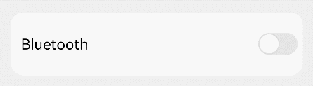
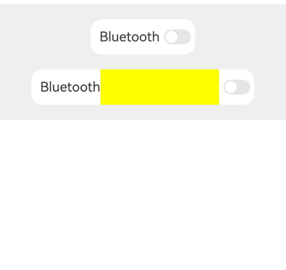

# Blank

The Blank component is a space-filling component that automatically occupies the remaining space along the main axis of its container. It only takes effect when the parent component is a [Row](./cj-row-column-stack-row.md), [Column](./cj-row-column-stack-column.md), or [Flex](./cj-row-column-stack-flex.md).

## Import Module

```cangjie
import kit.ArkUI.*
```

## Child Components

None

## Creating the Component

### init(?Length)

```cangjie
public init(min!: ?Length = None)
```

**Function:** Creates a Blank component.

> **Notes:**
>
> - When the Blank component's parent container ([Row](./cj-row-column-stack-row.md), [Column](./cj-row-column-stack-column.md), or [Flex](./cj-row-column-stack-flex.md)) does not specify a size along the main axis, the Blank component will automatically stretch or compress. If a size is specified or the container adapts to the size of its child nodes, the Blank component will not stretch or compress.
> - When setting the size along the main axis (size) and min for the Blank component, the constraint relationship is `max(min, size)`.
> - If a size is specified for the Blank component along the cross axis of the parent container, it will not fill the parent container's cross axis. If no size is specified, the default value of `alignSelf` is `ItemAlign.Stretch`, which will fill the container's cross axis.

**System Capability:** SystemCapability.ArkUI.ArkUI.Full

**Since:** 22

**Parameters:**

| Parameter | Type | Required | Default | Description |
|:---|:---|:---|:---|:---|
| min | ?[Length](./cj-common-types.md#interface-length) | No | None | **Named parameter.** The minimum size of the Blank component along the main axis of the container. If no pixel unit is specified, the default unit is `vp`. Percentage values are not supported. Negative values will use the initial value. If the minimum value exceeds the available space in the container, the minimum value will be used as the component's size, causing it to overflow the container. Initial value: `0.vp` |

## Common Attributes/Common Events

Common Attributes: All supported.

Common Events: All supported.

## Component Attributes

### func color(?ResourceColor)

```cangjie
public func color(value: ?ResourceColor): This
```

**Function:** Sets the fill color of the Blank component.

**System Capability:** SystemCapability.ArkUI.ArkUI.Full

**Since:** 22

**Parameters:**

| Parameter | Type | Required | Default | Description |
|:---|:---|:---|:---|:---|
| value | ?[ResourceColor](./cj-common-types.md#interface-resourcecolor) | Yes | - | The fill color of the Blank component.<br>Initial value: `Color.Transparent`. |

## Example Code

### Example 1 (Filling Remaining Space)

Demonstrates the effect of the Blank component filling the remaining space in both portrait and landscape orientations.

<!-- run -->

```cangjie
package ohos_app_cangjie_entry

import kit.ArkUI.*
import ohos.arkui.state_macro_manage.*

@Entry
@Component
class EntryView {
    func build() {
        Column() {
            Row() {
                Text("Bluetooth").fontSize(18)
                Blank()
                Toggle(ToggleType.Switch).margin(top: 14, bottom: 14, left: 6, right: 6)
            }.width(100.percent).backgroundColor(0xFFFFFF).borderRadius(15).padding( left: 12 )
        }.backgroundColor(0xEFEFEF).padding(20)
    }
}
```



### Example 2 (Filling Fixed Width)

Demonstrates the effect of the `min` parameter when the parent component of the Blank component does not specify a width.

<!-- run -->

```cangjie
package ohos_app_cangjie_entry

import kit.ArkUI.*
import ohos.arkui.state_macro_manage.*

@Entry
@Component
class EntryView {
    func build() {
        Column(space: 20) {
            Row() {
                Text("Bluetooth").fontSize(18)
                Blank().color(0xFFFF00)
                Toggle(ToggleType.Switch).margin(top: 14, bottom: 14, left: 6, right: 6)
            }.backgroundColor(0xFFFFFF).borderRadius(15).padding(left: 12)

            Row() {
                Text("Bluetooth").fontSize(18)
                Blank(min: 160.vp).color(0xFFFF00)
                Toggle(ToggleType.Switch).margin(top: 14, bottom: 14, left: 6, right: 6)
            }.backgroundColor(0xFFFFFF).borderRadius(15).padding(left: 12)
        }.backgroundColor(0xEFEFEF).padding(20).width(100.percent)
    }
}
```

