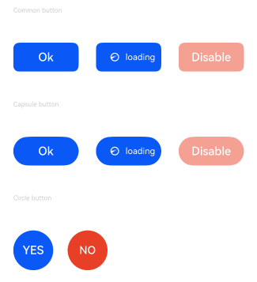
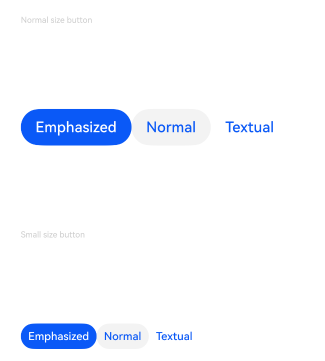

# Button

A button component that allows for quick creation of buttons with different styles.

## Subcomponents

Can contain a single subcomponent.

## Creating the Component

### init()

```cangjie
public init()
```

**Function:** Creates a button.

**System Capability:** SystemCapability.ArkUI.ArkUI.Full

**Initial Version:** 21

### init(() -> Unit)

```cangjie
public init(child: () -> Unit)
```

**Function:** Creates a button containing subcomponents.

**System Capability:** SystemCapability.ArkUI.ArkUI.Full

**Initial Version:** 21

**Parameters:**

| Parameter | Type | Required | Default | Description |
|:---|:---|:---|:---|:---|
| child | ()->Unit | Yes | - | Subcomponents contained within the button. |

### init(ResourceStr)

```cangjie
public init(label: ResourceStr)
```

**Function:** Creates a corresponding button component with text content. In this case, the Button cannot contain subcomponents.  
Text content is displayed in a single line by default.

**System Capability:** SystemCapability.ArkUI.ArkUI.Full

**Initial Version:** 21

**Parameters:**

| Parameter | Type | Required | Default | Description |
|:---|:---|:---|:---|:---|
| label | [ResourceStr](../BasicServicesKit/cj-apis-base.md#interface-resourcestr) | Yes | - | The text content of the button. When the length of the text exceeds the width of the button itself, the text will be truncated. |

### init(ButtonOptions)

```cangjie
public init(options: ButtonOptions)
```

**Function:** Creates a corresponding button component with text content. In this case, the Button cannot contain subcomponents.

**System Capability:** SystemCapability.ArkUI.ArkUI.Full

**Initial Version:** 21

**Parameters:**

| Parameter | Type | Required | Default | Description |
|:---|:---|:---|:---|:---|
| options | [ButtonOptions](#class-buttonoptions) | Yes | - | Configures the display style of the button. |

### init(ButtonOptions, () -> Unit)

```cangjie
public init(options: ButtonOptions, child: () -> Unit)
```

**Function:** Creates a button that can contain subcomponents and has a display style.

**System Capability:** SystemCapability.ArkUI.ArkUI.Full

**Initial Version:** 21

**Parameters:**

| Parameter | Type | Required | Default | Description |
|:---|:---|:---|:---|:---|
| options | [ButtonOptions](#class-buttonoptions) | Yes | - | Configures the display style of the button. |
| child | ()->Unit | Yes | - | Subcomponents contained within the button. |

### init(ResourceStr, ButtonOptions)

```cangjie
public init(label: ResourceStr, options: ButtonOptions)
```

**Function:** Creates a corresponding button component with text content. In this case, the Button cannot contain subcomponents.  
Text content is displayed in a single line by default.

**System Capability:** SystemCapability.ArkUI.ArkUI.Full

**Initial Version:** 21

**Parameters:**

| Parameter | Type | Required | Default | Description |
|:---|:---|:---|:---|:---|
| label | [ResourceStr](../BasicServicesKit/cj-apis-base.md#interface-resourcestr) | Yes | - | Sets the text content. <br>**Note:** <br>When the length of the text exceeds the width of the button itself, the text will be truncated. |
| options | [ButtonOptions](#class-buttonoptions) | Yes | - | Configures the display style of the button. |

## Common Attributes/Common Events

Common Attributes: All supported.

Common Events: All supported.

## Component Attributes

### func buttonStyle(ButtonStyleMode)

```cangjie
public func buttonStyle(value: ButtonStyleMode): This
```

**Function:** Sets the style and importance level of the Button component.

**System Capability:** SystemCapability.ArkUI.ArkUI.Full

**Initial Version:** 21

**Parameters:**

| Parameter | Type | Required | Default | Description |
|:---|:---|:---|:---|:---|
| value | [ButtonStyleMode](#enum-buttonstylemode) | Yes | - | The style and importance level of the Button component. <br>Initial value: ButtonStyleMode.EMPHASIZED. |

### func fontColor(ResourceColor)

```cangjie
public func fontColor(color: ResourceColor): This
```

**Function:** Sets the text color of the dropdown button itself based on the specified Color.

**System Capability:** SystemCapability.ArkUI.ArkUI.Full

**Initial Version:** 21

**Parameters:**

| Parameter | Type | Required | Default | Description |
|:---|:---|:---|:---|:---|
| color | [ResourceColor](../BasicServicesKit/cj-apis-base.md#interface-resourcecolor) | Yes | - | The text color of the button. |

### func fontFamily(ResourceStr)

```cangjie
public func fontFamily(value: ResourceStr): This
```

**Function:** Sets the font list.

**System Capability:** SystemCapability.ArkUI.ArkUI.Full

**Initial Version:** 21

**Parameters:**

| Parameter | Type | Required | Default | Description |
|:---|:---|:---|:---|:---|
| value | [ResourceStr](../BasicServicesKit/cj-apis-base.md#interface-resourcestr) | Yes | - | The text content of the button. |

### func fontSize(Length)

```cangjie
public func fontSize(value: Length): This
```

**Function:** Sets the font size.

**System Capability:** SystemCapability.ArkUI.ArkUI.Full

**Initial Version:** 21

**Parameters:**

| Parameter | Type | Required | Default | Description |
|:---|:---|:---|:---|:---|
| value | [Length](../BasicServicesKit/cj-apis-base.md#interface-length) | Yes | - | The text size of the button. |

### func fontStyle(FontStyle)

```cangjie
public func fontStyle(value: FontStyle): This
```

**Function:** Sets the font style.

**System Capability:** SystemCapability.ArkUI.ArkUI.Full

**Initial Version:** 21

**Parameters:**

| Parameter | Type | Required | Default | Description |
|:---|:---|:---|:---|:---|
| value | [FontStyle](./cj-common-types.md#enum-fontstyle) | Yes | - | The text style of the button. |

### func fontWeight(FontWeight)

```cangjie
public func fontWeight(value: FontWeight): This
```

**Function:** Sets the font weight of the text. Setting it too large may result in truncation with different fonts.

**System Capability:** SystemCapability.ArkUI.ArkUI.Full

**Initial Version:** 21

**Parameters:**

| Parameter | Type | Required | Default | Description |
|:---|:---|:---|:---|:---|
| value | [FontWeight](./cj-common-types.md#enum-fontweight) | Yes | - | The font weight of the button text. |

### func shape(ButtonType)

```cangjie
public func shape(value: ButtonType): This
```

**Function:** Sets the shape of the Button component.

**System Capability:** SystemCapability.ArkUI.ArkUI.Full

**Initial Version:** 21

**Parameters:**

| Parameter | Type | Required | Default | Description |
|:---|:---|:---|:---|:---|
| value | [ButtonType](#enum-buttontype) | Yes | - | The shape type of the button. |

### func stateEffect(Bool)

```cangjie
public func stateEffect(value: Bool): This
```

**Function:** Sets whether to enable the pressed state display effect.

**System Capability:** SystemCapability.ArkUI.ArkUI.Full

**Initial Version:** 21

**Parameters:**

| Parameter | Type | Required | Default | Description |
|:---|:---|:---|:---|:---|
| value | Bool | Yes | - | Whether to enable the pressed state display effect when the button is pressed. When set to false, the pressed effect is disabled. <br/>Initial value: true |

## Basic Type Definitions

### class ButtonOptions

```cangjie
public class ButtonOptions {
    public var shape: ButtonType
    public var stateEffect: Bool
    public var buttonStyle: ButtonStyleMode
    public var controlSize: ControlSize
    public var role: ButtonRole

    public init(
        shape!: ButtonType = ButtonType.Capsule,
        stateEffect!: Bool = true,
        buttonStyle!: ButtonStyleMode = ButtonStyleMode.Emphasized,
        controlSize!: ControlSize = ControlSize.Normal,
        role!: ButtonRole = ButtonRole.Normal
    )
}
```

**Function:** Configures the display style of the button.

**System Capability:** SystemCapability.ArkUI.ArkUI.Full

**Initial Version:** 21

#### var buttonStyle

```cangjie
public var buttonStyle: ButtonStyleMode
```

**Function:** Describes the style and importance level of the button.

**Type:** [ButtonStyleMode](#enum-buttonstylemode)

**Read-Write Capability:** Read-Write

**System Capability:** SystemCapability.ArkUI.ArkUI.Full

**Initial Version:** 21

#### var controlSize

```cangjie
public var controlSize: ControlSize
```

**Function:** Describes the size of the button.

**Type:** [ControlSize](./cj-common-types.md#enum-controlsize)

**Read-Write Capability:** Read-Write

**System Capability:** SystemCapability.ArkUI.ArkUI.Full

**Initial Version:** 21

#### var role

```cangjie
public var role: ButtonRole
```

**Function:** Describes the role of the button.

**Type:** [ButtonRole](#enum-buttonrole)

**Read-Write Capability:** Read-Write

**System Capability:** SystemCapability.ArkUI.ArkUI.Full

**Initial Version:** 21

#### var shape

```cangjie
public var shape: ButtonType
```

**Function:** Describes the shape of the button.

**Type:** [ButtonType](#enum-buttontype)

**Read-Write Capability:** Read-Write

**System Capability:** SystemCapability.ArkUI.ArkUI.Full

**Initial Version:** 21

#### var stateEffect

```cangjie
public var stateEffect: Bool
```

**Function:** Whether to enable the pressed state display effect when the button is pressed.

**Type:** Bool

**Read-Write Capability:** Read-Write

**System Capability:** SystemCapability.ArkUI.ArkUI.Full

**Initial Version:** 21

#### init(ButtonType, Bool, ButtonStyleMode, ControlSize, ButtonRole)

```cangjie
public init(
    shape!: ButtonType = ButtonType.Capsule,
    stateEffect!: Bool = true,
    buttonStyle!: ButtonStyleMode = ButtonStyleMode.Emphasized,
    controlSize!: ControlSize = ControlSize.Normal,
    role!: ButtonRole = ButtonRole.Normal
)
```

**Function:** Creates an object of type ButtonOptions.

**System Capability:** SystemCapability.ArkUI.ArkUI.Full

**Initial Version:** 21

**Parameters:**

| Parameter | Type | Required | Default | Description |
|:---|:---|:---|:---|:---|
| shape | [ButtonType](#enum-buttontype) | No | ButtonType.Capsule | **Named parameter.** The shape of the button. |
| stateEffect | Bool | No | true | **Named parameter.** Whether to enable the pressed state display effect when the button is pressed. When set to false, the pressed effect is disabled. <br>**Note:** <br>When the pressed state display effect is enabled, developers setting the state style will perform color overlay based on the background color set after the state style is completed. |
| buttonStyle | [ButtonStyleMode](#enum-buttonstylemode) | No | ButtonStyleMode.Emphasized | **Named parameter.** Describes the style and importance level of the button. <br/>**Note:** <br/>Button importance levels: Emphasized button > Normal button > Textual button. |
| controlSize | [ControlSize](./cj-common-types.md#enum-controlsize) | No | ControlSize.Normal | **Named parameter.** Describes the size of the button. |
| role | [ButtonRole](#enum-buttonrole) | No | ButtonRole.Normal | **Named parameter.** Describes the role of the button. |

### enum ButtonRole

```cangjie
public enum ButtonRole {
    | Normal
    | Error
}
```

**Function:** The role of the button.

**System Capability:** SystemCapability.ArkUI.ArkUI.Full

**Initial Version:** 21

#### Error

```cangjie
Error
```

**Function:** Warning button.

**System Capability:** SystemCapability.ArkUI.ArkUI.Full

**Initial Version:** 21

#### Normal

```cangjie
Normal
```

**Function:** Normal button.

**System Capability:** SystemCapability.ArkUI.ArkUI.Full

**Initial Version:** 21

### enum ButtonStyleMode

```cangjie
public enum ButtonStyleMode {
    | Normal
    | Emphasized
    | Textual
}
```

**Function:** The importance level of the button.

**System Capability:** SystemCapability.ArkUI.ArkUI.Full

**Initial Version:** 21

#### Emphasized

```cangjie
Emphasized
```

**Function:** Emphasized button (used to highlight the current operation).

**System Capability:** SystemCapability.ArkUI.ArkUI.Full

**Initial Version:** 21

#### Normal

```cangjie
Normal
```

**Function:** Normal button (for general interface operations).

**System Capability:** SystemCapability.ArkUI.ArkUI.Full

**Initial Version:** 21

#### Textual

```cangjie
Textual
```

**Function:** Textual button (plain text, no background color).

**System Capability:** SystemCapability.ArkUI.ArkUI.Full

**Initial Version:** 21

### enum ButtonType

```cangjie
public enum ButtonType {
    | Normal
    | Capsule
    | Circle
    | RoundRectangle
}
```

**Function:** The shape type of the button.

**System Capability:** SystemCapability.ArkUI.ArkUI.Full

**Initial Version:** 21

#### Capsule

```cangjie
Capsule
```

**Function:** Capsule-shaped button (rounded corners default to half the height).

**System Capability:** SystemCapability.ArkUI.ArkUI.Full

**Initial Version:** 21

#### Circle

```cangjie
Circle
```

**Function:** Circular button.

**System Capability:** SystemCapability.ArkUI.ArkUI.Full

**Initial Version:** 21

#### Normal

```cangjie
Normal
```

**Function:** Normal button (default without rounded corners).

**System Capability:** SystemCapability.ArkUI.ArkUI.Full

**Initial Version:** 21

#### RoundRectangle

```cangjie
RoundRectangle
```

**Function:** Rounded rectangle button.

**System Capability:** SystemCapability.ArkUI.ArkUI.Full

**Initial Version:** 21## Sample Code

### Example 1 (Setting Button Display Styles)

This example demonstrates two methods for creating buttons: using child components or text content to create corresponding buttons.

<!-- run -->

```cangjie

package ohos_app_cangjie_entry
import kit.ArkUI.*
import ohos.arkui.state_macro_manage.*
import kit.PerformanceAnalysisKit.Hilog

func loggerInfo(str: String) {
    Hilog.info(0, "CangjieTest", str)
}

@Entry
@Component
class EntryView {
    func build() {
        Flex(direction: FlexDirection.Column, alignItems: ItemAlign.Start, justifyContent: FlexAlign.SpaceBetween) {
            Text("Common button").fontSize(9).fontColor(0xCCCCCC)

            Flex(alignItems: ItemAlign.Center, justifyContent: FlexAlign.SpaceBetween) {
                Button("Ok").shape(ButtonType.Normal).stateEffect(true).borderRadius(8)
                    .width(90)
                Button(ButtonOptions()) {
                    Row() {
                        LoadingProgress().width(20).height(20).color(Color.White)
                        Text("loading").fontSize(12).fontColor(0xffffff).margin(left: 5, right: 12)
                    }.alignItems(VerticalAlign.Center).width(90).height(40)
                }.shape(ButtonType.Normal).stateEffect(true).borderRadius(8).width(90)
                Button("Disable").shape(ButtonType.Normal).stateEffect(true).opacity(0.5)
                    .borderRadius(8).width(90)
                }

            Text("Capsule button").fontSize(9).fontColor(0xCCCCCC)

            Flex(alignItems: ItemAlign.Center, justifyContent: FlexAlign.SpaceBetween) {
                Button("Ok").shape(ButtonType.Capsule).stateEffect(true).borderRadius(8)
                    .width(90)
                Button(ButtonOptions()) {
                    Row() {
                        LoadingProgress().width(20).height(20).color(Color.White)
                        Text("loading").fontSize(12).fontColor(0xffffff).margin(left: 5, right: 12)
                    }.alignItems(VerticalAlign.Center).width(90).height(40)
                }.shape(ButtonType.Capsule).stateEffect(true).borderRadius(8).width(90)
                .onClick { evt =>
                    loggerInfo("The login is successful")
                }
                Button("Disable").shape(ButtonType.Capsule).stateEffect(true).opacity(0.5)
                    .borderRadius(8).width(90)
            }

            Text("Circle button").fontSize(9).fontColor(0xCCCCCC)

            Flex(alignItems: ItemAlign.Center, wrap: FlexWrap.Wrap) {
                Button("YES").shape(ButtonType.Circle).stateEffect(true).width(55)
                    .height(55)
                Button("NO").shape(ButtonType.Capsule).stateEffect(true).width(55)
                    .height(55).margin(left: 20).fontSize(15)
                }
        }.height(400).padding(left: 35, right: 35, top: 35)
    }
}
```



### Example 2 (Adding Rendering Control to Buttons)

This example controls button display text using if/else statements.

<!-- run -->

```cangjie

package ohos_app_cangjie_entry
import kit.ArkUI.*
import ohos.arkui.state_macro_manage.*

@Entry
@Component
class EntryView {
    @State var count: UInt32 = 0
    func build() {
        Column() {
            Text('${this.count}')
                .fontSize(30)
                .onClick{ evt =>
                    this.count ++
                }
          if (this.count <= 0) {
            Button('count is negative').fontSize(30).height(50)
          } else if (this.count % 2 == 0) {
            Button('count is even').fontSize(30).height(50)
          } else {
            Button('count is odd').fontSize(30).height(50)
          }
        }.height(100.percent).width(100.percent).justifyContent(FlexAlign.Center)
    }
}
```


### Example 3 (Setting Importance Levels for Different Button Sizes)

This example configures controlSize and buttonStyle to achieve different importance levels for various button sizes.

<!-- run -->

```cangjie

package ohos_app_cangjie_entry
import kit.ArkUI.*
import ohos.arkui.state_macro_manage.*

@Entry
@Component
class EntryView {
    @State var txt: String = 'overflowTextOverlengthTextOverflow.Clip'
    func build() {
        Flex(direction: FlexDirection.Column, alignItems: ItemAlign.Start, justifyContent: FlexAlign.SpaceBetween) {
            Text('Normal size button').fontSize(9).fontColor(0xCCCCCC)
            Flex(alignItems: ItemAlign.Center, wrap: FlexWrap.Wrap) {
                Button('Emphasized').buttonStyle(ButtonStyleMode.Emphasized)
                Button('Normal').buttonStyle(ButtonStyleMode.Normal)
                Button('Textual').buttonStyle(ButtonStyleMode.Textual)
            }

            Text('Small size button').fontSize(9).fontColor(0xCCCCCC)
            Flex(alignItems: ItemAlign.Center, wrap: FlexWrap.Wrap) {
                Button('Emphasized', ButtonOptions(controlSize: ControlSize.Small)).buttonStyle(ButtonStyleMode.Emphasized)
                Button('Normal', ButtonOptions(controlSize: ControlSize.Small)).buttonStyle(ButtonStyleMode.Normal)
                Button('Textual', ButtonOptions(controlSize: ControlSize.Small)).buttonStyle(ButtonStyleMode.Textual)
            }
        }.height(400).padding(left: 35, right: 35, top: 35)
    }
}
```



### Example 4 (Setting Button Roles)

This example configures the role property to define button roles.

<!-- run -->

```cangjie

package ohos_app_cangjie_entry
import kit.ArkUI.*
import ohos.arkui.state_macro_manage.*

@Entry
@Component
class EntryView {
    @State var txt: String = 'overflowTextOverlengthTextOverflow.Clip'
    func build() {
        Flex(direction: FlexDirection.Column, alignItems: ItemAlign.Start, justifyContent: FlexAlign.SpaceBetween) {
            Text('Role is Normal button').fontSize(9).fontColor(0xCCCCCC)
            Flex(alignItems: ItemAlign.Center, wrap: FlexWrap.Wrap) {
                Button('Emphasized', ButtonOptions(role: ButtonRole.Normal)).buttonStyle(ButtonStyleMode.Emphasized)
                Button('Normal', ButtonOptions(role: ButtonRole.Normal)).buttonStyle(ButtonStyleMode.Normal)
                Button('Textual', ButtonOptions(role: ButtonRole.Normal)).buttonStyle(ButtonStyleMode.Textual);
            }

            Text('Role is Error button').fontSize(9).fontColor(0xCCCCCC)
            Flex(alignItems: ItemAlign.Center, wrap: FlexWrap.Wrap) {
                Button('Emphasized', ButtonOptions(role: ButtonRole.Error)).buttonStyle(ButtonStyleMode.Emphasized)
                Button('Normal', ButtonOptions(role: ButtonRole.Error)).buttonStyle(ButtonStyleMode.Normal)
                Button('Textual', ButtonOptions(role: ButtonRole.Error)).buttonStyle(ButtonStyleMode.Textual);
            }
        }.height(400).padding(left: 35, right: 35, top: 35)
    }
}
```

