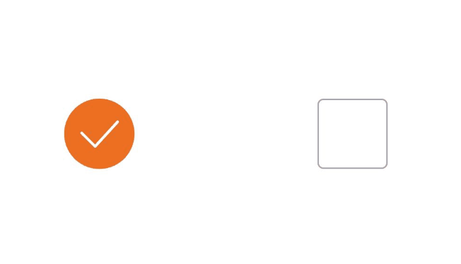
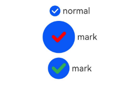
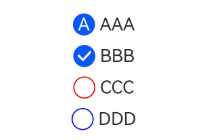

# Checkbox

A checkbox component, typically used for toggling an option on or off.

## Subcomponents

None

## Creating the Component

### init(String, String, ?CustomBuilder)

```cangjie
public init(name!: String = "", group!: String = "", indicatorBuilder!: ?CustomBuilder = None)
```

**Function:** Creates a checkbox component.

**System Capability:** SystemCapability.ArkUI.ArkUI.Full

**Since:** 21

**Parameters:**

| Parameter Name | Type | Required | Default Value | Description |
|:---|:---|:---|:---|:---|
| name | String | No | "" | **Named parameter.** The name of the checkbox. |
| group | String | No | "" | **Named parameter.** Specifies the name of the group to which the checkbox belongs (i.e., the name of the [CheckboxGroup](./cj-button-picker-checkboxgroup.md#checkboxgroup)).<br/>**Note:**<br/>This parameter is irrelevant when not used with the [CheckboxGroup](./cj-button-picker-checkboxgroup.md#checkboxgroup) component. |
| indicatorBuilder | ?[CustomBuilder](./cj-common-types.md#type-custombuilder) | No | None | **Named parameter.** Configures the selected style of the checkbox as a custom UI description. The custom UI description is center-aligned with the Checkbox component. When set to None, it defaults to the unset state of indicatorBuilder. Use in conjunction with [@Builder](../../../en/application-dev/arkui-cj/paradigm/cj-macro-builder.md) and the bind method. |

## Common Attributes/Common Events

Common Attributes: All supported.

Common Events: All supported.

## Component Attributes

### func select(Bool)

```cangjie
public func select(value: Bool): This
```

**Function:** Sets whether the checkbox is selected.

**System Capability:** SystemCapability.ArkUI.ArkUI.Full

**Since:** 21

**Parameters:**

| Parameter Name | Type | Required | Default Value | Description |
|:---|:---|:---|:---|:---|
| value | Bool | Yes | - | Whether the checkbox is selected.<br>Initial value: false<br>When true, the checkbox is selected. When false, it is not selected. |

### func selectedColor(ResourceColor)

```cangjie
public func selectedColor(value: ResourceColor): This
```

**Function:** Sets the color of the checkbox in the selected state.

**System Capability:** SystemCapability.ArkUI.ArkUI.Full

**Since:** 21

**Parameters:**

| Parameter Name | Type | Required | Default Value | Description |
|:---|:---|:---|:---|:---|
| value | [ResourceColor](./../BasicServicesKit/cj-apis-base.md#interface-resourcecolor) | Yes | - | The color of the checkbox in the selected state.<br>Initial value:<br>@r(sys.color.ohos_id_color_text_primary_activated).<br>Invalid values are treated as the default value. |

### func shape(CheckBoxShape)

```cangjie
public func shape(value: CheckBoxShape): This
```

**Function:** Sets the shape of the CheckBox component, including circular and rounded square.

**System Capability:** SystemCapability.ArkUI.ArkUI.Full

**Since:** 21

**Parameters:**

| Parameter Name | Type | Required | Default Value | Description |
|:---|:---|:---|:---|:---|
| value | [CheckBoxShape](./cj-common-types.md#enum-checkboxshape) | Yes | - | Toggles the shape of the CheckBox component between circular and rounded square.<br>Initial value:<br>CheckBoxShape.Circle. |

## Component Events

### func onChange(OnCheckboxChangeCallback)

```cangjie
public func onChange(callback: OnCheckboxChangeCallback): This
```

**Function:** Triggers this event when the selected state changes.

**System Capability:** SystemCapability.ArkUI.ArkUI.Full

**Since:** 21

**Parameters:**

| Parameter Name | Type | Required | Default Value | Description |
|:---|:---|:---|:---|:---|
| callback | [OnCheckboxChangeCallback](#type-oncheckboxchangecallback) | Yes | - | The callback triggered when the selected state changes.<br>\- When the Bool value is true, it indicates selected.<br>\- When the Bool value is false, it indicates not selected. |

## Basic Type Definitions

### type OnCheckboxChangeCallback

```cangjie
public type OnCheckboxChangeCallback = (Bool) -> Unit
```

**Function:** Type alias for (Bool) -> Unit.

**System Capability:** SystemCapability.ArkUI.ArkUI.Full

**Since:** 21

## Example Code

### Example 1 (Setting Checkbox Shape)

This example demonstrates circular and rounded square checkbox styles by configuring CheckBoxShape.

<!-- run -->

```cangjie

package ohos_app_cangjie_entry
import kit.ArkUI.*
import ohos.arkui.state_macro_manage.*
import kit.PerformanceAnalysisKit.Hilog

func loggerInfo(str: String) {
    Hilog.info(0, "CangjieTest", str)
}

@Entry
@Component
class EntryView {
    func build(){
        Flex(justifyContent: FlexAlign.SpaceAround, alignItems: ItemAlign.Center){
            Checkbox(name: "checkbox1", group: "checkboxGroup")
            .select(true)
            .selectedColor(0xed6f21)
            .shape(CheckBoxShape.Circle)
            .onChange({value: Bool =>
                loggerInfo("Checkbox1 change is" + value.toString())
            })
            .size(width: 50.vp, height: 50.vp)
            Checkbox(name: "checkbox2", group: "checkboxGroup")
            .select(false)
            .selectedColor(0x39a2db)
            .shape(CheckBoxShape.RoundedSquare)
            .onChange({value: Bool =>
                loggerInfo("Checkbox2 change is" + value.toString())
            })
            .width(50.vp)
            .height(50.vp)
        }
        .height(400.vp)
    }
}
```



### Example 2 (Custom Checkbox Style)

This example implements the functionality of custom checkbox styles.

<!-- run -->

```cangjie
package ohos_app_cangjie_entry
import kit.ArkUI.*
import ohos.arkui.state_macro_manage.*

@Entry
@Component
class EntryView {
    func build() {
        Column() {
            Row() {
                Checkbox(name: "checkbox")
                Text("normal")
            }
            Row() {
                Checkbox(name: "mark")
                    .selectedColor(Color.Red)
                    .width(60.vp)
                    .height(60.vp)
                Text("mark")
            }
            Row() {
                Checkbox(name: "mark")
                    .selectedColor(Color.Green)
                    .width(40.vp)
                    .height(40.vp)
                Text("mark")
            }
        }.width(100.percent)
    }
}
```



### Example 3 (Setting Text Checkbox Style)

This example demonstrates a selected style as Text by configuring indicatorBuilder.

<!-- run -->

```cangjie
package ohos_app_cangjie_entry
import kit.ArkUI.*
import ohos.arkui.state_macro_manage.*

@Entry
@Component
class EntryView {
    @Builder
    func indicatorA() {
        Column() {
            Text("A").fontColor(Color.White)
        }
    }
    func build() {
        Column() {
            Row() {
                Checkbox(name: "AAA", indicatorBuilder: bind(indicatorA, this))
                Text("AAA")
            }
            Row() {
                Checkbox(name: "BBB")
                Text("BBB")
            }
            Row() {
                Checkbox(name: "CCC").selectedColor(Color.Red)
                Text("CCC")
            }
            Row() {
                Checkbox(name: "DDD").selectedColor(Color.Blue)
                Text("DDD")
            }
        }.width(100.percent)
    }
}
```

