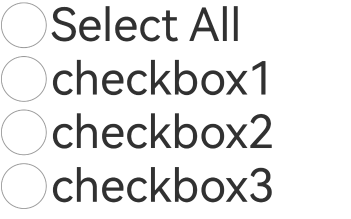

# CheckboxGroup

A checkbox group component used to control the select-all or deselect-all state of checkboxes.

## Import Module

```cangjie
import kit.UIkit.*
```

## Child Components

None

## Creating the Component

### init(String)

```cangjie
public init(group!: String = "")
```

**Function:** Creates a checkbox group that can control the select-all or deselect-all state of checkboxes within the group. Checkboxes and CheckboxGroups with the same group value belong to the same group.

When used with cached components (e.g., List), the selected state of uncreated checkboxes needs to be manually controlled by the application.

**System Capability:** SystemCapability.ArkUI.ArkUI.Full

**Since:** 21

**Parameters:**

| Parameter | Type | Required | Default | Description |
|:---|:---|:---|:---|:---|
| group | String | No | "" | **Named parameter.** The group name of the checkboxes.<br/>**Note:**<br/>Among multiple CheckboxGroups with the same group name, only the first CheckboxGroup takes effect. |

## Universal Attributes/Events

Universal Attributes: All supported.

Universal Events: All supported.

## Component Attributes

### func selectAll(Bool)

```cangjie
public func selectAll(value: Bool): This
```

**Function:** Sets whether to select all. If the [Checkbox](./cj-button-picker-checkbox.md#checkbox) in the same group explicitly sets the select attribute, the Checkbox has higher priority.

**System Capability:** SystemCapability.ArkUI.ArkUI.Full

**Since:** 21

**Parameters:**

| Parameter | Type | Required | Default | Description |
|:---|:---|:---|:---|:---|
| value | Bool | Yes | - | Whether to select all.<br>Initial value: false.<br>When true, all checkboxes in the group are selected. When false, none are selected. |

### func selectedColor(ResourceColor)

```cangjie
public func selectedColor(value: ResourceColor): This
```

**Function:** Sets the color for the selected or partially selected state.

**System Capability:** SystemCapability.ArkUI.ArkUI.Full

**Since:** 21

**Parameters:**

| Parameter | Type | Required | Default | Description |
|:---|:---|:---|:---|:---|
| value | [ResourceColor](../BasicServicesKit/cj-apis-base.md#interface-resourcecolor) | Yes | - | The color for the selected or partially selected state.<br/>Initial value:<br/>@r(sys.color.ohos_id_color_text_primary_activated).<br/>Invalid values are handled as the default. |

## Component Events

### func onChange(OnCheckboxGroupChangeCallback)

```cangjie
public func onChange(callback: OnCheckboxGroupChangeCallback): This
```

**Function:** Triggers a callback when the selected state of the CheckboxGroup or the checkboxes within the group changes.

**System Capability:** SystemCapability.ArkUI.ArkUI.Full

**Since:** 21

**Parameters:**

| Parameter | Type | Required | Default | Description |
|:---|:---|:---|:---|:---|
| callback | OnCheckboxGroupChangeCallback | Yes | - | Information about the checkbox group. |

## Basic Type Definitions

### class CheckboxGroupResult

```cangjie
public class CheckboxGroupResult {
    public var status: SelectStatus
    public var name: Array<String>
    public init(
        status: SelectStatus,
        name: Array<String>
    )
}
```

**Function:** Information about the selected state of a checkbox group.

**System Capability:** SystemCapability.ArkUI.ArkUI.Full

**Since:** 21

#### var name

```cangjie
public var name: Array<String>
```

**Function:** Names of all selected checkboxes in the group.

**Type:** Array\<String>

**Read/Write:** Read-Write

**System Capability:** SystemCapability.ArkUI.ArkUI.Full

**Since:** 21

#### var status

```cangjie
public var status: SelectStatus
```

**Function:** Selection status.

**Type:** [SelectStatus](#enum-selectstatus)

**Read/Write:** Read-Write

**System Capability:** SystemCapability.ArkUI.ArkUI.Full

**Since:** 21

#### init(SelectStatus, Array\<String>)

```cangjie
public init(
    status: SelectStatus,
    name: Array<String>
)
```

**Function:** Constructs information about the selected state of a checkbox group.

**System Capability:** SystemCapability.ArkUI.ArkUI.Full

**Since:** 21

**Parameters:**

| Parameter | Type | Required | Default | Description |
|:---|:---|:---|:---|:---|
| status | [SelectStatus](#enum-selectstatus) | Yes | - | Selection status. |
| name | Array\<String> | Yes | - | Names of all selected checkboxes in the group. |

### enum SelectStatus

```cangjie
public enum SelectStatus <: Equatable<SelectStatus> {
    | All
    | Part
    | None
    | ...
}
```

**Function:** Types of checkbox selection states.

**System Capability:** SystemCapability.ArkUI.ArkUI.Full

**Since:** 21

**Parent Type:**

- Equatable\<SelectStatus>

#### All

```cangjie
All
```

**Function:** All checkboxes in the group are selected.

**System Capability:** SystemCapability.ArkUI.ArkUI.Full

**Since:** 21

#### None

```cangjie
None
```

**Function:** No checkboxes in the group are selected.

**System Capability:** SystemCapability.ArkUI.ArkUI.Full

**Since:** 21

#### Part

```cangjie
Part
```

**Function:** Some checkboxes in the group are selected.

**System Capability:** SystemCapability.ArkUI.ArkUI.Full

**Since:** 21

#### func !=(SelectStatus)

```cangjie
public operator func !=(other: SelectStatus): Bool
```

**Function:** Determines whether two enum values are not equal.

**Parameters:**

| Parameter | Type | Required | Default | Description |
|:---|:---|:---|:---|:---|
| other | [SelectStatus](#enum-selectstatus) | Yes | - | Another enum value. |

**Return Value:**

| Type | Description |
|:----|:----|
| Bool | Returns true if the enum values are not equal, otherwise false. |

#### func ==(SelectStatus)

```cangjie
public operator func ==(other: SelectStatus): Bool
```

**Function:** Determines whether two enum values are equal.

**Parameters:**

| Parameter | Type | Required | Default | Description |
|:---|:---|:---|:---|:---|
| other | [SelectStatus](#enum-selectstatus) | Yes | - | Another enum value. |

**Return Value:**

| Type | Description |
|:----|:----|
| Bool | Returns true if the enum values are equal, otherwise false. |

#### func getValue()

```cangjie
public func getValue(): Int32
```

**Function:** Gets the value of the enum.

**System Capability:** SystemCapability.ArkUI.ArkUI.Full

**Since:** 21

**Return Value:**

| Type | Description |
|:----|:----|
| Int32 | The value of the enum. |

## Example Code

### Example 1 (Setting Up a Checkbox Group)

This example controls the select-all or deselect-all state of checkboxes.

<!-- run -->

```cangjie

package ohos_app_cangjie_entry
import kit.ArkUI.*
import kit.PerformanceAnalysisKit.Hilog
import ohos.arkui.state_macro_manage.*
import std.collection.ArrayList

func loggerInfo(str: String) {
    Hilog.info(0, "CangjieTest", str)
}

func formatNames(names: Array<String>): String {
    var result = ""
    for(name in names) {
        result += name + ";"
    }
    result
}

@Entry
@Component
class EntryView {
    func build() {
        Column(){
            Flex(justifyContent: FlexAlign.Start, alignItems: ItemAlign.Center) {
                CheckboxGroup(group:"checkboxGroup")
                .size(width: 50.vp, height: 50.vp)
                .selectedColor(0xed6f21)
                .selectAll(false)
                .onChange { val =>
                    loggerInfo("checkboxGroup onChange names:" + formatNames(val.name))
                }

                Text("Select All").fontSize(50)
            }
            Flex(justifyContent: FlexAlign.Start, alignItems: ItemAlign.Center) {
                Checkbox(name: "checkbox1", group:"checkboxGroup")
                .size(width: 50.vp, height: 50.vp)

                Text("checkbox1").fontSize(50)
            }

            Flex(justifyContent: FlexAlign.Start, alignItems: ItemAlign.Center) {
                Checkbox(name: "checkbox2", group:"checkboxGroup")
                .size(width: 50.vp, height: 50.vp)

                Text("checkbox2").fontSize(50)
            }
        }
    }
}
```


### Example 2 (Custom Checkmark Style)

This example implements a custom checkmark style for the checkbox group by configuring the mark.

<!-- run -->

```cangjie

package ohos_app_cangjie_entry
import kit.ArkUI.*
import kit.PerformanceAnalysisKit.Hilog
import ohos.arkui.state_macro_manage.*
import std.collection.ArrayList

func loggerInfo(str: String) {
    Hilog.info(0, "CangjieTest", str)
}

func formatNames(names: Array<String>): String {
    var result = ""
    for(name in names) {
        result += name + ";"
    }
    result
}

@Entry
@Component
class EntryView {
    func build() {
        Column(){
            Flex(justifyContent: FlexAlign.Start, alignItems: ItemAlign.Center) {
                CheckboxGroup(group:"checkboxGroup1")
                .size(width: 50.vp, height: 50.vp)
                .selectedColor(0xed6f21)
                .selectAll(true)
                .onChange { val =>
                    loggerInfo("checkboxGroup1 onChange names:" + formatNames(val.name))
                }

                Text("Select All").fontSize(50)
            }
            Flex(justifyContent: FlexAlign.Start, alignItems: ItemAlign.Center) {
                Checkbox(name: "checkbox1", group:"checkboxGroup1")
                .size(width: 50.vp, height: 50.vp)

                Text("checkbox1").fontSize(50)```typescript
            }

            Flex(justifyContent: FlexAlign.Start, alignItems: ItemAlign.Center) {
                Checkbox(name: "checkbox2", group:"checkboxGroup1")
                .size(width: 50.vp, height: 50.vp)

                Text("checkbox2").fontSize(50)
            }

            Flex(justifyContent: FlexAlign.Start, alignItems: ItemAlign.Center) {
                Checkbox(name: "checkbox3", group:"checkboxGroup1")
                .size(width: 50.vp, height: 50.vp)

                Text("checkbox3").fontSize(50)
            }
        }
    }
}
```

