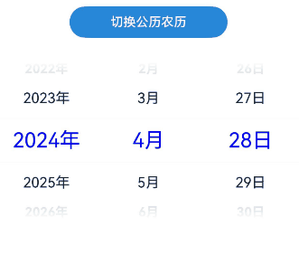

# DatePicker

<!--Del-->
> **Note:**
>
> Currently in the beta phase.
<!--DelEnd-->

A date picker component used to create a sliding date selector within a specified date range.

## Import Module

```cangjie
import kit.ArkUI.*
```

## Subcomponents

None

## Creating the Component

### init(?DateTime, ?DateTime, ?DateTime)

```cangjie
public init(
    start!: ?DateTime = None,
    end!: ?DateTime = None,
    selected!: ?DateTime = None
)
```

**Function:** Creates a sliding date picker that allows date selection within the specified DateTime range.

**System Capability:** SystemCapability.ArkUI.ArkUI.Full

**Initial Version:** 22

**Parameters:**

| Parameter | Type       | Required | Default Value                                                          | Description                    |
|:----------|:-----------|:---------|:----------------------------------------------------------------------|:-------------------------------|
| start     | ?[DateTime](../ImageKit/cj-apis-image.md#datetime) | No       | None | **Named parameter.** Specifies the start date of the picker.<br>Default: DateTime.of(year: 1970, month: Month.of(1), dayOfMonth: 1).|
| end       | ?[DateTime](../ImageKit/cj-apis-image.md#datetime) | No       | None | **Named parameter.** Specifies the end date of the picker.<br>Default: DateTime.of(year: 2100, month: Month.of(12), dayOfMonth: 31).|
| selected  | ?[DateTime](../ImageKit/cj-apis-image.md#datetime) | No       | None | **Named parameter.** Sets the selected date.<br>Default: DateTime.now().|

## Common Attributes/Events

Common Attributes: All supported.

Common Events: All supported.

## Component Attributes

### func disappearTextStyle(?PickerTextStyle)

```cangjie
public func disappearTextStyle(value: ?PickerTextStyle): This
```

**Function:** Sets the text style for transition items (the second item above or below the selected item).

**System Capability:** SystemCapability.ArkUI.ArkUI.Full

**Initial Version:** 22

**Parameters:**

| Parameter | Type | Required | Default Value | Description|
|:----------|:-----------------------------------------------------------------------|:---------|:--------------|:----------------------------------------------------------------------------------------------|
| value     | ?[PickerTextStyle](./cj-common-types.md#class-pickertextstyle)| Yes      | -             | Text color, font size, and font weight for transition items.<br>Default: {color: '#ff182431',font: {size: '14.fp', weight: FontWeight.Regular, family: 'HarmonyOS Sans', style: FontStyle.Normal}}.|

### func lunar(?Bool)

```cangjie
public func lunar(value: ?Bool): This
```

**Function:** Sets whether to display the lunar calendar in the popup.

**System Capability:** SystemCapability.ArkUI.ArkUI.Full

**Initial Version:** 22

**Parameters:**

| Parameter | Type   | Required | Default Value | Description                                                            |
|:----------|:-------|:---------|:--------------|:---------------------------------------------------------------------|
| value     | ?Bool  | Yes      | -             | Whether to display the lunar calendar.<br/> - true: Show lunar calendar.<br/> - false: Hide lunar calendar.<br>Default: false.|

### func selectedTextStyle(?PickerTextStyle)

```cangjie
public func selectedTextStyle(value: ?PickerTextStyle): This
```

**Function:** Sets the text style for the selected item.

**System Capability:** SystemCapability.ArkUI.ArkUI.Full

**Initial Version:** 22

**Parameters:**

| Parameter | Type                                                                      | Required | Default Value | Description                                                                                 |
|:----------|:-------------------------------------------------------------------------|:---------|:--------------|:------------------------------------------------------------------------------------------|
| value     | ?[PickerTextStyle](./cj-common-types.md#class-pickertextstyle) | Yes      | -             | Text style value.<br>Default: {color: '#ff007dff',font: {size: '20fp', weight: FontWeight.Medium, family: 'HarmonyOS Sans', style: FontStyle.Normal}}.|

### func textStyle(?PickerTextStyle)

```cangjie
public func textStyle(value: ?PickerTextStyle): This
```

**Function:** Sets the text style for general items (the first item above or below the selected item).

**System Capability:** SystemCapability.ArkUI.ArkUI.Full

**Initial Version:** 22

**Parameters:**

| Parameter | Type                                                                      | Required | Default Value | Description                                                                                             |
|:----------|:-------------------------------------------------------------------------|:---------|:--------------|:------------------------------------------------------------------------------------------------------|
| value     | ?[PickerTextStyle](./cj-common-types.md#class-pickertextstyle) | Yes      | -             | Text color, font size, and font weight for general items.<br>Default: {color: '#ff182431',font: {size: '16.fp', weight: FontWeight.Regular, family: 'HarmonyOS Sans', style: FontStyle.Normal}}.|

## Component Events

### func onDateChange(?Callback\<DateTime,Unit>)

```cangjie
public func onDateChange(callback: ?Callback<DateTime, Unit>): This
```

**Function:** Triggered when a date is selected.

**System Capability:** SystemCapability.ArkUI.ArkUI.Full

**Initial Version:** 22

**Parameters:**

| Parameter | Type                                                                                                                                       | Required | Default Value | Description                                      |
|:----------|:------------------------------------------------------------------------------------------------------------------------------------------|:---------|:--------------|:-----------------------------------------------|
| callback  | ?[Callback](../arkinterop/cj-api-callback_invoke.md#type-callback)\<[DateTime](../ImageKit/cj-apis-image.md#datetime),Unit> | Yes      | -             | Returns the selected time (year, month, day) with hours and minutes based on the current system time, and seconds fixed at 00.<br>Default: { _ => } |

## Basic Type Definitions

### class DatePickerResult

```cangjie
public class DatePickerResult {
    public var year: Int64
    public var month: Int64
    public var day: Int64
    public init(
        year: Int64,
        month: Int64,
        day: Int64
    )
}
```

**Function:** Records the selection result of the date picker popup.

**System Capability:** SystemCapability.ArkUI.ArkUI.Full

**Initial Version:** 22

#### var year

```cangjie
public var year: Int64
```

**Function:** The year of the selected date.

**Type:** Int64

**Read/Write:** Read-Write

**System Capability:** SystemCapability.ArkUI.ArkUI.Full

**Initial Version:** 22

#### var month

```cangjie
public var month: Int64
```

**Function:** The month of the selected date.

**Type:** Int64

**Read/Write:** Read-Write

**System Capability:** SystemCapability.ArkUI.ArkUI.Full

**Initial Version:** 22

#### var day

```cangjie
public var day: Int64
```

**Function:** The day of the selected date.

**Type:** Int64

**Read/Write:** Read-Write

**System Capability:** SystemCapability.ArkUI.ArkUI.Full

**Initial Version:** 22


#### init(Int64, Int64, Int64)

```cangjie
public init(
    year: Int64,
    month: Int64,
    day: Int64
)
```

**Function:** Records the selection result of the date picker popup.

**System Capability:** SystemCapability.ArkUI.ArkUI.Full

**Initial Version:** 22

**Parameters:**

| Parameter | Type    | Required | Default Value | Description                           |
|:----------|:-------|:---------|:--------------|:------------------------------------|
| year      | Int64  | Yes      | -             | The year of the selected date.       |
| month     | Int64  | Yes      | -             | The month of the selected date (0~11), where 0 represents January and 11 represents December. |
| day       | Int64  | Yes      | -             | The day of the selected date.        |


## Example Code

This example implements a date picker component where clicking a button toggles between Gregorian and lunar calendars.

<!-- run -->

```cangjie

package ohos_app_cangjie_entry
import kit.ArkUI.*
import ohos.hilog.*
import ohos.arkui.state_macro_manage.*
import std.time.DateTime
import std.time.Month

@Entry
@Component
class EntryView {
    @State var isLunar: Bool = false
    @State var selectedDate: DateTime = DateTime.of(year: 2024, month: Month.of(4), dayOfMonth: 28)
    @State var resultedDate: DateTime = DateTime.of(year: 2024, month: Month.of(4), dayOfMonth: 28)

    func build() {
        Column() {
            Button("Switch Gregorian/lunar calendars")
                .backgroundColor(0x2788D9)
                .onClick({
                    event => this.isLunar = !this.isLunar
                })
                .width(200.vp)

            DatePicker(
                start: DateTime.of(year: 2012, month: Month.of(8), dayOfMonth: 8),
                end: DateTime.of(year: 2045, month: Month.of(8), dayOfMonth: 8),
                selected: this.selectedDate
            )
                .disappearTextStyle(PickerTextStyle(color: Color.Gray, font: Font(size: 16.fp, weight: FontWeight.Bold)))
                .textStyle(PickerTextStyle(color: 0xff182431, font: Font(size: 18.fp, weight: FontWeight.Normal)))
                .selectedTextStyle(PickerTextStyle(color: 0xff0000FF, font: Font(size: 26.fp, weight: FontWeight.Regular)))
                .lunar(this.isLunar)
                .onDateChange(
                    { res =>
                        this.resultedDate = DateTime.of(year: res.year, month: res.month, dayOfMonth: res.dayOfMonth)
                        Hilog.info(0, "AppLogCj", "select current date is: " + res.year.toString() + "-" + res.month.toString() + "-" +
                        res.dayOfMonth.toString(), "")
                })
                .margin(top: 30)
        }.width(100.percent)
    }
}
```

