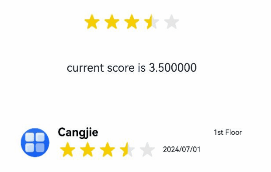
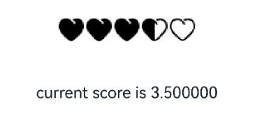

# Rating

A component that provides the ability to select a rating within a given range.

## Import Module

```cangjie
import kit.ArkUI.*
```

## Child Components

None

## Creating the Component

### init(?Float64, ?Bool)

```cangjie
public init(rating!: ?Float64, indicator!: ?Bool = None)
```

**Function:** Constructs a component for selecting ratings within a specified range.

**System Capability:** SystemCapability.ArkUI.ArkUI.Full

**Initial Version:** 22

**Parameters:**

| Parameter Name | Type | Required | Default Value | Description |
|:---|:---|:---|:---|:---|
| rating | ?Float64 | Yes | - | **Named parameter.** Sets and receives the rating value.<br>Initial value: 0.0.<br>**Note:** Valid range: [0, stars]. Values less than 0 are set to 0, and values greater than stars are set to the maximum value stars. |
| indicator | ?Bool | No | None | **Named parameter.** Sets the rating component to be used as an indicator, preventing rating changes.<br>Initial value: false (ratings can be changed).<br>**Note:** When indicator=true, the default component height is height=12.0.vp, and width=height * stars. When indicator=false, the default component height is height=28.0.vp, and width=height * stars. |

## Common Attributes/Events

Common Attributes: All supported.

Common Events: All supported.

## Component Attributes

### func stars(?Int32)

```cangjie
public func stars(value: ?Int32): This
```

**Function:** Sets the total number of stars. If set to a value less than or equal to 0, the initial value is displayed.

**System Capability:** SystemCapability.ArkUI.ArkUI.Full

**Initial Version:** 22

**Parameters:**

| Parameter Name | Type | Required | Default Value | Description |
|:---|:---|:---|:---|:---|
| value | ?Int32 | Yes | - | Sets the total number of stars.<br>Initial value: 5. |

### func stepSize(?Float64)

```cangjie
public func stepSize(size: ?Float64): This
```

**Function:** Sets the step size for rating operations. If set to a value less than or equal to 0.0, the initial value is displayed.

**System Capability:** SystemCapability.ArkUI.ArkUI.Full

**Initial Version:** 22

**Parameters:**

| Parameter Name | Type | Required | Default Value | Description |
|:---|:---|:---|:---|:---|
| size | ?Float64 | Yes | - | The step size for rating operations.<br>Initial value: 0.5.<br>Valid range: (0.0, stars]. |

### func starStyle(?ResourceStr, ?ResourceStr, ?ResourceStr)

```cangjie
public func starStyle(backgroundUri!: ?ResourceStr, foregroundUri!: ?ResourceStr, secondaryUri!: ?ResourceStr = None): This
```

**Function:** Sets the style of the rating stars. The supported image types for this attribute refer to the [Image](./cj-image-video-image.md#image) component. Supports loading local and network images but does not currently support PixelMap or Resource types.

By default, images are loaded asynchronously; synchronous loading is not supported.

**System Capability:** SystemCapability.ArkUI.ArkUI.Full

**Initial Version:** 22

**Parameters:**

| Parameter Name | Type | Required | Default Value | Description |
|:---|:---|:---|:---|:---|
| backgroundUri | ?[ResourceStr](./cj-common-types.md#interface-resourcestr) | Yes | - | **Named parameter.** The image link for unselected stars, which can be customized or use the system default image.<br>Initial value: "". |
| foregroundUri | ?[ResourceStr](./cj-common-types.md#interface-resourcestr) | Yes | - | **Named parameter.** The image path for selected stars, which can be customized or use the system default image.<br>Initial value: "". |
| secondaryUri | ?[ResourceStr](./cj-common-types.md#interface-resourcestr) | No | None | **Named parameter.** The image path for partially selected stars, which can be customized or use the system default image.<br>Initial value: Takes the value of backgroundUri. |

> **Notes:**
>
> - backgroundUri: The image link for unselected stars, which can be customized or use the system default image.
> - foregroundUri: The image path for selected stars, which can be customized or use the system default image.
> - secondaryUri: The image path for partially selected stars, which can be customized or use the system default image.
> - When the rating dimensions are [width, height], the drawing area for a single image is [width / stars, height].
> - To ensure a square drawing area, it is recommended to set custom dimensions as [height * stars, height], where width = height * stars.
> - If the image paths set for backgroundUri, foregroundUri, or secondaryUri are incorrect, the images will not be displayed.
> - If backgroundUri or foregroundUri is set to an empty string, the rating component will load the system default star images.
> - If secondaryUri is not set or is set to an empty string, it defaults to backgroundUri, effectively behaving as if only foregroundUri and backgroundUri were set.

## Component Events

### func onChange(?(Float64) -> Unit)

```cangjie
public func onChange(callback: ?(Float64) -> Unit): This
```

**Function:** Triggers this callback when the rating value changes.

**System Capability:** SystemCapability.ArkUI.ArkUI.Full

**Initial Version:** 22

**Parameters:**

| Parameter Name | Type | Required | Default Value | Description |
|:---|:---|:---|:---|:---|
| callback | ?(Float64)->Unit | Yes | - | The rating value of the rating bar.<br>Initial value: { _ => }. |

## Example Code

### Example 1 (Setting Default Rating Style)

This example creates a default star rating style.

<!-- run -->

```cangjie
package ohos_app_cangjie_entry

import kit.ArkUI.*
import ohos.arkui.state_macro_manage.*
import ohos.i18n.*
import ohos.resource_manager.*
import ohos.resource.__GenerateResource__

@Entry
@Component
class EntryView {
    @State var rating: Float64 = 3.5

    func build() {
        Column() {
            Column() {
                Rating(rating: rating,indicator: false)
                  .stars(5)
                  .stepSize(0.5)
                  .margin(24)
                  .onChange({value: Float64 =>
                    this.rating = value
                    })
                Text("current score is ${this.rating}")
                    .fontSize(16)
                    .fontColor(0x182431)
                    .margin( 16 )
              }.width(360).height(113).backgroundColor(Color.White).margin(top: 68 )
            Row() {
                Image(@r(app.media.startIcon))
                    .width(40)
                    .height(40)
                    .borderRadius(20)
                    .margin(left: 24 )
                Column() {
                    Text("Cangjie")
                        .fontSize(16)
                        .fontColor(Color.Black)
                        .fontWeight(FontWeight.Bold)
                    Row() {
                        Rating(rating: 3.5, indicator: false ).margin(top: 1, right: 8 )
                        Text("2024/07/01")
                            .fontSize(10)
                            .fontColor(Color.Black)
                        }
                }.margin(left: 12 ).alignItems(HorizontalAlign.Start)

                Text("1st Floor")
                    .fontSize(10)
                    .fontColor(Color.Black)
                    .position( x: 295, y: 8 )
             }.width(360).height(56).backgroundColor(Color.White).margin(top: 64 )
        }.width(100.percent).height(100.percent)
    }
}
```



### Example 2 (Setting Rating Style)

This example customizes the star images by configuring starStyle.

<!-- run -->

```cangjie
package ohos_app_cangjie_entry
import kit.ArkUI.*
import ohos.arkui.state_macro_manage.*

@Entry
@Component
class EntryView {
    @State var rating: Float64 = 3.5
    @State var backPng: String = "data:image/png;base64,iVBORw0KGgoAAAANSUhEUgAAABgAAAAYCAYAAADgdz34AAAAAXNSR0IArs4c6QAAAj1JREFUSEu11UuojWEUBuDnOC5nIISSQoQyQRIZIRSiiHCKESMiBiTFDCEZSZmgTGRAuSYdQq6JxEQhl1JCkmukfOv0/adtt8/ePzpf7f6997/Wetda71rv16SLT1MXx9cZQA9MyeCv8RI/q5LphqEYRnucW/hRnXA1wEBsSgFXIr4X5yv2YC/i++5sM6DC5iOOYAfeFv9XAgzCFYzGtQSwH+/QC/OxGu8xHcvz8wQeJuDeyXZt/u9Z8p+Zq+5oUQS5jlGYgXs1uBmDU7myObhTw2Ys2lIybzAZ34oKNmMXVqWeHqpD/OBcXV9MwvMahs10DMNjXQXAIPzC+BJTFSCR/XpEi2qdu+iZ3o8LgO55QqLn60oAlDHZhw1oDoB+KZsPRUllvEvYbEkV7ExtbwmA+HzJBLaWcC5jEhzMioEoODiHiWmOhwfzZSLUsWnBC1xGawGwBMcT0dsSJ9v/EyAWNZYyKiArAOJ5AzHHUcnjfwSJXQnJeJAqmBYxKjc5NjjGK7QnluTTX4KELt3Mmx869rQaIH7PxZk851FikF/m9M+ZD8HUnGi7Xy01XYGjSTKuYh4+N0AIwbuACViQE+xw6Uyul+Jwcrifyp5dp5IIfilzFzITPn+cehdOlHoyq+JihEpWnpG4mO+ERWk4TteptNGNFntxFiMQIlYECc06n1u8MHF3u7M2NgIIvz5Z1OIeOJBFcQ2eJGJDtl/V46gMQPg3J7I3ZjmPy+VgvtW+NxqxsgCN4nT6vssBfgOltGMhyH2RwgAAAABJRU5ErkJggg=="
    @State var forePng: String = "data:image/png;base64,iVBORw0KGgoAAAANSUhEUgAAABgAAAAYCAYAAADgdz34AAAAAXNSR0IArs4c6QAAAcdJREFUSEu11b9LVXEYx/GXKWU4RGAN4RBESFNQkEQUBkrRkOHUUtQ/EARNtbZFlDgKDjU4SSFOOilCRZBISxTYELUUQUuUVnQeOScO955z77l0/E7nx/N83n+/Pz5Pl20eXdu8rwywE0PoRj9e4VlBZQZwkC2d59hsjGkE7MdtXMOeXPCn5P0BJvET53EfR3MxXzCNu4jnrZEHHMAyDrVYttcYxV4sIipobG9xFjGpP4De9MSjFfbkXQqJ5Ytl2VeQs4qTUW1WwR3crSCehbzHmQRwHlMlebdxLwO8wWAHgAj9gKi8qIL4/xLHA9BTtPsdworCN7ArAP34XINgkURPAHbgW9Bqhnz0U5btwUJ6MupkPMbVDHA52eSZOtVxGisZIM70i9j1miBLGG70yUfwMrnqff8J+YYTiBvdZHZjeFLwvSozfCpsIsyxSY+yb1fwqKpiLi7c9BLm87lldn0jMbSJDiB/cL1oYq0azs3wkgrL9SOxxYupi5rm1K6jjWAOuwuqWcc41sqqbQeIvHDNp2kPyOvEiQs3/dpqKasAIi9c82laA/I6ceLCTb+2WsoqgMiPtjibVHMsFYs7cw5xJFuOqoAQCdc9laqtpL26nX5p02+bWDXgL/kuQxxwPkE6AAAAAElFTkSuQmCC"

    func build() {
        Column() {
            Rating(rating: rating,indicator: false)
                .stars(5)
                .stepSize(0.5)
                .starStyle(
                    backgroundUri: backPng,
                    foregroundUri: forePng
                )
                .margin(24)
                .onChange({value: Float64 =>
                    this.rating = value
                })
            Text("current score is ${this.rating}")
                .fontSize(16)
                .fontColor(0x182431)
                .margin(16)
        }
        .width(100.percent)
        .padding(top: 5)
    }
}
```

