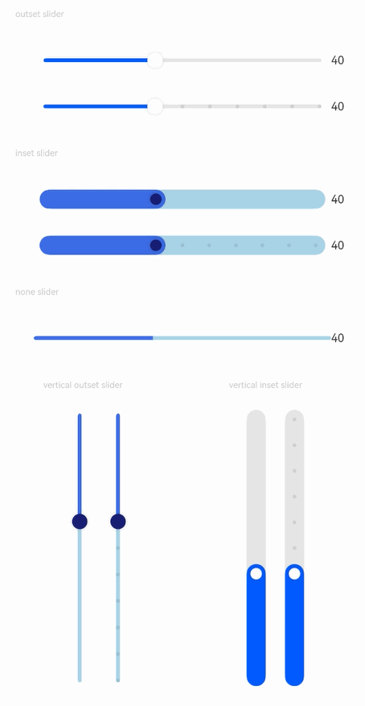

# Slider

The slider component is typically used for quick adjustment of settings such as volume control, brightness adjustment, and similar application scenarios.

## Import Module

```cangjie
import kit.ArkUI.*
```

## Subcomponents

None

## Creating the Component

### init(?Float64, ?Float64, ?Float64, ?Float64, ?SliderStyle, ?Axis, ?Bool)

```cangjie
public init(
    min!: ?Float64 = None,
    max!: ?Float64 = None,
    step!: ?Float64 = None,
    value!: ?Float64 = None,
    style!: ?SliderStyle = None,
    direction!: ?Axis = None,
    reverse!: ?Bool = None
)
```

**Function:** Creates a slider component.

**System Capability:** SystemCapability.ArkUI.ArkUI.Full

**Initial Version:** 22

**Parameters:**

| Parameter | Type | Required | Default | Description |
|:---|:---|:---|:---|:---|
| min | ?Float64 | No | None | **Named parameter.** Sets the minimum value.<br>Initial value: 0.0. |
| max | ?Float64 | No | None | **Named parameter.** Sets the maximum value.<br>Initial value: 100.0.<br>**Note:** In case of min >= max exception, min defaults to 0 and max defaults to 100.<br>If value is outside [min, max] range, it will be set to min or max based on proximity. |
| step | ?Float64 | No | None | **Named parameter.** Sets the step size for slider movement.<br>Initial value: 1.0.<br>**Note:** If step <= 0 or step >= max - min, the initial value is used. |
| value | ?Float64 | No | None | **Named parameter.** Current progress value.<br>Initial value: min value. |
| style | ?[SliderStyle](./cj-common-types.md#enum-sliderstyle) | No | None | **Named parameter.** Sets the slider thumb style.<br>Initial value: SliderStyle.OutSet. |
| direction | ?[Axis](./cj-common-types.md#enum-axis) | No | None | **Named parameter.** Sets the slider direction to horizontal or vertical.<br>Initial value: Axis.Horizontal. |
| reverse | ?Bool | No | None | **Named parameter.** Sets whether the slider range is reversed.<br>Initial value: false.<br>**Note:**<br>When false, horizontal slider moves left to right, vertical slider moves top to bottom.<br>When true, horizontal slider moves right to left, vertical slider moves bottom to top. |

## Common Attributes/Events

Common Attributes: Supports all common attributes except touch hot zones.

Common Events: Fully supported.

## Component Attributes

### func blockBorderColor(?ResourceColor)

```cangjie
public func blockBorderColor(value: ?ResourceColor): This
```

**Function:** Sets the slider border color.

**System Capability:** SystemCapability.ArkUI.ArkUI.Full

**Initial Version:** 22

**Parameters:**

| Parameter | Type | Required | Default | Description |
|:---|:---|:---|:---|:---|
| value | ?[ResourceColor](./cj-common-types.md#interface-resourcecolor) | Yes | - | Slider border color.<br>Initial value: 0x00000000. |

### func blockColor(?ResourceColor)

```cangjie
public func blockColor(value: ?ResourceColor): This
```

**Function:** Sets the slider color.

**System Capability:** SystemCapability.ArkUI.ArkUI.Full

**Initial Version:** 22

**Parameters:**

| Parameter | Type | Required | Default | Description |
|:---|:---|:---|:---|:---|
| value | ?[ResourceColor](./cj-common-types.md#interface-resourcecolor) | Yes | - | Slider color. |

### func selectedColor(?ResourceColor)

```cangjie
public func selectedColor(value: ?ResourceColor): This
```

**Function:** Sets the color of the slid portion of the track based on the specified Color.

**System Capability:** SystemCapability.ArkUI.ArkUI.Full

**Initial Version:** 22

**Parameters:**

| Parameter | Type | Required | Default | Description |
|:---|:---|:---|:---|:---|
| value | ?[ResourceColor](./cj-common-types.md#interface-resourcecolor) | Yes | - | Color of the slid portion of the track. |

### func showSteps(?Bool)

```cangjie
public func showSteps(value: ?Bool): This
```

**Function:** Sets whether to display step tick marks.

**System Capability:** SystemCapability.ArkUI.ArkUI.Full

**Initial Version:** 22

**Parameters:**

| Parameter | Type | Required | Default | Description |
|:---|:---|:---|:---|:---|
| value | ?Bool | Yes | - | Whether to display step tick marks.<br>Initial value: false. |

### func showTips(?Bool, ?ResourceStr)

```cangjie
public func showTips(value: ?Bool, content!: ?ResourceStr = None): This
```

**Function:** Sets whether to display a bubble tip during sliding.

When direction is Axis.Horizontal, the tip appears above the slider (or below if space is insufficient). When direction is Axis.Vertical, the tip appears to the left of the slider (or right if space is insufficient). If margins are not set or are too small, the tip may be truncated.

The tip's drawing area is the overlay of the Slider node itself.

**System Capability:** SystemCapability.ArkUI.ArkUI.Full

**Initial Version:** 22

**Parameters:**

| Parameter | Type | Required | Default | Description |
|:---|:---|:---|:---|:---|
| value | ?Bool | Yes | - | Whether to display a bubble tip during sliding.<br>Initial value: false. |
| content | ?[ResourceStr](./cj-common-types.md#interface-resourcestr) | No | None | **Named parameter.** Text content of the bubble tip, defaults to current percentage. |

### func trackColor(?ResourceColor)

```cangjie
public func trackColor(value: ?ResourceColor): This
```

**Function:** Sets the background color of the track based on the specified Color.

**System Capability:** SystemCapability.ArkUI.ArkUI.Full

**Initial Version:** 22

**Parameters:**

| Parameter | Type | Required | Default | Description |
|:---|:---|:---|:---|:---|
| value | ?[ResourceColor](./cj-common-types.md#interface-resourcecolor) | Yes | - | Background color of the track.<br>**Note:**<br>For gradient colors, if color stop values are invalid or gradient stops are empty, the gradient effect will not apply. |

### func trackThickness(?Length)

```cangjie
public func trackThickness(value: ?Length): This
```

**Function:** Sets the thickness of the track based on the specified Length. Values <= 0 will revert to the initial value.

To maintain SliderStyle consistency between the thumb and track, blockSize scales proportionally with trackThickness.

When style is SliderStyle.OutSet, trackThickness : blockSize = 1 : 4. When style is SliderStyle.InSet, trackThickness : blockSize = 5 : 3.

During trackThickness adjustment, if trackThickness or blockSize exceeds the slider component's width or height (possible with SliderStyle.OutSet), the initial value is used.

**System Capability:** SystemCapability.ArkUI.ArkUI.Full

**Initial Version:** 22

**Parameters:**

| Parameter | Type | Required | Default | Description |
|:---|:---|:---|:---|:---|
| value | ?[Length](./cj-common-types.md#interface-length) | Yes | - | Thickness of the track.<br/>Initial value: 4.0.vp for SliderStyle.OutSet, 20.0.vp for SliderStyle.InSet. |

## Component Events

### func onChange(?(Float64, SliderChangeMode) -> Unit)

```cangjie
public func onChange(callback: ?(Float64, SliderChangeMode) -> Unit): This
```

**Function:** Triggered when the Slider is dragged or clicked.

Begin and End states trigger on gesture clicks. Moving and Click states trigger when the value changes.

Continuous drag actions do not trigger the Click state.

**System Capability:** SystemCapability.ArkUI.ArkUI.Full

**Initial Version:** 22

**Parameters:**

| Parameter | Type | Required | Default | Description |
|:---|:---|:---|:---|:---|
| callback | ?(Float64, [SliderChangeMode](./cj-common-types.md#enum-sliderchangemode)) -> Unit | Yes | - | Callback triggered when Slider is dragged or clicked.<br>Parameter 1: Current progress value, ranging according to step size.<br>Parameter 2: Event trigger state.<br>Initial value: { _, _ => }. |

## Example Code

### Example 1 (Basic Slider Styles)

This example controls bubble tips, tick marks, thumb, and track display through style, showTips, and showSteps configurations.

<!-- run -->

```cangjie

package ohos_app_cangjie_entry
import kit.ArkUI.*
import ohos.arkui.state_macro_manage.*

@Entry
@Component
class EntryView {
    @State var outSetValueOne: Float64 = 40.00
    @State var inSetValueOne: Float64 = 40.00
    @State var noneValueOne: Float64 = 40.00
    @State var outSetValueTwo: Float64 = 40.00
    @State var inSetValueTwo: Float64 = 40.00
    @State var vOutSetValueOne: Float64 = 40.00
    @State var vInSetValueOne: Float64 = 40.00
    @State var vOutSetValueTwo: Float64 = 40.00
    @State var vInSetValueTwo: Float64 = 40.00

    func build() {
        Column() {
            Text('outset slider').fontSize(9).fontColor(0xCCCCCC).width(90.percent).margin(15)
            Row() {
                Slider(
                    value: this.outSetValueOne,
                    min: 0.0,
                    max: 100.0,
                    style: SliderStyle.OutSet
                ).showTips(true).onChange({
                    value: Float64, mode: SliderChangeMode => this.outSetValueOne = value
                })
                Text("${Int64(this.outSetValueOne)}").fontSize(12)
            }.width(80.percent)
            Row() {
                Slider(
                    value: this.outSetValueTwo,
                    step: 10.0,
                    style: SliderStyle.OutSet
                ).showSteps(true).onChange({
                    value: Float64, mode: SliderChangeMode => this.outSetValueTwo = value
                })
                Text("${Int64(this.outSetValueTwo)}").fontSize(12)
            }.width(80.percent)

            Text('inset slider').fontSize(9).fontColor(0xCCCCCC).width(90.percent).margin(15)
            Row() {
                Slider(
                    value: this.inSetValueOne,
                    min: 0.0,
                    max: 100.0,
                    style: SliderStyle.InSet
                )
                    .blockColor(0x191970)
                    .trackColor(0xADD8E6)
                    .selectedColor(0x4169E1)
                    .showTips(true)
                    .onChange({
                        value: Float64, mode: SliderChangeMode => this.inSetValueOne = value
                    })
                Text("${Int64(this.inSetValueOne)}").fontSize(12)
            }.width(80.percent)
            Row() {
                Slider(
                    value: this.inSetValueTwo,
                    step: 10.0,
                    style: SliderStyle.InSet
                )
                    .blockColor(0x191970)
                    .trackColor(0xADD8E6)
                    .selectedColor(0x4169E1)
                    .showSteps(true)
                    .onChange({
                        value: Float64, mode: SliderChangeMode => this.inSetValueTwo = value
                    })
                Text("${Int64(this.inSetValueTwo)}").fontSize(12)
            }.width(80.percent)

            Text('none slider').fontSize(9).fontColor(0xCCCCCC).width(90.percent).margin(15)
            Row() {
                Slider(
                    value: this.noneValueOne,
                    min: 0.0,
                    max: 100.0,
                    style: SliderStyle.OutSet
                )
                    .blockColor(0x191970)
                    .trackColor(0xADD8E6)
                    .selectedColor(0x4169E1)
                    .showTips(true)
                    .onChange({
                        value: Float64, mode: SliderChangeMode => this.noneValueOne = value
                    })
                Text("${Int64(this.noneValueOne)}").fontSize(12)
            }.width(80.percent)

            Row() {
                Column() {
                    Text('vertical outset slider').fontSize(9).fontColor(0xCCCCCC).width(50.percent).margin(15)
                    Row() {
                        Text("").width(10.percent)
                        Slider(
                            value: this.vOutSetValueOne,
                            style: SliderStyle.OutSet,
                            direction: Axis.Vertical
                        )
                            .blockColor(0x191970)
                            .trackColor(0xADD8E6)
                            .selectedColor(0x4169E1)
                            .showTips(true)
                            .onChange({
                                value: Float64, mode: SliderChangeMode => this.vOutSetValueOne = value
                            })
                        Slider(
                            value: this.vOutSetValueTwo,
                            step: 10.0,
                            style: SliderStyle.OutSet,
                            direction: Axis.Vertical
                        )
                            .blockColor(0x191970)
                            .trackColor(0xADD8E6)
                            .selectedColor(0x4169E1)
                            .showSteps(true)
                            .onChange({
                                value: Float64, mode: SliderChangeMode => this.vOutSetValueTwo = value
                            })
                    }
                }.width(50.percent).height(300)

                Column() {
                    Text('vertical inset slider').fontSize(9).fontColor(0xCCCCCC).width(50.percent).margin(15)
                    Row() {
                        Slider(
                            value: this.vInSetValueOne,
                            style: SliderStyle.InSet,
                            direction: Axis.Vertical,
                            reverse: true // Vertical Sliders default to min at top and max at bottom. Setting reverse to true enables bottom-to-top sliding.
                        )
                            .showTips(true)
                            .onChange({
                                value: Float64, mode: SliderChangeMode => this.vInSetValueOne = value
                            })
                        Slider(
                            value: this.vInSetValueTwo,
                            step: 10.0,
                            style: SliderStyle.InSet,
                            direction: Axis.Vertical,
                            reverse: true
                        )
                            .showSteps(true)
                            .onChange({
                                value: Float64, mode: SliderChangeMode => this.vInSetValueTwo = value
                            })
                    }
                }.width(50.percent).height(300)
            }
        }.width(100.percent)
    }
}
```

