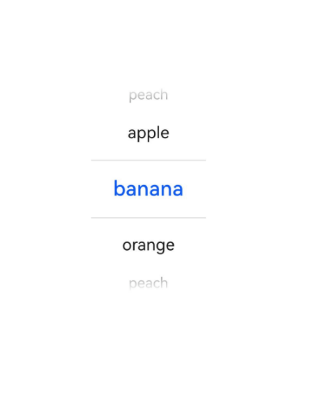

# TextPicker

A component for sliding to select text content.

## Import Module

```cangjie
import kit.ArkUI.*
```

## Child Components

None

## Creating the Component

### init(Array\<String>, ?UInt32, ?String)

```cangjie
public init(
    range!: Array<String>,
    selected!: ?UInt32 = Option.None,
    value!: ?String = Option.None
)
```

**Function:** Creates a text picker based on the selection range specified by `range`.

**System Capability:** SystemCapability.ArkUI.ArkUI.Full

**Since:** 22

**Parameters:**

| Parameter | Type | Required | Default | Description |
|:---|:---|:---|:---|:---|
| range | Array\<String> | Yes | - | **Named parameter.** The data selection list for the picker. |
| selected | ?UInt32 | No | Option.None | **Named parameter.** Sets the index value of the default selected item in the array.<br>Initial value: 0. |
| value | ?String | No | Option.None | **Named parameter.** Sets the value of the default selected item, with lower priority than `selected`.<br>Initial value: First element value.<br>**Note:** This value is only valid when displaying a text list. It is invalid when displaying an image list or an image plus text list. |

## Common Attributes/Common Events

Common Attributes: All supported.

Common Events: All supported.

## Component Attributes

### func canLoop(?Bool)

```cangjie
public func canLoop(value: ?Bool): This
```

**Function:** Sets whether the picker can scroll infinitely.

**System Capability:** SystemCapability.ArkUI.ArkUI.Full

**Since:** 22

**Parameters:**

| Parameter | Type | Required | Default | Description |
|:---|:---|:---|:---|:---|
| value | ?Bool | Yes | - | Whether infinite scrolling is enabled.<br>true: Enabled, false: Disabled.<br>Initial value: true. |

### func defaultPickerItemHeight(?Length)

```cangjie
public func defaultPickerItemHeight(value: ?Length): This
```

**Function:** Sets the height of each picker item.

**System Capability:** SystemCapability.ArkUI.ArkUI.Full

**Since:** 22

**Parameters:**

| Parameter | Type | Required | Default | Description |
|:---|:---|:---|:---|:---|
| value | ?[Length](./cj-common-types.md#interface-length) | Yes | - | The height of each picker item. |

## Component Events

### func onChange(?OnTextPickerChangeCallback)

```cangjie
public func onChange(callback: ?OnTextPickerChangeCallback): This
```

**Function:** Triggered when the picker selection changes.

**System Capability:** SystemCapability.ArkUI.ArkUI.Full

**Since:** 22

**Parameters:**

| Parameter | Type | Required | Default | Description |
|:---|:---|:---|:---|:---|
| callback | ?[OnTextPickerChangeCallback](#type-ontextpickerchangecallback) | Yes | - | Callback function when the picker selection changes.<br>Initial value: { _, _ => }. |

## Basic Type Definitions

### type OnTextPickerChangeCallback

```cangjie
public type OnTextPickerChangeCallback = (String, UInt32) -> Unit
```

**Function:** Callback for the TextPicker item selection event.

**Type:** (String, UInt32) -> Unit

**System Capability:** SystemCapability.ArkUI.ArkUI.Full

**Since:** 22

## Example Code

### Example 1 (Setting the Number of Picker Columns)

This example demonstrates how to configure `range` to implement a single-column or multi-column text picker.

<!-- run -->

```cangjie

package ohos_app_cangjie_entry
import kit.ArkUI.*
import ohos.arkui.state_macro_manage.*
import ohos.hilog.*

func loggerInfo(str: String) {
    Hilog.info(0, "CangjieTest", str)
}

@Entry
@Component
class EntryView {
    var select: UInt32 = 1
    @State var fruits: Array<String> = ["apple", "banana", "orange", "peach"]
    func build() {
        Column {
            TextPicker(range: this.fruits, selected: this.select)
            .onChange({value: String, index: UInt32  =>
                    loggerInfo("Picker item changed, value: ${index}")
            })
        }
        .width(100.percent)
        .height(100.percent)
        .alignItems(HorizontalAlign.Center)
        .justifyContent(FlexAlign.Center)
    }
}
```

