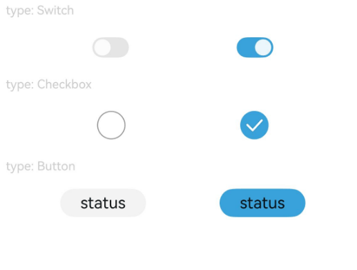

# Toggle

The component provides checkbox style, state button style, and switch style.

## Import Module

```cangjie
import kit.ArkUI.*
```

## Child Components

Child components are only allowed when ToggleType is Button.

## Creating Components

### init(?ToggleType, ?Bool)

```cangjie
public init(toggleType: ?ToggleType, isOn!: ?Bool = None)
```

**Function:** Creates a Toggle-type object.

**System Capability:** SystemCapability.ArkUI.ArkUI.Full

**Since:** 22

**Parameters:**

| Parameter | Type | Required | Default | Description |
|:---|:---|:---|:---|:---|
| toggleType | ?[ToggleType](./cj-common-types.md#enum-toggletype) | Yes | - | The type of toggle.<br>Initial value: ToggleType.Switch. |
| isOn | ?Bool | No | None | **Named parameter.** Whether the toggle is on. true: on, false: off.<br>Initial value: false. |

### init(?ToggleType, ?Bool, () -> Unit)

```cangjie
public init(toggleType: ?ToggleType, isOn: ?Bool, subcomponent: () -> Unit)
```

**Function:** Creates a Toggle-type object.

**System Capability:** SystemCapability.ArkUI.ArkUI.Full

**Since:** 22

**Parameters:**

| Parameter | Type | Required | Default | Description |
|:---|:---|:---|:---|:---|
| toggleType | ?[ToggleType](./cj-common-types.md#enum-toggletype) | Yes | - | The type of toggle.<br>Initial value: ToggleType.Switch. |
| isOn | ?Bool | Yes | - | Whether the toggle is on. true: on, false: off.<br>Initial value: false. |
| subcomponent | () -> Unit | Yes | - | Declares child components. |

## Common Attributes/Common Events

Common Attributes: All supported.

Common Events: All supported.

## Component Attributes

### func selectedColor(?ResourceColor)

```cangjie
public func selectedColor(value: ?ResourceColor): This
```

**Function:** Sets the background color of the component in the on state.

**System Capability:** SystemCapability.ArkUI.ArkUI.Full

**Since:** 22

**Parameters:**

| Parameter | Type | Required | Default | Description |
|:---|:---|:---|:---|:---|
| value | ?[ResourceColor](cj-common-types.md#interface-resourcecolor) | Yes | - | The background color of the component in the on state. |

### func switchPointColor(?ResourceColor)

```cangjie
public func switchPointColor(color: ?ResourceColor): This
```

**Function:** Sets the color of the circular slider for the Switch type. Only effective when type is ToggleType.Switch.

**System Capability:** SystemCapability.ArkUI.ArkUI.Full

**Since:** 22

**Parameters:**

| Parameter | Type | Required | Default | Description |
|:---|:---|:---|:---|:---|
| color | ?[ResourceColor](cj-common-types.md#interface-resourcecolor) | Yes | - | The color of the circular slider for the Switch type. |

## Component Events

### func onChange(?(Bool) -> Unit)

```cangjie
public func onChange(callback: ?(Bool) -> Unit): This
```

**Function:** Triggered when the selected state of the component changes.

**System Capability:** SystemCapability.ArkUI.ArkUI.Full

**Since:** 22

**Parameters:**

| Parameter | Type | Required | Default | Description |
|:---|:---|:---|:---|:---|
| callback | ?(Bool) -> Unit | Yes | - | The callback function when the selected state of the component changes.<br>Initial value: { _ => }. |

## Example Code

### Example 1 (Setting the Style of the Toggle)

This example sets the checkbox style, state button style, and switch style of the Toggle by configuring ToggleType.

<!-- run -->

```cangjie

package ohos_app_cangjie_entry
import kit.ArkUI.*
import ohos.arkui.state_macro_manage.*
import ohos.hilog.*

func loggerInfo(str: String) {
    Hilog.info(0, "CangjieTest", str)
}

@Entry
@Component
class EntryView {
    func build() {
        Column(space: 15) {
            Text("type: Switch")
            .fontSize(12)
            .fontColor(0xcccccc)
            .width(90.percent)
            Flex(justifyContent: FlexAlign.SpaceEvenly, alignItems: ItemAlign.Center) {
                Toggle(ToggleType.Switch, isOn: false)
                .selectedColor(0xed6f21)
                .switchPointColor(0xe5ffffff)
                .onChange({isOn: Bool =>
                    loggerInfo("Component status: ${isOn}")
                })

                Toggle(ToggleType.Switch, isOn: true)
                .selectedColor(0x39a2db)
                .switchPointColor(0xe5ffffff)
                .onChange({isOn: Bool =>
                    loggerInfo("Component status: ${isOn}")
                })
            }

            Text("type: Checkbox")
            .fontSize(12)
            .fontColor(0xcccccc)
            .width(90.percent)
            Flex(justifyContent: FlexAlign.SpaceEvenly, alignItems: ItemAlign.Center) {
                Toggle(ToggleType.Checkbox, isOn: false)
                .size(width: 28, height: 28)
                .selectedColor(0xed6f21)
                .onChange({isOn: Bool =>
                    loggerInfo("Component status: ${isOn}")
                })

                Toggle(ToggleType.Checkbox, isOn: true)
                .size(width: 28, height: 28)
                .selectedColor(0x39a2db)
                .onChange({isOn: Bool =>
                    loggerInfo("Component status: ${isOn}")
                })
            }

            Text("type: Button")
            .fontSize(12)
            .fontColor(0xcccccc)
            .width(90.percent)
            Flex(justifyContent: FlexAlign.SpaceEvenly, alignItems: ItemAlign.Center) {
                Toggle(ToggleType.Button, false) {
                    Text("status")
                    .padding(left:12, right: 12)
                }
                .selectedColor(0xed6f21)
                .onChange({isOn: Bool =>
                    loggerInfo("Component status: ${isOn}")
                })

                Toggle(ToggleType.Button, true) {
                    Text("status")
                    .padding(left:12, right: 12)
                }
                .selectedColor(0x39a2db)
                .onChange({isOn: Bool =>
                    loggerInfo("Component status: ${isOn}")
                })
            }
        }
    }
}
```

