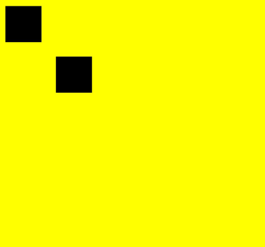

# CanvasRenderingContext2D

Use RenderingContext to draw on Canvas components, with drawable objects including rectangles, text, images, etc.

> **NOTE**
>
> - The drawing interfaces described in this document are stored in the command queue of the associated Canvas component when called. These commands are only dequeued and executed when the current frame enters the rendering phase and the associated Canvas component is visible. Therefore, when the Canvas component is not visible, frequent calls to drawing interfaces should be avoided to prevent command accumulation in the queue, which could lead to excessive memory usage.
> - When the width or height of a Canvas component exceeds 8000px, CPU rendering is used, resulting in significantly degraded performance.

## Import Module

```cangjie
import kit.ArkUI.*
```

## interface FillStyle

```cangjie
public interface FillStyle {}
```

**Function:** Interface for fill styles.

**System Capability:** SystemCapability.ArkUI.ArkUI.Full

**Since:** 22

## Int64

**Function:** Description of Int64 type definition

### extend Int64 <: FillStyle

```cangjie
extend Int64 <: FillStyle {}
```

**Function:** Extends Int64 as a subclass of FillStyle.

## UInt32

**Function:** Description of UInt32 type definition

### extend UInt32 <: FillStyle

```cangjie
extend UInt32 <: FillStyle {}
```

**Function:** Extends UInt32 as a subclass of FillStyle.

## Color

**Function:** Description of Color type definition

### extend Color <: FillStyle

```cangjie
extend Color <: FillStyle {}
```

**Function:** Extends Color as a subclass of FillStyle.

## CanvasGradient

**Function:** Description of CanvasGradient type definition

### extend CanvasGradient <: FillStyle

```cangjie
extend CanvasGradient <: FillStyle {}
```

**Function:** Extends CanvasGradient as a subclass of FillStyle.

## CanvasPattern

**Function:** Description of CanvasPattern type definition

### extend CanvasPattern <: FillStyle

```cangjie
extend CanvasPattern <: FillStyle {}
```

**Function:** Extends CanvasPattern as a subclass of FillStyle.

## interface StrokeStyle

```cangjie
public interface StrokeStyle {}
```

**Function:** Interface for stroke styles.

**System Capability:** SystemCapability.ArkUI.ArkUI.Full

**Since:** 22

## Int64

**Function:** Description of Int64 type definition

### extend Int64 <: StrokeStyle

```cangjie
extend Int64 <: StrokeStyle {}
```

**Function:** Extends Int64 as a subclass of StrokeStyle.

## UInt32

**Function:** Description of UInt32 type definition

### extend UInt32 <: StrokeStyle

```cangjie
extend UInt32 <: StrokeStyle {}
```

**Function:** Extends UInt32 as a subclass of StrokeStyle.

## Color

**Function:** Description of Color type definition

### extend Color <: StrokeStyle

```cangjie
extend Color <: StrokeStyle {}
```

**Function:** Extends Color as a subclass of StrokeStyle.

## CanvasGradient

**Function:** Description of CanvasGradient type definition

### extend CanvasGradient <: StrokeStyle

```cangjie
extend CanvasGradient <: StrokeStyle {}
```

**Function:** Extends CanvasGradient as a subclass of StrokeStyle.

## CanvasPattern

**Function:** Description of CanvasPattern type definition

### extend CanvasPattern <: StrokeStyle

```cangjie
extend CanvasPattern <: StrokeStyle {}
```

**Function:** Extends CanvasPattern as a subclass of StrokeStyle.

## class CanvasRenderingContext2D

```cangjie
public class CanvasRenderingContext2D {
    public init(?RenderingContextSettings)
}
```

**Function:** Drawing context object for Canvas components.

**System Capability:** SystemCapability.ArkUI.ArkUI.Full

**Since:** 22

### init(?RenderingContextSettings)

```cangjie
public init(settings: ?RenderingContextSettings)
```

**Function:** Initialization function for canvas drawing context objects, used to create drawing context objects.

**System Capability:** SystemCapability.ArkUI.ArkUI.Full

**Since:** 22

**Parameters:**

| Parameter | Type | Required | Default Value | Description |
|:---|:---|:---|:---|:---|
| settings | ?[RenderingContextSettings](./cj-canvas-drawing-canvas.md#class-renderingcontextsettings) | No | - | Initialization settings. |

### prop fillStyle

```cangjie
public mut prop fillStyle: Option<FillStyle>
```

**Function:** Specifies the fill color for drawing.

**Type:** Option\<FillStyle>

**Read/Write:** Readable and Writable

**System Capability:** SystemCapability.ArkUI.ArkUI.Full

**Since:** 22

### prop lineWidth

```cangjie
public mut prop lineWidth: Option<Float64>
```

**Function:** Line width property.

**Type:** Option\<Float64>

**Read/Write:** Readable and Writable

**System Capability:** SystemCapability.ArkUI.ArkUI.Full

**Since:** 22

### prop strokeStyle

```cangjie
public mut prop strokeStyle: Option<StrokeStyle>
```

**Function:** Sets the stroke color.

**Type:** Option\<StrokeStyle>

**Read/Write:** Readable and Writable

**System Capability:** SystemCapability.ArkUI.ArkUI.Full

**Since:** 22

### prop lineCap

```cangjie
public mut prop lineCap: Option<String>
```

**Function:** Line cap property.

**Type:** Option\<String>

**Read/Write:** Readable and Writable

**System Capability:** SystemCapability.ArkUI.ArkUI.Full

**Since:** 22

### prop lineJoin

```cangjie
public mut prop lineJoin: Option<String>
```

**Function:** Line join property.

**Type:** Option\<String>

**Read/Write:** Readable and Writable

**System Capability:** SystemCapability.ArkUI.ArkUI.Full

**Since:** 22

### prop miterLimit

```cangjie
public mut prop miterLimit: Option<Float64>
```

**Function:** Sets the miter limit value. The value cannot be 0 or negative.

**Type:** Option\<Float64>

**Read/Write:** Readable and Writable

**System Capability:** SystemCapability.ArkUI.ArkUI.Full

**Since:** 22

### prop font

```cangjie
public mut prop font: Option<String>
```

**Function:** Sets the font style.

**Type:** Option\<String>

**Read/Write:** Readable and Writable

**System Capability:** SystemCapability.ArkUI.ArkUI.Full

**Since:** 22

### prop textAlign

```cangjie
public mut prop textAlign: Option<String>
```

**Function:** Text alignment mode.

**Type:** Option\<String>

**Read/Write:** Readable and Writable

**System Capability:** SystemCapability.ArkUI.ArkUI.Full

**Since:** 22

### prop textBaseline

```cangjie
public mut prop textBaseline: Option<String>
```

**Function:** Text baseline.

**Type:** Option\<String>

**Read/Write:** Readable and Writable

**System Capability:** SystemCapability.ArkUI.ArkUI.Full

**Since:** 22

### prop globalAlpha

```cangjie
public mut prop globalAlpha: Option<Float64>
```

**Function:** Transparency.

**Type:** Option\<Float64>

**Read/Write:** Readable and Writable

**System Capability:** SystemCapability.ArkUI.ArkUI.Full

**Since:** 22

### prop lineDashOffset

```cangjie
public mut prop lineDashOffset: Option<Float64>
```

**Function:** Line dash offset property.

**Type:** Option\<Float64>

**Read/Write:** Readable and Writable

**System Capability:** SystemCapability.ArkUI.ArkUI.Full

**Since:** 22

### prop globalCompositeOperation

```cangjie
public mut prop globalCompositeOperation: Option<String>
```

**Function:** Type of compositing operation applied when drawing new shapes.

**Type:** Option\<String>

**Read/Write:** Readable and Writable

**System Capability:** SystemCapability.ArkUI.ArkUI.Full

**Since:** 22

### prop shadowBlur

```cangjie
public mut prop shadowBlur: Option<Float64>
```

**Function:** Shadow blur radius. The value cannot be negative.

**Type:** Option\<Float64>

**Read/Write:** Readable and Writable

**System Capability:** SystemCapability.ArkUI.ArkUI.Full

**Since:** 22

### prop shadowColor

```cangjie
public mut prop shadowColor: Option<ResourceColor>
```

**Function:** Shadow color.

**Type:** Option\<ResourceColor>

**Read/Write:** Readable and Writable

**System Capability:** SystemCapability.ArkUI.ArkUI.Full

**Since:** 22### prop shadowOffsetX

```cangjie
public mut prop shadowOffsetX: Option<Float64>
```

**Function:** The horizontal offset distance of the shadow.

**Type:** Option\<Float64>

**Read/Write Capability:** Readable and Writable

**System Capability:** SystemCapability.ArkUI.ArkUI.Full

**Initial Version:** 22

### prop shadowOffsetY

```cangjie
public mut prop shadowOffsetY: Option<Float64>
```

**Function:** The vertical offset distance of the shadow.

**Type:** Option\<Float64>

**Read/Write Capability:** Readable and Writable

**System Capability:** SystemCapability.ArkUI.ArkUI.Full

**Initial Version:** 22

### prop imageSmoothingEnabled

```cangjie
public mut prop imageSmoothingEnabled: Option<Bool>
```

**Function:** Sets whether to enable image smoothing when drawing images. `true` enables it, `false` disables it.

**Type:** Option\<Bool>

**Read/Write Capability:** Readable and Writable

**System Capability:** SystemCapability.ArkUI.ArkUI.Full

**Initial Version:** 22

### prop imageSmoothingQuality

```cangjie
public mut prop imageSmoothingQuality: Option<String>
```

**Function:** Sets the image smoothing quality.

**Type:** Option\<String>

**Read/Write Capability:** Readable and Writable

**System Capability:** SystemCapability.ArkUI.ArkUI.Full

**Initial Version:** 22

### prop direction

```cangjie
public mut prop direction: Option<String>
```

**Function:** The text drawing direction.

**Type:** Option\<String>

**Read/Write Capability:** Readable and Writable

**System Capability:** SystemCapability.ArkUI.ArkUI.Full

**Initial Version:** 22

### prop filter

```cangjie
public mut prop filter: Option<String>
```

**Function:** Provides filter effects such as blur and grayscale.

**Type:** Option\<String>

**Read/Write Capability:** Readable and Writable

**System Capability:** SystemCapability.ArkUI.ArkUI.Full

**Initial Version:** 22

### prop height

```cangjie
public prop height: Float64
```

**Function:** The default value is 0, which binds the height of the specified canvas. This value is read-only.

**Type:** Float64

**Read/Write Capability:** Read-only

**System Capability:** SystemCapability.ArkUI.ArkUI.Full

**Initial Version:** 22

### prop width

```cangjie
public prop width: Float64
```

**Function:** The default value is 0, which binds the width of the specified canvas. This value is read-only.

**Type:** Float64

**Read/Write Capability:** Read-only

**System Capability:** SystemCapability.ArkUI.ArkUI.Full

**Initial Version:** 22

### func setLineDash(?Array\<Float64>)

```cangjie
public func setLineDash(dashArr: ?Array<Float64>): Unit
```

**Function:** Sets the dash pattern for lines.

**System Capability:** SystemCapability.ArkUI.ArkUI.Full

**Initial Version:** 22

**Parameters:**

| Parameter | Type | Required | Default Value | Description |
|:---|:---|:---|:---|:---|
| segments | ?Array\<Float64> | No | - | An array describing how line segments alternate and their spacing lengths.<br>Default unit: vp |

### func fillRect(Float64, Float64, Float64, Float64)

```cangjie
public func fillRect(x: Float64, y: Float64, w: Float64, h: Float64): Unit
```

**Function:** Fills the specified rectangular area.

**System Capability:** SystemCapability.ArkUI.ArkUI.Full

**Initial Version:** 22

**Parameters:**

| Parameter | Type | Required | Default Value | Description |
|:---|:---|:---|:---|:---|
| x | Float64 | Yes | - | The x-coordinate of the top-left corner of the rectangle.<br>Default unit: vp. |
| y | Float64 | Yes | - | The y-coordinate of the top-left corner of the rectangle.<br>Default unit: vp. |
| w | Float64 | Yes | - | The width of the rectangle.<br>Default unit: vp. |
| h | Float64 | Yes | - | The height of the rectangle.<br>Default unit: vp. |

### func strokeRect(Float64, Float64, Float64, Float64)

```cangjie
public func strokeRect(x: Float64, y: Float64, w: Float64, h: Float64): Unit
```

**Function:** Strokes the specified rectangular area.

**System Capability:** SystemCapability.ArkUI.ArkUI.Full

**Initial Version:** 22

**Parameters:**

| Parameter | Type | Required | Default Value | Description |
|:---|:---|:---|:---|:---|
| x | Float64 | Yes | - | The x-coordinate of the top-left corner of the rectangle.<br>Default unit: vp. |
| y | Float64 | Yes | - | The y-coordinate of the top-left corner of the rectangle.<br>Default unit: vp. |
| w | Float64 | Yes | - | The width of the rectangle.<br>Default unit: vp. |
| h | Float64 | Yes | - | The height of the rectangle.<br>Default unit: vp. |

### func clearRect(Float64, Float64, Float64, Float64)

```cangjie
public func clearRect(x: Float64, y: Float64, w: Float64, h: Float64): Unit
```

**Function:** Clears the drawing content of the specified rectangular area.

**System Capability:** SystemCapability.ArkUI.ArkUI.Full

**Initial Version:** 22

**Parameters:**

| Parameter | Type | Required | Default Value | Description |
|:---|:---|:---|:---|:---|
| x | Float64 | Yes | - | The x-coordinate of the top-left corner of the rectangle.<br>Default unit: vp. |
| y | Float64 | Yes | - | The y-coordinate of the top-left corner of the rectangle.<br>Default unit: vp. |
| w | Float64 | Yes | - | The width of the rectangle.<br>Default unit: vp. |
| h | Float64 | Yes | - | The height of the rectangle.<br>Default unit: vp. |

### func fillText(String, Float64, Float64, ?Float64)

```cangjie
public func fillText(text: String, x: Float64, y: Float64, maxWidth!: ?Float64 = Option.None): Unit
```

**Function:** Fills the specified text at the given position.

**System Capability:** SystemCapability.ArkUI.ArkUI.Full

**Initial Version:** 22

**Parameters:**

| Parameter | Type | Required | Default Value | Description |
|:---|:---|:---|:---|:---|
| text | String | Yes | - | The text content to be drawn. |
| x | Float64 | Yes | - | The x-coordinate of the bottom-left corner of the text.<br>Default unit: vp. |
| y | Float64 | Yes | - | The y-coordinate of the bottom-left corner of the text.<br>Default unit: vp. |
| maxWidth | ?Float64 | No | - | **Named parameter.** The maximum allowed width of the text.<br>Default unit: vp.<br>Initial value: No width limit. |

### func strokeText(String, Float64, Float64, ?Float64)

```cangjie
public func strokeText(text: String, x: Float64, y: Float64, maxWidth!: Option<Float64> = Option.None): Unit
```

**Function:** Draws stroked text.

**System Capability:** SystemCapability.ArkUI.ArkUI.Full

**Initial Version:** 22

**Parameters:**

| Parameter | Type | Required | Default Value | Description |
|:---|:---|:---|:---|:---|
| text | String | Yes | - | The text content to be drawn. |
| x | Float64 | Yes | - | The x-coordinate of the bottom-left corner of the text.<br>Default unit: vp. |
| y | Float64 | Yes | - | The y-coordinate of the bottom-left corner of the text.<br>Default unit: vp. |
| maxWidth | Option\<Float64> | No | - | **Named parameter.** The maximum width of the text to be drawn.<br>Default unit: vp. |

### func measureText(?String)

```cangjie
public func measureText(text: ?String): TextMetrics
```

**Function:** Returns a text measurement object that provides the width of the specified text. The width value may vary across different devices.

**System Capability:** SystemCapability.ArkUI.ArkUI.Full

**Initial Version:** 22

**Parameters:**

| Parameter | Type | Required | Default Value | Description |
|:---|:---|:---|:---|:---|
| text | ?String | No | - | The text to be measured. |

**Return Value:**

| Type | Description |
|:---|:---|
| [TextMetrics](cj-canvas-drawing-canvas.md#class-textmetrics) | The text measurement result. |

### func stroke()

```cangjie
public func stroke(): Unit
```

**Function:** Performs a stroke operation.

**System Capability:** SystemCapability.ArkUI.ArkUI.Full

**Initial Version:** 22

### func stroke(Path2D)

```cangjie
public func stroke(path: Path2D): Unit
```

**Function:** Performs a stroke operation.

**System Capability:** SystemCapability.ArkUI.ArkUI.Full

**Initial Version:** 22

**Parameters:**

| Parameter | Type | Required | Default Value | Description |
|:---|:---|:---|:---|:---|
| path | Path2D | Yes | - | The specified path object for stroking. |

### func beginPath()

```cangjie
public func beginPath(): Unit
```

**Function:** Creates a new drawing path.

**System Capability:** SystemCapability.ArkUI.ArkUI.Full

**Initial Version:** 22

### func moveTo(Float64, Float64)

```cangjie
public func moveTo(x: Float64, y: Float64): Unit
```

**Function:** Moves the path from the current point to the specified point.

**System Capability:** SystemCapability.ArkUI.ArkUI.Full

**Initial Version:** 22

**Parameters:**

| Parameter | Type | Required | Default Value | Description |
|:---|:---|:---|:---|:---|
| x | Float64 | Yes | - | The x-coordinate of the specified position.<br>Default unit: vp. |
| y | Float64 | Yes | - | The y-coordinate of the specified position.<br>Default unit: vp. |

### func lineTo(Float64, Float64)

```cangjie
public func lineTo(x: Float64, y: Float64): Unit
```

**Function:** Connects the path from the current point to the specified point.

**System Capability:** SystemCapability.ArkUI.ArkUI.Full

**Initial Version:** 22

**Parameters:**

| Parameter | Type | Required | Default Value | Description |
|:---|:---|:---|:---|:---|
| x | Float64 | Yes | - | The x-coordinate of the specified position.<br>Default unit: vp. |
| y | Float64 | Yes | - | The y-coordinate of the specified position.<br>Default unit: vp. |

### func closePath()

```cangjie
public func closePath(): Unit
```

**Function:** Closes the current path to form a closed path.

**System Capability:** SystemCapability.ArkUI.ArkUI.Full

**Initial Version:** 22

### func createPattern(?ImageBitmap, Option\<Repetition>)

```cangjie
public func createPattern(image: ?ImageBitmap, repetition: Option<Repetition>): Option<CanvasPattern>
```

**Function:** Creates a pattern for image filling by specifying an image and repetition method.

**System Capability:** SystemCapability.ArkUI.ArkUI.Full

**Initial Version:** 22

**Parameters:**

| Parameter | Type | Required | Default Value | Description |
|:---|:---|:---|:---|:---|
| image | ?ImageBitmap | No | - | The image source object, as referenced by the ImageBitmap object. |
| repetition | Option\<Repetition> | No | - | Specifies how the image should be repeated. |

**Return Value:**

| Type | Description |
|:---|:---|
| Option\<CanvasPattern> | The pattern object created for image filling. |

### func bezierCurveTo(Float64, Float64, Float64, Float64, Float64, Float64)

```cangjie
public func bezierCurveTo(cp1x: Float64, cp1y: Float64, cp2x: Float64, cp2y: Float64, x: Float64, y: Float64): Unit
```

**Function:** Creates a cubic Bézier curve path.

**System Capability:** SystemCapability.ArkUI.ArkUI.Full

**Initial Version:** 22

**Parameters:**

| Parameter | Type | Required | Default Value | Description |
|:---|:---|:---|:---|:---|
| cp1x | Float64 | Yes | - | The x-coordinate of the first Bézier parameter.<br>Default unit: vp. |
| cp1y | Float64 | Yes | - | The y-coordinate of the first Bézier parameter.<br>Default unit: vp. |
| cp2x | Float64 | Yes | - | The x-coordinate of the second Bézier parameter.<br>Default unit: vp. |
| cp2y | Float64 | Yes | - | The y-coordinate of the second Bézier parameter.<br>Default unit: vp. |
| x | Float64 | Yes | - | The x-coordinate at the end of the path.<br>Default unit: vp. |
| y | Float64 | Yes | - | The y-coordinate at the end of the path.<br>Default unit: vp. |### func quadraticCurveTo(Float64, Float64, Float64, Float64)

```cangjie
public func quadraticCurveTo(cpx: Float64, cpy: Float64, x: Float64, y: Float64): Unit
```

**Function:** Creates a quadratic Bézier curve path.

**System Capability:** SystemCapability.ArkUI.ArkUI.Full

**Since:** 22

**Parameters:**

| Parameter | Type    | Mandatory | Default | Description |
|:----------|:--------|:----------|:--------|:------------|
| cpx       | Float64 | Yes       | -       | The x-coordinate of the Bézier parameter.<br>Default unit: vp. |
| cpy       | Float64 | Yes       | -       | The y-coordinate of the Bézier parameter.<br>Default unit: vp. |
| x         | Float64 | Yes       | -       | The x-coordinate of the path's end point.<br>Default unit: vp. |
| y         | Float64 | Yes       | -       | The y-coordinate of the path's end point.<br>Default unit: vp. |

### func arc(Float64, Float64, Float64, Float64, Float64, ?Bool)

```cangjie
public func arc(
    x: Float64,
    y: Float64,
    radius: Float64,
    startAngle: Float64,
    endAngle: Float64,
    counterclockwise!: ?Bool = None
): Unit
```

**Function:** Draws an arc path.

**System Capability:** SystemCapability.ArkUI.ArkUI.Full

**Since:** 22

**Parameters:**

| Parameter        | Type    | Mandatory | Default | Description |
|:-----------------|:--------|:----------|:--------|:------------|
| x                | Float64 | Yes       | -       | The x-coordinate of the arc's center.<br>Default unit: vp. |
| y                | Float64 | Yes       | -       | The y-coordinate of the arc's center.<br>Default unit: vp. |
| radius           | Float64 | Yes       | -       | The radius of the arc.<br>Default unit: vp. |
| startAngle       | Float64 | Yes       | -       | The starting angle of the arc.<br>Unit: radians. |
| endAngle         | Float64 | Yes       | -       | The ending angle of the arc.<br>Unit: radians. |
| counterclockwise | ?Bool   | No        | None    | **Named parameter.** Whether to draw the arc counterclockwise.<br>true: Draw the arc counterclockwise.<br>false: Draw the arc clockwise. |

### func arcTo(Float64, Float64, Float64, Float64, Float64)

```cangjie
public func arcTo(x1: Float64, y1: Float64, x2: Float64, y2: Float64, radius: Float64): Unit
```

**Function:** Creates an arc path based on the points the arc passes through and the arc radius.

**System Capability:** SystemCapability.ArkUI.ArkUI.Full

**Since:** 22

**Parameters:**

| Parameter | Type    | Mandatory | Default | Description |
|:----------|:--------|:----------|:--------|:------------|
| x1        | Float64 | Yes       | -       | The x-coordinate of the first point the arc passes through.<br>Default unit: vp. |
| y1        | Float64 | Yes       | -       | The y-coordinate of the first point the arc passes through.<br>Default unit: vp. |
| x2        | Float64 | Yes       | -       | The x-coordinate of the second point the arc passes through.<br>Default unit: vp. |
| y2        | Float64 | Yes       | -       | The y-coordinate of the second point the arc passes through.<br>Default unit: vp. |
| radius    | Float64 | Yes       | -       | The radius of the arc.<br>Default unit: vp. |

### func ellipse(Float64, Float64, Float64, Float64, Float64, Float64, Float64, ?Bool)

```cangjie
public func ellipse(
    x: Float64,
    y: Float64,
    radiusX: Float64,
    radiusY: Float64,
    rotation: Float64,
    startAngle: Float64,
    endAngle: Float64,
    counterclockwise!: ?Bool = None
): Unit
```

**Function:** Draws an ellipse within the specified rectangular area.

**System Capability:** SystemCapability.ArkUI.ArkUI.Full

**Since:** 22

**Parameters:**

| Parameter        | Type    | Mandatory | Default | Description |
|:-----------------|:--------|:----------|:--------|:------------|
| x                | Float64 | Yes       | -       | The x-coordinate of the ellipse's center. Unit: vp. |
| y                | Float64 | Yes       | -       | The y-coordinate of the ellipse's center. Unit: vp. |
| radiusX          | Float64 | Yes       | -       | The radius of the ellipse along the x-axis. Unit: vp. |
| radiusY          | Float64 | Yes       | -       | The radius of the ellipse along the y-axis. Unit: vp. |
| rotation         | Float64 | Yes       | -       | The rotation angle of the ellipse in radians. |
| startAngle       | Float64 | Yes       | -       | The starting angle of the ellipse in radians. |
| endAngle         | Float64 | Yes       | -       | The ending angle of the ellipse in radians. |
| counterclockwise | Bool    | No        | false   | **Named parameter.** Whether to draw the ellipse counterclockwise.<br>true: Draw the ellipse counterclockwise.<br>false: Draw the ellipse clockwise. |

### func rect(Float64, Float64, Float64, Float64)

```cangjie
public func rect(x: Float64, y: Float64, width: Float64, height: Float64): Unit
```

**Function:** Creates a rectangular path.

**System Capability:** SystemCapability.ArkUI.ArkUI.Full

**Since:** 22

**Parameters:**

| Parameter | Type    | Mandatory | Default | Description |
|:----------|:--------|:----------|:--------|:------------|
| x         | Float64 | Yes       | -       | The x-coordinate of the rectangle's top-left corner.<br>Default unit: vp. |
| y         | Float64 | Yes       | -       | The y-coordinate of the rectangle's top-left corner.<br>Default unit: vp. |
| width     | Float64 | Yes       | -       | The width of the rectangle.<br>Default unit: vp. |
| height    | Float64 | Yes       | -       | The height of the rectangle.<br>Default unit: vp. |

### func fill(?CanvasFillRule)

```cangjie
public func fill(fillRule!: ?CanvasFillRule = None): Unit
```

**Function:** Fills the current path according to the current fill style.

**System Capability:** SystemCapability.ArkUI.ArkUI.Full

**Since:** 22

**Parameters:**

| Parameter | Type           | Mandatory | Default | Description |
|:----------|:---------------|:----------|:--------|:------------|
| fillRule  | ?CanvasFillRule | No        | None    | **Named parameter.** Specifies the rule for clipping objects. |

### func fill(?Path2D, ?CanvasFillRule)

```cangjie
public func fill(path: ?Path2D, fillRule!: ?CanvasFillRule = None): Unit
```

**Function:** Fills the specified path according to the current fill style.

**System Capability:** SystemCapability.ArkUI.ArkUI.Full

**Since:** 22

**Parameters:**

| Parameter | Type           | Mandatory | Default | Description |
|:----------|:---------------|:----------|:--------|:------------|
| path      | ?Path2D        | No        | -       | The Path2D clipping path. |
| fillRule  | ?CanvasFillRule | No        | None    | **Named parameter.** Specifies the rule for clipping objects. |

### func clip(?CanvasFillRule)

```cangjie
public func clip(fillRule!: ?CanvasFillRule = None): Unit
```

**Function:** Sets the current path as the clipping path.

**System Capability:** SystemCapability.ArkUI.ArkUI.Full

**Since:** 22

**Parameters:**

| Parameter | Type           | Mandatory | Default | Description |
|:----------|:---------------|:----------|:--------|:------------|
| fillRule  | ?CanvasFillRule | No        | None    | **Named parameter.** Specifies the rule for clipping objects. |

### func clip(?Path2D, ?CanvasFillRule)

```cangjie
public func clip(path: ?Path2D, fillRule!: ?CanvasFillRule = None): Unit
```

**Function:** Clips according to the specified path.

**System Capability:** SystemCapability.ArkUI.ArkUI.Full

**Since:** 22

**Parameters:**

| Parameter | Type           | Mandatory | Default | Description |
|:----------|:---------------|:----------|:--------|:------------|
| path      | ?Path2D        | No        | -       | The Path2D clipping path. |
| fillRule  | ?CanvasFillRule | No        | None    | **Named parameter.** Specifies the rule for clipping objects. |

### func rotate(Float64)

```cangjie
public func rotate(angle: Float64): Unit
```

**Function:** Rotates the current coordinate system clockwise.

**System Capability:** SystemCapability.ArkUI.ArkUI.Full

**Since:** 22

**Parameters:**

| Parameter | Type    | Mandatory | Default | Description |
|:----------|:--------|:----------|:--------|:------------|
| angle     | Float64 | Yes       | -       | The angle in radians for clockwise rotation. Use Float64.PI / 180 to convert degrees to radians.<br>Unit: radians. |

### func scale(Float64, Float64)

```cangjie
public func scale(x: Float64, y: Float64): Unit
```

**Function:** Sets the scaling transformation properties of the canvas. Subsequent drawing operations will be scaled according to the specified scaling factors.

**System Capability:** SystemCapability.ArkUI.ArkUI.Full

**Since:** 22

**Parameters:**

| Parameter | Type    | Mandatory | Default | Description |
|:----------|:--------|:----------|:--------|:------------|
| x         | Float64 | Yes       | -       | The scaling factor in the horizontal direction.<br>Default unit: vp. |
| y         | Float64 | Yes       | -       | The scaling factor in the vertical direction.<br>Default unit: vp. |

### func transform(Float64, Float64, Float64, Float64, Float64, Float64)

```cangjie
public func transform(
    a: Float64,
    b: Float64,
    c: Float64,
    d: Float64,
    e: Float64,
    f: Float64
): Unit
```

**Function:** The transform method corresponds to a transformation matrix. When transforming a shape, setting the corresponding parameters of this matrix and multiplying the coordinates of each vertex of the shape by this matrix will yield the new vertex coordinates. Matrix transformation effects can be stacked.

**System Capability:** SystemCapability.ArkUI.ArkUI.Full

**Since:** 22

**Parameters:**

| Parameter | Type    | Mandatory | Default | Description |
|:----------|:--------|:----------|:--------|:------------|
| a         | Float64 | Yes       | -       | Specifies the horizontal scaling factor. |
| b         | Float64 | Yes       | -       | Specifies the horizontal skew factor. |
| c         | Float64 | Yes       | -       | Specifies the vertical skew factor. |
| d         | Float64 | Yes       | -       | Specifies the vertical scaling factor. |
| e         | Float64 | Yes       | -       | Specifies the horizontal translation.<br>Default unit: vp. |
| f         | Float64 | Yes       | -       | Specifies the vertical translation.<br>Default unit: vp. |

### func setTransform(Float64, Float64, Float64, Float64, Float64, Float64)

```cangjie
public func setTransform(
    a: Float64,
    b: Float64,
    c: Float64,
    d: Float64,
    e: Float64,
    f: Float64
): Unit
```

**Function:** Corresponds to a transformation matrix. When transforming a shape, setting the corresponding parameters of this matrix and multiplying the coordinates of each vertex of the shape by this matrix will yield the new vertex coordinates. The setTransform() method resets the existing transformation matrix and creates a new one.

**System Capability:** SystemCapability.ArkUI.ArkUI.Full

**Since:** 22

**Parameters:**

| Parameter | Type    | Mandatory | Default | Description |
|:----------|:--------|:----------|:--------|:------------|
| a         | Float64 | Yes       | -       | Specifies the horizontal scaling factor. |
| b         | Float64 | Yes       | -       | Specifies the horizontal skew factor. |
| c         | Float64 | Yes       | -       | Specifies the vertical skew factor. |
| d         | Float64 | Yes       | -       | Specifies the vertical scaling factor. |
| e         | Float64 | Yes       | -       | Specifies the horizontal translation.<br>Default unit: vp. |
| f         | Float64 | Yes       | -       | Specifies the vertical translation.<br>Default unit: vp. |

### func setTransform(?Matrix2D)

```cangjie
public func setTransform(matrix: ?Matrix2D): Unit
```

**Function:** Resets the existing transformation matrix and creates a new one using a Matrix2D object as a template.

**System Capability:** SystemCapability.ArkUI.ArkUI.Full

**Since:** 22

**Parameters:**

| Parameter | Type      | Mandatory | Default | Description |
|:----------|:----------|:----------|:--------|:------------|
| matrix    | ?Matrix2D | No        | -       | The transformation matrix. |

### func translate(Float64, Float64)

```cangjie
public func translate(x: Float64, y: Float64): Unit
```

**Function:** Moves the origin of the current coordinate system.

**System Capability:** SystemCapability.ArkUI.ArkUI.Full

**Since:** 22

**Parameters:**

| Parameter | Type    | Mandatory | Default | Description |
|:----------|:--------|:----------|:--------|:------------|
| x         | Float64 | Yes       | -       | The horizontal translation amount.<br>Default unit: vp. |
| y         | Float64 | Yes       | -       | The vertical translation amount.<br>Default unit: vp. |

### func restore()

```cangjie
public func restore(): Unit
```

**Function:** Restores the saved drawing context.

**System Capability:** SystemCapability.ArkUI.ArkUI.Full

**Since:** 22

### func save()

```cangjie
public func save(): Unit
```

**Function:** Pushes the current state onto the stack, saving the entire state of the canvas. Typically called when the drawing state needs to be preserved.

**System Capability:** SystemCapability.ArkUI.ArkUI.Full

**Since:** 22

### func createLinearGradient(Float64, Float64, Float64, Float64)

```cangjie
public func createLinearGradient(x0: Float64, y0: Float64, x1: Float64, y1: Float64): CanvasGradient
```

**Function:** Creates a linear gradient.

**System Capability:** SystemCapability.ArkUI.ArkUI.Full

**Since:** 22

**Parameters:**

| Parameter | Type    | Mandatory | Default | Description |
|:----------|:--------|:----------|:--------|:------------|
| x0        | Float64 | Yes       | -       | The x-coordinate of the starting point.<br>Default unit: vp. |
| y0        | Float64 | Yes       | -       | The y-coordinate of the starting point.<br>Default unit: vp. |
| x1        | Float64 | Yes       | -       | The x-coordinate of the ending point.<br>Default unit: vp. |
| y1        | Float64 | Yes       | -       | The y-coordinate of the ending point.<br>Default unit: vp. |

**Return Value:**

| Type           | Description |
|:---------------|:------------|
| [CanvasGradient](cj-canvas-drawing-canvas.md#class-canvasgradient) | The gradient object. Must be released after use. |

### func createRadialGradient(Float64, Float64, Float64, Float64, Float64, Float64)

```cangjie
public func createRadialGradient(x0: Float64, y0: Float64, r0: Float64, x1: Float64, y1: Float64, r1: Float64): CanvasGradient
```

**Function:** Creates a radial gradient.

**System Capability:** SystemCapability.ArkUI.ArkUI.Full

**Since:** 22

**Parameters:**

| Parameter | Type    | Mandatory | Default | Description |
|:----------|:--------|:----------|:--------|:------------|
| x0        | Float64 | Yes       | -       | The x-coordinate of the starting circle.<br>Default unit: vp. |
| y0        | Float64 | Yes       | -       | The y-coordinate of the starting circle.<br>Default unit: vp. |
| r0        | Float64 | Yes       | -       | The radius of the starting circle. Must be non-negative and finite.<br>Default unit: vp. |
| x1        | Float64 | Yes       | -       | The x-coordinate of the ending circle.<br>Default unit: vp. |
| y1        | Float64 | Yes       | -       | The y-coordinate of the ending circle.<br>Default unit: vp. |
| r1        | Float64 | Yes       | -       | The radius of the ending circle. Must be non-negative and finite.<br>Default unit: vp. |

**Return Value:**

| Type           | Description |
|:---------------|:---------------|
|[CanvasGradient](cj-canvas-drawing-canvas.md#class-canvasgradient)|  The gradient object. Must be released after use. |

### func createConicGradient(?Float64, ?Float64, ?Float64)

```cangjie
public func createConicGradient(startAngle: ?Float64, x: ?Float64, y: ?Float64): CanvasGradient
```

**Function:** Creates a conic gradient.

**System Capability:** SystemCapability.ArkUI.ArkUI.Full

**Since:** 22

**Parameters:**

| Parameter | Type | Required | Default | Description |
|:---|:---|:---|:---|:---|
| startAngle | ?Float64 | Yes | - | The angle at which the gradient starts. Measured from the horizontal right side of the center, moving clockwise.<br>Unit: radians. |
| x | ?Float64 | Yes | - | The x-coordinate of the center of the conic gradient.<br>Default unit: vp. |
| y | ?Float64 | Yes | - | The y-coordinate of the center of the conic gradient.<br>Default unit: vp. |

**Return Value:**

| Type | Description |
|:---|:---|
| [CanvasGradient](cj-canvas-drawing-canvas.md#class-canvasgradient) | A new CanvasGradient object for creating gradient effects on the canvas. |

### func drawImage(ImageBitmap, ?Float64, ?Float64)

```cangjie
public func drawImage(image: ImageBitmap, dx: ?Float64, dy: ?Float64): Unit
```

**Function:** Draws an image.

**System Capability:** SystemCapability.ArkUI.ArkUI.Full

**Since:** 22

**Parameters:**

| Parameter | Type | Required | Default | Description |
|:---|:---|:---|:---|:---|
| image | ImageBitmap | Yes | - | The image resource. |
| dx | ?Float64 | No | - | The x-coordinate of the top-left corner of the drawing area.<br>Default unit: vp. |
| dy | ?Float64 | No | - | The y-coordinate of the top-left corner of the drawing area.<br>Default unit: vp. |

### func drawImage(ImageBitmap, ?Float64, ?Float64, ?Float64, ?Float64)

```cangjie
public func drawImage(image: ImageBitmap, dx: ?Float64, dy: ?Float64, dw: ?Float64, dh: ?Float64): Unit
```

**Function:** Draws an image.

**System Capability:** SystemCapability.ArkUI.ArkUI.Full

**Since:** 22

**Parameters:**

| Parameter | Type | Required | Default | Description |
|:---|:---|:---|:---|:---|
| image | ImageBitmap | Yes | - | The image resource. |
| dx | ?Float64 | No | - | The x-coordinate of the top-left corner of the drawing area.<br>Default unit: vp. |
| dy | ?Float64 | No | - | The y-coordinate of the top-left corner of the drawing area.<br>Default unit: vp. |
| dw | ?Float64 | No | - | The width of the drawing area. If the width differs from the cropped image's width, the image will be stretched or compressed to match.<br>Default unit: vp. |
| dh | ?Float64 | No | - | The height of the drawing area. If the height differs from the cropped image's height, the image will be stretched or compressed to match.<br>Default unit: vp. |

### func drawImage(ImageBitmap, ?Float64, ?Float64, ?Float64, ?Float64, ?Float64, ?Float64, ?Float64, ?Float64)

```cangjie
public func drawImage(
    image: ImageBitmap,
    sx: ?Float64,
    sy: ?Float64,
    sw: ?Float64,
    sd: ?Float64,
    dx: ?Float64,
    dy: ?Float64,
    dw: ?Float64,
    dh: ?Float64
): Unit
```

**Function:** Draws an image.

**System Capability:** SystemCapability.ArkUI.ArkUI.Full

**Since:** 22

**Parameters:**

| Parameter | Type | Required | Default | Description |
|:---|:---|:---|:---|:---|
| image | ImageBitmap | Yes | - | The image resource. |
| sx | ?Float64 | No | - | The x-coordinate offset from the top-left corner of the source image for cropping.<br>Unit: px. |
| sy | ?Float64 | No | - | The y-coordinate offset from the top-left corner of the source image for cropping.<br>Unit: px. |
| sw | ?Float64 | No | - | The width to crop from the source image.<br>Unit: px. |
| sd | ?Float64 | No | - | The height to crop from the source image.<br>Unit: px. |
| dx | ?Float64 | No | - | The x-coordinate of the top-left corner of the drawing area.<br>Default unit: vp. |
| dy | ?Float64 | No | - | The y-coordinate of the top-left corner of the drawing area.<br>Default unit: vp. |
| dw | ?Float64 | No | - | The width of the drawing area. If the width differs from the cropped image's width, the image will be stretched or compressed to match.<br>Default unit: vp. |
| dh | ?Float64 | No | - | The height of the drawing area. If the height differs from the cropped image's height, the image will be stretched or compressed to match.<br>Default unit: vp. |

### func drawImage(PixelMap, ?Float64, ?Float64)

```cangjie
public func drawImage(image: PixelMap, dx: ?Float64, dy: ?Float64): Unit
```

**Function:** Draws an image.

**System Capability:** SystemCapability.ArkUI.ArkUI.Full

**Since:** 22

**Parameters:**

| Parameter | Type | Required | Default | Description |
|:---|:---|:---|:---|:---|
| image | [PixelMap](../ImageKit/cj-apis-image.md#class-pixelmap) | Yes | - | The image object to draw on the canvas. |
| dx | ?Float64 | No | - | The x-coordinate of the top-left corner of the drawing area.<br>Default unit: vp. |
| dy | ?Float64 | No | - | The y-coordinate of the top-left corner of the drawing area.<br>Default unit: vp. |

### func drawImage(PixelMap, ?Float64, ?Float64, ?Float64, ?Float64)

```cangjie
public func drawImage(image: PixelMap, dx: ?Float64, dy: ?Float64, dw: ?Float64, dh: ?Float64): Unit
```

**Function:** Draws an image.

**System Capability:** SystemCapability.ArkUI.ArkUI.Full

**Since:** 22

**Parameters:**

| Parameter | Type | Required | Default | Description |
|:---|:---|:---|:---|:---|
| image | [PixelMap](../ImageKit/cj-apis-image.md#class-pixelmap) | Yes | - | The image object to draw on the canvas. |
| dx | ?Float64 | No | - | The x-coordinate of the top-left corner of the drawing area.<br>Default unit: vp. |
| dy | ?Float64 | No | - | The y-coordinate of the top-left corner of the drawing area.<br>Default unit: vp. |
| dw | ?Float64 | No | - | The width of the drawing area. If the width differs from the cropped image's width, the image will be stretched or compressed to match.<br>Default unit: vp. |
| dh | ?Float64 | No | - | The height of the drawing area. If the height differs from the cropped image's height, the image will be stretched or compressed to match.<br>Default unit: vp. |

### func drawImage(PixelMap, ?Float64, ?Float64, ?Float64, ?Float64, ?Float64, ?Float64, ?Float64, ?Float64)

```cangjie
public func drawImage(
    image: PixelMap,
    sx: ?Float64,
    sy: ?Float64,
    sw: ?Float64,
    sd: ?Float64,
    dx: ?Float64,
    dy: ?Float64,
    dw: ?Float64,
    dh: ?Float64
): Unit
```

**Function:** Draws an image.

**System Capability:** SystemCapability.ArkUI.ArkUI.Full

**Since:** 22

**Parameters:**

| Parameter | Type | Required | Default | Description |
|:---|:---|:---|:---|:---|
| image | [PixelMap](../ImageKit/cj-apis-image.md#class-pixelmap) | Yes | - | The image object to draw on the canvas. |
| sx | ?Float64 | No | - | The x-coordinate offset from the top-left corner of the source image for cropping.<br>Unit: px. |
| sy | ?Float64 | No | - | The y-coordinate offset from the top-left corner of the source image for cropping.<br>Unit: px. |
| sw | ?Float64 | No | - | The width to crop from the source image.<br>Unit: px. |
| sd | ?Float64 | No | - | The height to crop from the source image.<br>Unit: px. |
| dx | ?Float64 | No | - | The x-coordinate of the top-left corner of the drawing area.<br>Default unit: vp. |
| dy | ?Float64 | No | - | The y-coordinate of the top-left corner of the drawing area.<br>Default unit: vp. |
| dw | ?Float64 | No | - | The width of the drawing area. If the width differs from the cropped image's width, the image will be stretched or compressed to match.<br>Default unit: vp. |
| dh | ?Float64 | No | - | The height of the drawing area. If the height differs from the cropped image's height, the image will be stretched or compressed to match.<br>Default unit: vp. |

### func getPixelMap(?Float64, ?Float64, ?Float64, ?Float64)

```cangjie
public func getPixelMap(sx: ?Float64, sy: ?Float64, sw: ?Float64, sh: ?Float64): PixelMap
```

**Function:** Creates a PixelMap from the pixels in the specified area of the current canvas.

**System Capability:** SystemCapability.ArkUI.ArkUI.Full

**Since:** 22

**Parameters:**

| Parameter | Type | Required | Default | Description |
|:---|:---|:---|:---|:---|
| sx | ?Float64 | No | - | The x-coordinate of the top-left corner of the area to output.<br>Default unit: vp. |
| sy | ?Float64 | No | - | The y-coordinate of the top-left corner of the area to output.<br>Default unit: vp. |
| sw | ?Float64 | No | - | The width of the area to output.<br>Default unit: vp. |
| sh | ?Float64 | No | - | The height of the area to output.<br>Default unit: vp. |

**Return Value:**

| Type | Description |
|:---|:---|
| [PixelMap](../ImageKit/cj-apis-image.md#class-pixelmap) | The PixelMap object. |

### func reset()

```cangjie
public func reset(): Unit
```

**Function:** Resets the CanvasRenderingContext2D to its default state, clearing the back buffer, drawing state stack, drawing path, and styles.

**System Capability:** SystemCapability.ArkUI.ArkUI.Full

**Since:** 22

### func saveLayer()

```cangjie
public func saveLayer(): Unit
```

**Function:** Creates a new layer.

**System Capability:** SystemCapability.ArkUI.ArkUI.Full

**Since:** 22

### func restoreLayer()

```cangjie
public func restoreLayer(): Unit
```

**Function:** Restores the image transformation and clipping state to the state before saveLayer and draws the layer onto the canvas.

**System Capability:** SystemCapability.ArkUI.ArkUI.Full

**Since:** 22

### func resetTransform()

```cangjie
public func resetTransform(): Unit
```

**Function:** Resets the current matrix using the identity matrix.

**System Capability:** SystemCapability.ArkUI.ArkUI.Full

**Since:** 22

### func getTransform()

```cangjie
public func getTransform(): Matrix2D
```

**Function:** Gets the current transformation matrix applied to the context.

**System Capability:** SystemCapability.ArkUI.ArkUI.Full

**Since:** 22

**Return Value:**

| Type | Description |
|:---|:---|
| Matrix2D | The matrix object. |

### func transferFromImageBitmap(?ImageBitmap)

```cangjie
public func transferFromImageBitmap(bitmap: ?ImageBitmap): Unit
```

**Function:** Displays the given ImageBitmap object.

**System Capability:** SystemCapability.ArkUI.ArkUI.Full

**Since:** 22

**Parameters:**

| Parameter | Type | Required | Default | Description |
|:---|:---|:---|:---|:---|
| bitmap | ?ImageBitmap | No | - | The ImageBitmap object to display. |

### func setPixelMap(?PixelMap)

```cangjie
public func setPixelMap(value: ?PixelMap): Unit
```

**Function:** Sets the PixelMap to the current context. The drawing content will be synchronized to the PixelMap.

**System Capability:** SystemCapability.ArkUI.ArkUI.Full

**Since:** 22

**Parameters:**

| Parameter | Type | Required | Default | Description |
|:---|:---|:---|:---|:---|
| value | ?[PixelMap](../ImageKit/cj-apis-image.md#class-pixelmap) | No | - | The PixelMap object. |

### func getLineDash()

```cangjie
public func getLineDash(): Array<Float64>
```

**Function:** Gets the current line dash pattern of the canvas.

**System Capability:** SystemCapability.ArkUI.ArkUI.Full

**Since:** 22

**Return Value:**

| Type | Description |
|:---|:---|
| Array\<Float64> | Returns an array describing how line segments alternate and their spacing lengths.<br>Default unit: vp. |

### func toDataURL(?String, ?Float64)

```cangjie
public func toDataURL(imageType!: ?String = None, quality!: ?Float64 = None): String
```

**Function:** Generates a URL containing the image display. This interface involves memory copying and is time-consuming; frequent use should be avoided.

**System Capability:** SystemCapability.ArkUI.ArkUI.Full

**Since:** 22

**Parameters:**

| Parameter | Type | Required | Default | Description |
|:---|:---|:---|:---|:---|
| imageType | ?String | No | None | **Named parameter.** Specifies the image format. |
| quality | ?Float64 | No | None | **Named parameter.** For image formats like image/jpeg or image/webp, specifies the image quality from 0 to 1. If out of range, the default value 0.92 is used. |

**Return Value:**

| Type | Description |
|:---|:---|
| String | The URL of the image. |

### func createImageData(?Float64, ?Float64)

```cangjie
public func createImageData(sw: ?Float64, sh: ?Float64): ImageData
```

**Function:** Creates a new, blank ImageData object of the specified size. This interface involves memory copying and is time-consuming; frequent use should be avoided.

**System Capability:** SystemCapability.ArkUI.ArkUI.Full

**Since:** 22

**Parameters:**

| Parameter | Type | Required | Default | Description |
|:---|:---|:---|:---|:---|
| sw | ?Float64 | No | - | The width of the ImageData.<br>Default unit: vp. |
| sh | ?Float64 | No | - | The height of the ImageData.<br>Default unit: vp. |

**Return Value:**

| Type | Description |
|:---|:---|
| ImageData | The ImageData object. |

### func createImageData(?ImageData)

```cangjie
public func createImageData(imageData: ?ImageData): ImageData
```

**Function:** Creates a new ImageData object with the same width and height as an existing ImageData object (without copying image data). Refer to [ImageData](./cj-canvas-drawing-imagedata.md). This interface involves memory copying and is time-consuming; frequent use should be avoided. Example usage is the same as [putImageData](#func-putimagedataimagedata-length-length).

**System Capability:** SystemCapability.ArkUI.ArkUI.Full

**Since:** 22

**Parameters:**

| Parameter | Type | Required | Default | Description |
|:---|:---|:---|:---|:---|
| imageData | ?ImageData | No | - | The existing ImageData object. |

**Return Value:**

| Type | Description |
|:---|:---|
| ImageData | The new ImageData object. |

### func getImageData(?Float64, ?Float64, ?Float64, ?Float64)

```cangjie
public func getImageData(sx: ?Float64, sy: ?Float64, sw: ?Float64, sh: ?Float64): ImageData
```

**Function:** Creates an ImageData object from the pixels in the specified area of the current canvas. This interface involves memory copying and is time-consuming; frequent use should be avoided.

**System Capability:** SystemCapability.ArkUI.ArkUI.Full

**Since:** 22

**Parameters:**

| Parameter | Type | Required | Default | Description |
|:---|:---|:---|:---|:---|
| sx | ?Float64 | Yes | - | The x-coordinate of the top-left corner of the area to output.<br>Default unit: vp. |
| sy | ?Float64 | Yes | - | The y-coordinate## Sample Code

<!-- run -->

```cangjie

package ohos_app_cangjie_entry
import kit.ArkUI.*
import ohos.arkui.state_macro_manage.*

@Entry
@Component
class EntryView {
    private let settings: RenderingContextSettings = RenderingContextSettings(antialias: true)
    private let context: CanvasRenderingContext2D = CanvasRenderingContext2D(this.settings)
    @State var message: String = ""
    func build() {
            Flex(direction: FlexDirection.Column, alignItems: ItemAlign.Center, justifyContent: FlexAlign.Center)  {
                Canvas(this.context)
                    .width(100.percent)
                    .height(100.percent)
                    .backgroundColor(0xffff00)
                    .onReady({=>
                        this.context.fillRect(10.0, 10.0, 50.0, 50.0)
                        this.context.translate(70.0, 70.0)
                        this.context.fillRect(10.0, 10.0, 50.0, 50.0)
                        })
            }.width(100.percent).height(100.percent)
    }
}

```

