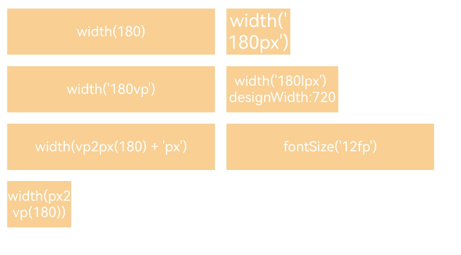

# Pixel Units

Cangjie provides 4 types of pixel units, using vp as the base data unit.

| Name | Description |
|:---|:---|
| px | Physical pixel unit of the screen. |
| vp | Density-independent pixel, converted to physical pixels based on screen pixel density. When a value has no unit specified, vp is the default unit. On a screen with an actual width of 1440 physical pixels, 1vp ≈ 3px.<br/>**Note:** <br/> The ratio between vp and px depends on screen pixel density. |
| fp | Font pixel, similar to vp in adapting to screen density changes, and also adjusts with system font size settings. |
| lpx | Logical viewport pixel unit. The lpx unit represents the ratio between the actual screen width and the logical width (configured via designWidth, default value 720). When designWidth is 720, on a screen with an actual width of 1440 physical pixels, 1lpx equals 2px. |

## Import Module

```cangjie
import kit.ArkUI.*
```

## func fp2px(Length)

```cangjie
public func fp2px(value: Length): Option<Length>
```

**Function:** Converts a value in fp units to px units.

**System Capability:** SystemCapability.ArkUI.ArkUI.Full

**Since:** 22

**Parameters:**

| Parameter | Type | Required | Default | Description |
|:---|:---|:---|:---|:---|
| value | [Length](./cj-common-types.md#interface-length) | Yes | - | The value in fp units to be converted. |

**Return Value:**

| Type | Description |
|:----|:----|
| Option\<[Length](./cj-common-types.md#interface-length)> | The converted value in px units. |

## func lpx2px(Length)

```cangjie
public func lpx2px(value: Length): Option<Length>
```

**Function:** Converts a value in lpx units to px units.

**System Capability:** SystemCapability.ArkUI.ArkUI.Full

**Since:** 22

**Parameters:**

| Parameter | Type | Required | Default | Description |
|:---|:---|:---|:---|:---|
| value | [Length](./cj-common-types.md#interface-length) | Yes | - | The value in lpx units to be converted. |

**Return Value:**

| Type | Description |
|:----|:----|
| Option\<[Length](./cj-common-types.md#interface-length)> | The converted value in px units. |

## func px2fp(Length)

```cangjie
public func px2fp(value: Length): Option<Length>
```

**Function:** Converts a value in px units to fp units.

**System Capability:** SystemCapability.ArkUI.ArkUI.Full

**Since:** 22

**Parameters:**

| Parameter | Type | Required | Default | Description |
|:---|:---|:---|:---|:---|
| value | [Length](./cj-common-types.md#interface-length) | Yes | - | The value in px units to be converted. |

**Return Value:**

| Type | Description |
|:----|:----|
| Option\<[Length](./cj-common-types.md#interface-length)> | The converted value in fp units. |

## func px2lpx(Length)

```cangjie
public func px2lpx(value: Length): Option<Length>
```

**Function:** Converts a value in px units to lpx units.

**System Capability:** SystemCapability.ArkUI.ArkUI.Full

**Since:** 22

**Parameters:**

| Parameter | Type | Required | Default | Description |
|:---|:---|:---|:---|:---|
| value | [Length](./cj-common-types.md#interface-length) | Yes | - | The value in px units to be converted. |

**Return Value:**

| Type | Description |
|:----|:----|
| Option\<[Length](./cj-common-types.md#interface-length)> | The converted value in lpx units. |

## func px2vp(Length)

```cangjie
public func px2vp(value: Length): Option<Length>
```

**Function:** Converts a value in px units to vp units.<br>Note: By default, uses the virtual pixel ratio of the screen where the current UI instance resides for conversion. If the UI instance is not created, uses the default screen's virtual pixel ratio.

**System Capability:** SystemCapability.ArkUI.ArkUI.Full

**Since:** 22

**Parameters:**

| Parameter | Type | Required | Default | Description |
|:---|:---|:---|:---|:---|
| value | [Length](./cj-common-types.md#interface-length) | Yes | - | The value in px units to be converted. |

**Return Value:**

| Type | Description |
|:----|:----|
| Option\<[Length](./cj-common-types.md#interface-length)> | The converted value in vp units. |

## func vp2px(Length)

```cangjie
public func vp2px(value: Length): Option<Length>
```

**Function:** Converts a value in vp units to px units.<br>Note: By default, uses the virtual pixel ratio of the screen where the current UI instance resides for conversion. If the UI instance is not created, uses the default screen's virtual pixel ratio.

**System Capability:** SystemCapability.ArkUI.ArkUI.Full

**Since:** 22

**Parameters:**

| Parameter | Type | Required | Default | Description |
|:---|:---|:---|:---|:---|
| value | [Length](./cj-common-types.md#interface-length) | Yes | - | The value in vp units to be converted. |

**Return Value:**

| Type | Description |
|:----|:----|
| Option\<[Length](./cj-common-types.md#interface-length)> | The converted value in px units. |

## Example Code

<!-- run -->

```cangjie

package ohos_app_cangjie_entry

import kit.ArkUI.*
import ohos.arkui.state_macro_manage.*

@Entry
@Component
class EntryView {
    @State var isShow: Bool = false
    func build() {
        Column() {
            Flex(wrap: FlexWrap.Wrap) {
                Column() {
                    Text("width(180)")
                        .width(180)
                        .height(40)
                        .backgroundColor(0xF9CF93)
                        .textAlign(TextAlign.Center)
                        .fontColor(Color.White)
                        .fontSize(22.vp)
                }.margin(5)

                Column() {
                    Text("width('180px')")
                        .width(180.px)
                        .height(40)
                        .backgroundColor(0xF9CF93)
                        .textAlign(TextAlign.Center)
                        .fontColor(Color.White)
                }.margin(5)

                Column() {
                    Text("width('180vp')")
                        .width(180.vp)
                        .height(40)
                        .backgroundColor(0xF9CF93)
                        .textAlign(TextAlign.Center)
                        .fontColor(Color.White)
                        .fontSize(22.vp)
                }.margin(5)

                Column() {
                    Text("width('180lpx') designWidth:720")
                        .width(180.lpx)
                        .height(40)
                        .backgroundColor(0xF9CF93)
                        .textAlign(TextAlign.Center)
                        .fontColor(Color.White)
                        .fontSize(22.vp)
                }.margin(5)

                Column() {
                    Text("width(vp2px(180) + 'px')")
                        .width(getUIContext().vp2px(180.vp) ?? 180.vp)
                        .height(40)
                        .backgroundColor(0xF9CF93)
                        .textAlign(TextAlign.Center)
                        .fontColor(Color.White)
                        .fontSize(22.vp)
                }.margin(5)

                Column() {
                    Text("fontSize('22fp')")
                        .width(180)
                        .height(40)
                        .backgroundColor(0xF9CF93)
                        .textAlign(TextAlign.Center)
                        .fontColor(Color.White)
                        .fontSize(22.fp)
                }.margin(5)

                Column() {
                    Text("width(px2vp(180))")
                        .width(getUIContext().px2vp(180.px) ?? 180.px )
                        .height(40)
                        .backgroundColor(0xF9CF93)
                        .textAlign(TextAlign.Center)
                        .fontColor(Color.White)
                        .fontSize(22.fp)
                }.margin(5)
            }.width(100.percent)
        }
    }
}

```

