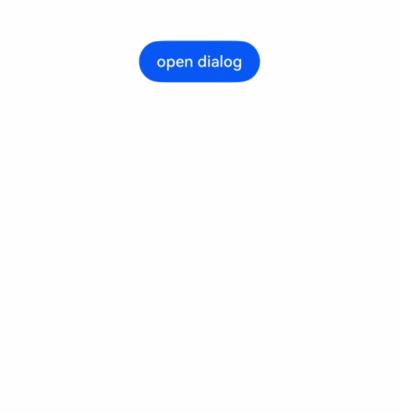

# Custom Dialog (CustomDialog)

Display custom dialogs through the CustomDialogController class. When using dialog components, custom dialogs should be prioritized for easier customization of dialog styles and content.

## Import Module

```cangjie
import kit.ArkUI.*
```

## class CustomDialogController

```cangjie
public class CustomDialogController {
    public init(value: CustomDialogControllerOptions)
}
```

**Function:** Constructs an object of type CustomDialogController.

**System Capability:** SystemCapability.ArkUI.ArkUI.Full

**Since:** 22

### init(CustomDialogControllerOptions)

```cangjie
public init(value: CustomDialogControllerOptions)
```

**Function:** Creates a constructor for custom dialogs.

**System Capability:** SystemCapability.ArkUI.ArkUI.Full

**Since:** 22

**Parameters:**

| Parameter | Type | Required | Default | Description |
|:---|:---|:---|:---|:---|
| value | [CustomDialogControllerOptions](#class-customdialogcontrolleroptions) | Yes | - | Parameters for configuring the custom dialog. |

### func closeDialog()

```cangjie
public func closeDialog(): Unit
```

**Function:** Closes the displayed custom dialog. If already closed, this has no effect.

**System Capability:** SystemCapability.ArkUI.ArkUI.Full

**Since:** 22

### func openDialog()

```cangjie
public func openDialog(): Unit
```

**Function:** Displays the custom dialog content. Can be used multiple times, but if the dialog is in SubWindow mode, it cannot trigger another SubWindow dialog.

**System Capability:** SystemCapability.ArkUI.ArkUI.Full

**Since:** 22

### func releaseSelf()

```cangjie
public func releaseSelf(): Unit
```

**Function:** For UI framework use.

**System Capability:** SystemCapability.ArkUI.ArkUI.Full

**Since:** 22

## class CustomDialogControllerOptions

```cangjie
public class CustomDialogControllerOptions {
    public var cancel: ?VoidCallback
    public var autoCancel: ?Bool
    public var alignment: ?DialogAlignment
    public var offset: ?Offset
    public var customStyle: ?Bool
    public var gridCount: ?UInt32
    public var maskColor: ?ResourceColor
    public var maskRect: ?Rectangle
    public var openAnimation: ?AnimateParam
    public var closeAnimation: ?AnimateParam
    public var showInSubWindow: ?Bool
    public var backgroundColor: ?ResourceColor
    public var cornerRadius: ?Length
    public var isModal: ?Bool
    public var onWillDismiss: ?Callback<DismissDialogAction, Unit>
    public var width: ?Length
    public var height: ?Length
    public var borderWidth: ?Length
    public var borderColor: ?ResourceColor
    public var borderStyle: ?EdgeStyles
    public var shadow: ?ShadowOptions
    public var backgroundBlurStyle: ?BlurStyle
    public init(
        builder!: CustomView,
        cancel!: ?VoidCallback = None,
        autoCancel!: ?Bool = None,
        alignment!: ?DialogAlignment = None,
        offset!: ?Offset = None,
        customStyle!: ?Bool = None,
        gridCount!: ?UInt32 = None,
        maskColor!: ?ResourceColor = None,
        maskRect!: ?Rectangle = None,
        openAnimation!: ?AnimateParam = None,
        closeAnimation!: ?AnimateParam = None,
        showInSubWindow!: ?Bool = None,
        backgroundColor!: ?ResourceColor = None,
        cornerRadius!: ?Length = None,
        isModal!: ?Bool = None,
        onWillDismiss!: ?Callback<DismissDialogAction, Unit> = None,
        width!: ?Length = None,
        height!: ?Length = None,
        borderWidth!: ?Length = None,
        borderColor!: ?ResourceColor = None,
        borderStyle!: ?EdgeStyles = None,
        shadow!: ?ShadowOptions = None,
        backgroundBlurStyle!: ?BlurStyle = None
    )
}
```

**Function:** Declares parameters related to custom dialog settings.

**System Capability:** SystemCapability.ArkUI.ArkUI.Full

**Since:** 22

### var alignment

```cangjie
public var alignment: ?DialogAlignment
```

**Function:** The alignment of the dialog in the vertical direction.Initial Value: DialogAlignment.Default.

**Type:** ?[DialogAlignment](./cj-common-types.md#enum-dialogalignment)

**Read/Write:** Read-Write

**System Capability:** SystemCapability.ArkUI.ArkUI.Full

**Since:** 22

### var autoCancel

```cangjie
public var autoCancel: ?Bool
```

**Function:** Whether clicking the mask layer closes the dialog. true means the dialog will close, false means it will not.Initial Value: true.

**Type:** ?Bool

**Read/Write:** Read-Write

**System Capability:** SystemCapability.ArkUI.ArkUI.Full

**Since:** 22

### var backgroundBlurStyle

```cangjie
public var backgroundBlurStyle: ?BlurStyle
```

**Function:** The blur material of the dialog backplate.Initial Value: BlurStyle.ComponentUltraThick.

**Type:** ?[BlurStyle](./cj-common-types.md#enum-blurstyle)

**Read/Write:** Read-Write

**System Capability:** SystemCapability.ArkUI.ArkUI.Full

**Since:** 22

### var backgroundColor

```cangjie
public var backgroundColor: ?ResourceColor
```

**Function:** Sets the fill color of the dialog backplate.Initial Value: Color.Transparent.

**Type:** ?[ResourceColor](./cj-common-types.md#interface-resourcecolor)

**Read/Write:** Read-Write

**System Capability:** SystemCapability.ArkUI.ArkUI.Full

**Since:** 22

### var borderColor

```cangjie
public var borderColor: ?ResourceColor
```

**Function:** Sets the border color of the dialog backplate.Initial Value: Color.Black.

**Type:** ?[ResourceColor](./cj-common-types.md#interface-resourcecolor)

**Read/Write:** Read-Write

**System Capability:** SystemCapability.ArkUI.ArkUI.Full

**Since:** 22

### var borderStyle

```cangjie
public var borderStyle: ?EdgeStyles
```

**Function:** Sets the border style of the dialog backplate.Initial Value: EdgeStyles().

**Type:** ?[EdgeStyles](./cj-common-types.md#class-edgestyles)

**Read/Write:** Read-Write

**System Capability:** SystemCapability.ArkUI.ArkUI.Full

**Since:** 22

### var borderWidth

```cangjie
public var borderWidth: ?Length
```

**Function:** Sets the border width of the dialog backplate.Initial Value: 0.vp.

**Type:** ?[Length](./cj-common-types.md#interface-length)

**Read/Write:** Read-Write

**System Capability:** SystemCapability.ArkUI.ArkUI.Full

**Since:** 22

### var cancel

```cangjie
public var cancel: ?VoidCallback
```

**Function:** Callback when the dialog is closed via back button, ESC key, or clicking the mask layer.Initial Value: { => }.

**Type:** ?[VoidCallback](./cj-common-types.md#type-voidcallback)

**Read/Write:** Read-Write

**System Capability:** SystemCapability.ArkUI.ArkUI.Full

**Since:** 22

### var closeAnimation

```cangjie
public var closeAnimation: ?AnimateParam
```

**Function:** Customizes the animation parameters for closing the dialog.

**Type:** ?[AnimateParam](./cj-common-types.md#class-animateparam)

**Read/Write:** Read-Write

**System Capability:** SystemCapability.ArkUI.ArkUI.Full

**Since:** 22

### var cornerRadius

```cangjie
public var cornerRadius: ?Length
```

**Function:** Sets the corner radius of the backplate.Initial Value: 32.vp.

**Type:** ?[Length](./cj-common-types.md#interface-length)

**Read/Write:** Read-Write

**System Capability:** SystemCapability.ArkUI.ArkUI.Full

**Since:** 22

### var customStyle

```cangjie
public var customStyle: ?Bool
```

**Function:** Whether the dialog container style is customized.Initial Value: false.

**Type:** ?Bool

**Read/Write:** Read-Write

**System Capability:** SystemCapability.ArkUI.ArkUI.Full

**Since:** 22

### var gridCount

```cangjie
public var gridCount: ?UInt32
```

**Function:** The number of grid widths occupied by the dialog width.

**Type:** ?UInt32

**Read/Write:** Read-Write

**System Capability:** SystemCapability.ArkUI.ArkUI.Full

**Since:** 22

### var height

```cangjie
public var height: ?Length
```

**Function:** Sets the height of the dialog backplate.

**Type:** ?[Length](./cj-common-types.md#interface-length)

**Read/Write:** Read-Write

**System Capability:** SystemCapability.ArkUI.ArkUI.Full

**Since:** 22

### var isModal

```cangjie
public var isModal: ?Bool
```

**Function:** Whether the dialog is a modal window. Modal windows have a mask layer; non-modal windows do not.Initial Value: true

**Type:** ?Bool

**Read/Write:** Read-Write

**System Capability:** SystemCapability.ArkUI.ArkUI.Full

**Since:** 22

### var maskColor

```cangjie
public var maskColor: ?ResourceColor
```

**Function:** Customizes the mask layer color.Initial Value: Color(0x33000000).

**Type:** ?[ResourceColor](./cj-common-types.md#interface-resourcecolor)

**Read/Write:** Read-Write

**System Capability:** SystemCapability.ArkUI.ArkUI.Full

**Since:** 22

### var maskRect

```cangjie
public var maskRect: ?Rectangle
```

**Function:** The mask layer area of the dialog. Events within this area are not transmitted; events outside are transmitted.Initial Value: Rectangle().

**Type:** ?[Rectangle](./cj-common-types.md#class-rectangle)

**Read/Write:** Read-Write

**System Capability:** SystemCapability.ArkUI.ArkUI.Full

**Since:** 22

### var offset

```cangjie
public var offset: ?Offset
```

**Function:** The offset of the dialog relative to the alignment position.Initial Value: Offset(0.vp, 0.vp).

**Type:** ?[Offset](./cj-common-types.md#class-offset)

**Read/Write:** Read-Write

**System Capability:** SystemCapability.ArkUI.ArkUI.Full

**Since:** 22

### var onWillDismiss

```cangjie
public var onWillDismiss: ?Callback<DismissDialogAction, Unit>
```

**Function:** Interactive close callback function.

**Type:** ?[Callback](./cj-common-types.md#type-callbackt-v)\<[DismissDialogAction](./cj-dialog-actionsheet.md#class-dismissdialogaction),Unit>

**Read/Write:** Read-Write

**System Capability:** SystemCapability.ArkUI.ArkUI.Full

**Since:** 22

### var openAnimation

```cangjie
public var openAnimation: ?AnimateParam
```

**Function:** Customizes the animation parameters for opening the dialog.

**Type:** ?[AnimateParam](./cj-common-types.md#class-animateparam)

**Read/Write:** Read-Write

**System Capability:** SystemCapability.ArkUI.ArkUI.Full

**Since:** 22

### var shadow

```cangjie
public var shadow: ?ShadowOptions
```

**Function:** Sets the shadow of the dialog backplate.

**Type:** ?[ShadowOptions](./cj-common-types.md#class-shadowoptions)

**Read/Write:** Read-Write

**System Capability:** SystemCapability.ArkUI.ArkUI.Full

**Since:** 22

### var showInSubWindow

```cangjie
public var showInSubWindow: ?Bool
```

**Function:** Whether to display the dialog in a sub-window when it needs to appear outside the main window.Initial Value: false.

**Type:** ?Bool

**Read/Write:** Read-Write

**System Capability:** SystemCapability.ArkUI.ArkUI.Full

**Since:** 22

### var width

```cangjie
public var width: ?Length
```

**Function:** Sets the width of the dialog backplate.

**Type:** ?[Length](./cj-common-types.md#interface-length)

**Read/Write:** Read-Write

**System Capability:** SystemCapability.ArkUI.ArkUI.Full

**Since:** 22

### init(CustomView, ?VoidCallback, ?Bool, ?DialogAlignment, ?Offset, ?Bool, ?UInt32, ?ResourceColor, ?Rectangle, ?AnimateParam, ?AnimateParam, ?Bool, ?ResourceColor, ?Length, ?Bool, ?Callback\<DismissDialogAction,Unit>, ?Length, ?Length, ?Length, ?ResourceColor, ?EdgeStyles, ?ShadowOptions, ?BlurStyle)

```cangjie
public init(
    builder!: CustomView,
    cancel!: ?VoidCallback = None,
    autoCancel!: ?Bool = None,
    alignment!: ?DialogAlignment = None,
    offset!: ?Offset = None,
    customStyle!: ?Bool = None,
    gridCount!: ?UInt32 = None,
    maskColor!: ?ResourceColor = None,
    maskRect!: ?Rectangle = None,
    openAnimation!: ?AnimateParam = None,
    closeAnimation!: ?AnimateParam = None,
    showInSubWindow!: ?Bool = None,
    backgroundColor!: ?ResourceColor = None,
    cornerRadius!: ?Length = None,
    isModal!: ?Bool = None,
    onWillDismiss!: ?Callback<DismissDialogAction, Unit> = None,
    width!: ?Length = None,
    height!: ?Length = None,
    borderWidth!: ?Length = None,
    borderColor!: ?ResourceColor = None,
    borderStyle!: ?EdgeStyles = None,
    shadow!: ?ShadowOptions = None,
    backgroundBlurStyle!: ?BlurStyle = None
)
```

**Function:** Creates a CustomDialogControllerOptions object.

**System Capability:** SystemCapability.ArkUI.ArkUI.Full

**Since:** 22

**Parameters:**

| Parameter | Type | Required | Default | Description |
|:---|:---|:---|:---|:---|
|builder|CustomView|Yes|-| **Named parameter.** Custom pop-up content constructor.|
|cancel|?[VoidCallback](./cj-common-types.md#type-voidcallback)|No|None| **Named parameter.** Callback when the dialog is closed via back button, ESC key, or clicking the mask layer. Initial value: { => }|
|autoCancel|?Bool|No|None| **Named parameter.** Whether clicking the mask layer closes the dialog. true means the dialog will close, false means it will not. Initial value: true|
|alignment|?[DialogAlignment](./cj-common-types.md#enum-dialogalignment)|No|None| **Named parameter.** The alignment of the dialog in the vertical direction. Initial value: DialogAlignment.Default|
|offset|?[Offset](./cj-common-types.md#class-offset)|No|None| **Named parameter.** The offset of the dialog relative to the alignment position. Initial value: Offset(0.vp, 0.vp)|
|customStyle|?Bool|No|None| **Named parameter.** Whether the dialog container style is customized. Initial value: false<br>When set to false (default):<br/>1. Corner radius is 32.vp.<br/>2. If dialog width/height is not set: The dialog width adapts to the grid system, and the height adapts to the custom content node.<br/>3. If dialog width/height is set: The dialog width does not exceed the maximum width in default style (100% width for custom nodes), and the dialog height does not exceed the maximum height in default style (100% height for custom nodes).<br>When set to true:<br/>1. Corner radius is 0, and the dialog background is transparent.<br/>2. Setting dialog width, height, border width, border style, border color, and shadow width is not supported.|
|gridCount|?UInt32|No|None| **Named parameter.** The number of grid widths occupied by the dialog width.<br>Defaults to adaptive based on window size. Invalid values are treated as defaults, with the maximum grid count being the system's maximum.|
|maskColor|?[ResourceColor](./cj-common-types.md#interface-resourcecolor)|No|None| **Named parameter.** Customizes the mask layer color. Initial value: Color(0x33000000)|
|maskRect|?[Rectangle](./cj-common-types.md#class-rectangle)|No|None| **Named parameter.** The mask layer area of the dialog. Events within the mask layer area are not passed through, and events outside the mask layer area are passed through. Initial value: Rectangle()<br/>**Note:**<br/>maskRect does not take effect when showInSubWindow is true.|
|openAnimation|?[AnimateParam](./cj-common-types.md#class-animateparam)|No|None| **Named parameter.** Customizes the animation effect parameters for dialog opening.<br>**Note:**<br/>The default value of tempo is 1. Values less than or equal to 0 are treated as the default value.<br/>The default value of iterations is 1, which means it plays once by default. Other values are treated as the default value.<br/>playMode controls the animation playback mode. The default value is PlayMode.Normal. Other values are treated as the default value.|
|closeAnimation|?[AnimateParam](./cj-common-types.md#class-animateparam)|No|None| **Named parameter.** Customizes the animation effect parameters for dialog closing.<br>**Note:**<br/>The default value of tempo is 1. Values less than or equal to 0 are treated as the default value.<br/>The default value of iterations is 1, which means it plays once by default. Other values are treated as the default value.<br/>playMode controls the animation playback mode. The default value is PlayMode.Normal. Other values are treated as the default value.<br/>It is recommended to use the default close animation during page transition.|
|showInSubWindow|?Bool|No|None| **Named parameter.** Whether to display the dialog in a sub-window when a dialog needs to be displayed outside the main window. Initial value: false<br>Initial value: false, the dialog is displayed within the application, not in an independent sub-window.<br>**Note:** A dialog with showInSubWindow set to true cannot trigger the display of another dialog with showInSubWindow set to true. |
|backgroundColor|?[ResourceColor](./cj-common-types.md#interface-resourcecolor)|No|None| **Named parameter.** Sets the dialog backplane fill. Initial value: Color.Transparent<br/>**Note:** If the background color of the content builder is also set, backgroundColor will be overridden by the background color of the content builder.<br/>When backgroundColor is set to a non-transparent color, backgroundBlurStyle needs to be set to BlurStyle.NONE, otherwise the color display will not meet the expected effect.|
|cornerRadius|?[Length](./cj-common-types.md#interface-length)|No|None| **Named parameter.** Sets the corner radius of the backplane. Initial value: 32.vp<br/>The radius of each of the four corners can be set separately.<br/>**Note:** The default corner radius of the custom dialog backplane is 32.vp. If you need to use the cornerRadius attribute, use it together with the [borderRadius](./cj-universal-attribute-border.md#func-borderradiustopleft-topright-bottomleft-bottomright) attribute.|
|isModal|?Bool|No|None| **Named parameter.** Whether the dialog is a modal window. Modal windows have a mask layer, and non-modal windows do not. Initial value: true|
|onWillDismiss|?[Callback](./cj-common-types.md#type-callbackt-v)\<[DismissDialogAction](./cj-dialog-actionsheet.md#class-dismissdialogaction),Unit>|No|None| **Named parameter.** Interactive close callback function.<br/>**Note:**<br/>1. When the user performs interactive operations such as clicking the mask layer to close, left/right swipe, three-key back, or keyboard ESC to close, if this callback function is registered, the dialog will not close immediately. In the callback function, the operation type that prevents closing the dialog can be obtained through reason, so you can decide whether to close the dialog based on the reason. The reason returned by the current component does not support the CloseButton enumeration value.<br/>2. In the onWillDismiss callback, onWillDismiss interception cannot be performed again.|
|width|?[Length](./cj-common-types.md#interface-length)|No|None| **Named parameter.** Sets the width of the dialog backplane.<br/>**Note:**<br/>- Default maximum width of the dialog: 400.vp.<br/>- Percentage parameter method: The reference width of the dialog is the width of the window where it is located, and it can be adjusted up or down based on this.|
|height|?[Length](./cj-common-types.md#interface-length)|No|None| **Named parameter.** Sets the height of the dialog backplane.<br/>**Note:**<br/>- Default maximum height of the dialog: 0.9 * (window height - safe area).<br/>- Percentage parameter method: The reference height of the dialog is (window height - safe area), and it can be adjusted up or down based on this.|
|borderWidth|?[Length](./cj-common-types.md#interface-length)|No|None| **Named parameter.** Sets the border width of the dialog backplane. Initial value: 0.vp<br/>The width of each of the four borders can be set separately.<br/>Percentage parameter method: Sets the border width of the dialog as a percentage of the parent element's dialog width.<br/>When the left and right borders of the dialog are greater than the dialog width, or the top and bottom borders are greater than the dialog height, the display may not meet expectations.|
|borderColor|?[ResourceColor](./cj-common-types.md#interface-resourcecolor)|No|None| **Named parameter.** Sets the border color of the dialog backplane. Initial value: Color.Black<br/>If you use the borderColor attribute, it must be used together with the borderWidth attribute.|
|borderStyle|?[EdgeStyles](./cj-common-types.md#class-edgestyles)|No|None| **Named parameter.** Sets the border style of the dialog backplane. Initial value: EdgeStyles()<br/>If you use the borderStyle attribute, it must be used together with the borderWidth attribute.|
|shadow|?[ShadowOptions](./cj-common-types.md#class-shadowoptions)|No|None| **Named parameter.** Sets the shadow of the dialog backplane.<br/>When the device is a 2-in-1 device, the default focused shadow value is ShadowStyle.OuterFloatingMD, and the unfocused shadow value is ShadowStyle.OuterFloatingSM.|
|backgroundBlurStyle|?[BlurStyle](./cj-common-types.md#enum-blurstyle)|No|None| **Named parameter.** Blur material of the dialog backplane. Initial value: BlurStyle.ComponentUltraThick<br/>**Note:**<br/>Set to BlurStyle.None to disable background blur. When backgroundBlurStyle is set to a non-None value, do not set backgroundColor, otherwise the color display will not meet the expected effect.|

<!-- run -->

```cangjie

package ohos_app_cangjie_entry

import kit.ArkUI.*
import ohos.arkui.state_macro_manage.*

@CustomDialog
class MyDialog {
    var controller: Option<CustomDialogController> = Option.None
    func build() {
        Row(space: 60) {
            Button("cancel").onClick({ evt =>
                controller?.releaseSelf()
            })

            Button("confirm").onClick({ evt =>
                controller?.releaseSelf()
            })
        }.height(500.px)
    }
}

@Entry
@Component
class EntryView {
    var dialogController: CustomDialogController = CustomDialogController(CustomDialogControllerOptions(builder: MyDialog()))
    func build() {
        Column {
            Button("open dialog").onClick({evt =>
                dialogController.openDialog()
            })
        }
    }
}

```

