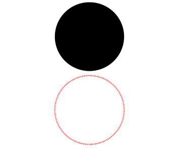

# Circle

<!--Del-->
> **Note:**
>
> Currently in the beta phase.
<!--DelEnd-->

A component for drawing circular shapes.

## Import Module

```cangjie
import kit.ArkUI.*
```

## Child Components

None

## Creating the Component

### init(?Length, ?Length)

```cangjie
public init(width!: ?Length = None, height!: ?Length = None)
```

**Functionality:** Draws a circle with specified width and height. When width and height are unequal, the shorter edge determines the diameter. Invalid values will be processed using initial values.

**System Capability:** SystemCapability.ArkUI.ArkUI.Full

**Initial Version:** 22

**Parameters:**

| Parameter | Type | Required | Default | Description |
|:---|:---|:---|:---|:---|
| width | ?[Length](./cj-common-types.md#interface-length) | No | None | **Named parameter.** Width, value range ≥0. Initial value: 0.vp |
| height | ?[Length](./cj-common-types.md#interface-length) | No | None | **Named parameter.** Height, value range ≥0. Initial value: 0.vp |

## Common Attributes/Events

Common Attributes: Supports all common attributes in addition to [Graphic Drawing Common Attributes](./cj-graphic-drawing-common.md#component-attributes).

Common Events: Fully supported.

## Example Code

<!-- run -->

```cangjie
package ohos_app_cangjie_entry
import kit.ArkUI.*
import ohos.arkui.state_macro_manage.*

@Entry
@Component
class EntryView {
    func build() {
        Column(space: 10) {
            // Draw a circle with diameter of 150
            Circle(width: 150, height: 150)
            // Draw a red dashed circular ring with diameter of 150 (when width/height differ, the shorter edge determines diameter)
            Circle()
                .width(150)
                .height(200)
                .fillOpacity(0.0)
                .strokeWidth(3)
                .stroke(Color.Red)
                .strokeDashArray([1, 2])
        }.width(100.percent)
    }
}
```

