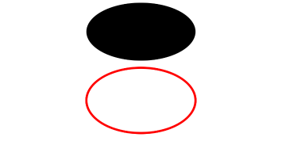

# Ellipse

<!--Del-->
> **Note:**
>
> Currently in the beta phase.
<!--DelEnd-->

An ellipse drawing component.

## Import Module

```cangjie
import kit.ArkUI.*
```

## Child Components

None

## Creating the Component

### init(?Length, ?Length)

```cangjie
public init(width!: ?Length = None, height!: ?Length = None)
```

**Functionality:** Draws an ellipse with specified width and height. Invalid values will be handled using initial values.

**System Capability:** SystemCapability.ArkUI.ArkUI.Full

**Since:** 22

**Parameters:**

| Parameter | Type | Required | Default | Description |
|:---|:---|:---|:---|:---|
| width | ?[Length](./cj-common-types.md#interface-length) | No | None | **Named parameter.** Width, value range ≥0. Initial value: 0.vp |
| height | ?[Length](./cj-common-types.md#interface-length) | No | None | **Named parameter.** Height, value range ≥0. Initial value: 0.vp |

## Common Attributes/Common Events

Common Attributes: In addition to supporting common attributes, it also supports [Graphic Drawing Common Attributes](./cj-graphic-drawing-common.md#component-attributes).

Common Events: Fully supported.

## Example Code

<!-- run -->

```cangjie
package ohos_app_cangjie_entry
import kit.ArkUI.*
import ohos.arkui.state_macro_manage.*

@Entry
@Component
class EntryView {
    func build() {
        Column() {
            // Draw a 150 * 80 ellipse
            Ellipse(width: 150, height: 80)
            // Draw a 150 * 100 red elliptical ring
            Ellipse()
                .width(150)
                .height(100)
                .fillOpacity(0.0)
                .stroke(Color.Red)
                .strokeWidth(3)
                .padding(top: 10)
        }.width(100.percent)
    }
}
```

