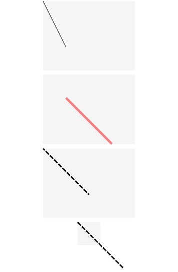
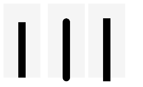
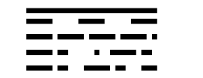

# Line

<!--Del-->
> **Note:**
>
> Currently in the beta phase.
<!--DelEnd-->

A component for drawing straight lines.

## Import Module

```cangjie
import kit.ArkUI.*
```

## Child Components

None

## Creating the Component

### init(?Length, ?Length)

```cangjie
public init(width!: ?Length = None, height!: ?Length = None)
```

**Function:** Draws a straight line within a fill area of specified width and height.

**System Capability:** SystemCapability.ArkUI.ArkUI.Full

**Since:** 22

**Parameters:**

| Parameter | Type | Required | Default | Description |
|:---|:---|:---|:---|:---|
| width | ?[Length](./cj-common-types.md#interface-length) | No | None | **Named parameter.** Width, value range ≥0.<br>When the value is abnormal or omitted, it will be processed according to the width required by its content.<br> Initial value: 0.vp |
| height | ?[Length](./cj-common-types.md#interface-length) | No | None | **Named parameter.** Height, value range ≥0.<br>When the value is abnormal or omitted, it will be processed according to the height required by its content.<br> Initial value: 0.vp |

## Common Attributes/Common Events

Common Attributes: In addition to supporting common attributes, it also supports [Graphic Drawing Common Attributes](./cj-graphic-drawing-common.md#component-attributes).

Common Events: All supported.

## Component Attributes

### func endPoint(?(Float64,Float64))

```cangjie
public func endPoint(value: ?(Float64, Float64)): This
```

**Function:** Sets the endpoint coordinates of the line (relative coordinates). Abnormal values will be processed according to the initial value.

**System Capability:** SystemCapability.ArkUI.ArkUI.Full

**Since:** 22

**Parameters:**

| Parameter | Type | Required | Default | Description |
|:---|:---|:---|:---|:---|
| value | ?(Float64,Float64) | Yes | - | Endpoint coordinates of the line (relative coordinates).<br>Initial value: (0.0, 0.0). |

### func startPoint(?(Float64,Float64))

```cangjie
public func startPoint(value: ?(Float64, Float64)): This
```

**Function:** Sets the starting point coordinates of the line (relative coordinates). Abnormal values will be processed according to the initial value.

**System Capability:** SystemCapability.ArkUI.ArkUI.Full

**Since:** 22

**Parameters:**

| Parameter | Type | Required | Default | Description |
|:---|:---|:---|:---|:---|
| value | ?(Float64,Float64) | Yes | - | Starting point coordinates of the line (relative coordinates).<br>Initial value: (0.0, 0.0). |

## Example Code

### Example 1 (Drawing with Component Attributes)

Using `startPoint`, `endPoint`, `fillOpacity`, `stroke`, `strokeDashArray`, and `strokeDashOffset` attributes to draw the starting point, endpoint, opacity, line color, border gaps, and rendering offset of the line respectively.

<!-- run -->

```cangjie
package ohos_app_cangjie_entry
import kit.ArkUI.*
import ohos.arkui.state_macro_manage.*

@Entry
@Component
class EntryView {
    func build() {
        Column(space: 10) {
            // The coordinates of the line's start and end points are relative to the Line component's drawing area
            Line()
                .width(200)
                .height(150)
                .startPoint((0.0, 0.0))
                .endPoint((50.0, 100.0))
                .stroke(Color.Black)
                .backgroundColor(0xF5F5F5)
            Line()
                .width(200)
                .height(150)
                .startPoint((50.0, 50.0))
                .endPoint((150.0, 150.0))
                .strokeWidth(5)
                .stroke(Color.Red)
                .strokeOpacity(0.5)
                .backgroundColor(0xF5F5F5)
            // strokeDashOffset defines the rendering offset for the associated dashed line strokeDashArray
            Line()
                .width(200)
                .height(150)
                .startPoint((0.0, 0.0))
                .endPoint((100.0, 100.0))
                .stroke(Color.Black)
                .strokeWidth(3)
                .strokeDashArray([10, 3])
                .strokeDashOffset(5)
                .backgroundColor(0xF5F5F5)
            // When the coordinate values exceed the width and height range of the Line component, the line will extend beyond the drawing area
            Line()
                .width(50)
                .height(50)
                .startPoint((0.0, 0.0))
                .endPoint((100.0, 100.0))
                .stroke(Color.Black)
                .strokeWidth(3)
                .strokeDashArray([10, 3])
                .backgroundColor(0xF5F5F5)
        }.width(100.percent)
    }
}
```



### Example 2 (Drawing Line Caps)

Using `strokeLineCap` to draw different line cap styles.

<!-- run -->

```cangjie
package ohos_app_cangjie_entry
import kit.ArkUI.*
import ohos.arkui.state_macro_manage.*

@Entry
@Component
class EntryView {
    func build() {
        Row(space: 10) {
            // When LineCapStyle is Butt
            Line()
                .width(100)
                .height(200)
                .startPoint((50.0, 50.0))
                .endPoint((50.0, 200.0))
                .stroke(Color.Black)
                .strokeWidth(20)
                .strokeLineCap(LineCapStyle.Butt)
                .backgroundColor(0xF5F5F5)
                .margin(10)
            // When LineCapStyle is Round
            Line()
                .width(100)
                .height(200)
                .startPoint((50.0, 50.0))
                .endPoint((50.0, 200.0))
                .stroke(Color.Black)
                .strokeWidth(20)
                .strokeLineCap(LineCapStyle.Round)
                .backgroundColor(0xF5F5F5)
            // When LineCapStyle is Square
            Line()
                .width(100)
                .height(200)
                .startPoint((50.0, 50.0))
                .endPoint((50.0, 200.0))
                .stroke(Color.Black)
                .strokeWidth(20)
                .strokeLineCap(LineCapStyle.Square)
                .backgroundColor(0xF5F5F5)
        }
    }
}
```



### Example 3 (Drawing Dashed Lines)

Using `strokeDashArray` to draw dashed lines with different patterns.

<!-- run -->

```cangjie
package ohos_app_cangjie_entry
import kit.ArkUI.*
import ohos.arkui.state_macro_manage.*

@Entry
@Component
class EntryView {
    func build() {
        Column() {
            Line()
                .width(300)
                .height(30)
                .startPoint((50.0, 30.0))
                .endPoint((300.0, 30.0))
                .stroke(Color.Black)
                .strokeWidth(10)
            // Set strokeDashArray interval to 50
            Line()
                .width(300)
                .height(30)
                .startPoint((50.0, 20.0))
                .endPoint((300.0, 20.0))
                .stroke(Color.Black)
                .strokeWidth(10)
                .strokeDashArray([50])
            // Set strokeDashArray intervals to 50, 10
            Line()
                .width(300)
                .height(30)
                .startPoint((50.0, 20.0))
                .endPoint((300.0, 20.0))
                .stroke(Color.Black)
                .strokeWidth(10)
                .strokeDashArray([50, 10])
            // Set strokeDashArray intervals to 50, 10, 20
            Line()
                .width(300)
                .height(30)
                .startPoint((50.0, 20.0))
                .endPoint((300.0, 20.0))
                .stroke(Color.Black)
                .strokeWidth(10)
                .strokeDashArray([50, 10, 20])
            // Set strokeDashArray intervals to 50, 10, 20, 30
            Line()
                .width(300)
                .height(30)
                .startPoint((50.0, 20.0))
                .endPoint((300.0, 20.0))
                .stroke(Color.Black)
                .strokeWidth(10)
                .strokeDashArray([50, 10, 20, 30])
        }
    }
}
```

