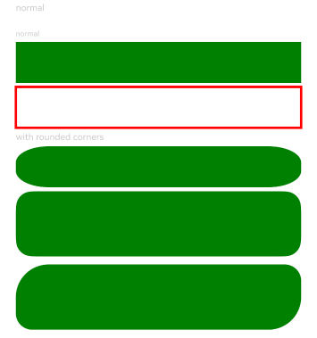

# Rect

A rectangular drawing component.

## Import Module

```cangjie
import kit.ArkUI.*
```

## Child Components

None

## Creating the Component

### init(?Length, ?Length)

```cangjie
public init(width!: ?Length = None, height!: ?Length = None)
```

**Function:** Draws a rectangle with specified width and height. Invalid values will be processed as initial values.

**System Capability:** SystemCapability.ArkUI.ArkUI.Full

**Since:** 22

**Parameters:**

| Parameter | Type | Required | Default | Description |
|:---|:---|:---|:---|:---|
| width | ?[Length](./cj-common-types.md#interface-length) | No | None | **Named parameter.** Width of the rectangle, value range ≥0. Initial value: 0. Default unit: vp. |
| height | ?[Length](./cj-common-types.md#interface-length) | No | None | **Named parameter.** Height of the rectangle, value range ≥0. Initial value: 0. Default unit: vp. |

## Common Attributes/Common Events

Common Attributes: In addition to supporting common attributes, it also supports [Graphic Drawing Common Attributes](./cj-graphic-drawing-common.md#component-attributes).

Common Events: Fully supported.

## Component Attributes

### func radiusWidth(?Length)

```cangjie
public func radiusWidth(value: ?Length): This
```

**Function:** Sets the width of rounded corners. When only width is set, height will match the width. Invalid values will be processed as initial values.

**System Capability:** SystemCapability.ArkUI.ArkUI.Full

**Since:** 22

**Parameters:**

| Parameter | Type | Required | Default | Description |
|:---|:---|:---|:---|:---|
| value | ?[Length](./cj-common-types.md#interface-length) | Yes | - | Width of rounded corners. Initial value: 0.vp |

### func radiusHeight(?Length)

```cangjie
public func radiusHeight(value: ?Length): This
```

**Function:** Sets the height of rounded corners. When only height is set, width will match the height. Invalid values will be processed as initial values.

**System Capability:** SystemCapability.ArkUI.ArkUI.Full

**Since:** 22

**Parameters:**

| Parameter | Type | Required | Default | Description |
|:---|:---|:---|:---|:---|
| value | ?[Length](./cj-common-types.md#interface-length) | Yes | - | Height of rounded corners. Initial value: 0.vp. |

### func radius(?Length)

```cangjie
public func radius(value: ?Length): This
```

**Function:** Sets the radius of rounded corners, value range ≥0. Invalid values will be processed as initial values.

**System Capability:** SystemCapability.ArkUI.ArkUI.Full

**Since:** 22

**Parameters:**

| Parameter | Type | Required | Default | Description |
|:---|:---|:---|:---|:---|
| value | ?[Length](./cj-common-types.md#interface-length) | Yes | - | Radius of rounded corners. Initial value: 0.vp. |

### func radius(?Array\<Length>)

```cangjie
public func radius(value: ?Array<Length>): This
```

**Function:** Sets the radius of rounded corners, value range ≥0. Invalid values will be processed as initial values.

**System Capability:** SystemCapability.ArkUI.ArkUI.Full

**Since:** 22

**Parameters:**

| Parameter | Type | Required | Default | Description |
|:---|:---|:---|:---|:---|
| value | ?Array\<[Length](./cj-common-types.md#interface-length)> | Yes | - | Radius of top-left, top-right, bottom-right, and bottom-left rounded corners.<br>Initial value: 0.vp. |

### func radius(?Array\<(Length, Length)>)

```cangjie
public func radius(radiusArray: ?Array<(Length, Length)>): This
```

**Function:** Sets the radius of rounded corners, value range ≥0. Invalid values will be processed as initial values.

**System Capability:** SystemCapability.ArkUI.ArkUI.Full

**Since:** 22

**Parameters:**

| Parameter | Type | Required | Default | Description |
|:---|:---|:---|:---|:---|
| radiusArray | ?Array\<([Length](./cj-common-types.md#interface-length), [Length](./cj-common-types.md#interface-length))> | Yes | - | Width and height of top-left, top-right, bottom-right, and bottom-left rounded corners.<br>Initial value: 0.<br>Default unit: vp. |

## Example Code

<!-- run -->

```cangjie
package ohos_app_cangjie_entry
import ohos.base.*
import ohos.arkui.component.*
import ohos.arkui.state_management.*
import ohos.arkui.state_macro_manage.*

@Entry
@Component
class EntryView {
    func build() {
        Column(space: 10) {
            Text("normal").fontSize(11).fontColor(0xCCCCCC).width(90.percent)
            // Draw a 90% * 50 rectangle
            Column(space: 5) {
                Text("normal").fontSize(9).fontColor(0xCCCCCC).width(90.percent)
                // Draw a 90% * 50 rectangle
                Rect().width(90.percent).height(50).fill(Color.Green)
                // Draw a 90% * 50 rectangular frame
                Rect()
                .width(90.percent)
                .height(50)
                .fillOpacity(0.0)
                .stroke(Color.Red)
                .strokeWidth(3)

                Text("with rounded corners").fontSize(11).fontColor(0xCCCCCC).width(90.percent)
                // Draw a 90% * 80 rectangle with rounded corners (width: 40, height: 20)
                Rect()
                .width(90.percent)
                .height(50)
                .radiusHeight(20)
                .radiusWidth(40)
                .fill(Color.Green)
                // Draw a 90% * 80 rectangle with rounded corners (radius: 20)
                Rect()
                .width(90.percent)
                .height(80)
                .radius(20)
                .fill(Color.Green)
                .stroke(Color.Transparent)
            }.width(100.percent).margin(top: 10)
            // Draw a 90% * 50 rectangle with rounded corners (top-left: 40x40, top-right: 20x20, bottom-right: 40x40, bottom-left: 20x20)
            Rect()
            .width(90.percent)
            .height(80)
            .radius([(40, 40), (20, 20), (40, 40), (20, 20)])
            .fill(Color.Green)
        }.width(100.percent).margin(top: 5)
    }
}
```

