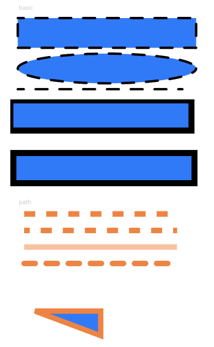

# Shape

<!--Del-->
> **Note:**
>
> Currently in the beta phase.
<!--DelEnd-->

The parent component for drawing components, which describes the common properties supported by all drawing components.

1. Drawing components use Shape as their parent component to achieve SVG-like effects.

2. Drawing components can be used independently to draw specified graphics on the page.

## Import Module

```cangjie
import kit.ArkUI.*
```

## Child Components

Includes [Rect](./cj-graphic-drawing-rect.md), [Circle](./cj-graphic-drawing-circle.md), [Ellipse](./cj-graphic-drawing-ellipse.md), [Image](./cj-image-video-image.md), [Text](./cj-text-input-text.md), [Column](./cj-row-column-stack-column.md), [Row](./cj-row-column-stack-row.md), and Shape child components.

## Creating Components

### init(() -> Unit)

```cangjie
public init(child!: () -> Unit = { => })
```

**Function:** Shape component constructor.

**System Capability:** SystemCapability.ArkUI.ArkUI.Full

**Since:** 22

**Parameters:**

| Parameter | Type | Required | Default Value | Description |
|:---|:---|:---|:---|:---|
| child | () -> Unit | No | { => } | **Named parameter.** Declares the child components supported within the Shape container. |

### init(?PixelMap)

```cangjie
public init(value!: ?PixelMap)
```

**Function:** Shape component constructor.

**System Capability:** SystemCapability.ArkUI.ArkUI.Full

**Since:** 22

**Parameters:**

| Parameter | Type | Required | Default Value | Description |
|:---|:---|:---|:---|:---|
| value | ?[PixelMap](../ImageKit/cj-apis-image.md#class-pixelmap) | Yes | - | **Named parameter.** The drawing target. Graphics can be drawn on the specified PixelMap object. If not set, drawing will occur on the current target. |

## Common Properties/Events

Common Properties: In addition to supporting common properties, it also supports [Graphic Drawing Common Properties](./cj-graphic-drawing-common.md#component-properties).

Common Events: All supported.

## Component Properties

### func viewPort(?Length, ?Length, ?Length, ?Length)

```cangjie
public func viewPort(
    x!: ?Length = None,
    y!: ?Length = None,
    width!: ?Length = None,
    height!: ?Length = None
): This
```

**Function:** Sets the viewport of the Shape.

**System Capability:** SystemCapability.ArkUI.ArkUI.Full

**Since:** 22

**Parameters:**

| Parameter | Type | Required | Default Value | Description |
|:---|:---|:---|:---|:---|
| x | ?[Length](./cj-common-types.md#interface-length) | No | None | **Named parameter.** The x-coordinate of the viewport's starting point. Initial value: 0.vp. |
| y | ?[Length](./cj-common-types.md#interface-length) | No | None | **Named parameter.** The y-coordinate of the viewport's starting point. Initial value: 0.vp. |
| width | ?[Length](./cj-common-types.md#interface-length) | No | None | **Named parameter.** The width of the viewport. Initial value: 0.vp. |
| height | ?[Length](./cj-common-types.md#interface-length) | No | None | **Named parameter.** The height of the viewport. Initial value: 0.vp. |

### func mesh(?Array\<Float64>, ?UInt32, ?UInt32)

```cangjie
public func mesh(value: ?Array<Float64>, column: ?UInt32, row: ?UInt32): This
```

**Function:** Sets mesh deformation data, defining a grid by the given number of columns and rows, and using a coordinate array to perform grid distortion/sampling transformation on the content.

**System Capability:** SystemCapability.ArkUI.ArkUI.Full

**Since:** 22

**Parameters:**

| Parameter | Type | Required | Default Value | Description |
|:---|:---|:---|:---|:---|
| value | ?Array\<Float64> | Yes | - | An array of length (column + 1) * (row + 1) * 2, which records the vertex positions of the distorted bitmap. The sequence of grid control point coordinates (arranged as [x0, y0, x1, y1, …]). Initial value: []. |
| column | ?UInt32 | Yes | - | The number of columns in the mesh matrix. Initial value: 0. |
| row | ?UInt32 | Yes | - | The number of rows in the mesh matrix. Initial value: 0. |

## Example Code

<!-- run -->

```cangjie
package ohos_app_cangjie_entry
import ohos.base.*
import ohos.arkui.component.*
import ohos.arkui.state_management.*
import ohos.arkui.state_macro_manage.*

@Entry
@Component
class EntryView {
    func build() {
        Column(space: 10) {
            Text("basic")
                .fontSize(11)
                .fontColor(0xCCCCCC)
                .width(320)
            Shape() {
                Rect()
                    .width(300)
                    .height(50)
                Ellipse()
                    .width(300)
                    .height(50)
                    .offset(x: 0, y: 60)
                Path()
                    .width(300)
                    .height(10)
                    .commands("M0 0 L900 0")
                    .offset(x: 0, y: 120)
            }
            .width(350)
            .height(140)
            .viewPort(x: -2, y: -2, width: 304, height: 130)
            .fill(0x317AF7)
            .stroke(Color.Black)
            .strokeWidth(4)
            .strokeDashArray([20])
            .strokeDashOffset(10)
            .strokeLineCap(LineCapStyle.Round)
            .strokeLineJoin(LineJoinStyle.Round)
            .antiAlias(true)
            // Draw a 300 * 50 rectangle with a border at points (0, 0) and (-5, -5) in the Shape. The reason for setting the viewport's starting position coordinates to negative values is that the default drawing start point is the midpoint of the line width. Therefore, to fully display the border, the viewport needs to be offset by half the line width.
            Shape() {
                Rect()
                    .width(300)
                    .height(50)
            }
            .width(350)
            .height(80)
            .viewPort(x: 0, y: 0, width: 320, height: 70)
            .fill(0x317AF7)
            .stroke(Color.Black)
            .strokeWidth(10)

            Shape() {
                Rect()
                    .width(300)
                    .height(50)
            }
            .width(350)
            .height(80)
            .viewPort(x: -5, y: -5, width: 320, height: 70)
            .fill(0x317AF7)
            .stroke(Color.Black)
            .strokeWidth(10)

            Text("path")
                .fontSize(11)
                .fontColor(0xCCCCCC)
                .width(320)
            // Draw a straight path at point (0, -5) in the Shape, with color 0xEE8443, line width 10, and line gap 20.
            Shape() {
                Path()
                    .width(300)
                    .height(10)
                    .commands("M0 0 L900 0")
            }
            .width(350)
            .height(20)
            .viewPort(x: 0, y: -5, width: 300, height: 20)
            .stroke(0xEE8443)
            .strokeWidth(10)
            .strokeDashArray([20])
            // Draw a straight path at point (0, -5) in the Shape, with color 0xEE8443, line width 10, line gap 20, and left offset 10.
            Shape() {
                Path()
                    .width(300)
                    .height(10)
                    .commands("M0 0 L900 0")
            }
            .width(350)
            .height(20)
            .viewPort(x: 0, y: -5, width: 300, height: 20)
            .stroke(0xEE8443)
            .strokeWidth(10)
            .strokeDashArray([20])
            .strokeDashOffset(10)
            // Draw a straight path at point (0, -5) in the Shape, with color 0xEE8443, line width 10, and opacity 0.5.
            Shape() {
                Path()
                    .width(300)
                    .height(10)
                    .commands("M0 0 L900 0")
            }
            .width(350)
            .height(20)
            .viewPort(x: 0, y: -5, width: 300, height: 20)
            .stroke(0xEE8443)
            .strokeWidth(10)
            .strokeOpacity(0.5)
            // Draw a straight path at point (0, -5) in the Shape, with color 0xEE8443, line width 10, line gap 20, and rounded line ends.
            Shape() {
                Path()
                    .width(300)
                    .height(10)
                    .commands("M0 0 L900 0")
            }
            .width(350)
            .height(20)
            .viewPort(x: 0, y: -5, width: 300, height: 20)
            .stroke(0xEE8443)
            .strokeWidth(10)
            .strokeDashArray([20])
            .strokeLineCap(LineCapStyle.Round)
            // Draw a closed path at point (-20, -5) in the Shape, with color 0x317AF7, line width 10, border color 0xEE8443, and sharp corner style (initial value).
            Shape() {
                Path()
                    .width(200)
                    .height(60)
                    .commands("M0 0 L400 0 L400 150 Z")
            }
            .width(300)
            .height(200)
            .viewPort(x: -20, y: -5, width: 310, height: 90)
            .fill(0x317AF7)
            .stroke(0xEE8443)
            .strokeWidth(10)
            .strokeLineJoin(LineJoinStyle.Miter)
            .strokeMiterLimit(5.0)
        }.width(100.percent).margin(top: 15)
    }
}
```

