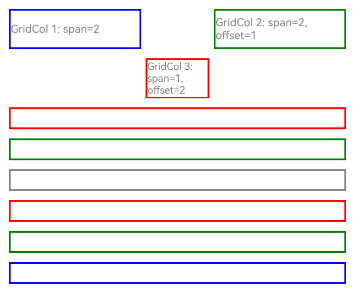
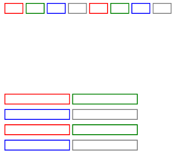

# GridCol

A grid column component that must be used as a child component of a grid container component ([GridRow](./cj-grid-layout-gridrow.md)).

## Import Module

```cangjie
import kit.ArkUI.*
```

## Child Components

Can contain a single child component.

## Creating the Component

### init(Int32, Int32, Int32, () -> Unit)

```cangjie
public init(span!: Int32 = 1, offset!: Int32 = 0, order!: Int32 = 0, child!: () -> Unit = {=>})
```

**Function:** Creates a grid layout child component.

**System Capability:** SystemCapability.ArkUI.ArkUI.Full

**Since:** 21

**Parameters:**

| Parameter | Type | Required | Default | Description |
|:---|:---|:---|:---|:---|
| span | Int32 | No | 1 | **Named parameter.** The number of columns the grid column component occupies in the grid container component ([GridRow](./cj-grid-layout-gridrow.md)).<br>A span of 0 means the element does not participate in layout calculations and will not be rendered. |
| offset | Int32 | No | 0 | **Named parameter.** The number of columns the grid column component is offset relative to the previous grid column component. |
| order | Int32 | No | 0 | **Named parameter.** The sequence number of the element, used to sort grid column components from smallest to largest based on their sequence numbers. |
| child | ()->Unit | No | { => } | **Named parameter.** The child component of the GridCol container. |

### init(GridColColumnOption, GridColColumnOption, GridColColumnOption, () -> Unit)

```cangjie
public init(
    span!: GridColColumnOption,
    offset!: GridColColumnOption,
    order!: GridColColumnOption,
    child!: () -> Unit = {=>}
)
```

**Function:** Creates a grid column component.

**System Capability:** SystemCapability.ArkUI.ArkUI.Full

**Since:** 21

**Parameters:**

| Parameter | Type | Required | Default | Description |
|:---|:---|:---|:---|:---|
| span | [GridColColumnOption](#class-gridcolcolumnoption) | Yes | - | **Named parameter.** The number of columns occupied. |
| offset | [GridColColumnOption](#class-gridcolcolumnoption) | Yes | - | **Named parameter.** The number of columns offset relative to the previous grid column component. |
| order | [GridColColumnOption](#class-gridcolcolumnoption) | Yes | - | **Named parameter.** The sequence number of the element, used to sort grid column components from smallest to largest based on their sequence numbers. |
| child | ()->Unit | No | { => } | **Named parameter.** The child component of the GridCol container. |

## Common Attributes/Common Events

Common Attributes: All supported.

Common Events: All supported.

## Component Attributes

### func gridColOffset(Int32)

```cangjie
public func gridColOffset(value: Int32): This
```

**Function:** Sets the number of columns offset relative to the previous grid column component.

**System Capability:** SystemCapability.ArkUI.ArkUI.Full

**Since:** 21

**Parameters:**

| Parameter | Type | Required | Default | Description |
|:---|:---|:---|:---|:---|
| value | Int32 | Yes | - | The number of columns offset relative to the previous grid column component.<br>Must be a positive integer. Initial value: 0. |

### func gridColOffset(GridColColumnOption)

```cangjie
@!APILevel[
    21,
    stagemodelonly: true,
    syscap: "SystemCapability.ArkUI.ArkUI.Full"
]
public func gridColOffset(value: GridColColumnOption): This
```

**Function:** Sets the number of columns offset relative to the previous grid column component.

**System Capability:** SystemCapability.ArkUI.ArkUI.Full

**Since:** 21

**Parameters:**

| Parameter | Type | Required | Default | Description |
|:---|:---|:---|:---|:---|
| value | [GridColColumnOption](#class-gridcolcolumnoption) | Yes | - | The number of columns offset relative to the previous grid column component. |

### func order(Int32)

```cangjie
public func order(value: Int32): This
```

**Function:** Sets the number of columns offset relative to the previous grid column component.

**System Capability:** SystemCapability.ArkUI.ArkUI.Full

**Since:** 21

**Parameters:**

| Parameter | Type | Required | Default | Description |
|:---|:---|:---|:---|:---|
| value | Int32 | Yes | - | The number of columns offset relative to the previous grid column component.<br>Must be a positive integer. Initial value: 0. |

### func order(GridColColumnOption)

```cangjie
public func order(value: GridColColumnOption): This
```

**Function:** Sets the sequence number of the element, used to sort grid column components from smallest to largest based on their sequence numbers.

**System Capability:** SystemCapability.ArkUI.ArkUI.Full

**Since:** 21

**Parameters:**

| Parameter | Type | Required | Default | Description |
|:---|:---|:---|:---|:---|
| value | [GridColColumnOption](#class-gridcolcolumnoption) | Yes | - | The sequence number of the element. |

### func span(Int32)

```cangjie
public func span(value: Int32): This
```

**Function:** Sets the number of columns occupied.

**System Capability:** SystemCapability.ArkUI.ArkUI.Full

**Since:** 21

**Parameters:**

| Parameter | Type | Required | Default | Description |
|:---|:---|:---|:---|:---|
| value | Int32 | Yes | - | The number of columns occupied.<br>Must be a positive integer. Initial value: 0.<br>A span of 0 means the element does not participate in layout calculations and will not be rendered. |

### func span(GridColColumnOption)

```cangjie
public func span(value: GridColColumnOption): This
```

**Function:** Sets the number of columns occupied.

**System Capability:** SystemCapability.ArkUI.ArkUI.Full

**Since:** 21

**Parameters:**

| Parameter | Type | Required | Default | Description |
|:---|:---|:---|:---|:---|
| value | [GridColColumnOption](#class-gridcolcolumnoption) | Yes | - | The number of columns occupied.<br>A span of 0 means the element does not participate in layout calculations and will not be rendered. |

## Basic Type Definitions

### class GridColColumnOption

```cangjie
public class GridColColumnOption {
    public var xs: Int32
    public var sm: Int32
    public var md: Int32 
    public var lg: Int32
    public var xl: Int32
    public var xxl: Int32
    public init(
        xs!: Int32 = 12,
        sm!: Int32 = 12,
        md!: Int32 = 12,
        lg!: Int32 = 12,
        xl!: Int32 = 12,
        xxl!: Int32 = 12
    )
    public init(value: Int32)
}
```

**Function:** Used to customize the number of grid units occupied by the grid column component on devices with different widths.

**System Capability:** SystemCapability.ArkUI.ArkUI.Full

**Since:** 21

#### var lg

```cangjie
public var lg: Int32
```

**Function:** **Named parameter.** The number of columns occupied or offset by the grid column component on devices with lg grid size.

**Type:** Int32

**Read/Write:** Read-Write

**System Capability:** SystemCapability.ArkUI.ArkUI.Full

**Since:** 21

#### var md

```cangjie
public var md: Int32
```

**Function:** **Named parameter.** The number of columns occupied or offset by the grid column component on devices with md grid size.

**Type:** Int32

**Read/Write:** Read-Write

**System Capability:** SystemCapability.ArkUI.ArkUI.Full

**Since:** 21

#### var sm

```cangjie
public var sm: Int32
```

**Function:** **Named parameter.** The number of columns occupied or offset by the grid column component on devices with sm grid size.

**Type:** Int32

**Read/Write:** Read-Write

**System Capability:** SystemCapability.ArkUI.ArkUI.Full

**Since:** 21

#### var xl

```cangjie
public var xl: Int32
```

**Function:** **Named parameter.** The number of columns occupied or offset by the grid column component on devices with xl grid size.

**Type:** Int32

**Read/Write:** Read-Write

**System Capability:** SystemCapability.ArkUI.ArkUI.Full

**Since:** 21

#### var xs

```cangjie
public var xs: Int32
```

**Function:** **Named parameter.** The number of columns occupied or offset by the grid column component on devices with xs grid size.

**Type:** Int32

**Read/Write:** Read-Write

**System Capability:** SystemCapability.ArkUI.ArkUI.Full

**Since:** 21

#### var xxl

```cangjie
public var xxl: Int32
```

**Function:** **Named parameter.** The number of columns occupied or offset by the grid column component on devices with xxl grid size.

**Type:** Int32

**Read/Write:** Read-Write

**System Capability:** SystemCapability.ArkUI.ArkUI.Full

**Since:** 21

#### init(Int32, Int32, Int32, Int32, Int32, Int32)

```cangjie
public init(
    xs!: Int32 = 12,
    sm!: Int32 = 12,
    md!: Int32 = 12,
    lg!: Int32 = 12,
    xl!: Int32 = 12,
    xxl!: Int32 = 12
)
```

**Function:** Constructs a GridColColumnOption object.

**System Capability:** SystemCapability.ArkUI.ArkUI.Full

**Since:** 21

**Parameters:**

| Parameter | Type | Required | Default | Description |
|:---|:---|:---|:---|:---|
| xs | Int32 | No | 12 | **Named parameter.** The number of columns occupied or offset by the grid column component on devices with xs grid size. |
| sm | Int32 | No | 12 | **Named parameter.** The number of columns occupied or offset by the grid column component on devices with sm grid size. |
| md | Int32 | No | 12 | **Named parameter.** The number of columns occupied or offset by the grid column component on devices with md grid size. |
| lg | Int32 | No | 12 | **Named parameter.** The number of columns occupied or offset by the grid column component on devices with lg grid size. |
| xl | Int32 | No | 12 | **Named parameter.** The number of columns occupied or offset by the grid column component on devices with xl grid size. |
| xxl | Int32 | No | 12 | **Named parameter.** The number of columns occupied or offset by the grid column component on devices with xxl grid size. |

#### init(Int32)

```cangjie
public init(value: Int32)
```

**Function:** Constructs a GridColColumnOption object.

**System Capability:** SystemCapability.ArkUI.ArkUI.Full

**Since:** 21

**Parameters:**

| Parameter | Type | Required | Default | Description |
|:---|:---|:---|:---|:---|
| value | Int32 | Yes | - | The number of columns occupied or offset by the grid column component on devices with any grid size. |

## Example Code

### Common Methods Example for GridCol

This example demonstrates the use of common methods, constructors, and loop rendering for GridCol, showing the effects of span and offset.

<!-- run -->

```cangjie
package ohos_app_cangjie_entry
import kit.ArkUI.*
import ohos.arkui.state_macro_manage.*

@Entry
@Component
class EntryView {
    var bgColors: Array<Color> = [Color.Red, Color.Green, Color.Gray, Color.Red, Color.Green, Color.Blue, Color.Gray]
    var currentBp: String = ""
    func build() {
        Column {
            // GridRow is set to have 5 columns in one row
            GridRow(
                columns: 5,
                gutter: GutterOption(x: 5.vp, y: 10.vp),
                breakpoints: BreakPoints(
                    value: [400.vp, 600.vp, 800.vp],
                    reference: BreakpointsReference.WindowSize
                ),
                direction: GridRowDirection.Row
            ) {
                // GridCol grid column component must be used as a child component of the grid container component (GridRow).
                // Construct the first GridCol child component, occupying 2 columns (columns 1 and 2)
                GridCol() {
                    Row() {
                        Text("GridCol 1: span=2")
                            .fontColor(Color.Gray)
                            .fontSize(12)
                    }
                        .width(100.percent)
                        .height(40.vp)
                }
                .borderColor(Color.Blue)
                .borderWidth(2.vp)
                .span(2)
                // Construct the second GridCol child component, occupying 2 columns, offset by 1 column from the previous grid, thus occupying columns 4 and 5
                GridCol() {
                    Row() {
                        Text("GridCol 2: span=2, offset=1")
                            .fontColor(Color.Gray)
                            .fontSize(12)
                    }
                    .width(100.percent)
                    .height(40.vp)
                }
                .borderColor(Color.Green)
                .borderWidth(2.vp)
                .span(2)
                .gridColOffset(1)
                // Construct the third GridCol child component, occupying 1 column, offset by 2 columns from the previous grid, thus occupying column 3 in the next row
                GridCol() {
                    Row() {
                        Text("GridCol 3: span=1, offset=2")
                            .fontColor(Color.Gray)
                            .fontSize(11)
                    }
                    .width(100.percent)
                    .height(40.vp)
                }
                .borderColor(Color.Red)
                .borderWidth(2.vp)
                .span(1)
                .gridColOffset(2)

                // Loop-rendered grid column components
                ForEach(
                    bgColors,
                    itemGeneratorFunc: {
                        color: Color, index: Int64 => GridCol() {
                            Row().height(20.vp)
                        }
                        .borderWidth(2.vp)
                        .borderColor(color)
                        .span(GridColColumnOption(xs: 12, sm: 12, md: 12, lg: 12, xl: 12, xxl: 12))
                        .id("my_GridCol")
                    }
                )
            }
            .width(100.percent)
            .height(100.percent)
            .onBreakpointChange({
                bp => currentBp = bp
            })
            .alignItems(ItemAlign.Center)
        }
        .margin(left: 10, right:10, top: 5, bottom: 5)
        .height(300)
    }
}
```

### Example of Using with GridRow

Please refer to the grid container example code ([GridRow](./cj-grid-layout-gridrow.md#example-code))

