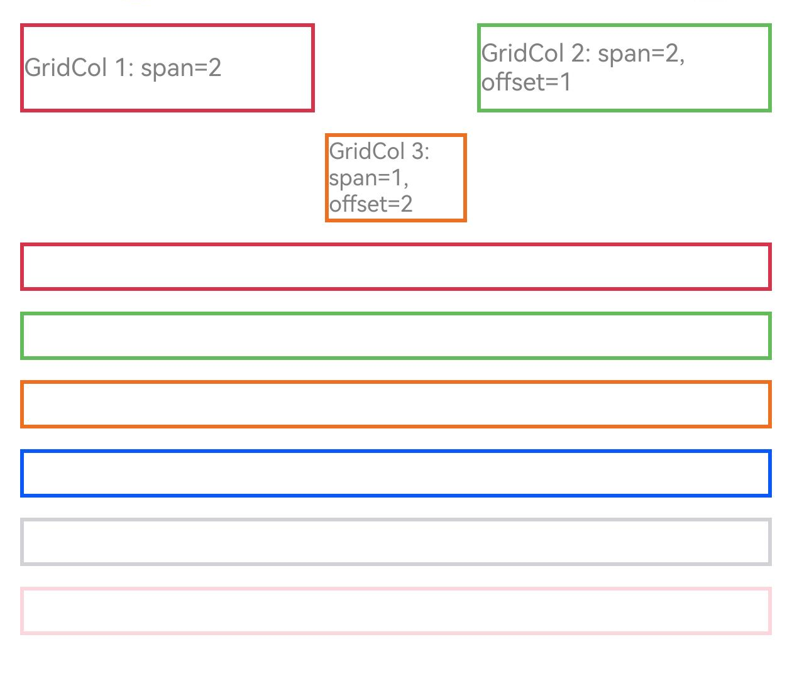

# GridCol

A grid sub-component that must be used as a child component of a grid container component ([GridRow](./cj-grid-layout-gridrow.md)).

## Import Module

```cangjie
import kit.ArkUI.*
```

## Child Components

Can contain a single child component.

## Creating the Component

### init(?Int32, ?Int32, ?Int32, () -> Unit)

```cangjie
public init(span!: ?Int32 = None, offset!: ?Int32 = None, order!: ?Int32 = None, child!: () -> Unit = {=>})
```

**Function:** Creates a grid layout sub-component.

**System Capability:** SystemCapability.ArkUI.ArkUI.Full

**Since Version:** 22

**Parameters:**

| Parameter | Type | Required | Default | Description |
|:---|:---|:---|:---|:---|
| span | ?Int32 | No | None | **Named parameter.** The number of columns the grid sub-component occupies in the grid container component ([GridRow](./cj-grid-layout-gridrow.md)).<br>A span of 0 means the element does not participate in layout calculations and will not be rendered.<br>Initial value: 1. |
| offset | ?Int32 | No | None | **Named parameter.** The number of columns the grid sub-component is offset relative to the previous grid sub-component.<br>Initial value: 0. |
| order | ?Int32 | No | None | **Named parameter.** The sequence number of the element, used to sort grid sub-components from smallest to largest based on their sequence numbers.<br>Initial value: 0. |
| child | () -> Unit | No | {=>} | **Named parameter.** The child component of the GridCol container. |

### init(?GridColOptions, ?GridColOptions, ?GridColOptions, () -> Unit)

```cangjie
public init(
    span!: ?GridColOptions,
    offset!: ?GridColOptions,
    order!: ?GridColOptions,
    child!: () -> Unit = {=>}
)
```

**Function:** Creates a grid sub-component.

**System Capability:** SystemCapability.ArkUI.ArkUI.Full

**Since Version:** 22

**Parameters:**

| Parameter | Type | Required | Default | Description |
|:---|:---|:---|:---|:---|
| span | ?[GridColOptions](#class-gridcoloptions) | Yes | - | **Named parameter.** The number of columns occupied.<br>Initial value: GridColOptions(1) |
| offset | ?[GridColOptions](#class-gridcoloptions) | Yes | - | **Named parameter.** The number of columns offset relative to the previous grid sub-component.<br>Initial value: GridColOptions(0) |
| order | ?[GridColOptions](#class-gridcoloptions) | Yes | - | **Named parameter.** The sequence number of the element, used to sort grid sub-components from smallest to largest based on their sequence numbers.<br>Initial value: GridColOptions(0) |
| child | () -> Unit | No | {=>} | **Named parameter.** The child component of the GridCol container. |

## Common Attributes/Common Events

Common Attributes: All supported.

Common Events: All supported.

## Component Attributes

### func gridColOffset(?Int32)

```cangjie
public func gridColOffset(value: ?Int32): This
```

**Function:** Sets the number of columns offset relative to the previous grid sub-component.

**System Capability:** SystemCapability.ArkUI.ArkUI.Full

**Since Version:** 22

**Parameters:**

| Parameter | Type | Required | Default | Description |
|:---|:---|:---|:---|:---|
| value | ?Int32 | Yes | - | The number of columns offset relative to the previous grid sub-component.<br>Initial value: 12. |

### func gridColOffset(?GridColOptions)

```cangjie
public func gridColOffset(value: ?GridColOptions): This
```

**Function:** Sets the number of columns offset relative to the previous grid sub-component.

**System Capability:** SystemCapability.ArkUI.ArkUI.Full

**Since Version:** 22

**Parameters:**

| Parameter | Type | Required | Default | Description |
|:---|:---|:---|:---|:---|
| value | ?[GridColOptions](#class-gridcoloptions) | Yes | - | The number of columns offset relative to the previous grid sub-component.<br>Initial value: GridColOptions(). |

### func order(?Int32)

```cangjie
public func order(value: ?Int32): This
```

**Function:** Sets the number of columns offset relative to the previous grid sub-component.

**System Capability:** SystemCapability.ArkUI.ArkUI.Full

**Since Version:** 22

**Parameters:**

| Parameter | Type | Required | Default | Description |
|:---|:---|:---|:---|:---|
| value | ?Int32 | Yes | - | The number of columns offset relative to the previous grid sub-component.<br>Initial value: 12. |

### func order(?GridColOptions)

```cangjie
public func order(value: ?GridColOptions): This
```

**Function:** Sets the sequence number of the element, used to sort grid sub-components from smallest to largest based on their sequence numbers.

**System Capability:** SystemCapability.ArkUI.ArkUI.Full

**Since Version:** 22

**Parameters:**

| Parameter | Type | Required | Default | Description |
|:---|:---|:---|:---|:---|
| value | ?[GridColOptions](#class-gridcoloptions) | Yes | - | The sequence number of the element.<br>Initial value: GridColOptions(). |

### func span(?Int32)

```cangjie
public func span(value: ?Int32): This
```

**Function:** Sets the number of columns occupied.

**System Capability:** SystemCapability.ArkUI.ArkUI.Full

**Since Version:** 22

**Parameters:**

| Parameter | Type | Required | Default | Description |
|:---|:---|:---|:---|:---|
| value | ?Int32 | Yes | - | The number of columns occupied.<br>Initial value: 12.<br>A span of 0 means the element does not participate in layout calculations and will not be rendered. |

### func span(?GridColOptions)

```cangjie
public func span(value: ?GridColOptions): This
```

**Function:** Sets the number of columns occupied.

**System Capability:** SystemCapability.ArkUI.ArkUI.Full

**Since Version:** 22

**Parameters:**

| Parameter | Type | Required | Default | Description |
|:---|:---|:---|:---|:---|
| value | ?[GridColOptions](#class-gridcoloptions) | Yes | - | The number of columns occupied.<br>A span of 0 means the element does not participate in layout calculations and will not be rendered.<br>Initial value: GridColOptions(). |

## Basic Type Definitions

### class GridColOptions

```cangjie
public class GridColOptions {
    public var xs: ?Int32
    public var sm: ?Int32
    public var md: ?Int32
    public var lg: ?Int32
    public var xl: ?Int32
    public var xxl: ?Int32
    public init(
        xs!: ?Int32 = None,
        sm!: ?Int32 = None,
        md!: ?Int32 = None,
        lg!: ?Int32 = None,
        xl!: ?Int32 = None,
        xxl!: ?Int32 = None
    )
    public init(value: ?Int32)
}
```

**Function:** Used to customize the number of grid units occupied by the grid sub-component on devices of different widths.

**System Capability:** SystemCapability.ArkUI.ArkUI.Full

**Since Version:** 22

#### var lg

```cangjie
public var lg: ?Int32
```

**Function:** The number of columns occupied or offset by the grid sub-component on devices with grid size lg.

**Type:** ?Int32

**Read/Write:** Readable and Writable

**System Capability:** SystemCapability.ArkUI.ArkUI.Full

**Since Version:** 22

#### var md

```cangjie
public var md: ?Int32
```

**Function:** The number of columns occupied or offset by the grid sub-component on devices with grid size md.

**Type:** ?Int32

**Read/Write:** Readable and Writable

**System Capability:** SystemCapability.ArkUI.ArkUI.Full

**Since Version:** 22

#### var sm

```cangjie
public var sm: ?Int32
```

**Function:** The number of columns occupied or offset by the grid sub-component on devices with grid size sm.

**Type:** ?Int32

**Read/Write:** Readable and Writable

**System Capability:** SystemCapability.ArkUI.ArkUI.Full

**Since Version:** 22

#### var xl

```cangjie
public var xl: ?Int32
```

**Function:** The number of columns occupied or offset by the grid sub-component on devices with grid size xl.

**Type:** ?Int32

**Read/Write:** Readable and Writable

**System Capability:** SystemCapability.ArkUI.ArkUI.Full

**Since Version:** 22

#### var xs

```cangjie
public var xs: ?Int32
```

**Function:** The number of columns occupied or offset by the grid sub-component on devices with grid size xs.

**Type:** ?Int32

**Read/Write:** Readable and Writable

**System Capability:** SystemCapability.ArkUI.ArkUI.Full

**Since Version:** 22

#### var xxl

```cangjie
public var xxl: ?Int32
```

**Function:** The number of columns occupied or offset by the grid sub-component on devices with grid size xxl.

**Type:** ?Int32

**Read/Write:** Readable and Writable

**System Capability:** SystemCapability.ArkUI.ArkUI.Full

**Since Version:** 22

#### init(?Int32, ?Int32, ?Int32, ?Int32, ?Int32, ?Int32)

```cangjie
public init(
    xs!: ?Int32 = None,
    sm!: ?Int32 = None,
    md!: ?Int32 = None,
    lg!: ?Int32 = None,
    xl!: ?Int32 = None,
    xxl!: ?Int32 = None
)
```

**Function:** Constructs a GridColOptions object.

**System Capability:** SystemCapability.ArkUI.ArkUI.Full

**Since Version:** 22

**Parameters:**

| Parameter | Type | Required | Default | Description |
|:---|:---|:---|:---|:---|
| xs | ?Int32 | No | None | **Named parameter.** The number of columns occupied or offset by the grid sub-component on devices with grid size xs.<br>Initial value: 12 |
| sm | ?Int32 | No | None | **Named parameter.** The number of columns occupied or offset by the grid sub-component on devices with grid size sm.<br>Initial value: 12 |
| md | ?Int32 | No | None | **Named parameter.** The number of columns occupied or offset by the grid sub-component on devices with grid size md.<br>Initial value: 12 |
| lg | ?Int32 | No | None | **Named parameter.** The number of columns occupied or offset by the grid sub-component on devices with grid size lg.<br>Initial value: 12 |
| xl | ?Int32 | No | None | **Named parameter.** The number of columns occupied or offset by the grid sub-component on devices with grid size xl.<br>Initial value: 12 |
| xxl | ?Int32 | No | None | **Named parameter.** The number of columns occupied or offset by the grid sub-component on devices with grid size xxl.<br>Initial value: 12 |

#### init(?Int32)

```cangjie
public init(value: ?Int32)
```

**Function:** Constructs a GridColOptions object.

**System Capability:** SystemCapability.ArkUI.ArkUI.Full

**Since Version:** 22

**Parameters:**

| Parameter | Type | Required | Default | Description |
|:---|:---|:---|:---|:---|
| value | ?Int32 | Yes | - | The number of columns occupied or offset by the grid sub-component on devices of any grid size.<br>Initial value: 12 |

## Example Code

### Common Methods Example for GridCol

This example demonstrates the common methods, constructors, and loop rendering usage of GridCol, and shows the effects of span and offset.

<!-- run -->

```cangjie
package ohos_app_cangjie_entry
import kit.ArkUI.*
import ohos.arkui.state_macro_manage.*

@Entry
@Component
class EntryView {
    var bgColors: Array<Color> = [Color.Red, Color.Green, Color.Gray, Color.Red, Color.Green, Color.Blue, Color.Gray]
    var currentBp: String = ""
    func build() {
        Column {
            //GridRow is set to have 5 columns in one row
            GridRow(
                columns: 5,
                gutter: GutterOption(x: 5.vp, y: 10.vp),
                breakpoints: BreakPoints(
                    value: [400.vp, 600.vp, 800.vp],
                    reference: BreakpointsReference.WindowSize
                ),
                direction: GridRowDirection.Row
            ) {
                //GridCol is a grid sub-component that must be used as a child component of a grid container component (GridRow).
                //Construct the first GridCol sub-component, occupying 2 columns (columns 1 and 2)
                GridCol() {
                    Row() {
                        Text("GridCol 1: span=2")
                            .fontColor(Color.Gray)
                            .fontSize(12)
                    }
                        .width(100.percent)
                        .height(40.vp)
                }
                .borderColor(Color.Blue)
                .borderWidth(2.vp)
                .span(2)
                //Construct the second GridCol sub-component, occupying 2 columns, offset by 1 column from the previous grid, thus occupying columns 4 and 5
                GridCol() {
                    Row() {
                        Text("GridCol 2: span=2, offset=1")
                            .fontColor(Color.Gray)
                            .fontSize(12)
                    }
                    .width(100.percent)
                    .height(40.vp)
                }
                .borderColor(Color.Green)
                .borderWidth(2.vp)
                .span(2)
                .gridColOffset(1)
                //Construct the third GridCol sub-component, occupying 1 column, offset by 2 columns from the previous grid, thus occupying column 3 in the next row due to line break
                GridCol() {
                    Row() {
                        Text("GridCol 3: span=1, offset=2")
                            .fontColor(Color.Gray)
                            .fontSize(11)
                    }
                    .width(100.percent)
                    .height(40.vp)
                }
                .borderColor(Color.Red)
                .borderWidth(2.vp)
                .span(1)
                .gridColOffset(2)

                //Loop rendering of grid sub-components
                ForEach(
                    bgColors,
                    itemGeneratorFunc: {
                        color: Color, index: Int64 => GridCol() {
                            Row().height(20.vp)
                        }
                        .borderWidth(2.vp)
                        .borderColor(color)
                        .span(GridColOptions(xs: 12, sm: 12, md: 12, lg: 12, xl: 12, xxl: 12))
                        .id("my_GridCol")
                    }
                )
            }
            .width(100.percent)
            .height(100.percent)
            .onBreakpointChange({
                bp => currentBp = bp
            })
            .alignItems(ItemAlign.Center)
        }
        .margin(left: 10, right:10, top: 5, bottom: 5)
        .height(300)
    }
}
```

### Example of Combined Usage with GridRow

Please refer to the grid container example code ([GridRow](./cj-grid-layout-gridrow.md#example-code))

