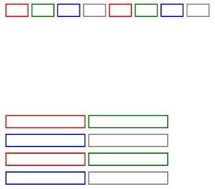

# GridRow

The grid layout provides a structured regularity for layouts, addressing dynamic layout challenges across multiple sizes and devices, ensuring consistent module arrangement across different devices.

The grid container component can only be used with grid child components ([GridCol](./cj-grid-layout-gridcol.md)) in grid layout scenarios.

## Import Module

```cangjie
import kit.ArkUI.*
```

## Child Components

([GridCol](./cj-grid-layout-gridcol.md)) is used in grid layout scenarios.

## Creating Components

### init(?Int32, ?Length, ?BreakPoints, ?GridRowDirection, () -> Unit)

```cangjie
public init(
    columns!: ?Int32,
    gutter!: ?Length = None,
    breakpoints!: ?BreakPoints = Option.None,
    direction!: ?GridRowDirection = Option.None,
    child!: () -> Unit = {=>}
)
```

**Function:** Creates a GridRow container that can include child components.

**System Capability:** SystemCapability.ArkUI.ArkUI.Full

**Since:** 22

**Parameters:**

| Parameter | Type | Required | Default | Description |
|:---|:---|:---|:---|:---|
| columns | ?Int32 | Yes | - | **Named parameter.** Sets the number of layout columns.<br>Initial value: 12. |
| gutter | ?[Length](./cj-common-types.md#interface-length) | No | None | **Named parameter.** Spacing between grid layouts.<br>Initial value: 0.vp. |
| breakpoints | ?[BreakPoints](#class-breakpoints) | No | Option.None | **Named parameter.** Breakpoint sequence for breakpoint values and corresponding references based on window or container size.<br>Initial value: BreakPoints(). |
| direction | ?[GridRowDirection](#enum-gridrowdirection) | No | Option.None | **Named parameter.** Arrangement direction of the grid layout.<br>Initial value: GridRowDirection.Row. |
| child | () -> Unit | No | {=>} | **Named parameter.** Child components of the GridRow container. |

### init(?GridRowOptions, ?Length, ?BreakPoints, ?GridRowDirection, () -> Unit)

```cangjie
public init(
    columns!: ?GridRowOptions = None,
    gutter!: ?Length = None,
    breakpoints!: ?BreakPoints = Option.None,
    direction!: ?GridRowDirection = Option.None,
    child!: () -> Unit = {=>}
)
```

**Function:** Creates a GridRow container that can include child components.

**System Capability:** SystemCapability.ArkUI.ArkUI.Full

**Since:** 22

**Parameters:**

| Parameter | Type | Required | Default | Description |
|:---|:---|:---|:---|:---|
| columns | ?[GridRowOptions](#class-gridrowoptions) | No | None | **Named parameter.** Sets the number of layout columns.<br>Initial value: GridRowOptions() |
| gutter | ?[Length](./cj-common-types.md#interface-length) | No | None | **Named parameter.** Spacing between grid layouts.<br>Initial value: 0.vp |
| breakpoints | ?[BreakPoints](#class-breakpoints) | No | Option.None | **Named parameter.** Breakpoint sequence for breakpoint values and corresponding references based on window or container size.<br>Initial value: BreakPoints() |
| direction | ?[GridRowDirection](#enum-gridrowdirection) | No | Option.None | **Named parameter.** Arrangement direction of the grid layout.<br>Initial value: GridRowDirection.Row |
| child | () -> Unit | No | {=>} | **Named parameter.** Child components of the GridRow container. |

### init(?Int32, ?GutterOption, ?BreakPoints, ?GridRowDirection, () -> Unit)

```cangjie
public init(
    columns!: ?Int32,
    gutter!: ?GutterOption,
    breakpoints!: ?BreakPoints = Option.None,
    direction!: ?GridRowDirection = Option.None,
    child!: () -> Unit = {=>}
)
```

**Function:** Creates a GridRow container that can include child components.

**System Capability:** SystemCapability.ArkUI.ArkUI.Full

**Since:** 22

**Parameters:**

| Parameter | Type | Required | Default | Description |
|:---|:---|:---|:---|:---|
| columns | ?Int32 | Yes | - | **Named parameter.** Sets the number of layout columns.<br>Initial value: 12 |
| gutter | ?[GutterOption](#class-gutteroption) | Yes | - | **Named parameter.** Spacing between grid layouts. |
| breakpoints | ?[BreakPoints](#class-breakpoints) | No | Option.None | **Named parameter.** Breakpoint sequence for breakpoint values and corresponding references based on window or container size.<br>Initial value: BreakPoints() |
| direction | ?[GridRowDirection](#enum-gridrowdirection) | No | Option.None | **Named parameter.** Arrangement direction of the grid layout.<br>Initial value: GridRowDirection.Row |
| child | () -> Unit | No | {=>} | **Named parameter.** Child components of the GridRow container. |

### init(?GridRowOptions, ?GutterOption, ?BreakPoints, ?GridRowDirection, () -> Unit)

```cangjie
public init(
    columns!: ?GridRowOptions = None,
    gutter!: ?GutterOption,
    breakpoints!: ?BreakPoints = Option.None,
    direction!: ?GridRowDirection = Option.None,
    child!: () -> Unit = {=>})
```

**Function:** Creates a GridRow container that can include child components.

**System Capability:** SystemCapability.ArkUI.ArkUI.Full

**Since:** 22

**Parameters:**

| Parameter | Type | Required | Default | Description |
|:---|:---|:---|:---|:---|
| columns | ?[GridRowOptions](#class-gridrowoptions) | No | None | **Named parameter.** Sets the number of layout columns.<br>Initial value: GridRowOptions(). |
| gutter | ?[GutterOption](#class-gutteroption) | Yes | - | **Named parameter.** Spacing between grid layouts. |
| breakpoints | ?[BreakPoints](#class-breakpoints) | No | Option.None | **Named parameter.** Breakpoint sequence for breakpoint values and corresponding references based on window or container size.<br>Initial value: BreakPoints(). |
| direction | ?[GridRowDirection](#enum-gridrowdirection) | No | Option.None | **Named parameter.** Arrangement direction of the grid layout.<br>Initial value: GridRowDirection.Row. |
| child | () -> Unit | No | {=>} | **Named parameter.** Child components of the GridRow container. |

## Common Attributes/Events

Common Attributes: All supported except text styles.

Common Events: All supported.

## Component Attributes

### func alignItems(?ItemAlign)

```cangjie
public func alignItems(value: ?ItemAlign): This
```

**Function:** Sets the vertical main axis alignment of GridCol within GridRow. GridCol itself can also set its own alignment via alignSelf([ItemAlign](./cj-common-types.md#enum-itemalign)). If both alignment methods are set, the GridCol's own setting takes precedence.

**System Capability:** SystemCapability.ArkUI.ArkUI.Full

**Since:** 22

**Parameters:**

| Parameter | Type | Required | Default | Description |
|:---|:---|:---|:---|:---|
| value | ?[ItemAlign](./cj-common-types.md#enum-itemalign) | Yes | - | Vertical main axis alignment of GridCol within GridRow.<br>Initial value: ItemAlign.Start. |

## Component Events

### func onBreakpointChange(?(String) -> Unit)

```cangjie
public func onBreakpointChange(callback: ?(String) -> Unit): This
```

**Function:** Triggers a callback when the breakpoint changes.

**System Capability:** SystemCapability.ArkUI.ArkUI.Full

**Since:** 22

**Parameters:**

| Parameter | Type | Required | Default | Description |
|:---|:---|:---|:---|:---|
| callback | ?(String)->Unit | Yes | - | Callback triggered when the breakpoint changes. Values: "xs", "sm", "md", "lg", "xl", "xxl".<br>Initial value: { res: String => }. |

## Basic Type Definitions

### class BreakPoints

```cangjie
public class BreakPoints {
    public var value: ?Array<Length>
    public var reference: ?BreakpointsReference
    public init(value!: ?Array<Length> = None,
        reference!: ?BreakpointsReference = None
    )
}
```

**Function:** Constructs breakpoints for the grid container component.

**System Capability:** SystemCapability.ArkUI.ArkUI.Full

**Since:** 22

#### var reference

```cangjie
public var reference: ?BreakpointsReference
```

**Function:** Reference for breakpoint switching.

**Type:** ?[BreakpointsReference](#enum-breakpointsreference)

**Read/Write:** Readable and Writable

**System Capability:** SystemCapability.ArkUI.ArkUI.Full

**Since:** 22

#### var value

```cangjie
public var value: ?Array<Length>
```

**Function:** Sets a monotonically increasing array of breakpoint positions.

**Type:** ?Array\<[Length](./cj-common-types.md#interface-length)>

**Read/Write:** Readable and Writable

**System Capability:** SystemCapability.ArkUI.ArkUI.Full

**Since:** 22

#### init(?Array\<Length>, ?BreakpointsReference)

```cangjie
public init(value!: ?Array<Length> = None,
    reference!: ?BreakpointsReference = None
)
```

**Function:** Constructs a BreakPoints object.

**System Capability:** SystemCapability.ArkUI.ArkUI.Full

**Since:** 22

**Parameters:**

| Parameter | Type | Required | Default | Description |
|:---|:---|:---|:---|:---|
| value | ?Array\<[Length](./cj-common-types.md#interface-length)> | No | None | **Named parameter.** Sets a monotonically increasing array of breakpoint positions.<br>Initial value: [320.vp, 600.vp, 840.vp] |
| reference | ?[BreakpointsReference](#enum-breakpointsreference) | No | None | **Named parameter.** Reference for breakpoint switching.<br>Initial value: BreakpointsReference.WindowSize |

### class GridRowSizeOption

```cangjie
public class GridRowSizeOption {
    public var xs: ?Length
    public var sm: ?Length
    public var md: ?Length
    public var lg: ?Length
    public var xl: ?Length
    public var xxl: ?Length
    public init(
        xs!: ?Length = None,
        sm!: ?Length = None,
        md!: ?Length = None,
        lg!: ?Length = None,
        xl!: ?Length = None,
        xxl!: ?Length = None
    )
    public init(value: ?Length)
}
```

**Function:** Gutter size for grids on devices of different widths.

**System Capability:** SystemCapability.ArkUI.ArkUI.Full

**Since:** 22

#### var lg

```cangjie
public var lg: ?Length
```

**Function:** Large-width type devices.

**Type:** ?[Length](./cj-common-types.md#interface-length)

**Read/Write:** Readable and Writable

**System Capability:** SystemCapability.ArkUI.ArkUI.Full

**Since:** 22

#### var md

```cangjie
public var md: ?Length
```

**Function:** Medium-width type devices.

**Type:** ?[Length](./cj-common-types.md#interface-length)

**Read/Write:** Readable and Writable

**System Capability:** SystemCapability.ArkUI.ArkUI.Full

**Since:** 22

#### var sm

```cangjie
public var sm: ?Length
```

**Function:** Small-width type devices.

**Type:** ?[Length](./cj-common-types.md#interface-length)

**Read/Write:** Readable and Writable

**System Capability:** SystemCapability.ArkUI.ArkUI.Full

**Since:** 22

#### var xl

```cangjie
public var xl: ?Length
```

**Function:** Extra-large-width type devices.

**Type:** ?[Length](./cj-common-types.md#interface-length)

**Read/Write:** Readable and Writable

**System Capability:** SystemCapability.ArkUI.ArkUI.Full

**Since:** 22

#### var xs

```cangjie
public var xs: ?Length
```

**Function:** Minimum-width type devices.

**Type:** ?[Length](./cj-common-types.md#interface-length)

**Read/Write:** Readable and Writable

**System Capability:** SystemCapability.ArkUI.ArkUI.Full

**Since:** 22

#### var xxl

```cangjie
public var xxl: ?Length
```

**Function:** Super-large-width type devices.

**Type:** ?[Length](./cj-common-types.md#interface-length)

**Read/Write:** Readable and Writable

**System Capability:** SystemCapability.ArkUI.ArkUI.Full

**Since:** 22

#### init(?Length, ?Length, ?Length, ?Length, ?Length, ?Length)

```cangjie
public init(
    xs!: ?Length = None,
    sm!: ?Length = None,
    md!: ?Length = None,
    lg!: ?Length = None,
    xl!: ?Length = None,
    xxl!: ?Length = None
)
```

**Function:** Constructs a GridRowSizeOption object.

**System Capability:** SystemCapability.ArkUI.ArkUI.Full

**Since:** 22

**Parameters:**

| Parameter | Type | Required | Default | Description |
|:---|:---|:---|:---|:---|
| xs | ?[Length](./cj-common-types.md#interface-length) | No | None | **Named parameter.** Number of columns occupied or offset by grid child components on xs-sized devices.<br>Initial value: 0.vp |
| sm | ?[Length](./cj-common-types.md#interface-length) | No | None | **Named parameter.** Number of columns occupied or offset by grid child components on sm-sized devices.<br>Initial value: 0.vp |
| md | ?[Length](./cj-common-types.md#interface-length) | No | None | **Named parameter.** Number of columns occupied or offset by grid child components on md-sized devices.<br>Initial value: 0.vp |
| lg | ?[Length](./cj-common-types.md#interface-length) | No | None | **Named parameter.** Number of columns occupied or offset by grid child components on lg-sized devices.<br>Initial value: 0.vp |
| xl | ?[Length](./cj-common-types.md#interface-length) | No | None | **Named parameter.** Number of columns occupied or offset by grid child components on xl-sized devices.<br>Initial value: 0.vp |
| xxl | ?[Length](./cj-common-types.md#interface-length) | No | None | **Named parameter.** Number of columns occupied or offset by grid child components on xxl-sized devices.<br>Initial value: 0.vp |

#### init(?Length)

```cangjie
public init(value: ?Length)
```

**Function:** Constructs a GridRowSizeOption object.

**System Capability:** SystemCapability.ArkUI.ArkUI.Full

**Since:** 22

**Parameters:**

| Parameter | Type | Required | Default | Description |
|:---|:---|:---|:---|:---|
| value | ?[Length](./cj-common-types.md#interface-length) | Yes | - | Number of columns occupied or offset by grid child components on devices of any grid size.<br>Initial value: 0.vp |

### class GutterOption

```cangjie
public class GutterOption {
    public init(x!: ?Length = None, y!: ?Length = None)
    public init(x!: ?GridRowSizeOption, y!: ?GridRowSizeOption)
}
```

**Function:** Grid layout spacing type, used to describe the spacing between grid subcomponents in different directions.

**System Capability:** SystemCapability.ArkUI.ArkUI.Full

**Since:** 22

#### init(?Length, ?Length)

```cangjie
public init(x!: ?Length = None, y!: ?Length = None)
```

**Function:** Constructs a GutterOption object.

**System Capability:** SystemCapability.ArkUI.ArkUI.Full

**Since:** 22

**Parameters:**

| Parameter | Type | Required | Default | Description |
|:---|:---|:---|:---|:---|
| x | ?[Length](./cj-common-types.md#interface-length) | No | None | **Named parameter.** Spacing of grid subcomponents in the x-direction.<br>Initial value: 0.vp |
| y | ?[Length](./cj-common-types.md#interface-length) | No | None | **Named parameter.** Spacing of grid subcomponents in the y-direction.<br>Initial value: 0.vp |

#### init(?GridRowSizeOption, ?GridRowSizeOption)

```cangjie
public init(x!: ?GridRowSizeOption, y!: ?GridRowSizeOption)
```

**Function:** Constructs a GutterOption object.

**System Capability:** SystemCapability.ArkUI.ArkUI.Full

**Since:** 22

**Parameters:**

| Parameter | Type | Required | Default | Description |
|:---|:---|:---|:---|:---|
| x | ?[GridRowSizeOption](#class-gridrowsizeoption) | No | None | **Named parameter.** Spacing of grid subcomponents in the x-direction.<br>Initial value: GridRowSizeOption() |
| y | ?[GridRowSizeOption](#class-gridrowsizeoption) | No | None | **Named parameter.** Spacing of grid subcomponents in the y-direction.<br>Initial value: GridRowSizeOption() |

### class GridRowOptions

```cangjie
public class GridRowOptions {
    public var xs: ?Int32
    public var sm: ?Int32
    public var md: ?Int32
    public var lg: ?Int32
    public var xl: ?Int32
    public var xxl: ?Int32
    public init(
        xs!: ?Int32 = None,
        sm!: ?Int32 = None,
        md!: ?Int32 = None,
        lg!: ?Int32 = None,
        xl!: ?Int32 = None,
        xxl!: ?Int32 = None
    )
    public init(value: ?Int32)
}
```

**Function:** Number of grid columns under different device width types.

**System Capability:** SystemCapability.ArkUI.ArkUI.Full

**Since:** 22

#### var lg

```cangjie
public var lg: ?Int32
```

**Function:** **Named parameter.** Number of columns occupied or offset by grid subcomponents on devices with lg grid size.

**Type:** ?Int32

**Read/Write:** Readable and Writable

**System Capability:** SystemCapability.ArkUI.ArkUI.Full

**Since:** 22

#### var md

```cangjie
public var md: ?Int32
```

**Function:** **Named parameter.** Number of columns occupied or offset by grid subcomponents on devices with md grid size.

**Type:** ?Int32

**Read/Write:** Readable and Writable

**System Capability:** SystemCapability.ArkUI.ArkUI.Full

**Since:** 22

#### var sm

```cangjie
public var sm: ?Int32
```

**Function:** **Named parameter.** Number of columns occupied or offset by grid subcomponents on devices with sm grid size.

**Type:** ?Int32

**Read/Write:** Readable and Writable

**System Capability:** SystemCapability.ArkUI.ArkUI.Full

**Since:** 22

#### var xl

```cangjie
public var xl: ?Int32
```

**Function:** **Named parameter.** Number of columns occupied or offset by grid subcomponents on devices with xl grid size.

**Type:** ?Int32

**Read/Write:** Readable and Writable

**System Capability:** SystemCapability.ArkUI.ArkUI.Full

**Since:** 22

#### var xs

```cangjie
public var xs: ?Int32
```

**Function:** **Named parameter.** Number of columns occupied or offset by grid subcomponents on devices with xs grid size.

**Type:** ?Int32

**Read/Write:** Readable and Writable

**System Capability:** SystemCapability.ArkUI.ArkUI.Full

**Since:** 22

#### var xxl

```cangjie
public var xxl: ?Int32
```

**Function:** **Named parameter.** Number of columns occupied or offset by grid subcomponents on devices with xxl grid size.

**Type:** ?Int32

**Read/Write:** Readable and Writable

**System Capability:** SystemCapability.ArkUI.ArkUI.Full

**Since:** 22

#### init(?Int32, ?Int32, ?Int32, ?Int32, ?Int32, ?Int32)

```cangjie
public init(
    xs!: ?Int32 = None,
    sm!: ?Int32 = None,
    md!: ?Int32 = None,
    lg!: ?Int32 = None,
    xl!: ?Int32 = None,
    xxl!: ?Int32 = None
)
```

**Function:** Constructs a GridRowOptions object.

**System Capability:** SystemCapability.ArkUI.ArkUI.Full

**Since:** 22

**Parameters:**

| Parameter | Type | Required | Default | Description |
|:---|:---|:---|:---|:---|
| xs | ?Int32 | No | None | **Named parameter.** Number of columns occupied or offset by grid subcomponents on devices with xs grid size.<br>Initial value: 2 |
| sm | ?Int32 | No | None | **Named parameter.** Number of columns occupied or offset by grid subcomponents on devices with sm grid size.<br>Initial value: 4 |
| md | ?Int32 | No | None | **Named parameter.** Number of columns occupied or offset by grid subcomponents on devices with md grid size.<br>Initial value: 8 |
| lg | ?Int32 | No | None | **Named parameter.** Number of columns occupied or offset by grid subcomponents on devices with lg grid size.<br>Initial value: 12 |
| xl | ?Int32 | No | None | **Named parameter.** Number of columns occupied or offset by grid subcomponents on devices with xl grid size.<br>Initial value: 12 |
| xxl | ?Int32 | No | None | **Named parameter.** Number of columns occupied or offset by grid subcomponents on devices with xxl grid size.<br>Initial value: 12 |

#### init(?Int32)

```cangjie
public init(value: ?Int32)
```

**Function:** Constructs a GridRowOptions object.

**System Capability:** SystemCapability.ArkUI.ArkUI.Full

**Since:** 22

**Parameters:**

| Parameter | Type | Required | Default | Description |
|:---|:---|:---|:---|:---|
| value | ?Int32 | Yes | - | Number of columns occupied or offset by grid subcomponents on devices of any grid size.<br>Initial value: 12 |

### enum BreakpointsReference

```cangjie
public enum BreakpointsReference <: Equatable<BreakpointsReference> {
    | WindowSize
    | ComponentSize
    | ...
}
```

**Function:** Sets the reference to either window size or container size.

**System Capability:** SystemCapability.ArkUI.ArkUI.Full

**Since:** 22

**Parent Type:** Equatable\<[BreakpointsReference](#enum-breakpointsreference)>

#### ComponentSize

```cangjie
ComponentSize
```

**Function:** Uses container size as reference.

**System Capability:** SystemCapability.ArkUI.ArkUI.Full

**Since:** 22

#### WindowSize

```cangjie
WindowSize
```

**Function:** Uses window size as reference.

**System Capability:** SystemCapability.ArkUI.ArkUI.Full

**Since:** 22

#### operator func !=(BreakpointsReference)

```cangjie
public operator func !=(other: BreakpointsReference): Bool
```

**Function:** Compares whether two enum values are not equal.

**System Capability:** SystemCapability.ArkUI.ArkUI.Full

**Since:** 22

**Parameters:**

| Parameter | Type | Required | Default | Description |
|:---|:---|:---|:---|:---|
| other | [BreakpointsReference](#enum-breakpointsreference) | Yes | - | Another enum value to compare. |

**Return Value:**

| Type | Description |
|:----|:----|
| Bool | Returns true if the two enum values are not equal, otherwise returns false. |

#### operator func ==(BreakpointsReference)

```cangjie
public operator func ==(other: BreakpointsReference): Bool
```

**Function:** Compares whether two enum values are equal.

**System Capability:** SystemCapability.ArkUI.ArkUI.Full

**Since:** 22

**Parameters:**

| Parameter | Type | Required | Default | Description |
|:---|:---|:---|:---|:---|
| other | [BreakpointsReference](#enum-breakpointsreference) | Yes | - | Another enum value to compare. |

**Return Value:**

| Type | Description |
|:----|:----|
| Bool | Returns true if the two enum values are equal, otherwise returns false. |

### enum GridRowDirection

```cangjie
public enum GridRowDirection <: Equatable<GridRowDirection> {
    | Row
    | RowReverse
    | ...
}
```

**Function:** Arranges grid elements in row or column direction.

**System Capability:** SystemCapability.ArkUI.ArkUI.Full

**Since:** 22

**Parent Type:** Equatable\<[GridRowDirection](#enum-gridrowdirection)>

#### Row

```cangjie
Row
```

**Function:** Uses row direction as the main axis for layout mode.

**System Capability:** SystemCapability.ArkUI.ArkUI.Full

**Since:** 22

#### RowReverse

```cangjie
RowReverse
```

**Function:** Layouts in the opposite direction of Row.

**System Capability:** SystemCapability.ArkUI.ArkUI.Full

**Since:** 22

#### operator func !=(GridRowDirection)

```cangjie
public operator func !=(other: GridRowDirection): Bool
```

**Function:** Compares whether two enum values are not equal.

**System Capability:** SystemCapability.ArkUI.ArkUI.Full

**Since:** 22.

**Parameters:**

| Parameter | Type | Required | Default | Description |
|:---|:---|:---|:---|:---|
| other | [GridRowDirection](#enum-gridrowdirection) | Yes | - | Another enum value to compare. |

**Return Value:**

| Type | Description |
|:----|:----|
| Bool | Returns true if the two enum values are not equal, otherwise returns false. |

#### operator func ==(GridRowDirection)

```cangjie
public operator func ==(other: GridRowDirection): Bool
```

**Function:** Compares whether two enum values are equal.

**System Capability:** SystemCapability.ArkUI.ArkUI.Full

**Since:** 22

**Parameters:**

| Parameter | Type | Required | Default | Description |
|:---|:---|:---|:---|:---|
| other | [GridRowDirection](#enum-gridrowdirection) | Yes | - | Another enum value to compare. |

**Return Value:**

| Type | Description |
|:----|:----|
| Bool | Returns true if the two enum values are equal, otherwise returns false. |## Sample Code

<!-- run -->

```cangjie
package ohos_app_cangjie_entry
import kit.ArkUI.*
import ohos.arkui.state_macro_manage.*

@Entry
@Component
class EntryView {
    var bgColors: Array<Color> = [Color.Red, Color.Green, Color.Blue, Color.Gray, Color.Red, Color.Green, Color.Blue, Color.Gray]
    var currentBp: String = ""
    func build() {
        Column {
            GridRow(
                // Set the number of grid columns for different device width types.
                // xs: minimum width devices   sm: small width devices    md: medium width devices.
                // lg: large width devices     xl: extra large width devices  xxl: super large width devices.
                columns: GridRowOptions(xs: 6, sm: 7, md: 8, lg: 9, xl: 10, xxl: 11),
                // Set grid layout spacing, where x represents horizontal and y represents vertical direction.
                gutter: GutterOption(x: 5.vp, y: 10.vp),
                // Set breakpoint values and corresponding references based on window or container size.
                breakpoints: BreakPoints(
                    // Enable four breakpoints: xs, sm, md, lg
                    value: [200.vp, 300.vp, 400.vp], // Set a monotonically increasing array for breakpoint positions.
                    reference: BreakpointsReference.WindowSize
                ), // Set to use window as reference.
                // Set grid layout direction, arranged in row direction.
                direction: GridRowDirection.Row
            ) {
                // Loop render grids with colors from bgColors
                ForEach(
                    bgColors,
                    itemGeneratorFunc: {
                        color: Color, index: Int64 => GridCol() {
                            Row()
                                .width(100.percent)
                                .height(20.vp)
                        }
                        .borderWidth(2.vp)
                        .borderColor(color)
                        .span(1)
                    }
                )
            }
                .width(100.percent)
                .height(200)
                .onBreakpointChange({bp => currentBp = bp})
                .alignItems(ItemAlign.Center) // Set vertical main axis alignment for GridCol in GridRow. Here set to center alignment.

            GridRow(
                // Set layout column count to 5
                columns: 5,
                // Set grid layout spacing: 5vp horizontal, 10vp vertical.
                gutter: GutterOption(x: 5.vp, y: 10.vp),
                // Set breakpoint values and corresponding references based on window or container size.
                breakpoints: BreakPoints(
                    // Enable four breakpoints: xs, sm, md, lg
                    value: [400.vp, 600.vp, 800.vp], // Set a monotonically increasing array for breakpoint positions.
                    reference: BreakpointsReference.WindowSize // Set to use window as reference.
                ),
                direction: GridRowDirection.Row
            ) {
                ForEach(
                    bgColors,
                    itemGeneratorFunc: {
                        color: Color, index: Int64 => GridCol() {
                            Row()
                                .width(100.percent)
                                .height(20.vp)
                        }
                        .borderWidth(2.vp)
                        .borderColor(color)
                        .span(GridColOptions(xs: 2, sm: 3, md: 4, lg: 5, xl: 6, xxl: 7))
                    }
                )
            }
            .width(100.percent)
            .height(100.percent)
            .onBreakpointChange({bp => currentBp = bp})
            .alignItems(ItemAlign.Center)
        }
        .margin(left: 10, right: 10, top: 5, bottom: 5)
        .height(400)
    }
}
```

