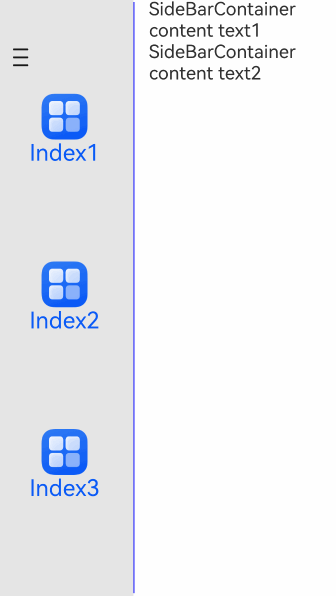

# SideBarContainer

Provides a sidebar container that can be shown or hidden. The sidebar and content area are defined through child components, where the first child component represents the sidebar and the second represents the content area.

## Import Module

```cangjie
import kit.ArkUI.*
```

## Child Components

Can contain child components.

> **Note:**
>
> - Child component types: System components and custom components. Rendering control types are not supported ([if/else](../../arkui-cj/rendering_control/cj-rendering-control-ifelse.md), [ForEach](cj-state-rendering-foreach.md), [LazyForEach](cj-state-rendering-lazyforeach.md)).
> - Number of child components: Must contain exactly 2 child components.
> - Exception handling for child component count: If there are 3 or more child components, the first and second will be displayed. If there is only 1 child component, the sidebar will be displayed, and the content area will be blank.

## Creating the Component

### init(?SideBarContainerType, () -> Unit)

```cangjie
public init(sideBarType!: ?SideBarContainerType = None, child!: () -> Unit = {=>})
```

**Function:** Creates a sidebar container.

**System Capability:** SystemCapability.ArkUI.ArkUI.Full

**Initial Version:** 22

**Parameters:**

| Parameter | Type | Required | Default | Description |
|:---|:---|:---|:---|:---|
| sideBarType | ?[SideBarContainerType](./cj-common-types.md#enum-sidebarcontainertype) | No | None | **Named parameter.** Sets the display type of the sidebar.<br>Initial value: SideBarContainerType.Embed. |
| child | () -> Unit | No | {=>} | **Named parameter.** Defines the sidebar and content area. |

## Common Attributes/Common Events

Common attributes: All supported.

Common events: All supported.

## Component Attributes

### func autoHide(?Bool)

```cangjie
public func autoHide(value: ?Bool): This
```

**Function:** Sets whether the sidebar automatically hides when dragged to a width smaller than the minimum width.

> **Note:**
>
> - Affected by the [minSideBarWidth](#func-minsidebarwidthlength) attribute method. If [minSideBarWidth](#func-minsidebarwidthlength) is not set, the initial value is used.
> - Determines whether to auto-hide during dragging. A damping effect is required to trigger hiding when the width is less than the minimum (exceeding a certain distance).

**System Capability:** SystemCapability.ArkUI.ArkUI.Full

**Initial Version:** 22

**Parameters:**

| Parameter | Type | Required | Default | Description |
|:---|:---|:---|:---|:---|
| value | ?Bool | Yes | - | Whether the sidebar automatically hides when dragged to a width smaller than the minimum width.<br>true: Auto-hides.<br>false: Does not auto-hide.<br>Initial value: true. |

### func controlButton(?ButtonStyle)

```cangjie
public func controlButton(value: ?ButtonStyle): This
```

**Function:** Sets the attributes of the sidebar control button.

**System Capability:** SystemCapability.ArkUI.ArkUI.Full

**Initial Version:** 22

**Parameters:**

| Parameter | Type | Required | Default | Description |
|:---|:---|:---|:---|:---|
| value | ?[ButtonStyle](./cj-button-picker-button.md#enum-buttontype) | Yes | - | Attributes of the sidebar control button. |

### func divider(?DividerStyle)

```cangjie
public func divider(value: ?DividerStyle): This
```

**Function:** Sets the style of the divider line.

**System Capability:** SystemCapability.ArkUI.ArkUI.Full

**Initial Version:** 22

**Parameters:**

| Parameter | Type | Required | Default | Description |
|:---|:---|:---|:---|:---|
| value | ?[DividerStyle](#class-dividerstyle) | Yes | - | Style of the divider line. The divider is displayed by default.<br>Initial value: DividerStyle(strokeWidth: 1.vp) |

### func maxSideBarWidth(?Length)

```cangjie
public func maxSideBarWidth(value: ?Length): This
```

**Function:** Sets the maximum width of the sidebar.

> **Note:**
>
> - If set to a value less than 0, the default value is used. The value cannot exceed the width of the sidebar container itself; if it does, the container's width is used.
> - maxSideBarWidth takes precedence over the child component's maxWidth. If maxSideBarWidth is not set, the default value takes precedence over the child component's maxWidth.

**System Capability:** SystemCapability.ArkUI.ArkUI.Full

**Initial Version:** 22

**Parameters:**

| Parameter | Type | Required | Default | Description |
|:---|:---|:---|:---|:---|
| value | ?[Length](./cj-common-types.md#interface-length) | Yes | - | Sets the maximum width of the sidebar.<br>Unit: vp.<br>Initial value: 280.vp. |

### func minContentWidth(?Length)

```cangjie
public func minContentWidth(value: ?Length): This
```

**Function:** Sets the minimum displayable width of the SideBarContainer's content area.

> **Note:**
>
> - If the minimum width is set to less than 0, the content area's minimum width is 360.vp. If this attribute is not set, the content area can shrink to 0.
> - In Embed mode, increasing the component size only increases the content area's size.
> - When reducing the component size, the content area's width is first reduced to minContentWidth. Further reduction maintains the content area's width at minContentWidth and reduces the sidebar's width first. When the sidebar's width reaches minSideBarWidth, further reduction:
>
>     - If autoHide is false, the sidebar width remains at minSideBarWidth and the content area width at minContentWidth, but the content area will be truncated.
>     - If autoHide is true, the sidebar is hidden first, and then the content area width is reduced to minContentWidth, after which the content area width remains unchanged but is truncated.
>
> - minContentWidth takes precedence over the sidebar's [maxSideBarWidth](#func-maxsidebarwidthlength) and [sideBarWidth](#func-sidebarwidthlength) attributes. If minContentWidth is not set, the default value has lower priority than [minSideBarWidth](#func-minsidebarwidthlength) and [maxSideBarWidth](#func-maxsidebarwidthlength).

**System Capability:** SystemCapability.ArkUI.ArkUI.Full

**Initial Version:** 22

**Parameters:**

| Parameter | Type | Required | Default | Description |
|:---|:---|:---|:---|:---|
| value | ?[Length](./cj-common-types.md#interface-length) | Yes | - | The minimum displayable width of the SideBarContainer's content area.<br>Unit: vp.<br>Initial value: 360.vp. |

### func minSideBarWidth(?Length)

```cangjie
public func minSideBarWidth(value: ?Length): This
```

**Function:** Sets the minimum width of the sidebar.

> **Note:**
>
> - If set to a value less than 0, the default value is used. The value cannot exceed the width of the sidebar container itself; if it does, the container's width is used.
> - minSideBarWidth takes precedence over the child component's minWidth. If minSideBarWidth is not set, the default value takes precedence over the child component's minWidth.

**System Capability:** SystemCapability.ArkUI.ArkUI.Full

**Initial Version:** 22

**Parameters:**

| Parameter | Type | Required | Default | Description |
|:---|:---|:---|:---|:---|
| value | ?[Length](./cj-common-types.md#interface-length) | Yes | - | The minimum width of the sidebar.<br>Initial value: 240.vp. |

### func showControlButton(?Bool)

```cangjie
public func showControlButton(value: ?Bool): This
```

**Function:** Sets whether to display the control button.

**System Capability:** SystemCapability.ArkUI.ArkUI.Full

**Initial Version:** 22

**Parameters:**

| Parameter | Type | Required | Default | Description |
|:---|:---|:---|:---|:---|
| value | ?Bool | Yes | - | Whether to display the control button.<br>true: Displays the control button.<br>false: Does not display the control button.<br>Initial value: true. |

### func showSideBar(?Bool)

```cangjie
public func showSideBar(value: ?Bool): This
```

**Function:** Sets whether to display the sidebar.

**System Capability:** SystemCapability.ArkUI.ArkUI.Full

**Initial Version:** 22

**Parameters:**

| Parameter | Type | Required | Default | Description |
|:---|:---|:---|:---|:---|
| value | ?Bool | Yes | - | Whether to display the sidebar.<br>true: Displays the sidebar.<br>false: Does not display the sidebar.<br>Initial value: true. |

### func sideBarPosition(?SideBarPosition)

```cangjie
public func sideBarPosition(value: ?SideBarPosition): This
```

**Function:** Sets the display position of the sidebar.

**System Capability:** SystemCapability.ArkUI.ArkUI.Full

**Initial Version:** 22

**Parameters:**

| Parameter | Type | Required | Default | Description |
|:---|:---|:---|:---|:---|
| value | ?[SideBarPosition](./cj-common-types.md#enum-sidebarposition) | Yes | - | The display position of the sidebar.<br>Initial value: SideBarPosition.Start. |

### func sideBarWidth(?Length)

```cangjie
public func sideBarWidth(value: ?Length): This
```

**Function:** Sets the width of the sidebar.

> **Note:**
>
> If set to a value less than 0, the default value is used. Constrained by the minimum and maximum widths, the closest valid value is used if outside the range.

**System Capability:** SystemCapability.ArkUI.ArkUI.Full

**Initial Version:** 22

**Parameters:**

| Parameter | Type | Required | Default | Description |
|:---|:---|:---|:---|:---|
| value | ?[Length](./cj-common-types.md#interface-length) | Yes | - | The width of the sidebar.<br>Unit: vp.<br>Initial value: 240.vp. |

## Component Events

### func onChange(?(Bool) -> Unit)

```cangjie
public func onChange(callback: ?(Bool) -> Unit): This
```

**Function:** Triggered when the sidebar's state changes between shown and hidden.

> **Note:**
>
> This event is triggered under any of the following conditions:
>
> - When the [showSideBar](#func-showsidebarbool) attribute value changes.
> - When the [showSideBar](#func-showsidebarbool) attribute's adaptive behavior changes.
> - When dragging the divider triggers [autoHide](#func-autohidebool).

**System Capability:** SystemCapability.ArkUI.ArkUI.Full

**Initial Version:** 22

**Parameters:**

| Parameter | Type | Required | Default | Description |
|:---|:---|:---|:---|:---|
| callback | ?(Bool)->Unit | Yes | - | Callback function. When the sidebar changes from hidden to shown, the parameter is true; when it changes from shown to hidden, the parameter is false.<br>Initial value: { _ => }. |

## Basic Type Definitions

### class ButtonIconOptions

```cangjie
public class ButtonIconOptions {
    public var shown: ?ResourceStr
    public var hidden: ?ResourceStr
    public var switching: ?ResourceStr
    public init(shown!: ?ResourceStr, hidden!: ?ResourceStr, switching!: ?ResourceStr = None)
}
```

**Function:** Represents the icon type.

**System Capability:** SystemCapability.ArkUI.ArkUI.Full

**Initial Version:** 22

#### var shown

```cangjie
public var shown: ?ResourceStr
```

**Function:** The icon of the control button when the sidebar is shown.

**Type:** ?[ResourceStr](./cj-common-types.md#interface-resourcestr)

**Read/Write:** Readable and writable

**System Capability:** SystemCapability.ArkUI.ArkUI.Full

**Initial Version:** 22

#### var hidden

```cangjie
public var hidden: ?ResourceStr
```

**Function:** The icon of the control button when the sidebar is hidden.

**Type:** ?[ResourceStr](./cj-common-types.md#interface-resourcestr)

**Read/Write:** Readable and writable

**System Capability:** SystemCapability.ArkUI.ArkUI.Full

**Initial Version:** 22

#### var switching

```cangjie
public var switching: ?ResourceStr
```

**Function:** The icon of the control button during the transition between shown and hidden states.

**Type:** ?[ResourceStr](./cj-common-types.md#interface-resourcestr)

**Read/Write:** Readable and writable

**System Capability:** SystemCapability.ArkUI.ArkUI.Full

**Initial Version:** 22

#### init(?ResourceStr, ?ResourceStr, ?ResourceStr)

```cangjie
public init(shown!: ?ResourceStr, hidden!: ?ResourceStr, switching!: ?ResourceStr = None)
```

**Function:** Constructs a ButtonIconOptions object.

**System Capability:** SystemCapability.ArkUI.ArkUI.Full

**Initial Version:** 22

**Parameters:**

| Parameter | Type | Required | Default | Description |
|:---|:---|:---|:---|:---|
| shown | ?[ResourceStr](./cj-common-types.md#interface-resourcestr) | Yes | - | **Named parameter.** Sets the icon of the control button when the sidebar is shown. |
| hidden | ?[ResourceStr](./cj-common-types.md#interface-resourcestr) | Yes | - | **Named parameter.** Sets the icon of the control button when the sidebar is hidden. |
| switching | ?[ResourceStr](./cj-common-types.md#interface-resourcestr) | No | None | **Named parameter.** Sets the icon of the control button during the transition between shown and hidden states.<br>Initial value: "" |

### class ButtonStyle

```cangjie
public class ButtonStyle {
    public var left: ?Float64
    public var top: ?Float64
    public var width: ?Float64
    public var height: ?Float64
    public var icons: ?ButtonIconOptions
    public init(
        left!: ?Float64 = None,
        top!: ?Float64 = None,
        width!: ?Float64 = None,
        height!: ?Float64 = None,
        icons!: ?ButtonIconOptions = None
    )
}
```

**Function:** Represents the attributes of the sidebar control button.

**System Capability:** SystemCapability.ArkUI.ArkUI.Full

**Initial Version:** 22

#### var left

```cangjie
public var left: ?Float64
```

**Function:** Sets the left margin of the control button from the container's left boundary.<br>Unit: vp.

**Type:** ?Float64

**Read/Write:** Readable and writable

**System Capability:** SystemCapability.ArkUI.ArkUI.Full

**Initial Version:** 22

#### var top

```cangjie
public var top: ?Float64
```

**Function:** Sets the top margin of the control button from the container's top boundary.<br>Unit: vp.

**Type:** ?Float64

**Read/Write:** Readable and writable

**System Capability:** SystemCapability.ArkUI.ArkUI.Full

**Initial Version:** 22

#### var width

```cangjie
public var width: ?Float64
```

**Function:** Sets the width of the control button.<br>Unit: vp.

**Type:** ?Float64

**Read/Write:** Readable and writable

**System Capability:** SystemCapability.ArkUI.ArkUI.Full

**Initial Version:** 22

#### var height

```cangjie
public var height: ?Float64
```

**Function:** Sets the height of the control button.<br>Unit: vp.

**Type:** ?Float64

**Read/Write:** Readable and writable

**System Capability:** SystemCapability.ArkUI.ArkUI.Full

**Initial Version:** 22

#### var icons

```cangjie
public var icons: ?ButtonIconOptions
```

**Function:** Sets the icons of the control button.

**Type:** ?[ButtonIconOptions](#class-buttoniconoptions)

**System Capability:** SystemCapability.ArkUI.ArkUI.Full

**Read/Write:** Readable and writable

**Initial Version:** 22

#### init(?Float64, ?Float64, ?Float64, ?Float64, ?ButtonIconOptions)

```cangjie
public init(
    left!: ?Float64 = None,
    top!: ?Float64 = None,
    width!: ?Float64 = None,
    height!: ?Float64 = None,
    icons!: ?ButtonIconOptions = None
)
```

**Function:** Constructs a ButtonStyle object.

**System Capability:** SystemCapability.ArkUI.ArkUI.Full

**Initial Version:** 22

**Parameters:**

| Parameter | Type | Required | Default | Description |
|:---|:---|:---|:---|:---|
| left | ?Float64 | No | None | **Named parameter.** Sets the left margin of the control button from the container's left boundary.<br>Unit: vp.<br>Initial value: 16.0. |
| top | ?Float64 | No | None | **Named parameter.** Sets the top margin of the control button from the container's top boundary.<br>Unit: vp.<br>Initial value: 48.0. |
| width | ?Float64 | No | None | **Named parameter.** Sets the width of the control button.<br>Unit: vp.<br>Initial value: 24.0. |
| height | ?Float64 | No | None | **Named parameter## Sample Code

<!-- run -->

```cangjie
package ohos_app_cangjie_entry
import kit.ArkUI.*
import ohos.arkui.state_management.*
import ohos.arkui.state_macro_manage.*
import ohos.i18n.*
import ohos.resource_manager.*
import ohos.resource.__GenerateResource__

@Entry
@Component
class EntryView {
    @State var arr: Array<Int64> = [1, 2, 3]
    @State var current: Int64 = 1
    var normalIcon: AppResource = @r(app.media.startIcon)
    let ctrlButton: ButtonStyle = ButtonStyle(left: 17.0, top: 49.0, width: 20.0, height: 31.0,
        icons: ButtonIconOptions(shown: "", hidden: "", switching: ""))
    func build() {
        SideBarContainer() {
            Column() {
                ForEach(
                    this.arr,
                    itemGeneratorFunc: {
                        item: Int64, idx: Int64 => Column() {
                            Image(this.normalIcon)
                                .width(50)
                                .height(50)
                            Text("Index${item}")
                                .fontSize(25)
                                .fontColor(0x0A59F7)
                                .fontFamily("source-sans-pro,cursive,sans-serif")
                        }.onClick({
                            event => this.current = idx
                        })
                    }
                )
            }
                .width(100.percent)
                .justifyContent(FlexAlign.SpaceEvenly)
                .backgroundColor(0x19000000)
            Column() {
                Text('SideBarContainer content text1')
                    .fontSize(20)
                Text('SideBarContainer content text2')
                    .fontSize(20)
            }
        }
            .id("SideBarDefault")
            .showSideBar(true)
            .showControlButton(true)
            .showControlButton(true)
            .autoHide(false)
            .sideBarWidth(150.vp)
            .minSideBarWidth(50.vp)
            .maxSideBarWidth(300.vp)
            .minContentWidth(1.vp)
            .sideBarPosition(SideBarPosition.Start)
            .controlButton(ctrlButton)
            .width(90.percent)
            .height(85.percent)
    }
}
```

