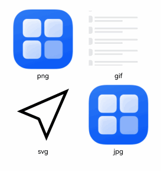
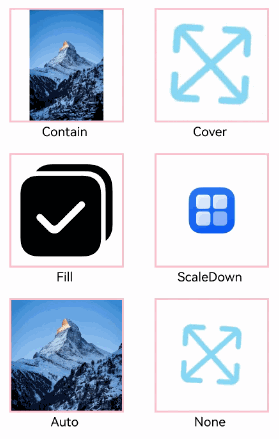
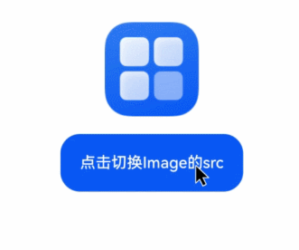
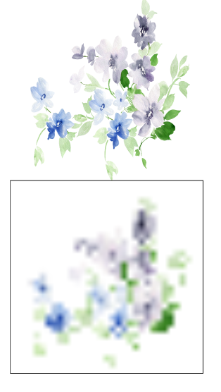
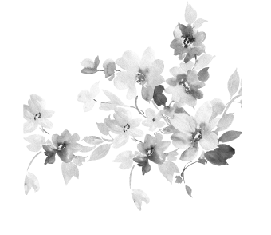
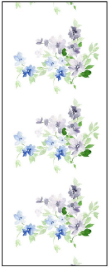
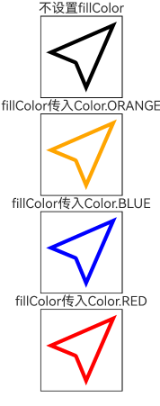

# Image

The Image component is used to display images in applications. It supports image formats including png, jpg, jpeg, bmp, svg, webp, gif, and heif.

> **Notes:**
>
> - When copying the Image component using shortcut keys, the Image component must be in a [focused state](./cj-universal-attribute-focus.md#func-focusontouchbool). By default, the Image component is not focusable. To enable focus, set the [focusable](cj-apis-window.md#var-focusable) attribute to true, then use the TAB key to switch focus to the component. Setting the [focusOnTouch](./cj-universal-attribute-focus.md#func-focusontouchbool) attribute to true will allow the component to gain focus when clicked.
> - The component supports SVG image sources. For SVG tag documentation, refer to [SVG Tag Description](../ImageKit/cj-apis-image.md#svg标签说明).
> - The playback of animated images depends on the visibility changes of the Image node. By default, animations are not played. When the node becomes visible, the animation starts via a callback, and when the node becomes invisible, the animation stops. The visibility state is determined by the [onVisibleAreaChange](./cj-ui-framework.md#func-onvisibleareachangearrayfloat64-boolfloat64---unit) event. When the visible threshold ratio is greater than 0, the Image is considered visible.

## Import Module

```cangjie
import kit.ArkUI.*
```

## Required Permissions

When using network images, add the internet usage permission `ohos.permission.INTERNET` to the `"requestPermissions"` section in module.json5.

```json
"requestPermissions": [
    { "name": "ohos.permission.INTERNET"}
]
```

## Child Components

None

## Creating the Component

### init(?ResourceStr)

```cangjie
public init(src: ?ResourceStr)
```

**Function:** Obtains an image from the image data source for subsequent rendering and display.

> **Notes:**
>
> - If the Image component fails to load the image or the image size is 0, the component size automatically becomes 0 and does not follow the parent component's layout constraints.
> - By default, the Image component crops the image from the center. For example, if the component's width and height are set to the same value but the original image has unequal dimensions, the middle area is cropped.
> - If the Image loads successfully and no width or height is set for the component, its display size adapts to the parent component.

**System Capability:** SystemCapability.ArkUI.ArkUI.Full

**Initial Version:** 22

**Parameters:**

| Parameter | Type | Required | Default Value | Description |
|:---|:---|:---|:---|:---|
| src | ?[ResourceStr](./cj-common-types.md#interface-resourcestr) | Yes | - | The data source of the image.<br>Default value: "" |

### init(?PixelMap)

```cangjie
public init(src: ?PixelMap)
```

**Function:** Obtains an image from the image data source for subsequent rendering and display.

> **Notes:**
>
> - If the Image component fails to load the image or the image size is 0, the component size automatically becomes 0 and does not follow the parent component's layout constraints.
> - By default, the Image component crops the image from the center. For example, if the component's width and height are set to the same value but the original image has unequal dimensions, the middle area is cropped.
> - If the Image loads successfully and no width or height is set for the component, its display size adapts to the parent component.

**System Capability:** SystemCapability.ArkUI.ArkUI.Full

**Initial Version:** 22

**Parameters:**

| Parameter | Type | Required | Default Value | Description |
|:---|:---|:---|:---|:---|
| src | ?[PixelMap](../ImageKit/cj-apis-image.md#class-pixelmap) | Yes | - | The data source of the image.<br/>PixelMap is a pixel map format commonly used in image editing scenarios. |

## Universal Attributes/Events

Universal Attributes: All supported.

> **Note:**
>
> The Image component does not support the universal attribute [foregroundColor](./cj-universal-attribute-foregroundcolor.md#func-foregroundcolorresourcecolor). Instead, use the Image component's [fillColor](#func-fillcolorresourcecolor) attribute to set the fill color.

Universal Events: All supported.

## Component Attributes

### func alt(?ResourceStr)

```cangjie
public func alt(src: ?ResourceStr): This
```

**Function:** Sets the placeholder image displayed during image loading.

**System Capability:** SystemCapability.ArkUI.ArkUI.Full

**Initial Version:** 22

**Parameters:**

| Parameter | Type | Required | Default Value | Description |
|:---|:---|:---|:---|:---|
| src | ?[ResourceStr](./cj-common-types.md#interface-resourcestr) | Yes | - | The placeholder image displayed during loading. Supports local images (png, jpg, bmp, svg, gif, and heif types). Network images are not supported.<br>Default value: "". |

### func autoResize(?Bool)

```cangjie
public func autoResize(value: ?Bool): This
```

**Function:** Sets whether to automatically scale the image source during decoding.

> **Note:**
>
> This operation determines the source image size used for drawing based on the display area dimensions, which helps reduce memory usage.

**System Capability:** SystemCapability.ArkUI.ArkUI.Full

**Initial Version:** 22

**Parameters:**

| Parameter | Type | Required | Default Value | Description |
|:---|:---|:---|:---|:---|
| value | ?Bool | Yes | - | Whether to automatically scale the image source during decoding. When set to true, the component determines the source image size used for drawing based on the display area dimensions, which helps reduce memory usage. For example, if the original image size is 1920x1080 and the display area size is 200x200, the image will be downsampled to 200x200 during decoding, significantly saving memory.<br>Default value: false |

### func fillColor(?ResourceColor)

```cangjie
public func fillColor(value: ?ResourceColor): This
```

**Function:** Sets the fill color to replace the SVG image color. Only effective for SVG image sources.

> **Note:**
>
> To modify the color of a PNG image, use [colorFilter](#class-colorfilter).

**System Capability:** SystemCapability.ArkUI.ArkUI.Full

**Initial Version:** 22

**Parameters:**

| Parameter | Type | Required | Default Value | Description |
|:---|:---|:---|:---|:---|
| value | ?[ResourceColor](./cj-common-types.md#interface-resourcecolor) | Yes | - | The fill color to set. |

### func fitOriginalSize(?Bool)

```cangjie
public func fitOriginalSize(value: ?Bool): This
```

**Function:** Sets whether the display size of the image follows the source image size. If the Image component size is not set, its display size will follow the source image size.

**System Capability:** SystemCapability.ArkUI.ArkUI.Full

**Initial Version:** 22

**Parameters:**

| Parameter | Type | Required | Default Value | Description |
|:---|:---|:---|:---|:---|
| value | ?Bool | Yes | - | Whether to follow the source image size.<br>Default value: false. |

### func interpolation(?ImageInterpolation)

```cangjie
public func interpolation(value: ?ImageInterpolation): This
```

**Function:** Sets the interpolation effect for the image, mitigating aliasing issues during scaling.

> **Notes:**
>
> - Reduces aliasing when low-resolution images are enlarged. Only applies to image upscaling.
> - SVG image sources do not support this attribute.

**System Capability:** SystemCapability.ArkUI.ArkUI.Full

**Initial Version:** 22

**Parameters:**

| Parameter | Type | Required | Default Value | Description |
|:---|:---|:---|:---|:---|
| value | ?[ImageInterpolation](./cj-common-types.md#enum-imageinterpolation) | Yes | - | The interpolation effect for the image.<br>Default value: ImageInterpolation.Low. |

### func matchTextDirection(?Bool)

```cangjie
public func matchTextDirection(value: ?Bool): This
```

**Function:** Sets whether the image follows the system language direction, displaying a mirrored flip effect in RTL language environments.

**System Capability:** SystemCapability.ArkUI.ArkUI.Full

**Initial Version:** 22

**Parameters:**

| Parameter | Type | Required | Default Value | Description |
|:---|:---|:---|:---|:---|
| value | ?Bool | Yes | - | Whether to follow the system language direction.<br>Default value: false. |

### func objectFit(?ImageFit)

```cangjie
public func objectFit(value: ?ImageFit): This
```

**Function:** Sets the fill effect of the image.

**System Capability:** SystemCapability.ArkUI.ArkUI.Full

**Initial Version:** 22

**Parameters:**

| Parameter | Type | Required | Default Value | Description |
|:---|:---|:---|:---|:---|
| value | ?[ImageFit](./cj-common-types.md#enum-imagefit) | Yes | - | The fill effect of the image.<br>Default value: ImageFit.Cover. |

### func objectRepeat(?ImageRepeat)

```cangjie
public func objectRepeat(value: ?ImageRepeat): This
```

**Function:** Sets the repeat style of the image.

> **Notes:**
>
> - Repeats from the center outward. If there is insufficient space for another image, it will be truncated.
> - SVG image sources do not support this attribute.

**System Capability:** SystemCapability.ArkUI.ArkUI.Full

**Initial Version:** 22

**Parameters:**

| Parameter | Type | Required | Default Value | Description |
|:---|:---|:---|:---|:---|
| value | ?[ImageRepeat](./cj-common-types.md#enum-imagerepeat) | Yes | - | The repeat style of the image.<br>Default value: ImageRepeat.NoRepeat. |

### func renderMode(?ImageRenderMode)

```cangjie
public func renderMode(value: ?ImageRenderMode): This
```

**Function:** Sets the rendering mode of the image.

> **Notes:**
>
> - SVG image sources do not support this attribute.
> - If [ColorFilter](#class-colorfilter) is set, this attribute setting will not take effect.

**System Capability:** SystemCapability.ArkUI.ArkUI.Full

**Initial Version:** 22

**Parameters:**

| Parameter | Type | Required | Default Value | Description |
|:---|:---|:---|:---|:---|
| value | ?[ImageRenderMode](./cj-common-types.md#enum-imagerendermode) | Yes | - | The rendering mode of the image. SVG image sources do not support this attribute.<br>Default value: ImageRenderMode.Original. |

### func sourceSize(?Length, ?Length)

```cangjie
public func sourceSize(width: ?Length, height: ?Length): This
```

**Function:** Decodes the original image into a PixelMap image of the specified size. PixelMap resources do not support this function.

**System Capability:** SystemCapability.ArkUI.ArkUI.Full

**Initial Version:** 22

**Parameters:**

| Parameter | Type | Required | Default Value | Description |
|:---|:---|:---|:---|:---|
| width | ?[Length](./cj-common-types.md#interface-length) | Yes | - | The width of the decoded image.<br>Default value: 0.0.px. |
| height | ?[Length](./cj-common-types.md#interface-length) | Yes | - | The height of the decoded image.<br>Default value: 0.0.px. |

### func syncLoad(?Bool)

```cangjie
public func syncLoad(value: ?Bool): This
```

**Function:** Sets whether to load the image synchronously.

> **Note:**
>
> It is recommended to set `syncLoad` to true when loading small local images, as the loading time is short and can be executed on the main thread.

**System Capability:** SystemCapability.ArkUI.ArkUI.Full

**Initial Version:** 22

**Parameters:**

| Parameter | Type | Required | Default Value | Description |
|:---|:---|:---|:---|:---|
| value | ?Bool | Yes | - | Whether to load the image synchronously. By default, images are loaded asynchronously. Synchronous loading blocks the UI thread and does not display a placeholder image.<br>Default value: false. |

## Component Events

### func onComplete(?ImageCompleteCallback)

```cangjie
public func onComplete(callback: ?ImageCompleteCallback): This
```

**Function:** Triggered when the image is successfully loaded, returning the dimensions of the loaded image.

**System Capability:** SystemCapability.ArkUI.ArkUI.Full

**Initial Version:** 22

**Parameters:**

| Parameter | Type | Required | Default Value | Description |
|:---|:---|:---|:---|:---|
| callback | ?[ImageCompleteCallback](#type-imagecompletecallback) | Yes | - | The callback function triggered when the image is successfully loaded.<br>Default value: { _ => }. |

### func onError(?ImageErrorCallback)

```cangjie
public func onError(callback: ?ImageErrorCallback): This
```

**Function:** Triggered when an error occurs during image loading.

**System Capability:** SystemCapability.ArkUI.ArkUI.Full

**Initial Version:** 22

**Parameters:**

| Parameter | Type | Required | Default Value | Description |
|:---|:---|:---|:---|:---|
| callback | ?[ImageErrorCallback](#type-imageerrorcallback) | Yes | - | The callback function triggered when an error occurs during image loading.<br>Default value: { _ => }. |

### func onFinish(?() -> Unit)

```cangjie
public func onFinish(event: ?() -> Unit): This
```

**Function:** Triggered when the loaded source file is an animated SVG image and the animation completes. If the animation is set to loop infinitely, this event will not be triggered.

**System Capability:** SystemCapability.ArkUI.ArkUI.Full

**Initial Version:** 22

**Parameters:**

| Parameter | Type | Required | Default Value | Description |
|:---|:---|:---|:---|:---|
| event | ?() -> Unit | Yes | - | The callback function triggered when the SVG animation completes.<br>Default value: { => }. |

## Basic Type Definitions

### class ColorFilter

```cangjie
public class ColorFilter {
    public init(value: ?Array<Float32>)
}
```

**Function:** A color filter matrix.

**System Capability:** SystemCapability.ArkUI.ArkUI.Full

**Initial Version:** 22

#### init(?Array\<Float32>)

```cangjie
public init(value: ?Array<Float32>)
```

**Function:** Constructs a color filter matrix.

**System Capability:** SystemCapability.ArkUI.ArkUI.Full

**Initial Version:** 22

**Parameters:**

| Parameter | Type | Required | Default Value | Description |
|:---|:---|:---|:---|:---|
| value | ?Array\<Float32> | No | - | A 4x5 filter matrix.<br>Default value: [] |

### class ImageError

```cangjie
public class ImageError {
    public var componentWidth: ?Float64
    public var componentHeight: ?Float64
    public var message: ?String
}
```

**Function:** The return object for the callback triggered when an image loading error occurs.

**System Capability:** SystemCapability.ArkUI.ArkUI.Full

**Initial Version:** 22

#### var componentHeight

```cangjie
public var componentHeight: ?Float64
```

**Function:** The height of the component, in px.

**Type:** ?Float64

**Read/Write:** Readable and Writable

**System Capability:** SystemCapability.ArkUI.ArkUI.Full

**Initial Version:** 22

#### var componentWidth

```cangjie
public var componentWidth: ?Float64
```

**Function:** The width of the component, in px.

**Type:** ?Float64

**Read/Write:** Readable and Writable

**System Capability:** SystemCapability.ArkUI.ArkUI.Full

**Initial Version:** 22

#### var message

```cangjie
public var message: ?String
```

**Function:** The error message.

**Type:** ?String

**Read/Write:** Readable and Writable

**System Capability:** SystemCapability.ArkUI.ArkUI.Full

**Initial Version:** 22

### class ImageLoadResult

```cangjie
public class ImageLoadResult {
    public var width: ?Float64
    public var height: ?Float64
    public var componentWidth: ?Float64
    public var componentHeight: ?Float64
    public var loadingStatus: ?Int32
    public var contentWidth: ?Float64
    public var contentHeight: ?Float64
    public var contentOffsetX: ?Float64
    public var contentOffsetY: ?Float64
}
```

**Function:** The type returned when an image is successfully loaded.

**System Capability:** SystemCapability.ArkUI.ArkUI.Full

**Initial Version:** 22

#### var componentHeight

```cangjie
public var componentHeight: ?Float64
```

**Function:** The height of the component, in px.

**Type:** ?Float64

**Read/Write:** Readable and Writable

**System Capability:** SystemCapability.ArkUI.ArkUI.Full

**Initial Version:** 22

#### var componentWidth

```cangjie
public var componentWidth: ?Float64
```

**Function:** The width of the component, in px.

**Type:** ?Float64

**Read/Write:** Readable and Writable

**System Capability:** SystemCapability.ArkUI.ArkUI.Full

**Initial Version:** 22

#### var contentHeight

```## type ImageCompleteCallback

```cangjie
public type ImageCompleteCallback = (ImageLoadResult) -> Unit
```

**Function:** Callback function type for image loading completion.

**Initial Version:** 22

## type ImageErrorCallback

```cangjie
public type ImageErrorCallback = (ImageError) -> Unit
```

**Function:** Callback function type for image loading errors.

**Initial Version:** 22

## Example Code

### Example 1 (Loading Basic Image Types)

Loading basic image types such as png, gif, svg, and jpg.

<!-- run -->

```cangjie
package ohos_app_cangjie_entry
import kit.ArkUI.*
import ohos.arkui.state_macro_manage.*
import ohos.i18n.*
import ohos.resource.*

@Entry
@Component
class EntryView {
    func build() {
        Flex(direction: FlexDirection.Column, alignItems: ItemAlign.Start) {
                Row() {
                    // Loading png format image
                    Image(@r(app.media.startIcon))
                    .width(110)
                    .height(110)
                    .margin(15)
                    .overlay(value: "png", align: Alignment.Bottom, offset: OverlayOffset(x: 0.0, y: 20.0))
                    // Loading gif format image
                    Image(@r(app.media.list))
                    .width(110).height(110).margin(15)
                    .overlay(value: "gif", align: Alignment.Bottom, offset: OverlayOffset(x: 0.0, y: 20.0))
                }
                Row() {
                    // Loading svg format image
                    Image(@r(app.media.svg))
                    .width(110)
                    .height(110)
                    .margin(15)
                    .overlay(value: "svg", align: Alignment.Bottom, offset: OverlayOffset(x: 0.0, y: 20.0))
                    // Loading jpg format image
                    Image(@r(app.media.startIcon_jpg))
                    .width(110)
                    .height(110)
                    .margin(15)
                    .overlay(value: "jpg", align: Alignment.Bottom, offset: OverlayOffset(x: 0.0, y: 20.0))
                }
            }
            .height(320)
            .width(360)
            .padding(right: 10, top: 10)
    }
}
```



### Example 2 (Adding Events to Images)

Adding onClick and onFinish events to images.

<!-- run -->

```cangjie
package ohos_app_cangjie_entry
import kit.ArkUI.*
import ohos.arkui.state_macro_manage.*
import ohos.i18n.*
import ohos.resource.*

@Entry
@Component
class EntryView {
    let imageOne: AppResource= @r(app.media.startIcon)
    let imageTwo = @r(app.media.background)
    let imageThree = @r(app.media.svg_move)
    @State var src: AppResource = this.imageOne
    @State var src2: AppResource = this.imageThree

    func build() {
        Column(){
            // Adding click event to image, loading specific image after click
            Image(this.src)
            .width(100)
            .height(100)
            .onClick({
                    evt =>
                    this.src =this.imageTwo
            })
            // When loading SVG format image
            Image(this.src2)
            .width(100)
            .height(100)
            .onFinish({
                    // Loading another image when SVG animation completes
                    =>
                    this.src2 =this.imageOne
            })
        }
    }
}
```


### Example 3 (Setting Image Fill Effects)

This example sets fill effects for images through objectFit.

<!-- run -->

```cangjie
package ohos_app_cangjie_entry
import kit.ArkUI.*
import ohos.arkui.state_macro_manage.*
import ohos.i18n.*
import ohos.resource.*

@Entry
@Component
class EntryView {
    func build() {
        Flex(direction: FlexDirection.Column, alignItems: ItemAlign.Start) {
            Row() {
                // Loading png format image
                Image(@r(app.media.flower))
                .width(110)
                .height(110)
                .margin(15)
                .overlay(value: "Contain", align: Alignment.Bottom, offset: OverlayOffset(x: 0.0, y: 20.0))
                .border(width: 2, color: 0xFEC0CD)
                .objectFit(ImageFit.Contain)
                // Loading gif format image
                Image(@r(app.media.bybridhar_gif1))
                .width(110)
                .height(110)
                .margin(15)
                .overlay(value: "Cover", align: Alignment.Bottom, offset: OverlayOffset(x: 0.0, y: 20.0))
                .border(width: 2, color: 0xFEC0CD)
                .objectFit(ImageFit.Cover)
            }
            Row() {
                // Loading svg format image
                Image(@r(app.media.svg))
                .width(110)
                .height(110)
                .margin(15)
                .overlay(value: "Fill", align: Alignment.Bottom, offset: OverlayOffset(x: 0.0, y: 20.0))
                .border(width: 2, color: 0xFEC0CD)
                .objectFit(ImageFit.Fill)
                // Loading jpg format image
                Image(@r(app.media.startIcon))
                .width(110)
                .height(110)
                .margin(15)
                .overlay(value: "ScaleDown", align: Alignment.Bottom, offset: OverlayOffset(x: 0.0, y: 20.0))
                .border(width: 2, color: 0xFEC0CD)
                .objectFit(ImageFit.ScaleDown)
            }
            Row() {
                // Loading png format image
                Image(@r(app.media.media1))
                .width(110)
                .height(110)
                .margin(15)
                .overlay(value: "Auto", align: Alignment.Bottom, offset: OverlayOffset(x: 0.0, y: 20.0))
                .border(width: 2, color: 0xFEC0CD)
                .objectFit(ImageFit.Auto)
                // Loading gif format image
                Image(@r(app.media.bybridhar_gif1))
                .width(110)
                .height(110)
                .margin(15)
                .overlay(value: "None", align: Alignment.Bottom, offset: OverlayOffset(x: 0.0, y: 20.0))
                .border(width: 2, color: 0xFEC0CD)
                .objectFit(ImageFit.None)
            }
        }
        .height(480)
        .width(360)
        .padding(right: 10, top: 10)
    }
}
```



### Example 4 (Switching Between Different Image Types)

This example demonstrates the display effects of png and svg types as data sources.

<!-- run -->

```cangjie
package ohos_app_cangjie_entry
import kit.ArkUI.*
import ohos.arkui.state_macro_manage.*
import ohos.i18n.*
import ohos.resource.*

@Entry
@Component
class EntryView {
    let imageOne: AppResource= @r(app.media.startIcon)
    let imageTwo = @r(app.media.svg_move)
    @State var imageSrcIndex : Int64 = 0
    @State var imageSrcList : Array<AppResource> = [this.imageOne,this.imageTwo]

    func build() {
        Column(){
            Image(this.imageSrcList[this.imageSrcIndex])
                .width(100)
                .height(100)
            Button("Click to switch Image src")
                .padding(20)
                .onClick({
                    evt =>
                    this.imageSrcIndex = (this.imageSrcIndex + 1) % 2
            })
        }
    }
}
```



### Example 5 (Setting Image Decoding Size via sourceSize)

This example customizes image decoding size through the [sourceSize](#func-sourcesizelength-length) interface.

<!-- run -->

```cangjie
package ohos_app_cangjie_entry
import kit.ArkUI.*
import ohos.arkui.state_macro_manage.*
import ohos.i18n.*
import ohos.resource.*
import ohos.arkui.component.ImageFit

@Entry
@Component
class EntryView {
    @State var borderRadiusValue : Int64 = 10

    func build() {
        Column(){
            Image(@r(app.media.image))
                .sourceSize(500,500)
                .width(300)
                .height(300)
            Image(@r(app.media.image))
                .sourceSize(10,10)
                .width(300)
                .height(300)
                .borderWidth(1)
        }
        .height(100.percent)
        .width(100.percent)
    }
}
```



### Example 6 (Setting Image Rendering Mode via renderMode)

This example sets image rendering mode to grayscale through the [renderMode](#func-rendermodeimagerendermode) interface.

<!-- run -->

```cangjie
package ohos_app_cangjie_entry
import kit.ArkUI.*
import ohos.arkui.state_macro_manage.*
import ohos.i18n.*
import ohos.resource.*
import ohos.arkui.component.ImageFit

@Entry
@Component
class EntryView {
    @State var borderRadiusValue : Int64 = 10

    func build() {
        Column(){
            Image(@r(app.media.image))
                .renderMode(ImageRenderMode.Template)
                .width(300)
                .height(300)
        }
        .height(100.percent)
        .width(100.percent)
    }
}
```



### Example 7 (Setting Image Repeat Style via objectRepeat)

This example repeats image drawing on the vertical axis through the [objectRepeat](#func-objectrepeatimagerepeat) interface.

<!-- run -->

```cangjie
package ohos_app_cangjie_entry
import kit.ArkUI.*
import ohos.arkui.state_macro_manage.*
import ohos.i18n.*
import ohos.resource.*
import ohos.arkui.component.ImageFit

@Entry
@Component
class EntryView {
    @State var borderRadiusValue : Int64 = 10
    func build() {
        Column(){
            Image(@r(app.media.image))
                .objectRepeat(ImageRepeat.Y)
                .width(120)
                .height(300)
                .objectFit(ImageFit.Contain)
                .borderWidth(1)
        }
        .height(100.percent)
        .width(100.percent)
    }
}
```



### Example 8 (Setting Fill Color for SVG Images)

This example sets fill color for SVG images through the [fillColor](#func-fillcolorresourcecolor) interface.

<!-- run -->

```cangjie
package ohos_app_cangjie_entry
import kit.ArkUI.*
import ohos.arkui.state_macro_manage.*
import ohos.i18n.*
import ohos.resource.*

@Entry
@Component
class EntryView {
    @State var borderRadiusValue : Int64 = 10
    func build() {
        Column(){
            Text("Without fillColor")
            Image(@r(app.media.svg))
                .width(100)
                .height(100)
                .objectFit(ImageFit.Contain)
                .borderWidth(1)
            Text("fillColor set to Color.Gray")
            Image(@r(app.media.svg))
                .width(100)
                .height(100)
                .objectFit(ImageFit.Contain)
                .borderWidth(1)
                .fillColor(Color.Gray)
            Text("fillColor set to Color.Blue")
            Image(@r(app.media.svg))
                .width(100)
                .height(100)
                .objectFit(ImageFit.Contain)
                .borderWidth(1)
                .fillColor(Color.Blue)
            Text("fillColor set to Color.Red")
            Image(@r(app.media.svg))
                .width(100)
                .height(100)
                .objectFit(ImageFit.Contain)
                .borderWidth(1)
                .fillColor(Color.Red)
        }
        .height(100.percent)```kotlin
        .width(100.percent)
    }
}
```

