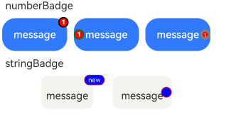
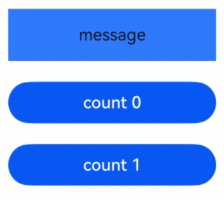

# Badge

An information marker component that can be attached to a single component as a container for information alerts.

## Import Module

```cangjie
import kit.ArkUI.*
```

## Child Components

Supports a single child component.

> **Note:**
>
> Child component types: System components and custom components, including rendering control types ([if/else](../../arkui-cj/rendering_control/cj-rendering-control-ifelse.md), [ForEach](cj-state-rendering-foreach.md), [LazyForEach](cj-state-rendering-lazyforeach.md)).

## Creating the Component

### init(Int32, ?BadgeStyle, ?BadgePosition, ?Int32, () -> Unit)

```cangjie
public init(count!: Int32, style!: ?BadgeStyle, position!: ?BadgePosition = None,
    maxCount!: ?Int32 = None, child!: () -> Unit)
```

**Function:** Creates a badge component based on a numeric value.

**System Capability:** SystemCapability.ArkUI.ArkUI.Full

**Since:** 22

**Parameters:**

| Parameter | Type | Required | Default | Description |
|:---|:---|:---|:---|:---|
| count | Int32 | Yes | - | **Named parameter.** Sets the number of alert messages. Does not display the badge if the value is less than or equal to 0. |
| style | ?[BadgeStyle](#class-badgestyle) | Yes | - | **Named parameter.** The style settings for the Badge component, including text color, size, dot color, and size. |
| position | ?[BadgePosition](#enum-badgeposition) | No | None | **Named parameter.** The display position of the badge. Initial value: BadgePosition.RightTop |
| maxCount | ?Int32 | No | None | **Named parameter.** The maximum number of messages. If exceeded, displays as maxCount+. Initial value: 99 |
| child | () -> Unit | Yes | - | **Named parameter.** The child component of the container. |

### init(String, ?BadgeStyle, ?BadgePosition, () -> Unit)

```cangjie
public init(value!: String, style!: ?BadgeStyle, position!: ?BadgePosition = None, child!: () -> Unit)
```

**Function:** Creates a badge component based on a string.

**System Capability:** SystemCapability.ArkUI.ArkUI.Full

**Since:** 22

**Parameters:**

| Parameter | Type | Required | Default | Description |
|:---|:---|:---|:---|:---|
| value | String | Yes | - | **Named parameter.** The text parameter for the badge component. |
| style | ?[BadgeStyle](#class-badgestyle) | Yes | - | **Named parameter.** The style settings for the Badge component, including text color, size, dot color, and size. |
| position | ?[BadgePosition](#enum-badgeposition) | No | None | **Named parameter.** The display position of the badge. Initial value: BadgePosition.RightTop |
| child | () -> Unit | Yes | - | **Named parameter.** The child component of the container. |

## Common Attributes/Events

Common Attributes: All supported except text styles.

Common Events: All supported.

## Basic Type Definitions

### class BadgeStyle

```cangjie
public class BadgeStyle {
    public var color: ?ResourceColor
    public var fontSize: ?Length
    public var badgeSize: ?Length
    public var badgeColor: ?ResourceColor
    public var fontWeight: ?FontWeight
    public var borderColor: ?ResourceColor
    public var borderWidth: ?Length
    public init(color!: ?ResourceColor = None, fontSize!: ?Length = None, badgeSize!: ?Length = None,
        badgeColor!: ?ResourceColor = None, fontWeight!: ?FontWeight = None,
        borderColor!: ?ResourceColor = None, borderWidth!: ?Length = None)
}
```

**Function:** Contains style parameters for the Badge component.

**System Capability:** SystemCapability.ArkUI.ArkUI.Full

**Since:** 22

#### var badgeColor

```cangjie
public var badgeColor: ?ResourceColor
```

**Function:** The color of the badge.

**Type:** ?[ResourceColor](./cj-common-types.md#interface-resourcecolor)

**Read/Write:** Readable and Writable

**System Capability:** SystemCapability.ArkUI.ArkUI.Full

**Since:** 22

#### var badgeSize

```cangjie
public var badgeSize: ?Length
```

**Function:** The size of the badge, in vp units.

**Type:** ?[Length](./cj-common-types.md#interface-length)

**Read/Write:** Readable and Writable

**System Capability:** SystemCapability.ArkUI.ArkUI.Full

**Since:** 22

#### var borderColor

```cangjie
public var borderColor: ?ResourceColor
```

**Function:** The border color of the base plate.

**Type:** ?[ResourceColor](./cj-common-types.md#interface-resourcecolor)

**Read/Write:** Readable and Writable

**System Capability:** SystemCapability.ArkUI.ArkUI.Full

**Since:** 22

#### var borderWidth

```cangjie
public var borderWidth: ?Length
```

**Function:** The border width of the base plate.

**Type:** ?[Length](./cj-common-types.md#interface-length)

**Read/Write:** Readable and Writable

**System Capability:** SystemCapability.ArkUI.ArkUI.Full

**Since:** 22

#### var color

```cangjie
public var color: ?ResourceColor
```

**Function:** The text color.

**Type:** ?[ResourceColor](./cj-common-types.md#interface-resourcecolor)

**Read/Write:** Readable and Writable

**System Capability:** SystemCapability.ArkUI.ArkUI.Full

**Since:** 22

#### var fontSize

```cangjie
public var fontSize: ?Length
```

**Function:** The text size, in fp units.

**Type:** ?[Length](./cj-common-types.md#interface-length)

**Read/Write:** Readable and Writable

**System Capability:** SystemCapability.ArkUI.ArkUI.Full

**Since:** 22

#### var fontWeight

```cangjie
public var fontWeight: ?FontWeight
```

**Function:** Sets the font weight of the text.

**Type:** ?[FontWeight](./cj-common-types.md#enum-fontweight)

**Read/Write:** Readable and Writable

**System Capability:** SystemCapability.ArkUI.ArkUI.Full

**Since:** 22

#### init(?ResourceColor, ?Length, ?Length, ?ResourceColor, ?FontWeight, ?ResourceColor, ?Length)

```cangjie
public init(color!: ?ResourceColor = None, fontSize!: ?Length = None, badgeSize!: ?Length = None,
    badgeColor!: ?ResourceColor = None, fontWeight!: ?FontWeight = None,
    borderColor!: ?ResourceColor = None, borderWidth!: ?Length = None)
```

**Function:** Creates a BadgeStyle object.

**System Capability:** SystemCapability.ArkUI.ArkUI.Full

**Since:** 22

**Parameters:**

| Parameter | Type | Required | Default | Description |
|:---|:---|:---|:---|:---|
| color | ?[ResourceColor](./cj-common-types.md#interface-resourcecolor) | No | None | **Named parameter.** The text color. Initial value: Color.White |
| fontSize | ?[Length](./cj-common-types.md#interface-length) | No | None | **Named parameter.** The text size. Initial value: 10.fp |
| badgeSize | ?[Length](./cj-common-types.md#interface-length) | No | None | **Named parameter.** The size of the badge. Initial value: 16.vp |
| badgeColor | ?[ResourceColor](./cj-common-types.md#interface-resourcecolor) | No | None | **Named parameter.** The color of the badge. Initial value: Color.Red |
| fontWeight | ?[FontWeight](./cj-common-types.md#enum-fontweight) | No | None | **Named parameter.** Sets the font weight of the text. Initial value: FontWeight.Normal |
| borderColor | ?[ResourceColor](./cj-common-types.md#interface-resourcecolor) | No | None | **Named parameter.** The border color of the base plate. Initial value: Color.Red |
| borderWidth | ?[Length](./cj-common-types.md#interface-length) | No | None | **Named parameter.** The border width of the base plate. Initial value: 1.vp |

### enum BadgePosition

```cangjie
public enum BadgePosition <: Equatable<BadgePosition> {
    | RightTop
    | Right
    | Left
    | ...
}
```

**Function:** Defines the position attributes of the badge.

**System Capability:** SystemCapability.ArkUI.ArkUI.Full

**Since:** 22

**Parent Type:**

- Equatable\<[BadgePosition](#enum-badgeposition)>

#### Left

```cangjie
Left
```

**Function:** The badge is displayed vertically centered on the left side of the parent component.

**System Capability:** SystemCapability.ArkUI.ArkUI.Full

**Since:** 22

#### Right

```cangjie
Right
```

**Function:** The badge is displayed vertically centered on the right side of the parent component.

**System Capability:** SystemCapability.ArkUI.ArkUI.Full

**Since:** 22

#### RightTop

```cangjie
RightTop
```

**Function:** The badge is displayed in the top-right corner of the parent component.

**System Capability:** SystemCapability.ArkUI.ArkUI.Full

**Since:** 22

#### operator func !=(BadgePosition)

```cangjie
public operator func !=(other: BadgePosition): Bool
```

**Function:** Compares whether two enum values are not equal.

**System Capability:** SystemCapability.ArkUI.ArkUI.Full

**Since:** 22

**Parameters:**

| Parameter | Type | Required | Default | Description |
|:---|:---|:---|:---|:---|
| other | [BadgePosition](#enum-badgeposition) | Yes | - | The other enum value to compare. |

**Return Value:**

| Type | Description |
|:----|:----|
| Bool | Returns true if the two enum values are not equal, otherwise returns false. |

#### operator func ==(BadgePosition)

```cangjie
public operator func ==(other: BadgePosition): Bool
```

**Function:** Compares whether two enum values are equal.

**System Capability:** SystemCapability.ArkUI.ArkUI.Full

**Since:** 22

**Parameters:**

| Parameter | Type | Required | Default | Description |
|:---|:---|:---|:---|:---|
| other | [BadgePosition](#enum-badgeposition) | Yes | - | The other enum value to compare. |

**Return Value:**

| Type | Description |
|:----|:----|
| Bool | Returns true if the two enum values are equal, otherwise returns false. |

## Example Code

### Example 1 (Setting Badge Content)

This example demonstrates different badge effects when passing empty values, strings, or numbers using the `value` and `count` properties.

<!-- run -->

```cangjie
package ohos_app_cangjie_entry
import kit.ArkUI.*
import ohos.arkui.state_macro_manage.*

@Entry
@Component
class EntryView {
    func build() {
        Column() {
            Text("numberBadge").width(80.percent)
            Row(space: 10) {
                // Numeric superscript, maxCount defaults to 99, displays as 99+ if exceeded
                Badge(
                    count: 1,
                    style: BadgeStyle(color: Color(0xFFFFFF), fontSize: 16, badgeSize: 20, badgeColor: Color.Red,
                        fontWeight: FontWeight.Bolder, borderColor: Color.Black, borderWidth: 2.vp),
                    position: BadgePosition.RightTop,
                    maxCount: 99
                ) {
                    Button("message").width(100).height(50).backgroundColor(0x317aff)
                }.width(100).height(50)
                Badge(
                    count: 1,
                    style: BadgeStyle(color: Color(0xFFFFFF), fontSize: 16, badgeSize: 20, badgeColor: Color.Red,
                        fontWeight: FontWeight.Bolder, borderColor: Color.Green, borderWidth: 2.vp),
                    position: BadgePosition.Left,
                    maxCount: 99
                ) {
                    Button("message").width(100).height(50).backgroundColor(0x317aff)
                }.width(100).height(50)
                // Numeric superscript
                Badge(
                    count: 1,
                    style: BadgeStyle(color: Color(0xFFFFFF), fontSize: 16, badgeSize: 20, badgeColor: Color.Red,
                        fontWeight: FontWeight.Regular, borderColor: Color.Gray, borderWidth: 4.vp),
                    position: BadgePosition.Right,
                    maxCount: 99
                ) {
                    Button("message").width(100).height(50).backgroundColor(0x317aff)
                }.width(100).height(50)
            }.margin(10)
            Text("stringBadge").width(80.percent)
            Row(space: 30) {
                Badge(
                    value: "new",
                    style: BadgeStyle(color: Color(0xFFFFFF), fontSize: 9, badgeSize: 20, badgeColor: Color.Blue)
                ) {
                    Text("message")
                        .width(80)
                        .height(50)
                        .fontSize(16)
                        .lineHeight(37)
                        .borderRadius(10)
                        .textAlign(TextAlign.Center)
                        .backgroundColor(0xF3F4ED)
                }.width(80).height(50)
                // Empty value, sets a dot marker
                Badge(
                    value: "",
                    style: BadgeStyle(badgeSize: 6, badgeColor: Color.Blue),
                    position: BadgePosition.Right
                ) {
                    Text("message")
                        .width(90)
                        .height(50)
                        .fontSize(16)
                        .lineHeight(37)
                        .borderRadius(10)
                        .textAlign(TextAlign.Center)
                        .backgroundColor(0xF3F4ED)
                }.width(90).height(50)
            }.margin(10)
        }
    }
}
```

### Example 2 (Controlling Badge Visibility with Numeric Values)

This example demonstrates how to toggle the visibility of badge components by setting the `count` property to 0 or 1.

<!-- run -->

```cangjie
package ohos_app_cangjie_entry
import kit.ArkUI.*
import ohos.arkui.state_macro_manage.*

@Entry
@Component
class EntryView {
    @State var badgeCount: Int32 = 1
    func build() {
        Column() {
            Badge(
                count: this.badgeCount,
                style: BadgeStyle(color: Color(0xFFFFFF), fontSize: 16, badgeSize: 20, badgeColor: Color.Red,fontWeight: FontWeight.Bolder, borderColor: Color.Black, borderWidth: 2.vp),
                position: BadgePosition.RightTop,
            ){
                Text("message")
                    .width(100)
                    .height(50)
                    .backgroundColor(0x317aff)
            }
                .width(100)
                .height(50)
            Button("count 0")
                .onClick({ evt =>  this.badgeCount =0;})
            Button("count 1")
                .onClick({ evt =>  this.badgeCount =1;})
        }.margin(10)
    }
}
```

