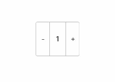

# Counter

A counter component that provides corresponding increment or decrement operations.

## Subcomponents

Can contain subcomponents.

## Creating the Component

### init(() -> Unit)

```cangjie
public init(content: () -> Unit)
```

**Function:** Creates a counter component.

**System Capability:** SystemCapability.ArkUI.ArkUI.Full

**Since:** 21

**Parameters:**

| Name | Type | Required | Default | Description |
|:---|:---|:---|:---|:---|
| content | ()->Unit | Yes | - | Defines the counter component and its content area. |

## Common Attributes/Common Events

Common Attributes: All supported.

Common Events: All supported.

## Component Attributes

### func enableDec(Bool)

```cangjie
public func enableDec(value: Bool): This
```

**Function:** Enables or disables the decrement button.

**System Capability:** SystemCapability.ArkUI.ArkUI.Full

**Since:** 21

**Parameters:**

| Name | Type | Required | Default | Description |
|:---|:---|:---|:---|:---|
| value | Bool | Yes | - | Enables or disables the decrement button.<br>true: Button enabled.<br>false: Button disabled.<br>Initial value: true. |

### func enableInc(Bool)

```cangjie
public func enableInc(value: Bool): This
```

**Function:** Enables or disables the increment button.

**System Capability:** SystemCapability.ArkUI.ArkUI.Full

**Since:** 21

**Parameters:**

| Name | Type | Required | Default | Description |
|:---|:---|:---|:---|:---|
| value | Bool | Yes | - | Enables or disables the increment button.<br>true: + button enabled.<br>false: + button disabled.<br>Component initial value: true. |

## Component Events

### func onDec(VoidCallback)

```cangjie
public func onDec(event: VoidCallback): This
```

**Function:** Listens for the event triggered when the value decreases.

**System Capability:** SystemCapability.ArkUI.ArkUI.Full

**Since:** 21

**Parameters:**

| Name | Type | Required | Default | Description |
|:---|:---|:---|:---|:---|
| event | VoidCallback | Yes | - | Callback function triggered when the Counter value decreases. |

### func onInc(VoidCallback)

```cangjie
public func onInc(event: VoidCallback): This
```

**Function:** Listens for the event triggered when the value increases.

**System Capability:** SystemCapability.ArkUI.ArkUI.Full

**Since:** 21

**Parameters:**

| Name | Type | Required | Default | Description |
|:---|:---|:---|:---|:---|
| event | VoidCallback | Yes | - | Callback function triggered when the Counter value increases. |

## Example Code

<!-- run -->

```cangjie
package ohos_app_cangjie_entry
import kit.ArkUI.*
import ohos.arkui.state_macro_manage.*

@Entry
@Component
class EntryView {
    @State var value: Int64 = 0
    func build() {
        Column {
            Counter() {Text(this.value.toString())}
                .margin(100.0)
                .height(10.percent)
                .onInc {
                this.value++
            }
                .onDec {
                this.value--
            }
        }
    }
}
```

