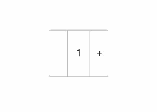

# Counter

A counter component that provides corresponding increment or decrement operations.

## Import Module

```cangjie
import kit.ArkUI.*
```

## Child Components

Can contain child components.

## Creating the Component

### init(() -> Unit)

```cangjie
public init(content: () -> Unit)
```

**Function:** Creates a counter component.

**System Capability:** SystemCapability.ArkUI.ArkUI.Full

**Since:** 22

**Parameters:**

| Parameter | Type | Required | Default Value | Description |
|:---|:---|:---|:---|:---|
| content | () -> Unit | Yes | - | Defines the counter component and its content area. |

## Common Attributes/Common Events

Common Attributes: All supported.

Common Events: All supported.

## Component Attributes

### func enableDec(?Bool)

```cangjie
public func enableDec(value: ?Bool): This
```

**Function:** Sets the decrement button to be disabled or enabled.

**System Capability:** SystemCapability.ArkUI.ArkUI.Full

**Since:** 22

**Parameters:**

| Parameter | Type | Required | Default Value | Description |
|:---|:---|:---|:---|:---|
| value | ?Bool | Yes | - | Disables or enables the decrement button. Initial value: true<br>true means the button is enabled.<br>false means the button is disabled. |

### func enableInc(?Bool)

```cangjie
public func enableInc(value: ?Bool): This
```

**Function:** Sets the increment button to be disabled or enabled.

**System Capability:** SystemCapability.ArkUI.ArkUI.Full

**Since:** 22

**Parameters:**

| Parameter | Type | Required | Default Value | Description |
|:---|:---|:---|:---|:---|
| value | ?Bool | Yes | - | Disables or enables the increment button. Initial value: true<br>true means the + button is enabled.<br>false means the + button is disabled. |

## Component Events

### func onDec(?VoidCallback)

```cangjie
public func onDec(event: ?VoidCallback): This
```

**Function:** Listens for the event triggered when the value decreases.

**System Capability:** SystemCapability.ArkUI.ArkUI.Full

**Since:** 22

**Parameters:**

| Parameter | Type | Required | Default Value | Description |
|:---|:---|:---|:---|:---|
| event | ?[VoidCallback](./cj-common-types.md#type-voidcallback) | Yes | - | Callback function triggered when the Counter value decreases. Initial value: { => } |

### func onInc(?VoidCallback)

```cangjie
public func onInc(event: ?VoidCallback): This
```

**Function:** Listens for the event triggered when the value increases.

**System Capability:** SystemCapability.ArkUI.ArkUI.Full

**Since:** 22

**Parameters:**

| Parameter | Type | Required | Default Value | Description |
|:---|:---|:---|:---|:---|
| event | ?[VoidCallback](./cj-common-types.md#type-voidcallback) | Yes | - | Callback function triggered when the Counter value increases. Initial value: { => } |

## Example Code

<!-- run -->

```cangjie
package ohos_app_cangjie_entry
import kit.ArkUI.*
import ohos.arkui.state_macro_manage.*

@Entry
@Component
class EntryView {
    @State var value: Int64 = 0
    func build() {
        Column {
            Counter() {Text(this.value.toString())}
                .margin(100.0)
                .height(10.percent)
                .onInc({ =>
                this.value++
            })
                .onDec({ =>
                this.value--
            })
        }
    }
}
```

