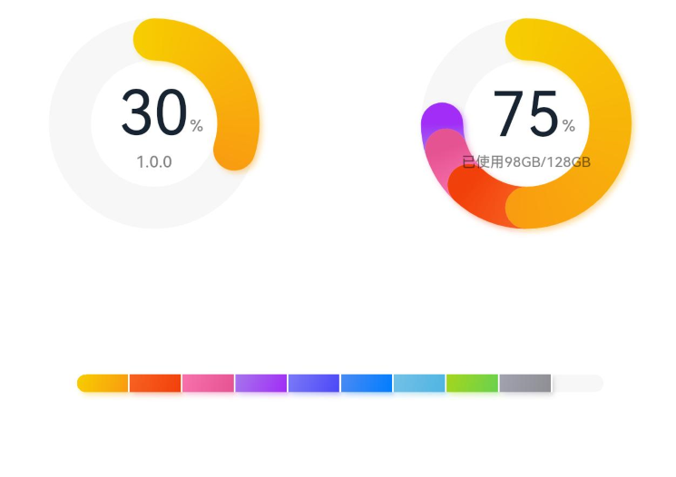
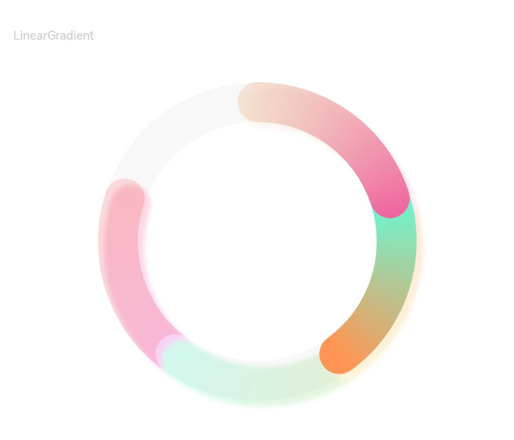
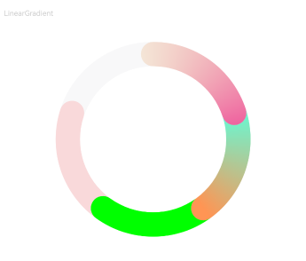

# DataPanel

<!--Del-->
> **Note:**
>
> Currently in the beta phase.
<!--DelEnd-->

A data panel component used to display multiple data proportions using proportion charts.

## Import Module

```cangjie
import kit.ArkUI.*
```

## Subcomponents

None

## Creating the Component

### init(Array\<Float64>, ?Float64, ?DataPanelType)

```cangjie
public init(values!: Array<Float64>, max!: ?Float64 = None, panelType!: ?DataPanelType = None)
```

**Function:** Creates a data panel component.

**System Capability:** SystemCapability.ArkUI.ArkUI.Full

**Since:** 22

**Parameters:**

| Parameter Name | Type | Required | Default Value | Description |
|:---|:---|:---|:---|:---|
| values | Array\<Float64> | Yes | - | **Named parameter.** List of data values, containing up to 9 data points. If more than 9 data points are provided, only the first 9 will be used. If a data value is less than 0, it will be set to 0. |
| max | ?Float64 | No | None | **Named parameter.** Initial value: 100.0 \- If max > 0, it represents the maximum value of the data. <br> \- If max ≤ 0, max equals the sum of the values in the array, displaying proportions. |
| panelType | ?[DataPanelType](./cj-common-types.md#enum-datapaneltype) | No | None | **Named parameter.** Initial value: DataPanelType.Circle. The type of the data panel (dynamic modification is not supported). |

## Common Attributes/Common Events

Common Attributes: All supported.

Common Events: All supported.

## Component Attributes

### func closeEffect(?Bool)

```cangjie
public func closeEffect(value: ?Bool): This
```

**Function:** Disables the rotation animation and shadow effect of the data proportion chart.

> **Note:**
>
> If the [trackShadow attribute](#func-trackshadowdatapanelshadowoptions) is not set, this attribute controls the shadow effect's toggle, with the default shadow effect enabled. If the trackShadow attribute is set, the shadow effect's toggle is controlled by the trackShadow attribute value.

**System Capability:** SystemCapability.ArkUI.ArkUI.Full

**Since:** 22

**Parameters:**

| Parameter Name | Type | Required | Default Value | Description |
|:---|:---|:---|:---|:---|
| value | ?Bool | Yes | - | Disables the rotation animation and shadow effect of the data proportion chart. Initial value: true<br>false: Disables the rotation animation and shadow effect. true: Enables the rotation animation and shadow effect. |

### func strokeWidth(?Length)

```cangjie
public func strokeWidth(value: ?Length): This
```

**Function:** Sets the thickness of the ring based on Length.

> **Note:**
>
> This attribute does not take effect when the data panel type is DataPanelType.Line.

**System Capability:** SystemCapability.ArkUI.ArkUI.Full

**Since:** 22

**Parameters:**

| Parameter Name | Type | Required | Default Value | Description |
|:---|:---|:---|:---|:---|
| value | ?[Length](./cj-common-types.md#interface-length) | Yes | - | Thickness of the ring. Initial value: 24.0.vp.<br>Unit: vp.<br>If a value less than 0 is set, the default value will be used. |

### func trackBackgroundColor(?ResourceColor)

```cangjie
public func trackBackgroundColor(value: ?ResourceColor): This
```

**Function:** Sets the background color.

**System Capability:** SystemCapability.ArkUI.ArkUI.Full

**Since:** 22

**Parameters:**

| Parameter Name | Type | Required | Default Value | Description |
|:---|:---|:---|:---|:---|
| value | ?[ResourceColor](./cj-common-types.md#interface-resourcecolor) | Yes | - | Background color. Initial value: 0x08182431 |

### func trackShadow(?DataPanelShadowOptions)

```cangjie
public func trackShadow(value: ?DataPanelShadowOptions): This
```

**Function:** Sets the shadow style.

**System Capability:** SystemCapability.ArkUI.ArkUI.Full

**Since:** 22

**Parameters:**

| Parameter Name | Type | Required | Default Value | Description |
|:---|:---|:---|:---|:---|
| value | ?[DataPanelShadowOptions](#class-datapanelshadowoptions) | Yes | - | Shadow style.<br>If not set, shadows are disabled by default.<br>Initial value: DataPanelShadowOptions(). |

### func valueColors(?Array\<LinearGradient>)

```cangjie
public func valueColors(value: ?Array<LinearGradient>): This
```

**Function:** Sets the colors for each data segment.

**System Capability:** SystemCapability.ArkUI.ArkUI.Full

**Since:** 22

**Parameters:**

| Parameter Name | Type | Required | Default Value | Description |
|:---|:---|:---|:---|:---|
| value | ?Array\<[LinearGradient](#class-lineargradient)> | Yes | - | Colors for each data segment. ResourceColor represents solid colors, while LinearGradient represents gradient colors. |

## Basic Type Definitions

### class ColorStop

```cangjie
public class ColorStop {
    public var color: ResourceColor
    public var offset: Length
    public init(color: ResourceColor, offset: Length)
}
```

**Function:** Color stop type, used to describe gradient color stops.

**System Capability:** SystemCapability.ArkUI.ArkUI.Full

**Since:** 22

#### var color

```cangjie
public var color: ResourceColor
```

**Function:** Color value.

**Type:** [ResourceColor](./cj-common-types.md#interface-resourcecolor)

**Read/Write Capability:** Readable and Writable

**System Capability:** SystemCapability.ArkUI.ArkUI.Full

**Since:** 22

#### var offset

```cangjie
public var offset: Length
```

**Function:** Gradient color stop (a proportional value between 0 and 1. If the value is less than 0, it is set to 0; if greater than 1, it is set to 1).

**Type:** [Length](./cj-common-types.md#interface-length)

**Read/Write Capability:** Readable and Writable

**System Capability:** SystemCapability.ArkUI.ArkUI.Full

**Since:** 22

#### init(ResourceColor, Length)

```cangjie
public init(color: ResourceColor, offset: Length)
```

**Function:** Creates a ColorStop object.

**System Capability:** SystemCapability.ArkUI.ArkUI.Full

**Since:** 22

**Parameters:**

| Parameter Name | Type | Required | Default Value | Description |
|:---|:---|:---|:---|:---|
| color | [ResourceColor](./cj-common-types.md#interface-resourcecolor) | Yes | - | Color value. |
| offset | [Length](./cj-common-types.md#interface-length) | Yes | - | Gradient color stop (a proportional value between 0 and 1. If the value is less than 0, it is set to 0; if greater than 1, it is set to 1). |

### class DataPanelShadowOptions

```cangjie
public class DataPanelShadowOptions <: MultiShadowOptions {
    public var colors: ?Array<LinearGradient>
    public init(radius!: ?Length = None, colors!: ?Array<LinearGradient> = None, offsetX!: ?Length = None, offsetY!: ?Length = None)
}
```

**Function:** Shadow style.

**System Capability:** SystemCapability.ArkUI.ArkUI.Full

**Since:** 22

**Parent Type:**

- [MultiShadowOptions](./cj-common-types.md#class-multishadowoptions)

#### var colors

```cangjie
public var colors: ?Array<LinearGradient>
```

**Function:** Colors of the shadows for each data segment.

> **Note:**
>
> - If the number of shadow colors set is less than the number of data segments, the number of shadow colors displayed will match the number of shadow colors set.
> - If the number of shadow colors set is greater than the number of data segments, the number of shadow colors displayed will match the number of data segments.

**Type:** ?Array\<[LinearGradient](#class-lineargradient)>

**Read/Write Capability:** Readable and Writable

**System Capability:** SystemCapability.ArkUI.ArkUI.Full

**Since:** 22

#### init(?Length, ?Array\<LinearGradient>, ?Length, ?Length)

```cangjie
public init(radius!: ?Length = None, colors!: ?Array<LinearGradient> = None, offsetX!: ?Length = None, offsetY!: ?Length = None)
```

**Function:** Creates a DataPanelShadowOptions object.

**System Capability:** SystemCapability.ArkUI.ArkUI.Full

**Since:** 22

**Parameters:**

| Parameter Name | Type | Required | Default Value | Description |
|:---|:---|:---|:---|:---|
| radius | ?[Length](./cj-common-types.md#interface-length) | No | None | **Named parameter.** Initial value: 20.vp. Shadow blur radius. |
| colors | ?Array\<[LinearGradient](#class-lineargradient)> | No | None | **Named parameter.** Initial value: []. Colors of the shadows for each data segment.<br>If the number of shadow colors set is less than the number of data segments, the number of shadow colors displayed will match the number of shadow colors set.<br>If the number of shadow colors set is greater than the number of data segments, the number of shadow colors displayed will match the number of data segments. |
| offsetX | ?[Length](./cj-common-types.md#interface-length) | No | None | **Named parameter.** Initial value: 5.vp. X-axis offset. |
| offsetY | ?[Length](./cj-common-types.md#interface-length) | No | None | **Named parameter.** Initial value: 5.vp. Y-axis offset. |

### class LinearGradient

```cangjie
public class LinearGradient {
    public init(colorStops: Array<ColorStop>)
    public init(color: ResourceColor)
}
```

**Function:** Linear gradient color description.

**System Capability:** SystemCapability.ArkUI.ArkUI.Full

**Since:** 22

#### init(Array\<ColorStop)

```cangjie
public init(colorStops: Array<ColorStop>)
```

**Function:** Gradient color description.

**System Capability:** SystemCapability.ArkUI.ArkUI.Full

**Since:** 22

**Parameters:**

| Parameter Name | Type | Required | Default Value | Description |
|:---|:---|:---|:---|:---|
| colorStops | Array\<[ColorStop](#class-colorstop)> | Yes | - | Stores gradient colors and gradient points. |

#### init(ResourceColor)

```cangjie
public init(color: ResourceColor)
```

**Function:** Gradient color description.

**System Capability:** SystemCapability.ArkUI.ArkUI.Full

**Since:** 22

**Parameters:**

| Parameter Name | Type | Required | Default Value | Description |
|:---|:---|:---|:---|:---|
| color | [ResourceColor](./cj-common-types.md#interface-resourcecolor) | Yes | - | Single gradient color. |

## Example Code

### Example 1 (Setting Data Panel Type)

This example demonstrates setting the type of the data panel using the type attribute.

<!-- run -->

```cangjie
package ohos_app_cangjie_entry
import kit.ArkUI.*
import ohos.arkui.state_macro_manage.*

@Entry
@Component
class EntryView {
    var valueArr: Array<Float64> = [10.0, 10.0, 10.0, 10.0, 10.0, 10.0, 10.0, 10.0, 10.0]
    func build() {
        Column {
            Row() {
                Stack() {
                    DataPanel(values: [30.0], max: 100.0, panelType: DataPanelType.Circle).width(168).height(168)
                    Column() {
                        Text("30")
                            .fontSize(35)
                            .fontColor(0x182431)
                        Text("1.0.0")
                            .fontSize(9.33)
                            .lineHeight(12.83)
                            .fontWeight(FontWeight.W500)
                            .opacity(0.6)
                    }
                    Text("%")
                        .fontSize(9.33)
                        .lineHeight(12.83)
                        .fontWeight(FontWeight.W500)
                        .opacity(0.6)
                        .position(x: 104.42, y: 78.17)
                }.margin(right: 44)
                Stack() {
                    DataPanel(values: [50.0, 12.0, 8.0, 5.0], max: 100.0, panelType: DataPanelType.Circle)
                        .width(168)
                        .height(168)
                    Column() {
                        Text("75")
                            .fontSize(35)
                            .fontColor(0x182431)
                        Text("Used 98GB/128GB")
                            .fontSize(8.17)
                            .lineHeight(11.08)
                            .fontWeight(FontWeight.W500)
                            .opacity(0.6)
                    }
                    Text("%")
                        .fontSize(9.33)
                        .lineHeight(12.83)
                        .fontWeight(FontWeight.W500)
                        .opacity(0.6)
                        .position(x: 104.42, y: 78.17)
                }
            }
                .margin(bottom: 59)
            DataPanel(values: this.valueArr, max: 100.0, panelType: DataPanelType.Line)
                .width(300)
                .height(10)
        }
            .width(100.percent)
            .margin(top: 5)
    }
}
```



### Example 2 (Setting Gradient Colors and Shadows)

This example demonstrates setting gradient color effects and shadow effects using the valueColors and trackShadow interfaces with LinearGradient colors.

<!-- run -->

```cangjie
package ohos_app_cangjie_entry
import kit.ArkUI.*
import ohos.arkui.state_macro_manage.*

@Entry
@Component
class EntryView {
    var values1: Array<Float64> = [20.0, 20.0, 20.0, 20.0]
    var color1: LinearGradient = LinearGradient([ColorStop(0x65EEC9A3, 0), ColorStop(0xFFEF629F, 1)])
    var color2: LinearGradient = LinearGradient([ColorStop(0xFF67F9D4, 0), ColorStop(0xFFFF9554, 1)])
    var colorShadow1: LinearGradient = LinearGradient([ColorStop(0x65EEC9A3, 0), ColorStop(0x65EF629F, 1)])
    var colorShadow2: LinearGradient = LinearGradient([ColorStop(0x65e26709, 0), ColorStop(0x65efbd08, 1)])
    var colorShadow3: LinearGradient = LinearGradient([ColorStop(0x6572B513, 0), ColorStop(0x6508efa6, 1)])
    var colorShadow4: LinearGradient = LinearGradient([ColorStop(0x65ed08f5, 0), ColorStop(0x65ef0849, 1)])
    var color3: LinearGradient = LinearGradient(0x00FF00)
    var color4: LinearGradient = LinearGradient(0x20FF0000)
    @State var bgColor: UInt32 = 0x08182431
    @State var offsetX: Int64 = 15
    @State var offsetY: Int64 = 15
    @State var radius: Int64 = 5
    @State var colorArray: Array<LinearGradient> = [this.color1, this.color2, this.color3, this.color4]
    @State var shadowColorArray: Array<LinearGradient> = [this.colorShadow1, this.colorShadow2, this.colorShadow3,this.colorShadow4]
    func build() {
        Column {
            Text("LinearGradient")
                .fontSize(9)
                .fontColor(0xCCCCCC)
                .textAlign(TextAlign.Start)
                .width(100.percent)
                .margin(top: 20, left: 20)
            DataPanel(values: this.values1, max: 100.0, panelType: DataPanelType.Circle)
                .width(300)
                .height(300).
                valueColors(this.colorArray)
                .trackShadow(
                DataPanelShadowOptions(
                    radius: this.radius,
                    colors: this.shadowColorArray,
                    offsetX: this.offsetX,
                    offsetY: this.offsetY
                )
            )
                .strokeWidth(30)
                .trackBackgroundColor(this.bgColor)
        }
            .width(100.percent)
            .margin(top: 5)
    }
}
```

### Example 3 (Disabling Animation and Shadow)

This example demonstrates how to disable the data panel closing animation and shadow effects using the `closeEffect` interface.

<!-- run -->

```cangjie
package ohos_app_cangjie_entry
import kit.ArkUI.*
import ohos.arkui.state_macro_manage.*

@Entry
@Component
class EntryView {
    var values1: Array<Float64> = [20.0, 20.0, 20.0, 20.0]
    var color1: LinearGradient = LinearGradient([ColorStop(0x65EEC9A3, 0), ColorStop(0xFFEF629F, 1)])
    var color2: LinearGradient = LinearGradient([ColorStop(0xFF67F9D4, 0), ColorStop(0xFFFF9554, 1)])
    var colorShadow1: LinearGradient = LinearGradient([ColorStop(0x65EEC9A3, 0), ColorStop(0x65EF629F, 1)])
    var colorShadow2: LinearGradient = LinearGradient([ColorStop(0x65e26709, 0), ColorStop(0x65efbd08, 1)])
    var colorShadow3: LinearGradient = LinearGradient([ColorStop(0x6572B513, 0), ColorStop(0x6508efa6, 1)])
    var colorShadow4: LinearGradient = LinearGradient([ColorStop(0x65ed08f5, 0), ColorStop(0x65ef0849, 1)])
    var color3: LinearGradient = LinearGradient(0x00FF00)
    var color4: LinearGradient = LinearGradient(0x20FF0000)
    @State var bgColor: UInt32 = 0x08182431
    @State var offsetX: Int64 = 15
    @State var offsetY: Int64 = 15
    @State var radius: Int64 = 5
    @State var colorArray: Array<LinearGradient> = [this.color1, this.color2, this.color3, this.color4]
    @State var shadowColorArray: Array<LinearGradient> = [this.colorShadow1, this.colorShadow2, this.colorShadow3,this.colorShadow4]
    func build() {
        Column {
            Text("LinearGradient")
                .fontSize(9)
                .fontColor(0xCCCCCC)
                .textAlign(TextAlign.Start)
                .width(100.percent)
                .margin(top: 20, left: 20)
            DataPanel(values: this.values1, max: 100.0, panelType: DataPanelType.Circle)
                .width(300)
                .height(300).
                valueColors(this.colorArray)
                .strokeWidth(30)
                .closeEffect(true)
                .trackBackgroundColor(this.bgColor)
        }
            .width(100.percent)
            .margin(top: 5)
    }
}
```

