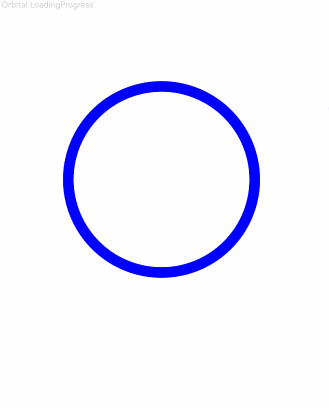

# LoadingProgress

A component for displaying loading animations.

The loading animation stops when the component is not visible. The visibility state of the component is determined by [onVisibleAreaChange](./cj-universal-event-visibleareachange.md#func-onvisibleareachangearrayfloat64-bool-float64---unit), where a visibility threshold ratio greater than 0 is considered as the visible state.

## Import Module

```cangjie
import kit.ArkUI.*
```

## Child Components

None

## Creating the Component

### init()

```cangjie
public init()
```

**Function:** Creates a loading progress component.

**System Capability:** SystemCapability.ArkUI.ArkUI.Full

**Since:** 22

## Common Attributes/Common Events

Common Attributes: All are supported except text styles.

> **Note:**
>
> The component should have reasonable width and height settings. When the component's dimensions are set too large, the loading animation may not display as expected.

Common Events: All are supported.

## Component Attributes

### func color(?ResourceColor)

```cangjie
public func color(value: ?ResourceColor): This
```

**Function:** Sets the foreground color of the current loading progress bar.

**System Capability:** SystemCapability.ArkUI.ArkUI.Full

**Since:** 22

**Parameters:**

| Parameter | Type | Required | Default Value | Description |
|:---|:---|:---|:---|:---|
| value | ?[ResourceColor](./cj-common-types.md#interface-resourcecolor) | Yes | - | Initial value: 0xFF666666, the default foreground color of the loading progress bar. |

## Example Code

### Example 1

<!-- run -->

```cangjie
package ohos_app_cangjie_entry
import kit.ArkUI.*
import ohos.arkui.state_macro_manage.*

@Entry
@Component
class EntryView {
    func build() {
        Column(space: 5) {
            Text("Orbital LoadingProgress")
                .fontSize(9)
                .fontColor(0xCCCCCC)
                .width(90.percent)
            LoadingProgress()
            .color(Color.Blue)
        }.width(100.percent).margin(top: 5)
    }
}
```

