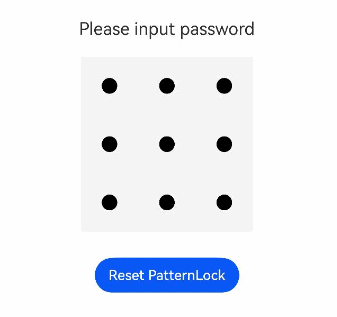

# PatternLock

A pattern lock component that allows password input via a 3x3 grid pattern, designed for password verification scenarios. The input state begins when a finger presses within the PatternLock component area and ends when the finger leaves the screen, completing the password input.

## Import Module

```cangjie
import kit.ArkUI.*
```

## Child Components

None

## Creating the Component

### init(?PatternLockController)

```cangjie
public init(controller!: ?PatternLockController = None)
```

**Function:** Creates a PatternLock component.

**System Capability:** SystemCapability.ArkUI.ArkUI.Full

**Since Version:** 22

**Parameters:**

| Parameter Name | Type | Required | Default Value | Description |
|:---|:---|:---|:---|:---|
| controller | ?[PatternLockController](#class-patternlockcontroller) | No | None | **Named parameter.** Sets the PatternLock component controller, which can be used to reset the component state. |

## Common Attributes/Common Events

Common Attributes: All supported.

Common Events: All supported.

## Component Attributes

### func activeColor(?ResourceColor)

```cangjie
public func activeColor(value: ?ResourceColor): This
```

**Function:** Sets the fill color of grid dots in the "active" state, where "active" refers to when a finger passes over a dot but has not yet selected it.

**System Capability:** SystemCapability.ArkUI.ArkUI.Full

**Since Version:** 22

**Parameters:**

| Parameter Name | Type | Required | Default Value | Description |
|:---|:---|:---|:---|:---|
| value | ?[ResourceColor](./cj-common-types.md#interface-resourcecolor) | Yes | - | The fill color of grid dots in the "active" state. Initial value: 0xFF182431. |

### func autoReset(?Bool)

```cangjie
public func autoReset(value: ?Bool): This
```

**Function:** Sets whether to reset the component state when pressing within the component area again after completing password input.

**System Capability:** SystemCapability.ArkUI.ArkUI.Full

**Since Version:** 22

**Parameters:**

| Parameter Name | Type | Required | Default Value | Description |
|:---|:---|:---|:---|:---|
| value | ?Bool | Yes | - | Whether to reset the component state when pressing within the component area again after completing password input. If true, pressing again will reset the component state (clearing the previously entered password); if false, the component state will not be reset. Initial value: true. |

### func circleRadius(?Length)

```cangjie
public func circleRadius(value: ?Length): This
```

**Function:** Sets the radius of the dots in the grid. If set to 0 or a negative value, the initial value is used.

**System Capability:** SystemCapability.ArkUI.ArkUI.Full

**Since Version:** 22

**Parameters:**

| Parameter Name | Type | Required | Default Value | Description |
|:---|:---|:---|:---|:---|
| value | ?[Length](./cj-common-types.md#interface-length) | Yes | - | The radius of the dots in the grid. Initial value: 6.0.vp. |

### func pathColor(?ResourceColor)

```cangjie
public func pathColor(value: ?ResourceColor): This
```

**Function:** Sets the color of the connecting lines.

**System Capability:** SystemCapability.ArkUI.ArkUI.Full

**Since Version:** 22

**Parameters:**

| Parameter Name | Type | Required | Default Value | Description |
|:---|:---|:---|:---|:---|
| value | ?[ResourceColor](./cj-common-types.md#interface-resourcecolor) | Yes | - | The color of the connecting lines. Initial value: 0x33182431. |

### func pathStrokeWidth(?Length)

```cangjie
public func pathStrokeWidth(value: ?Length): This
```

**Function:** Sets the width of the connecting lines. If set to 0 or a negative value, the lines will not be displayed.

**System Capability:** SystemCapability.ArkUI.ArkUI.Full

**Since Version:** 22

**Parameters:**

| Parameter Name | Type | Required | Default Value | Description |
|:---|:---|:---|:---|:---|
| value | ?[Length](./cj-common-types.md#interface-length) | Yes | - | The width of the connecting lines. Initial value: 12.0.vp. |

### func regularColor(?ResourceColor)

```cangjie
public func regularColor(value: ?ResourceColor): This
```

**Function:** Sets the fill color of grid dots in the "unselected" state.

**System Capability:** SystemCapability.ArkUI.ArkUI.Full

**Since Version:** 22

**Parameters:**

| Parameter Name | Type | Required | Default Value | Description |
|:---|:---|:---|:---|:---|
| value | ?[ResourceColor](./cj-common-types.md#interface-resourcecolor) | Yes | - | The fill color of grid dots in the "unselected" state. Initial value: 0xFF182431. |

### func selectedColor(?ResourceColor)

```cangjie
public func selectedColor(value: ?ResourceColor): This
```

**Function:** Sets the fill color of grid dots in the "selected" state.

**System Capability:** SystemCapability.ArkUI.ArkUI.Full

**Since Version:** 22

**Parameters:**

| Parameter Name | Type | Required | Default Value | Description |
|:---|:---|:---|:---|:---|
| value | ?[ResourceColor](./cj-common-types.md#interface-resourcecolor) | Yes | - | The fill color of grid dots in the "selected" state. Initial value: 0xFF182431. |

### func sideLength(?Length)

```cangjie
public func sideLength(value: ?Length): This
```

**Function:** Sets the width and height of the component (width and height are the same). If set to 0 or a negative value, the component will not be displayed.

**System Capability:** SystemCapability.ArkUI.ArkUI.Full

**Since Version:** 22

**Parameters:**

| Parameter Name | Type | Required | Default Value | Description |
|:---|:---|:---|:---|:---|
| value | ?[Length](./cj-common-types.md#interface-length) | Yes | - | The width and height of the component. Initial value: 288.0.vp. |

## Component Events

### func onPatternComplete(?(Array\<Int32>) -> Unit)

```cangjie
public func onPatternComplete(callback: ?(Array<Int32>) -> Unit): This
```

**Function:** Triggers this event when password input is completed.

**System Capability:** SystemCapability.ArkUI.ArkUI.Full

**Since Version:** 22

**Parameters:**

| Parameter Name | Type | Required | Default Value | Description |
|:---|:---|:---|:---|:---|
| callback | ?(Array\<Int32>) -> Unit | Yes | - | The callback triggered when password input is completed. Callback parameter: An array of numbers corresponding to the indices of the selected grid dots in order (dots in the first row from left to right are 0, 1, 2; the second row are 3, 4, 5; the third row are 6, 7, 8).<br>Initial value: { _ => }. |

## Basic Type Definitions

### class PatternLockController

```cangjie
public class PatternLockController {
    public init()
}
```

**Function:** The controller for the PatternLock component, which can be used to reset the component state.

**System Capability:** SystemCapability.ArkUI.ArkUI.Full

**Since Version:** 22

#### init()

```cangjie
public init()
```

**Function:** Creates a PatternLockController object.

**System Capability:** SystemCapability.ArkUI.ArkUI.Full

**Since Version:** 22

#### func reset()

```cangjie
public func reset(): Unit
```

**Function:** Resets the component state.

**System Capability:** SystemCapability.ArkUI.ArkUI.Full

**Since Version:** 22

## Example Code

<!-- run -->

```cangjie
package ohos_app_cangjie_entry

import kit.ArkUI.*
import ohos.arkui.state_macro_manage.*
import std.collection.*

@Entry
@Component
class EntryView {
    @State var passwords: ObservedArrayList<Int32> = ObservedArrayList<Int32>([])
    @State var message: String = 'please input password!'
    let patternLockController = PatternLockController()

    func build() {
        Column() {
            Text(this.message)
                .textAlign(TextAlign.Center)
                .margin(20)
                .fontSize(20)

            PatternLock(controller: this.patternLockController)
                .sideLength(200.vp)
                .circleRadius(9.vp)
                .pathStrokeWidth(18.vp)
                .activeColor(Color(0xB0C4DE))
                .selectedColor(Color(0x228B22))
                .pathColor(Color(0x90EE90))
                .backgroundColor(Color(0xF5F5F5))
                .autoReset(true)
                .onPatternComplete(
                    {
                        input: Array<Int32> =>
                        // If the password length is less than 5, prompt to re-enter
                        if (input.size < 5) {
                            this.message = 'The password length needs to be greater than 5, please enter again.'
                            return
                        }
                        // Check if the password length is greater than 0
                        if (this.passwords.size > 0) {
                            // Check if the two entered passwords match; if they do, prompt success; otherwise, prompt to re-enter
                            if (this.passwords.get().toString() == input.toString()) {
                                this.passwords = ObservedArrayList<Int32>(input)
                                this.message = 'Set password successfully: ' + this.passwords.get().toString()
                            } else {
                                this.message = 'Inconsistent passwords, please enter again.'
                            }
                        } else {
                            // Prompt to enter the password again
                            this.passwords = ObservedArrayList<Int32>(input)
                            this.message = "Please enter again."
                        }
                    }
                )

            Button('Reset PatternLock')
                .margin(30)
                .onClick(
                    {
                        evt => // Reset the pattern lock
                        this.patternLockController.reset()
                        this.passwords = ObservedArrayList<Int32>([])
                        this.message = 'Please input password'
                    }
                )
        }.width(100.percent).height(100.percent)
    }
}
```

