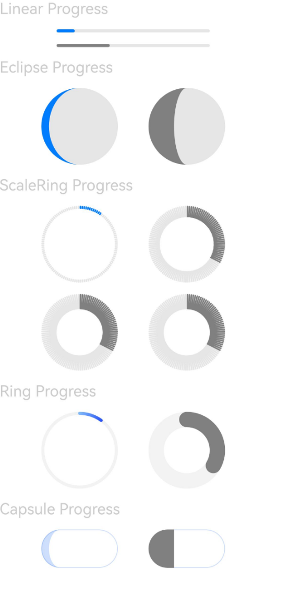
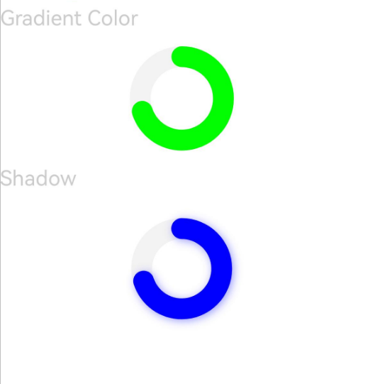
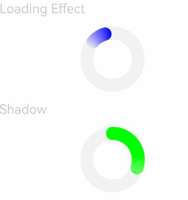
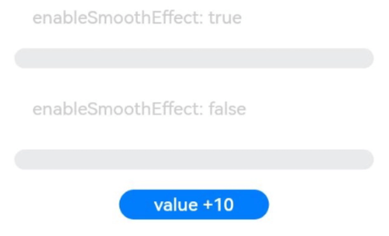

# Progress

<!--Del-->
> **Note:**
>
> Currently in the beta phase.
<!--DelEnd-->

A progress bar component used to display the loading progress of content or the processing status of operations.

## Import Module

```cangjie
import kit.ArkUI.*
```

## Child Components

None

## Creating the Component

### init(?Float64, ?Float64, ?ProgressType)

```cangjie
public init(value!: ?Float64, total!: ?Float64 = None, progressType!: ?ProgressType = None)
```

**Function:** Creates a progress bar component.

**System Capability:** SystemCapability.ArkUI.ArkUI.Full

**Since:** 22

**Parameters:**

| Parameter Name | Type | Required | Default Value | Description |
|:---|:---|:---|:---|:---|
| value | ?Float64 | Yes | - | **Named parameter.** Specifies the current progress value. Values less than 0 are set to 0.0, and values greater than total are set to total. Initial value: 0.0 |
| total | ?Float64 | No | None | **Named parameter.** Specifies the total length of the progress bar. Values less than or equal to 0 are set to 100.0. |
| progressType | ?[ProgressType](./cj-common-types.md#enum-progresstype) | No | None | **Named parameter.** Specifies the type of the progress bar. |

## Common Attributes/Common Events

Common Attributes: All supported.

> **Note:**
>
> This component overrides the common attribute backgroundColor. When applied directly to the Progress component, it affects the background color of the progress bar. To set the background color of the entire Progress component, add backgroundColor to the outer container that wraps the Progress component.

Common Events: All supported.

## Component Attributes

### func color(?ResourceColor)

```cangjie
public func color(value: ?ResourceColor): This
```

**Function:** Sets the foreground color of the progress bar.

**System Capability:** SystemCapability.ArkUI.ArkUI.Full

**Since:** 22

**Parameters:**

| Parameter Name | Type | Required | Default Value | Description |
|:---|:---|:---|:---|:---|
| value | ?[ResourceColor](./cj-common-types.md#interface-resourcecolor) | Yes | - | The foreground color of the progress bar. |

### func style(?Length, ?Int32, ?Length)

```cangjie
public func style(strokeWidth!: ?Length = None, scaleCount!: ?Int32 = None, scaleWidth!: ?Length = None): This
```

**Function:** Sets the style of the progress bar.

**System Capability:** SystemCapability.ArkUI.ArkUI.Full

**Since:** 22

**Parameters:**

| Parameter Name | Type | Required | Default Value | Description |
|:---|:---|:---|:---|:---|
| strokeWidth | ?[Length](./cj-common-types.md#interface-length) | No | None | **Named parameter.** Sets the width of the progress bar (percentage values are not supported). Initial value: 10.vp. |
| scaleCount | ?Int32 | No | None | **Named parameter.** Sets the total number of scale marks for a circular progress bar. Initial value: 120. |
| scaleWidth | ?[Length](./cj-common-types.md#interface-length) | No | None | **Named parameter.** Sets the thickness of the scale marks for a circular progress bar (percentage values are not supported). If the scale thickness exceeds the progress bar width, the system default thickness is used. Initial value: 2.vp. |

### func style(?RingStyleOptions)

```cangjie
public func style(value: ?RingStyleOptions): This
```

**Function:** Sets the style of the Ring progress bar.

**System Capability:** SystemCapability.ArkUI.ArkUI.Full

**Since:** 22

**Parameters:**

| Parameter Name | Type | Required | Default Value | Description |
|:---|:---|:---|:---|:---|
| value | ?[RingStyleOptions](#class-ringstyleoptions) | Yes | - | Sets the style of the Ring progress bar.<br>Initial value: RingStyleOptions(). |

### func value(?Float64)

```cangjie
public func value(value: ?Float64): This
```

**Function:** Sets the current progress value.

**System Capability:** SystemCapability.ArkUI.ArkUI.Full

**Since:** 22

**Parameters:**

| Parameter Name | Type | Required | Default Value | Description |
|:---|:---|:---|:---|:---|
| value | ?Float64 | Yes | - | The current progress value. Initial value: 0.0. |

## Basic Type Definitions

### interface CommonProgressStyleOptions

```cangjie
sealed interface CommonProgressStyleOptions {}
```

**Function:** Common style options for progress bars.

**System Capability:** SystemCapability.ArkUI.ArkUI.Full

**Since:** 22

### class RingStyleOptions

```cangjie
public class RingStyleOptions <: CommonProgressStyleOptions {
    public var strokeWidth: ?Length
    public var shadow: ?Bool
    public var status: ?ProgressStatus
    public var enableSmoothEffect: ?Bool
    public var enableScanEffect: ?Bool
    public init(strokeWidth!: ?Length = None, shadow!: ?Bool = None, status!: ?ProgressStatus = None, enableSmoothEffect!: ?Bool = None, enableScanEffect!: ?Bool = None)
}
```

**Function:** Style options for a circular (Ring) progress bar.

**System Capability:** SystemCapability.ArkUI.ArkUI.Full

**Since:** 22

**Parent Type:**

- [CommonProgressStyleOptions](#interface-commonprogressstyleoptions)

#### var enableScanEffect

```cangjie
public var enableScanEffect: ?Bool
```

**Function:** Toggles the scan light effect.

**Type:** ?Bool

**Read/Write:** Readable and Writable

**System Capability:** SystemCapability.ArkUI.ArkUI.Full

**Since:** 22

#### var enableSmoothEffect

```cangjie
public var enableSmoothEffect: ?Bool
```

**Function:** Toggles the smooth animation effect. When enabled, the progress transitions smoothly from the current value to the target value; otherwise, it changes abruptly.

**Type:** ?Bool

**Read/Write:** Readable and Writable

**System Capability:** SystemCapability.ArkUI.ArkUI.Full

**Since:** 22

#### var shadow

```cangjie
public var shadow: ?Bool
```

**Function:** Toggles the shadow effect for the progress bar.

**Type:** ?Bool

**Read/Write:** Readable and Writable

**System Capability:** SystemCapability.ArkUI.ArkUI.Full

**Since:** 22

#### var status

```cangjie
public var status: ?ProgressStatus
```

**Function:** Sets the status of the progress bar. When set to LOADING, a checking-for-updates animation is enabled, and setting the progress value has no effect. When changed from LOADING to PROGRESSING, the animation completes before stopping.

**Type:** ?[ProgressStatus](#enum-progressstatus)

**Read/Write:** Readable and Writable

**System Capability:** SystemCapability.ArkUI.ArkUI.Full

**Since:** 22

#### var strokeWidth

```cangjie
public var strokeWidth: ?Length
```

**Function:** Sets the width of the progress bar (percentage values are not supported).

**Type:** ?[Length](./cj-common-types.md#interface-length)

**Read/Write:** Readable and Writable

**System Capability:** SystemCapability.ArkUI.ArkUI.Full

**Since:** 22

#### init(?Length, ?Bool, ?ProgressStatus, ?Bool, ?Bool)

```cangjie
public init(strokeWidth!: ?Length = None, shadow!: ?Bool = None, status!: ?ProgressStatus = None, enableSmoothEffect!: ?Bool = None, enableScanEffect!: ?Bool = None)
```

**Function:** Creates a RingStyleOptions object.

**System Capability:** SystemCapability.ArkUI.ArkUI.Full

**Since:** 22

**Parameters:**

| Parameter Name | Type | Required | Default Value | Description |
|:---|:---|:---|:---|:---|
| strokeWidth | ?[Length](./cj-common-types.md#interface-length) | No | None | **Named parameter.** Sets the width of the progress bar (percentage values are not supported). If the width is greater than or equal to the radius, it defaults to half the radius. Initial value: 4.0.vp. |
| shadow | ?Bool | No | None | **Named parameter.** Toggles the shadow effect for the progress bar. Initial value: false. |
| status | ?[ProgressStatus](#enum-progressstatus) | No | None | **Named parameter.** Sets the status of the progress bar. When set to LOADING, a checking-for-updates animation is enabled, and setting the progress value has no effect. When changed from LOADING to PROGRESSING, the animation completes before stopping. Initial value: ProgressStatus.Progressing. |
| enableSmoothEffect | ?Bool | No | None | **Named parameter.** Toggles the smooth animation effect. When enabled, the progress transitions smoothly from the current value to the target value; otherwise, it changes abruptly. Initial value: true. |
| enableScanEffect | ?Bool | No | None | **Named parameter.** Toggles the scan light effect. Initial value: false. |

### enum ProgressStatus

```cangjie
public enum ProgressStatus <: Equatable<ProgressStatus> {
    | Loading
    | Progressing
    | ...
}
```

**Function:** The current status of the progress bar.

**System Capability:** SystemCapability.ArkUI.ArkUI.Full

**Since:** 22

**Parent Type:**

- Equatable\<[ProgressStatus](#enum-progressstatus)>

#### Loading

```cangjie
Loading
```

**Function:** Loading status.

**System Capability:** SystemCapability.ArkUI.ArkUI.Full

**Since:** 22

#### Progressing

```cangjie
Progressing
```

**Function:** Processing status.

**System Capability:** SystemCapability.ArkUI.ArkUI.Full

**Since:** 22

#### operator func !=(ProgressStatus)

```cangjie
public operator func !=(other: ProgressStatus): Bool
```

**Function:** Compares whether two enum values are not equal.

**System Capability:** SystemCapability.ArkUI.ArkUI.Full

**Since:** 22

**Parameters:**

| Parameter Name | Type | Required | Default Value | Description |
|:---|:---|:---|:---|:---|
| other | [ProgressStatus](#enum-progressstatus) | Yes | - | The other enum value to compare. |

**Return Value:**

| Type | Description |
|:----|:----|
| Bool | Returns true if the two enum values are not equal, otherwise returns false. |

#### operator func ==(ProgressStatus)

```cangjie
public operator func ==(other: ProgressStatus): Bool
```

**Function:** Compares whether two enum values are equal.

**System Capability:** SystemCapability.ArkUI.ArkUI.Full

**Since:** 22

**Parameters:**

| Parameter Name | Type | Required | Default Value | Description |
|:---|:---|:---|:---|:---|
| other | [ProgressStatus](#enum-progressstatus) | Yes | - | The other enum value to compare. |

**Return Value:**

| Type | Description |
|:----|:----|
| Bool | Returns true if the two enum values are equal, otherwise returns false. |

## Example Code

### Example 1 (Setting the Type of Progress Bar)

This example demonstrates setting the type of a progress bar using the type attribute.

<!-- run -->

```cangjie
package ohos_app_cangjie_entry

import kit.ArkUI.*
import ohos.arkui.state_macro_manage.*

@Entry
@Component
class EntryView {
    let scaleStyle0 = RingStyleOptions(strokeWidth: 15.vp, enableSmoothEffect: true)
    let scaleStyle1 = RingStyleOptions(strokeWidth: 20.vp, enableSmoothEffect: true)
    let scaleStyle2 = RingStyleOptions(strokeWidth: 20.vp, enableSmoothEffect: true)
    let ringStyle = RingStyleOptions(strokeWidth: 20.vp)
    func build() {
        Column(space: 15) {
            Text("Linear Progress").fontSize(20).fontColor(0xCCCCCC).width(90.percent)
            Progress(value: 10.0, progressType: ProgressType.Linear).width(200)
            Progress(value: 20.0, total: 150.0, progressType: ProgressType.Linear)
                .color(Color.Gray)
                .value(50.0)
                .width(200)

            Text("Eclipse Progress").fontSize(20).fontColor(0xCCCCCC).width(90.percent)
            Row(space: 40) {
                Progress(value: 10.0, progressType: ProgressType.Eclipse).width(100)
                Progress(value: 20.0, total: 150.0, progressType: ProgressType.Eclipse)
                    .width(100)
                    .color(Color.Gray)
                    .value(50.0)
            }

            Text("ScaleRing Progress").fontSize(20).fontColor(0xCCCCCC).width(90.percent)
            Row(space: 40) {
                Progress(value: 10.0, progressType: ProgressType.ScaleRing).width(100)
                Progress(value: 20.0, total: 150.0, progressType: ProgressType.ScaleRing)
                    .color(Color.Gray)
                    .value(50.0)
                    .width(100)
                    .style(scaleStyle0)
            }

            Row(space: 40) {
                Progress(value: 20.0, total: 150.0, progressType: ProgressType.ScaleRing)
                    .color(Color.Gray)
                    .value(50.0)
                    .width(100)
                    .style(scaleStyle1)
                Progress(value: 20.0, total: 150.0, progressType: ProgressType.ScaleRing)
                    .color(Color.Gray)
                    .value(50.0)
                    .width(100)
                    .style(scaleStyle2)
            }

            Text("Ring Progress").fontSize(20).fontColor(0xCCCCCC).width(90.percent)
            Row(space: 40) {
                Progress(value: 10.0, progressType: ProgressType.Ring).width(100)
                Progress(value: 20.0, total: 150.0, progressType: ProgressType.Ring)
                    .color(Color.Gray)
                    .value(50.0)
                    .width(100)
                    .style(ringStyle)
            }

            Text("Capsule Progress").fontSize(20).fontColor(0xCCCCCC).width(90.percent)
            Row(space: 40) {
                Progress(value: 10.0, progressType: ProgressType.Capsule).width(100).height(50)
                Progress(value: 20.0, total: 150.0, progressType: ProgressType.Capsule)
                    .color(Color.Gray)
                    .value(50.0)
                    .width(100)
                    .height(50)
            }
        }
    }
}
```

### Example 2 (Setting Circular Progress Bar Properties)

This example demonstrates the visual property configuration of a circular progress bar using the `strokeWidth` and `shadow` attributes of the style interface.

<!-- run -->

```cangjie
package ohos_app_cangjie_entry

import kit.ArkUI.*
import ohos.arkui.state_macro_manage.*

@Entry
@Component
class EntryView {
    let ringStyle0 = RingStyleOptions(strokeWidth: 20.vp)
    let ringStyle1 = RingStyleOptions(strokeWidth: 20.vp, shadow: true)
    func build() {
        Column(space: 15) {
            Text("Gradient Color").fontSize(20).fontColor(0xCCCCCC).width(90.percent)
            Row(space: 40) {
                Progress(value: 70.0, progressType: ProgressType.Ring)
                    .width(100)
                    .style(ringStyle0)
                    .color(0X02fd03)
            }
            Text("Shadow").fontSize(20).fontColor(0xCCCCCC).width(90.percent)
            Row(space: 40) {
                Progress(value: 70.0, progressType: ProgressType.Ring).width(120).color(Color.Blue).style(ringStyle1)
            }
        }
    }
}
```



### Example 3 (Configuring Circular Progress Bar Animation)

This example implements the toggle functionality for circular progress bar animations using the `status` and `enableScanEffect` attributes of the style interface.

<!-- run -->

```cangjie
package ohos_app_cangjie_entry

import ohos.arkui.state_management.*
import ohos.arkui.state_macro_manage.*
import ohos.arkui.component.*
import ohos.base.*
import ohos.resource_manager.*

@Entry
@Component
class EntryView {
    let ringStyle0 = RingStyleOptions(strokeWidth: 20.vp, status: ProgressStatus.Loading)
    let ringStyle1 = RingStyleOptions(strokeWidth: 20.vp, enableScanEffect: true)
    func build() {
        Column(space: 15) {
            Text("Loading Effect").fontSize(20).fontColor(0xCCCCCC).width(90.percent)
            Row(space: 40) {
                Progress(value: 0.0, progressType: ProgressType.Ring).width(100).style(ringStyle0).color(Color.Blue)
            }
            Text("Shadow").fontSize(20).fontColor(0xCCCCCC).width(90.percent)
            Row(space: 40) {
                Progress(value: 30.0, progressType: ProgressType.Ring).width(100).color(0X02fd03).style(ringStyle1)
            }
        }
    }
}
```



### Example 4 (Configuring Smooth Progress Animation)

This example implements the toggle functionality for smooth progress animation using the `enableSmoothEffect` attribute of the style interface.

<!-- run -->

```cangjie
package ohos_app_cangjie_entry

import kit.ArkUI.*
import ohos.arkui.state_macro_manage.*

@Entry
@Component
class EntryView {
    @State
    var value: Float64 = 0.0

    func build() {
        Column(space: 10) {
            Text('enableSmoothEffect: true').fontSize(9).fontColor(0xCCCCCC).width(90.percent).margin(5).margin( top: 20 )
            Progress( value: this.value, total: 100.0, progressType: ProgressType.Linear ).style(RingStyleOptions(strokeWidth: 10, enableSmoothEffect: true ))
            Text('enableSmoothEffect: false').fontSize(9).fontColor(0xCCCCCC).width(90.percent).margin(5)
            Progress( value: this.value, total: 100.0, progressType: ProgressType.Linear ).style(RingStyleOptions(strokeWidth: 10, enableSmoothEffect: false ))
            Button('value +10')
                .onClick({ evt =>
                    this.value += 10.0
            }).width(75).height(15).fontSize(9)
        }.width(50.percent).height(100.percent).margin( left: 20 )
    }
}
```

