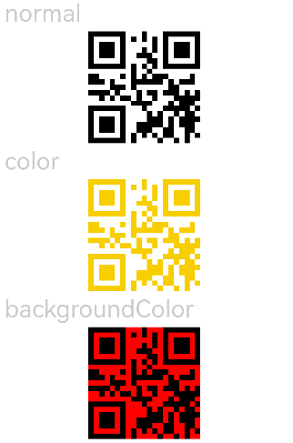

# QRCode

A component for displaying a single QR code.

> **Note:**
>
> The number of pixels in the QR code component is related to its content. When the component size is too small, it may fail to display the content properly, in which case the component size should be adjusted appropriately.

## Import Module

```cangjie
import kit.ArkUI.*
```

## Child Components

None

## Creating the Component

### init(?ResourceStr)

```cangjie
public init(value: ?ResourceStr)
```

**Function:** Creates a component for displaying a single QR code.

**System Capability:** SystemCapability.ArkUI.ArkUI.Full

**Since:** 22

**Parameters:**

| Parameter | Type | Required | Default | Description |
|:---|:---|:---|:---|:---|
| value | ?[ResourceStr](./cj-common-types.md#interface-resourcestr) | Yes | - | The content string of the QR code. Supports up to 512 characters. If exceeded, the first 512 characters will be used. Initial value: "undefined". |

## Universal Attributes/Events

Universal Attributes: All supported.

Universal Events: Supports [Click Event](cj-universal-event-click.md), [Touch Event](cj-universal-event-touch.md), [Mount/Unmount Event](cj-universal-event-appear.md).

## Component Attributes

### func color(?ResourceColor)

```cangjie
public func color(value: ?ResourceColor): This
```

**Function:** Sets the color of the QR code.

**System Capability:** SystemCapability.ArkUI.ArkUI.Full

**Since:** 22

**Parameters:**

| Parameter | Type | Required | Default | Description |
|:---|:---|:---|:---|:---|
| value | ?[ResourceColor](./cj-common-types.md#interface-resourcecolor) | Yes | - | The color of the QR code. Initial value: 0xff000000, and it does not change with the system's light/dark mode switch. |

### func contentOpacity(?Float64)

```cangjie
public func contentOpacity(value: ?Float64): This
```

**Function:** Sets the opacity of the QR code content color. The minimum opacity is 0.0, and the maximum is 1.0.

**System Capability:** SystemCapability.ArkUI.ArkUI.Full

**Since:** 22

**Parameters:**

| Parameter | Type | Required | Default | Description |
|:---|:---|:---|:---|:---|
| value | ?Float64 | Yes | - | The opacity of the QR code content color. Initial value: 1.0. Valid range: [0.0, 1.0]. Values outside this range will be treated as the initial value. |

### func contentOpacity(?AppResource)

```cangjie
public func contentOpacity(value: ?AppResource): This
```

**Function:** Sets the opacity of the QR code content color. The minimum opacity is 0, and the maximum is 1.

**System Capability:** SystemCapability.ArkUI.ArkUI.Full

**Since:** 22

**Parameters:**

| Parameter | Type | Required | Default | Description |
|:---|:---|:---|:---|:---|
| value | ?[AppResource](../LocalizationKit/cj-apis-resource.md#class-appresource) | Yes | - | The opacity of the QR code content color. <br>Initial value: 1.0. |

## Example Code

This example demonstrates the basic usage of the QRCode component, setting the QR code color via the [color](#func-colorresourcecolor) attribute, the background color via the backgroundColor attribute, and the opacity via the [contentOpacity](#func-contentopacityfloat64) attribute.

<!-- run -->

```cangjie
package ohos_app_cangjie_entry

import kit.ArkUI.*
import ohos.arkui.state_macro_manage.*
import ohos.i18n.*
import ohos.resource_manager.*
import ohos.resource.__GenerateResource__

@Entry
@Component
class EntryView {
    var value: String = "hello world";

    func build() {
        Scroll() {
            Column(space: 5) {
                Text("normal").fontSize(9).width(90.percent).fontColor(0xCCCCCC).fontSize(30)
                QRCode(this.value).width(140).height(140)

                // Set QR code color
                Text("color").fontSize(9).width(90.percent).fontColor(0xCCCCCC).fontSize(30)
                QRCode(this.value).color(0xF7CE00).width(140).height(140)

                // Set QR code background color
                Text("backgroundColor").fontSize(9).width(90.percent).fontColor(0xCCCCCC).fontSize(30)
                QRCode(this.value).width(140).height(140).backgroundColor(Color.Red)

                // Set QR code opacity
                Text("contentOpacity").fontSize(9).width(90.percent).fontColor(0xCCCCCC).fontSize(30)
                QRCode(this.value).width(140).height(140).color(Color.Black).contentOpacity(0.1)

                // Set QR code opacity
                Text("contentOpacity").fontSize(9).width(90.percent).fontColor(0xCCCCCC).fontSize(30)
                QRCode(this.value).width(140).height(140).color(Color.Black).contentOpacity(0.1)

                // Set QR code opacity
                Text("contentOpacity int").fontSize(9).width(90.percent).fontColor(0xCCCCCC).fontSize(30)
                QRCode(this.value).width(140).height(140).color(Color.Black).contentOpacity(0.0)

                // Set QR code opacity
                Text("contentOpacity resource").fontSize(9).width(90.percent).fontColor(0xCCCCCC).fontSize(30)
                QRCode(this.value).width(140).height(140).color(Color.Black).contentOpacity(
                    @r(sys.float.alpha_40))
            }.width(100.percent).margin(top: 5)
        }
    }
}
```


