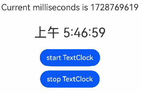

# TextClock

The TextClock component displays the current system time on the device through text. It supports time display in different time zones with second-level precision.

When the component is not visible, time updates will stop. The component's visibility state is based on [onVisibleAreaChange](./cj-universal-event-visibleareachange.md#func-onvisibleareachangearrayfloat64-bool-float64-unit---unit) handling, where a visibility threshold ratio greater than 0 is considered visible.

## Import Module

```cangjie
import kit.ArkUI.*
```

## Subcomponents

None

## Creating the Component

### init(?Float32, ?TextClockController)

```cangjie
public init(timeZoneOffset!: ?Float32 = None, controller!: ?TextClockController = None)
```

**Function:** Creates a TextClock object with time zone offset and controller.

**System Capability:** SystemCapability.ArkUI.ArkUI.Full

**Since:** 22

**Parameters:**

| Parameter Name | Type | Required | Default Value | Description |
|:---|:---|:---|:---|:---|
| timeZoneOffset | ?Float32 | No | None | **Named parameter.** Time zone offset. |
| controller | ?[TextClockController](#class-textclockcontroller) | No | None | **Named parameter.** Controller for the TextClock component. |

## Common Attributes/Common Events

Common Attributes: All supported.

Common Events: All supported.

## Component Attributes

### func fontColor(?ResourceColor)

```cangjie
public func fontColor(value: ?ResourceColor): This
```

**Function:** Sets the text color.

**System Capability:** SystemCapability.ArkUI.ArkUI.Full

**Since:** 22

**Parameters:**

| Parameter Name | Type | Required | Default Value | Description |
|:---|:---|:---|:---|:---|
| value | ?[ResourceColor](./cj-common-types.md#interface-resourcecolor) | Yes | - | Text color. |

### func fontFamily(?ResourceStr)

```cangjie
public func fontFamily(value: ?ResourceStr): This
```

**Function:** Sets the font family of the text.

**System Capability:** SystemCapability.ArkUI.ArkUI.Full

**Since:** 22

**Parameters:**

| Parameter Name | Type | Required | Default Value | Description |
|:---|:---|:---|:---|:---|
| value | ?[ResourceStr](./cj-common-types.md#interface-resourcestr) | Yes | - | Font family of the text.<br>Default: "HarmonyOS Sans". |

### func fontSize(?Length)

```cangjie
public func fontSize(value: ?Length): This
```

**Function:** Sets the font size of the text.

**System Capability:** SystemCapability.ArkUI.ArkUI.Full

**Since:** 22

**Parameters:**

| Parameter Name | Type | Required | Default Value | Description |
|:---|:---|:---|:---|:---|
| value | ?[Length](./cj-common-types.md#interface-length) | Yes | - | Font size of the text.<br>Default: 16.0.fp. |

### func fontStyle(?FontStyle)

```cangjie
public func fontStyle(value: ?FontStyle): This
```

**Function:** Sets the font style of the text.

**System Capability:** SystemCapability.ArkUI.ArkUI.Full

**Since:** 22

**Parameters:**

| Parameter Name | Type | Required | Default Value | Description |
|:---|:---|:---|:---|:---|
| value | ?[FontStyle](./cj-common-types.md#enum-fontstyle) | Yes | - | Font style of the text.<br>Default: FontStyle.Normal. |

### func fontWeight(?FontWeight)

```cangjie
public func fontWeight(value: ?FontWeight): This
```

**Function:** Sets the font weight of the text.

**System Capability:** SystemCapability.ArkUI.ArkUI.Full

**Since:** 22

**Parameters:**

| Parameter Name | Type | Required | Default Value | Description |
|:---|:---|:---|:---|:---|
| value | ?[FontWeight](./cj-common-types.md#enum-fontweight) | Yes | - | Font weight of the text.<br>Default: FontWeight.Normal. |

### func format(?ResourceStr)

```cangjie
public func format(value: ?ResourceStr): This
```

**Function:** Sets the time display format.

**System Capability:** SystemCapability.ArkUI.ArkUI.Full

**Since:** 22

**Parameters:**

| Parameter Name | Type | Required | Default Value | Description |
|:---|:---|:---|:---|:---|
| value | ?[ResourceStr](./cj-common-types.md#interface-resourcestr) | Yes | - | Time format string. Default: "". |

### func textShadow(?Array\<ShadowOptions>)

```cangjie
public func textShadow(values: ?Array<ShadowOptions>): This
```

**Function:** Sets the text shadow effect.

**System Capability:** SystemCapability.ArkUI.ArkUI.Full

**Since:** 22

**Parameters:**

| Parameter Name | Type | Required | Default Value | Description |
|:---|:---|:---|:---|:---|
| values | ?Array\<[ShadowOptions](./cj-common-types.md#class-shadowoptions)> | Yes | - | Array of shadow options. |

### func textShadow(?ShadowOptions)

```cangjie
public func textShadow(value: ?ShadowOptions): This
```

**Function:** Sets the text shadow effect.

**System Capability:** SystemCapability.ArkUI.ArkUI.Full

**Since:** 22

**Parameters:**

| Parameter Name | Type | Required | Default Value | Description |
|:---|:---|:---|:---|:---|
| value | ?[ShadowOptions](./cj-common-types.md#class-shadowoptions) | Yes | - | Shadow option. |

## Component Events

### func onDateChange(?(Int64) -> Unit)

```cangjie
public func onDateChange(callback: ?(Int64) -> Unit): This
```

**Function:** Provides a callback for date changes.

**System Capability:** SystemCapability.ArkUI.ArkUI.Full

**Since:** 22

**Parameters:**

| Parameter Name | Type | Required | Default Value | Description |
|:---|:---|:---|:---|:---|
| callback | ?(Int64) -> Unit | Yes | - | Callback function for date changes. Default: { _ => } |

## Basic Type Definitions

### class DateTimeOptions

```cangjie
public class DateTimeOptions {
    public var locale: ?String
    public var dateStyle: ?String
    public var timeStyle: ?String
    public var hourCycle: ?String
    public var timeZone: ?String
    public var numberingSystem: ?String
    public var hour12: ?Bool
    public var weekday: ?String
    public var era: ?String
    public var year: ?String
    public var month: ?String
    public var day: ?String
    public var hour: ?String
    public var minute: ?String
    public var second: ?String
    public var timeZoneName: ?String
    public var dayPeriod: ?String
    public var localeMatcher: ?String
    public var formatMatcher: ?String
    public init(locale!: ?String = None, dateStyle!: ?String = None, timeStyle!: ?String = None,
    hourCycle!: ?String = None, timeZone!: ?String = None, numberingSystem!: ?String = None, hour12!: ?Bool = None,
    weekday!: ?String = None, era!: ?String = None, year!: ?String = None, month!: ?String = None,
    day!: ?String = None, hour!: ?String = None, minute!: ?String = None, second!: ?String = None,
    timeZoneName!: ?String = None, dayPeriod!: ?String = None, localeMatcher!: ?String = None,
    formatMatcher!: ?String = None)
}
```

**Function:** Defines options for the DateTimeOptions object.

**System Capability:** SystemCapability.ArkUI.ArkUI.Full

**Since:** 22

#### var dateStyle

```cangjie
public var dateStyle: ?String
```

**Function:** Date display format. Values can be: "long", "short", "medium", "full", or "auto".

**Type:** ?String

**Read/Write:** Read-Write

**System Capability:** SystemCapability.ArkUI.ArkUI.Full

**Since:** 22

#### var day

```cangjie
public var day: ?String
```

**Function:** Day display format. Values can be: "numeric" or "2-digit".

**Type:** ?String

**Read/Write:** Read-Write

**System Capability:** SystemCapability.ArkUI.ArkUI.Full

**Since:** 22

#### var dayPeriod

```cangjie
public var dayPeriod: ?String
```

**Function:** Day period display format. Values can be: "long", "short", "narrow", or "auto".

**Type:** ?String

**Read/Write:** Read-Write

**System Capability:** SystemCapability.ArkUI.ArkUI.Full

**Since:** 22

#### var era

```cangjie
public var era: ?String
```

**Function:** Era display format. Values can be: "long", "short", "narrow", or "auto".

**Type:** ?String

**Read/Write:** Read-Write

**System Capability:** SystemCapability.ArkUI.ArkUI.Full

**Since:** 22

#### var formatMatcher

```cangjie
public var formatMatcher: ?String
```

**Function:** Format matching algorithm. Values can be: "basic" (exact match) or "best fit" (best match).

**Type:** ?String

**Read/Write:** Read-Write

**System Capability:** SystemCapability.ArkUI.ArkUI.Full

**Since:** 22

#### var hour

```cangjie
public var hour: ?String
```

**Function:** Hour display format. Values can be: "numeric" or "2-digit".

**Type:** ?String

**Read/Write:** Read-Write

**System Capability:** SystemCapability.ArkUI.ArkUI.Full

**Since:** 22

#### var hour12

```cangjie
public var hour12: ?Bool
```

**Function:** Whether to use 12-hour format. true means 12-hour format, false means otherwise. If both hour12 and hourCycle are set, hourCycle will not take effect.

**Type:** ?Bool

**Read/Write:** Read-Write

**System Capability:** SystemCapability.ArkUI.ArkUI.Full

**Since:** 22

#### var hourCycle

```cangjie
public var hourCycle: ?String
```

**Function:** Hour cycle. Values can be: "h11", "h12", "h23", or "h24".

**Type:** ?String

**Read/Write:** Read-Write

**System Capability:** SystemCapability.ArkUI.ArkUI.Full

**Since:** 22

#### var locale

```cangjie
public var locale: ?String
```

**Function:** Valid locale ID, e.g., "zh-Hans-CN". Default is the current system locale.

**Type:** ?String

**Read/Write:** Read-Write

**System Capability:** SystemCapability.ArkUI.ArkUI.Full

**Since:** 22

#### var localeMatcher: ?String

```cangjie
public var localeMatcher: ?String
```

**Function:** Locale matching algorithm. Values can be: "lookup" (exact match) or "best fit" (best match).

**Type:** ?String

**Read/Write:** Read-Write

**System Capability:** SystemCapability.ArkUI.ArkUI.Full

**Since:** 22

#### var minute

```cangjie
public var minute: ?String
```

**Function:** Minute display format. Values can be: "numeric" or "2-digit".

**Type:** ?String

**Read/Write:** Read-Write

**System Capability:** SystemCapability.ArkUI.ArkUI.Full

**Since:** 22

#### var month

```cangjie
public var month: ?String
```

**Function:** Month display format. Values can be: "numeric", "2-digit", "long", "short", "narrow", or "auto".

**Type:** ?String

**Read/Write:** Read-Write

**System Capability:** SystemCapability.ArkUI.ArkUI.Full

**Since:** 22

#### var numberingSystem

```cangjie
public var numberingSystem: ?String
```

**Function:** Numbering system. Values can be: "adlm", "ahom", "arab", "arabext", "bali", "beng", "bhks", "brah", "cakm", "cham", "deva", "diak", "fullwide", "gong", "gonm", "gujr", "guru", "hanidec", "hmng", "hmnp", "java", "kali", "khmr", "knda", "lana", "lanatham", "laoo", "latn", "lepc", "limb", "mathbold", "mathdbl", "mathmono", "mathsanb", "mathsans", "mlym", "modi", "mong", "mroo", "mtei", "mymr", "mymrshan", "mymrtlng", "newa", "nkoo", "olck", "orya", "osma", "rohg", "saur", "segment", "shrd", "sind", "sinh", "sora", "sund", "takr", "talu", "tamldec", "telu", "thai", "tibt", "tirh", "vaii", "wara", or "wcho".

**Type:** ?String

**Read/Write:** Read-Write

**System Capability:** SystemCapability.ArkUI.ArkUI.Full

**Since:** 22

#### var second: ?String

```cangjie
public var second: ?String
```

**Function:** Second display format. Values can be: "numeric" or "2-digit".

**Type:** ?String

**Read/Write:** Read-Write

**System Capability:** SystemCapability.ArkUI.ArkUI.Full

**Since:** 22

#### var timeStyle

```cangjie
public var timeStyle: ?String
```

**Function:** Time display format. Values can be: "long", "short", "medium", "full", or "auto".

**Type:** ?String

**Read/Write:** Read-Write

**System Capability:** SystemCapability.ArkUI.ArkUI.Full

**Since:** 22

#### var timeZone

```cangjie
public var timeZone: ?String
```

**Function:** Time zone to use. Value is a valid IANA time zone ID.

**Type:** ?String

**Read/Write:** Read-Write

**System Capability:** SystemCapability.ArkUI.ArkUI.Full

**Since:** 22

#### var timeZoneName

```cangjie
public var timeZoneName: ?String
```

**Function:** Localized representation of time zone name. Values can be: "long", "short", or "auto".

**Type:** ?String

**Read/Write:** Read-Write

**System Capability:** SystemCapability.ArkUI.ArkUI.Full

**Since:** 22

#### var weekday

```cangjie
public var weekday: ?String
```

**Function:** Weekday display format. Values can be: "long", "short", "narrow", or "auto".

**Type:** ?String

**Read/Write:** Read-Write

**System Capability:** SystemCapability.ArkUI.ArkUI.Full

**Since:** 22

#### var year

```cangjie
public var year: ?String
```

**Function:** Year display format. Values can be: "numeric" or "2-digit".

**Type:** ?String

**Read/Write:** Read-Write

**System Capability:** SystemCapability.ArkUI.ArkUI.Full

**Since:** 22

#### init(?String, ?String, ?String, ?String, ?String, ?String, ?Bool, ?String, ?String, ?String, ?String, ?String, ?String, ?String, ?String, ?String, ?String)

```cangjie
public init(locale!: ?String = None, dateStyle!: ?String = None, timeStyle!: ?String = None,
    hourCycle!: ?String = None, timeZone!: ?String = None, numberingSystem!: ?String = None, hour12!: ?Bool = None,
    weekday!: ?String = None, era!: ?String = None, year!: ?String = None, month!: ?String = None,
    day!: ?String = None, hour!: ?String = None, minute!: ?String = None, second!: ?String = None,
    timeZoneName!: ?String = None, dayPeriod!: ?String = None, localeMatcher!: ?String = None,
    formatMatcher!: ?String = None)
```

**Function:** Constructor for DateTimeOptions.

**System Capability:** SystemCapability.ArkUI.ArkUI.Full

**Since:** 22

**Parameters:**

| Parameter Name | Type | Required | Default Value | Description |
|:---|:---|:---|:---|:---|
| locale | ?String | No | None | **Named parameter.** Locale ID. Default: "zh-Hans-CN". |
| dateStyle | ?String | No | None | **Named parameter.** Date display format. Default: "long". |
| timeStyle | ?String | No | None | **Named parameter.** Time display format. Default: "long". |
| hourCycle | ?String | No | None | **Named parameter.** Hour cycle. Default: "h11". |
| timeZone | ?String | No | None | **Named parameter.** Time zone. Default: "". |
| numberingSystem | ?String | No | None | **Named parameter.** Numbering system. Default: "adlm". |
| hour12 | ?Bool | No | None | **Named parameter.** Whether to use 12## Sample Code

### Example 1 (Setting Text Shadow Style)

This example demonstrates how to set the text shadow style for a text clock using the `textShadow` property.

<!-- run -->

```cangjie
package ohos_app_cangjie_entry
import kit.ArkUI.*
import ohos.arkui.state_macro_manage.*

@Entry
@Component
class EntryView {
    @State
    var shadowoptions: Array<ShadowOptions> = [
        ShadowOptions(radius: 10.0, shadowType: ShadowType.Blur, offsetX: 10.0, offsetY: 0.0, color: 0xffff0000,
            fill: false),
        ShadowOptions(radius: 10.0, shadowType: ShadowType.Blur, offsetX: 20.0, offsetY: 0.0, color: 0xff000000,
            fill: false),
        ShadowOptions(radius: 10.0, shadowType: ShadowType.Blur, offsetX: 30.0, offsetY: 0.0, color: 0xffc0c0c0,
            fill: false),
        ShadowOptions(radius: 10.0, shadowType: ShadowType.Blur, offsetX: 40.0, offsetY: 0.0, color: 0xff00ff00,
            fill: false),
        ShadowOptions(radius: 10.0, shadowType: ShadowType.Blur, offsetX: 100.0, offsetY: 0.0, color: 0xff0000ff,
            fill: false)
    ]
    public func build() {
        Column {
            TextClock().fontSize(50).textShadow(shadowoptions)
        }
    }
}
```


### Example 2 (Text Style Clock with Start/Stop Functionality)

This example demonstrates the basic usage of the `TextClock` component by setting the clock text format through the `format` property.

Clicking the "start TextClock" button invokes the callback function to start the text clock using `TextClockController`. Clicking the "stop TextClock" button pauses the text clock via `TextClockController`.

The component in this example continuously updates the `accumulateTime` content when the text clock refreshes by setting the `onDateChange` callback function.

<!-- run -->

```cangjie
package ohos_app_cangjie_entry
import kit.ArkUI.*
import ohos.arkui.state_macro_manage.*

@Entry
@Component
class EntryView {
    @State
    var accumulateTime: Int64 = 0
    let controller = TextClockController()
    public func build() {
        Column {
            Text('Current milliseconds is ${this.accumulateTime}').fontSize(20).margin(10)
            // Displays system time in UTC+8 with 12-hour format, precise to seconds.
            TextClock(timeZoneOffset: -8.0, controller: this.controller)
                .format('aa hh:mm:ss')
                .onDateChange({
                    value: Int64 => this.accumulateTime = value
                })
                .margin(20)
                .fontSize(30)
            Button("start TextClock").margin(bottom: 10).onClick({
                evt =>
                // Start the text clock
                this.controller.start()
            })
            Button("stop TextClock").onClick({
                evt =>
                // Stop the text clock
                this.controller.stop()
            })
        }
    }
}
```

