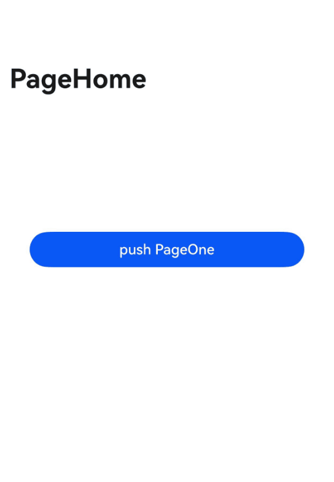

# Navigation

The Navigation component is the root view container for route navigation, typically used as the root container for Page components. By default, it includes a title bar, content area, and toolbar. The content area displays navigation content (child components of Navigation) on the homepage or non-homepage content (child components of [NavDestination](./cj-navigation-switching-navdestination.md)), with switching between homepage and non-homepage achieved through routing.

> **Note:**
>
> - When Navigation is nested within Navigation, the lifecycle of the inner Navigation does not synchronize with the outer Navigation or the lifecycle of [Full Modal](./cj-universal-attribute-bindcontentcover.md).
> - When NavDestination has no main/subtitle set and no back button, the title bar is not displayed.

## Import Module

```cangjie
import kit.ArkUI.*
```

## Child Components

Can contain child components.

## Creating the Component

### init(() -> Unit)

```cangjie
public init(child!: () -> Unit = { => })
```

**Function:** Constructs a Navigation container with child components.

**System Capability:** SystemCapability.ArkUI.ArkUI.Full

**Since Version:** 22

**Parameters:**

| Parameter | Type | Required | Default | Description |
|:---|:---|:---|:---|:---|
| child | () -> Unit | No | { => } | **Named parameter.** Child components of the Navigation container. |

### init(?NavPathStack, () -> Unit)

```cangjie
public init(pathInfos: ?NavPathStack, child!: () -> Unit = { => })
```

**Function:** Constructs a Navigation container with child components.

**System Capability:** SystemCapability.ArkUI.ArkUI.Full

**Since Version:** 22

**Parameters:**

| Parameter | Type | Required | Default | Description |
|:---|:---|:---|:---|:---|
| pathInfos | ?[NavPathStack](#class-navpathstack) | Yes | - | The route stack bound to the Navigation component. |
| child | () -> Unit | No | { => } | **Named parameter.** Child components of the Navigation container. |

## Common Attributes/Events

Common Attributes: All supported.

Common Events: All supported.

## Component Attributes

### func hideTitleBar(?Bool, ?Bool)

```cangjie
public func hideTitleBar(hide: ?Bool, animated!: ?Bool = None): This
```

**Function:** Sets whether to hide the title bar.

**System Capability:** SystemCapability.ArkUI.ArkUI.Full

**Since Version:** 22

**Parameters:**

| Parameter | Type | Required | Default | Description |
|:---|:---|:---|:---|:---|
| hide | ?Bool | Yes | - | Whether to hide the title bar. Initial value: false. |
| animated | ?Bool | No | None | **Named parameter.** Whether to use animation for showing/hiding the title bar. Initial value: false. |

### func navDestination(?(String, Any) -> Unit)

```cangjie
public func navDestination(builder: ?(String, Any) -> Unit): This
```

**Function:** Creates a NavDestination component. Uses the builder function to construct a NavDestination component based on the name. The builder must have only one root node.

**System Capability:** SystemCapability.ArkUI.ArkUI.Full

**Since Version:** 22

**Parameters:**

| Parameter | Type | Required | Default | Description |
|:---|:---|:---|:---|:---|
| builder | ?(String, Any) -> Unit | Yes | - | The NavDestination component. <br/>Parameter 1: The page name of NavDestination.<br/>Parameter 2: Detailed parameters of the NavDestination page set by developers. This parameter setting is currently not supported (setting has no effect). <br/>Initial value: { _: String, _: Any => }. |

### func title(?CustomBuilder, ?NavigationTitleOptions)

```cangjie
public func title(value: ?CustomBuilder, options!: ?NavigationTitleOptions = None): This
```

**Function:** Sets the page title.

**System Capability:** SystemCapability.ArkUI.ArkUI.Full

**Since Version:** 22

**Parameters:**

| Parameter | Type | Required | Default | Description |
|:---|:---|:---|:---|:---|
| value | ?[CustomBuilder](./cj-common-types.md#type-custombuilder) | Yes | - | The page title. Initial value: { => }. |
| options | ?[NavigationTitleOptions](#class-navigationtitleoptions) | No | None | **Named parameter.** Title bar options. |

### func title(?ResourceStr, ?NavigationTitleOptions)

```cangjie
public func title(value: ?ResourceStr, options!: ?NavigationTitleOptions = None): This
```

**Function:** Sets the page title.

**System Capability:** SystemCapability.ArkUI.ArkUI.Full

**Since Version:** 22

**Parameters:**

| Parameter | Type | Required | Default | Description |
|:---|:---|:---|:---|:---|
| value | ?[ResourceStr](./cj-common-types.md#interface-resourcestr) | Yes | - | The page title. Initial value: "". |
| options | ?[NavigationTitleOptions](#class-navigationtitleoptions) | No | None | **Named parameter.** Title bar options. |

## Basic Type Definitions

### class NavigationOptions

```cangjie
public class NavigationOptions {
    public var launchMode: ?LaunchMode
    public var animated: ?Bool
    public init(launchMode!: ?LaunchMode = None, animated!: ?Bool = None)
}
```

**Function:** Represents options for stack operations.

**System Capability:** SystemCapability.ArkUI.ArkUI.Full

**Since Version:** 22

#### var animated

```cangjie
public var animated: ?Bool
```

**Function:** Whether transition animations are supported.

**Type:** ?Bool

**Read/Write Capability:** Readable and Writable

**System Capability:** SystemCapability.ArkUI.ArkUI.Full

**Since Version:** 22

#### var launchMode

```cangjie
public var launchMode: ?LaunchMode
```

**Function:** Navigation stack operation mode.

**Type:** ?[LaunchMode](#enum-launchmode)

**Read/Write Capability:** Readable and Writable

**System Capability:** SystemCapability.ArkUI.ArkUI.Full

**Since Version:** 22

#### init(?LaunchMode, ?Bool)

```cangjie
public init(launchMode!: ?LaunchMode = None, animated!: ?Bool = None)
```

**Function:** Constructor for NavigationOptions.

**System Capability:** SystemCapability.ArkUI.ArkUI.Full

**Since Version:** 22

**Parameters:**

| Parameter | Type | Required | Default | Description |
|:---|:---|:---|:---|:---|
| launchMode | ?[LaunchMode](#enum-launchmode) | No | None | Navigation stack operation mode. Initial value: LaunchMode.Standard. |
| animated | ?Bool | No | None | Whether transition animations are supported. Initial value: true. |

### class NavigationTitleOptions

```cangjie
public class NavigationTitleOptions {
    public var backgroundColor: ?ResourceColor
    public var backgroundBlurStyle: ?BlurStyle
    public var barStyle: ?BarStyle
    public var paddingStart: ?Length
    public var paddingEnd: ?Length
    public init(backgroundColor!: ?ResourceColor = None, backgroundBlurStyle!: ?BlurStyle = None,
        barStyle!: ?BarStyle = None, paddingStart!: ?Length = None, paddingEnd!: ?Length = None
    )
}
```

**Function:** Options for the Navigation title bar.

**System Capability:** SystemCapability.ArkUI.ArkUI.Full

**Since Version:** 22

#### var backgroundBlurStyle

```cangjie
public var backgroundBlurStyle: ?BlurStyle
```

**Function:** The background blur style of the title bar. If not set, the background blur effect is disabled.

**Type:** ?[BlurStyle](./cj-common-types.md#enum-blurstyle)

**Read/Write Capability:** Readable and Writable

**System Capability:** SystemCapability.ArkUI.ArkUI.Full

**Since Version:** 22

#### var backgroundColor

```cangjie
public var backgroundColor: ?ResourceColor
```

**Function:** The background color of the title bar. If not set, the default color is used.

**Type:** ?[ResourceColor](./cj-common-types.md#interface-resourcecolor)

**Read/Write Capability:** Readable and Writable

**System Capability:** SystemCapability.ArkUI.ArkUI.Full

**Since Version:** 22

#### var barStyle

```cangjie
public var barStyle: ?BarStyle
```

**Function:** The layout style of the title bar.

**Type:** ?[BarStyle](#enum-barstyle)

**Read/Write Capability:** Readable and Writable

**System Capability:** SystemCapability.ArkUI.ArkUI.Full

**Since Version:** 22

#### var paddingEnd

```cangjie
public var paddingEnd: ?Length
```

**Function:** Sets the end margin of the title bar.

**Type:** ?[Length](./cj-common-types.md#interface-length)

**Read/Write Capability:** Readable and Writable

**System Capability:** SystemCapability.ArkUI.ArkUI.Full

**Since Version:** 22

#### var paddingStart

```cangjie
public var paddingStart: ?Length
```

**Function:** Sets the start margin of the title bar.

**Type:** ?[Length](./cj-common-types.md#interface-length)

**Read/Write Capability:** Readable and Writable

**System Capability:** SystemCapability.ArkUI.ArkUI.Full

**Since Version:** 22

#### init(?ResourceColor, ?BlurStyle, ?BarStyle, ?Length, ?Length)

```cangjie
public init(backgroundColor!: ?ResourceColor = None, backgroundBlurStyle!: ?BlurStyle = Option.None,
    barStyle!: ?BarStyle = None, paddingStart!: ?Length = None, paddingEnd!: ?Length = None)
```

**Function:** Constructor for NavigationTitleOptions.

**System Capability:** SystemCapability.ArkUI.ArkUI.Full

**Since Version:** 22

**Parameters:**

| Parameter | Type | Required | Default | Description |
|:---|:---|:---|:---|:---|
| backgroundColor | ?[ResourceColor](./cj-common-types.md#interface-resourcecolor) | No | None | Background color of the title bar. |
| backgroundBlurStyle | ?[BlurStyle](./cj-common-types.md#enum-blurstyle) | No | None | Background blur style of the title bar. |
| barStyle | ?[BarStyle](#enum-barstyle) | No | None | Layout style of the title bar. Initial value: BarStyle.Standard. |
| paddingStart | ?[Length](./cj-common-types.md#interface-length) | No | None | Start margin of the title bar. |
| paddingEnd | ?[Length](./cj-common-types.md#interface-length) | No | None | End margin of the title bar. |

### class NavPathInfo

```cangjie
public class NavPathInfo {
    public var name: ?String
    public var param: ?String
    public var onPop: ?Callback<PopInfo, Unit> = None
    public init(name!: ?String, param!: ?String, onPop!: ?Callback<PopInfo, Unit> = None)
}
```

**Function:** Represents information about NavDestination.

**System Capability:** SystemCapability.ArkUI.ArkUI.Full

**Since Version:** 22

#### var name

```cangjie
public var name: ?String
```

**Function:** The name of the navigation target page.

**Type:** ?String

**Read/Write Capability:** Readable and Writable

**System Capability:** SystemCapability.ArkUI.ArkUI.Full

**Since Version:** 22

#### var onPop

```cangjie
public var onPop: ?Callback<PopInfo, Unit> = None
```

**Function:** Callback function triggered when the navigation target page pops.

**Type:** ?[Callback](./cj-common-types.md#type-callbackt-v)\<[PopInfo](#class-popinfo), Unit>

**Read/Write Capability:** Readable and Writable

**System Capability:** SystemCapability.ArkUI.ArkUI.Full

**Since Version:** 22

#### var param

```cangjie
public var param: ?String
```

**Function:** Detailed parameters of the navigation target page.

**Type:** ?String

**Read/Write Capability:** Readable and Writable

**System Capability:** SystemCapability.ArkUI.ArkUI.Full

**Since Version:** 22

#### init(?String, ?String, ?Callback\<PopInfo, Unit>)

```cangjie
public init(name!: ?String, param!: ?String, onPop!: ?Callback<PopInfo, Unit> = None)
```

**Function:** Constructor for NavPathInfo.

**System Capability:** SystemCapability.ArkUI.ArkUI.Full

**Since Version:** 22

**Parameters:**

| Parameter | Type | Required | Default | Description |
|:---|:---|:---|:---|:---|
| name | ?String | Yes | - | **Named parameter.** Name of the NavDestination. Initial value: "". |
| param | ?String | Yes | - | **Named parameter.** Detailed parameters of the NavDestination. Initial value: "". |
| onPop | ?[Callback](./cj-common-types.md#type-callbackt-v)\<[PopInfo](#class-popinfo), Unit> | No | None | **Named parameter.** Callback function triggered when the NavDestination page pops. |### class NavPathStack

```cangjie
public class NavPathStack {
    public init()
}
```

**Function:** Represents information about NavDestinations. Provides methods to control destination pages in the stack.

**System Capability:** SystemCapability.ArkUI.ArkUI.Full

**Since:** 22

#### init()

```cangjie
public init()
```

**Function:** Creates an instance of NavPathStack.

**System Capability:** SystemCapability.ArkUI.ArkUI.Full

**Since:** 22

#### func pop(?Bool)

```cangjie
public func pop(animated!: ?Bool = None): ?NavPathInfo
```

**Function:** Pops the top NavDestination from the stack.

**System Capability:** SystemCapability.ArkUI.ArkUI.Full

**Since:** 22

**Parameters:**

| Parameter | Type | Required | Default | Description |
|:---|:---|:---|:---|:---|
| animated | ?Bool | No | None | **Named parameter.** Whether to support transition animation. Initial value: true. |

**Return Value:**

| Type | Description |
|:---|:---|
| ?[NavPathInfo](#class-navpathinfo) | Returns the top NavPathInfo if the stack is not empty; otherwise, returns None. |

#### func pushPath(?NavPathInfo, ?NavigationOptions)

```cangjie
public func pushPath(info: ?NavPathInfo, options!: ?NavigationOptions = None): Unit
```

**Function:** Pushes the specified NavDestination onto the stack. Triggers different behaviors based on the launchMode specified in the options parameter.

**System Capability:** SystemCapability.ArkUI.ArkUI.Full

**Since:** 22

**Parameters:**

| Parameter | Type | Required | Default | Description |
|:---|:---|:---|:---|:---|
| info | ?[NavPathInfo](#class-navpathinfo) | No | NavPathInfo(name: "", param: "") | The NavDestination to be pushed. |
| options | ?[NavigationOptions](#class-navigationoptions) | No | None | **Named parameter.** Navigation options. |

#### func pushPathByName(?String, ?String, ?Bool)

```cangjie
public func pushPathByName(name: ?String, param: ?String, animated!: ?Bool = None)
```

**Function:** Pushes the specified NavDestination onto the stack.

**System Capability:** SystemCapability.ArkUI.ArkUI.Full

**Since:** 22

**Parameters:**

| Parameter | Type | Required | Default | Description |
|:---|:---|:---|:---|:---|
| name | ?String | Yes | - | The name of the NavDestination to be pushed. Initial value: "". |
| param | ?String | Yes | - | Detailed parameters of the NavDestination to be pushed. Initial value: "". |
| animated | ?Bool | No | None | **Named parameter.** Whether to support transition animation. |

### class PopInfo

```cangjie
public class PopInfo {
    public let info: NavPathInfo
    public let result: String
}
```

**Function:** Represents information about the popped page.

**System Capability:** SystemCapability.ArkUI.ArkUI.Full

**Since:** 22

#### let info

```cangjie
public let info: NavPathInfo
```

**Function:** Navigation path information.

**Type:** [NavPathInfo](#class-navpathinfo)

**Read/Write Capability:** Read-only

**System Capability:** SystemCapability.ArkUI.ArkUI.Full

**Since:** 22

#### let result

```cangjie
public let result: String
```

**Function:** Result of the pop operation.

**Type:** String

**Read/Write Capability:** Read-only

**System Capability:** SystemCapability.ArkUI.ArkUI.Full

**Since:** 22

### enum BarStyle

```cangjie
public enum BarStyle <: Equatable<BarStyle> {
    | Standard
    | Stack
    | ...
}
```

**Function:** Layout style of the title bar or toolbar.

**System Capability:** SystemCapability.ArkUI.ArkUI.Full

**Since:** 22

**Parent Type:**

- Equatable\<[BarStyle](#enum-barstyle)>

#### Stack

```cangjie
Stack
```

**Function:** In this mode, the title bar or toolbar is laid out in an overlay above the content area.

**System Capability:** SystemCapability.ArkUI.ArkUI.Full

**Since:** 22

#### Standard

```cangjie
Standard
```

**Function:** In this mode, the title bar or toolbar is laid out above the content area.

**System Capability:** SystemCapability.ArkUI.ArkUI.Full

**Since:** 22

#### operator func !=(BarStyle)

```cangjie
public operator func !=(other: BarStyle): Bool
```

**Function:** Compares whether two enum values are not equal.

**System Capability:** SystemCapability.ArkUI.ArkUI.Full

**Since:** 22

**Parameters:**

| Parameter | Type | Required | Default | Description |
|:---|:---|:---|:---|:---|
| other | [BarStyle](#enum-barstyle) | Yes | - | The other enum value to compare. |

**Return Value:**

| Type | Description |
|:----|:----|
| Bool | Returns true if the two enum values are not equal; otherwise, returns false. |

#### operator func ==(BarStyle)

```cangjie
public operator func ==(other: BarStyle): Bool
```

**Function:** Compares whether two enum values are equal.

**System Capability:** SystemCapability.ArkUI.ArkUI.Full

**Since:** 22

**Parameters:**

| Parameter | Type | Required | Default | Description |
|:---|:---|:---|:---|:---|
| other | [BarStyle](#enum-barstyle) | Yes | - | The other enum value to compare. |

**Return Value:**

| Type | Description |
|:----|:----|
| Bool | Returns true if the two enum values are equal; otherwise, returns false. |

### enum LaunchMode

```cangjie
public enum LaunchMode <: Equatable<LaunchMode> {
    | Standard
    | MoveToTopSingleTon
    | PopToSingleTon
    | NewInstance
    | ...
}
```

**Function:** Defines the mode of stack operations.

**System Capability:** SystemCapability.ArkUI.ArkUI.Full

**Since:** 22

**Parent Type:**

- Equatable\<[LaunchMode](#enum-launchmode)>

#### MoveToTopSingleTon

```cangjie
MoveToTopSingleTon
```

**Function:** If a NavDestination with the specified name exists, moves it to the top of the stack; otherwise, behaves the same as Standard mode.

**System Capability:** SystemCapability.ArkUI.ArkUI.Full

**Since:** 22

#### NewInstance

```cangjie
NewInstance
```

**Function:** This mode creates a NavDestination instance. Unlike Standard, this mode does not reuse instances with the same name in the stack.

**System Capability:** SystemCapability.ArkUI.ArkUI.Full

**Since:** 22

#### PopToSingleTon

```cangjie
PopToSingleTon
```

**Function:** If a NavDestination with the specified name exists, pops the stack until that NavDestination; otherwise, behaves the same as Standard mode.

**System Capability:** SystemCapability.ArkUI.ArkUI.Full

**Since:** 22

#### Standard

```cangjie
Standard
```

**Function:** Default navigation stack operation mode. In this mode, the push operation adds the specified NavDestination page to the stack; the replace operation replaces the current top NavDestination page.

**System Capability:** SystemCapability.ArkUI.ArkUI.Full

**Since:** 22

#### operator func !=(LaunchMode)

```cangjie
public operator func !=(other: LaunchMode): Bool
```

**Function:** Compares whether two enum values are not equal.

**System Capability:** SystemCapability.ArkUI.ArkUI.Full

**Since:** 22

**Parameters:**

| Parameter | Type | Required | Default | Description |
|:---|:---|:---|:---|:---|
| other | [LaunchMode](#enum-launchmode) | Yes | - | The other enum value to compare. |

**Return Value:**

| Type | Description |
|:----|:----|
| Bool | Returns true if the two enum values are not equal; otherwise, returns false. |

#### operator func ==(LaunchMode)

```cangjie
public operator func ==(other: LaunchMode): Bool
```

**Function:** Compares whether two enum values are equal.

**System Capability:** SystemCapability.ArkUI.ArkUI.Full

**Since:** 22

**Parameters:**

| Parameter | Type | Required | Default | Description |
|:---|:---|:---|:---|:---|
| other | [LaunchMode](#enum-launchmode) | Yes | - | The other enum value to compare. |

**Return Value:**

| Type | Description |
|:----|:----|
| Bool | Returns true if the two enum values are equal; otherwise, returns false. |

## Example Code

The Navigation component is the root view container for route navigation.

```cangjie
package ohos_app_cangjie_entry
import kit.ArkUI.*
import ohos.arkui.state_macro_manage.*

@Builder
func pageMap(name: String, param: Any) {
    if (name == "pageOne") {
        PageOne()
    } else {
        PageTwo()
    }
}

@Entry
@Component
class EntryView {
    @Provide
    var stack: NavPathStack = NavPathStack()

    func build() {
        Navigation(this.stack) {
            Stack(alignContent: Alignment.Center) {
                Button("push PageOne", ButtonOptions(shape: ButtonType.Capsule))
                .width(80.percent)
                .height(40)
                .onClick({ evt =>
                    this.stack.pushPath(NavPathInfo(name: "pageOne", param: "pageOne test"))
                })
            }
            .width(100.percent)
            .height(50.percent)
        }
        .title("PageHome")
        .navDestination(bind(pageMap, this))
    }
}

@Component
class PageOne {
    @Consume
    var stack: NavPathStack

    func build() {
        NavDestination() {
            Stack(alignContent: Alignment.Center) {
                Button("push PageTwo", ButtonOptions(shape: ButtonType.Capsule))
                .width(80.percent)
                .height(40)
                .onClick({ evt =>
                    this.stack.pushPathByName("pageTwo", "pageOne test")
                })
            }
            .width(100.percent)
            .height(50.percent)
        }
        .title("PageOne")
    }
}

@Component
class PageTwo {
    private var pathStack: NavPathStack = NavPathStack()

    func build() {
        NavDestination() {
            Stack(alignContent: Alignment.Center) {
                Button("pop PageOne", ButtonOptions(shape: ButtonType.Capsule))
                .width(80.percent)
                .height(40)
                .onClick({ evt =>
                    this.pathStack.pop()
                })
            }
            .width(100.percent)
            .height(50.percent)
        }
        .title("PageTwo")
        .onReady({ context =>
            this.pathStack = context.pathStack
        })
        .onBackPressed({ =>
            this.pathStack.pop()
            return true
        })
    }
}
```

